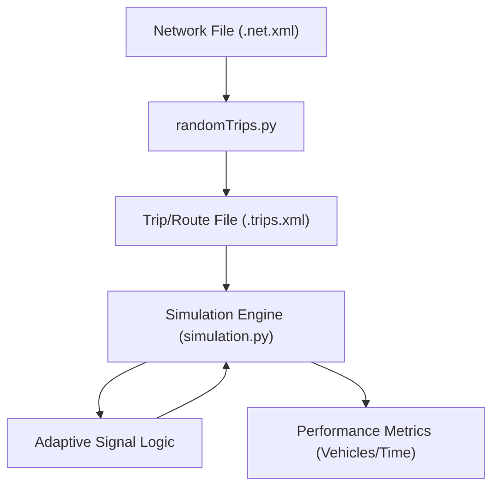

# Traffic Simulation Environment

The Traffic Simulation Environment consists of two primary components: a route generation system based on the **SUMO (Simulation of Urban MObility)** framework and a custom visual simulation engine powered by **Pygame**. Together, these allow for the creation of realistic traffic demands and the testing of adaptive signal control algorithms.

## System Architecture

The environment follows a pipeline where network topology is used to generate trip demands, which are then executed within the simulation engine.

---

## Random Trip Generation

The `randomTrips.py` script is a sophisticated utility used to generate synthetic traffic demand. It calculates the probability of vehicle departures and arrivals based on network characteristics.

### Core Logic
The generator utilizes a weighted distribution system to select edges for trips:
- **Source/Sink Selection**: Edges are weighted by length, number of lanes, and speed to determine the likelihood of being a starting or ending point.
- **Distance Constraints**: The system ensures that generated trips meet `min_distance` and `max_distance` requirements to avoid trivial or impossibly long trips.
- **Routing**: It integrates with `duarouter` to convert high-level "trips" (start $\rightarrow$ end) into concrete "routes" (specific edge sequences).

### Key Configuration Options
| Parameter | Description | Default |
| :--- | :--- | :--- |
| `--net-file` | The SUMO network file defining the road topology. | Mandatory |
| `--period` | Time interval between vehicle departures. | `1.0` |
| `--binomial` | Draws departures from a binomial distribution for stochasticity. | `None` |
| `--vclass` | Restricts trips to specific vehicle classes (e.g., `passenger`). | `passenger` |
| `--fringe-factor` | Multiplier for the weight of fringe edges (network boundaries). | `1.0` |

---

## Visual Simulation Engine

The `simulation.py` module implements a real-time 2D simulation of a four-way intersection. Unlike static simulations, this engine handles dynamic vehicle behavior and adaptive signal timing.

### Vehicle Dynamics
Vehicles are implemented as Pygame sprites with the following behavioral attributes:
- **Lane Management**: Supports multiple lanes per direction with specific stopping gaps (`gap = 15`) to prevent collisions.
- **Turning Logic**: Vehicles in the leftmost lane have a probability of turning, triggering a rotation animation and a change in movement vector.
- **Vehicle Classes**: Different speeds are assigned based on type:
  - `bike`: 3.75
  - `car`: 3.375
  - `rickshaw`: 3.0
  - `bus/truck`: 2.7

### Adaptive Signal Control
The simulation replaces fixed timers with a dynamic calculation method to optimize throughput.

**Green Time Calculation:**
The duration of the next green phase is determined by the number of vehicles queued in that direction:
$$\text{Green Time} = \max(\text{min\_time}, \min(\text{max\_time}, \text{min\_time} + (\text{vehicle\_count} \times 0.6)))$$

### Execution Threads
To maintain a smooth 60 FPS visual experience, the engine utilizes Python's `threading` module:
1. **Main Thread**: Handles Pygame rendering and sprite updates.
2. **Simulation Timer**: Tracks `timeElapsed` and computes final throughput metrics.
3. **Signal Logic Thread**: Manages the Red $\rightarrow$ Green $\rightarrow$ Yellow state machine.
4. **Vehicle Generator**: Spawns vehicles randomly across directions and lanes based on weighted probabilities.

## Performance Evaluation
At the end of the simulation period (`simTime`), the system outputs a performance summary:
- **Total Vehicles Passed**: The count of all vehicles that successfully crossed their respective stop lines.
- **Throughput**: Calculated as $\frac{\text{Total Vehicles}}{\text{Total Time}}$, providing a benchmark for the efficiency of the current signal control strategy.