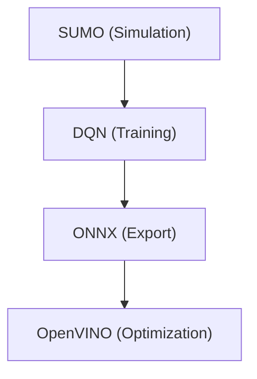

# Development and Setup

This section provides the technical specifications and step-by-step procedures required to configure the development environment for the AI-Based Traffic Signal Control System.

## Environment Specifications

The system is built upon a synergy of traffic simulation, reinforcement learning, and hardware optimization. Ensure the following dependencies are installed:

- **ROS 2 Distro**: Humble Hawksbill
- **Simulation Engine**: SUMO (Simulation of Urban MObility)
- **ML Framework**: PyTorch/TensorFlow (for DQN)
- **Optimization**: OpenVINO Toolkit

### IDE Configuration

For developers using Visual Studio Code, ensure the ROS extension is configured to target the correct distribution to enable proper IntelliSense and build tooling.

**`.vscode/settings.json`**
```json
{
  "ros.distro": "humble"
}
```

## System Architecture Pipeline

The project follows a linear progression from simulation environment design to edge-optimized deployment.



## Development Workflow

Follow these steps to create a network, train the agent, and execute the simulation.

### 1. Network and Route Generation
First, define the physical layout of the intersection and generate traffic demand.

1. **Create Network**: Use `netedit` to design the network file (e.g., `intersection.net.xml`).
2. **Generate Routes**: Create random trips based on the network file.
   ```bash
   python randomTrips.py -n intersection.net.xml -r intersection.rou.xml
   ```
3. **Configuration**: Update the file paths within `intersection.sumocfg` to point to your generated network and route files.

### 2. Simulation and Training
Once the environment is configured, launch the simulation and train the Deep Q-Network (DQN).

- **Run Simulation**:
  ```bash
  sumo-gui -c intersection.sumocfg
  ```
- **Train the Model**:
  Run the training script specifying the number of episodes and steps.
  ```bash
  python train.py --train -e 50 -m model_name -s 500
  ```
- **Execute Trained Model**:
  Run the model in inference mode to validate performance.
  ```bash
  python train.py -m model_name -s 500
  ```

### 3. Importing Real-World Maps
To use real-world geography, utilize `netconvert` to transform OpenStreetMap (OSM) files into SUMO networks.

```bash
netconvert --osm-files king_circle.osm -o king_circle.net.xml
```

## Model Optimization

To deploy the model on edge devices, the DQN model is exported to ONNX format and then optimized via the OpenVINO Model Optimizer.

**OpenVINO Conversion Command:**
```bash
ovc traffic_light_dqn.onnx --output_model optimized_model/traffic_light_dqn --input "input[1,6]"
```

| Parameter | Description |
| :--- | :--- |
| `--output_model` | Destination directory for the IR (Intermediate Representation) files. |
| `--input` | Defines the input tensor shape (e.g., `[1,6]` for a single state vector of 6 features). |