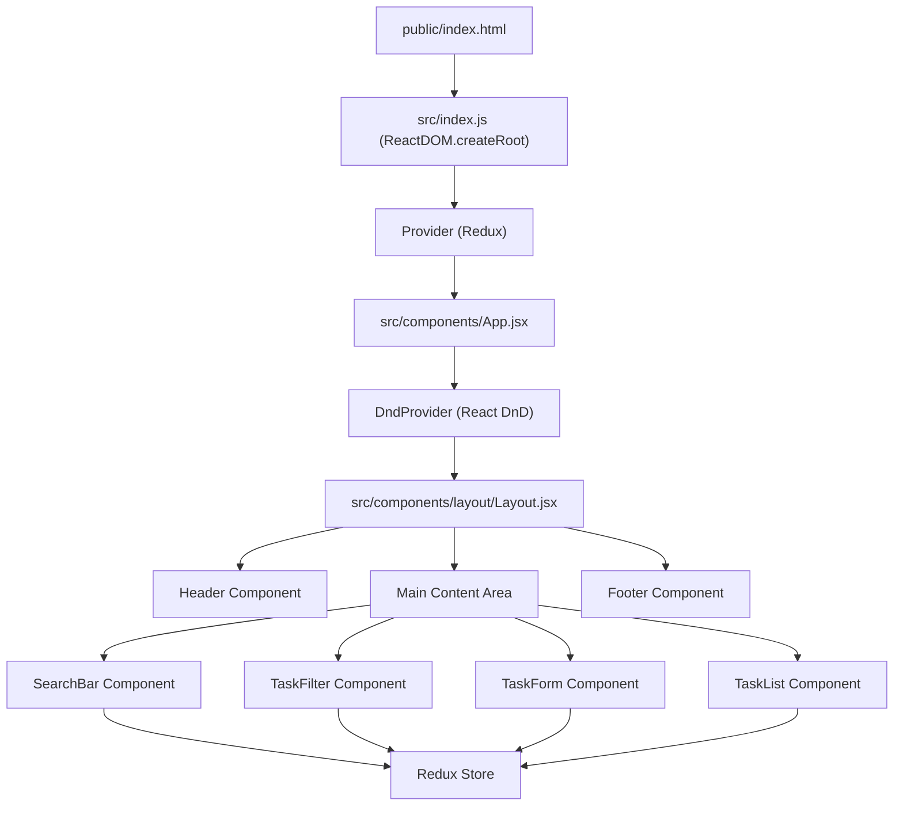

# Core Application Structure

This section provides an overview of the fundamental files and directories that constitute the TaskBuddy application, outlining their roles and how they interact to form the core user experience.

## Entry Point and Initialization

The application's journey begins with `src/index.js`. This file serves as the primary entry point for the React application. It's responsible for rendering the main `App` component into the DOM and setting up the Redux store for state management.

### `src/index.js`

This file orchestrates the initialization of the React application. It imports necessary libraries like React, `createRoot` from `react-dom/client`, and `Provider` from `react-redux`. Crucially, it establishes the Redux store using `store from './redux/store'` and wraps the entire `App` component within the `Provider`. This makes the Redux store accessible to all components within the application tree.

```javascript
import React from 'react';
import { createRoot } from 'react-dom/client';
import { Provider } from 'react-redux'; // Add this import
import store from './redux/store'; // Import your Redux store
import App from './components/App';
import './styles/index.css';

const container = document.getElementById('root');
const root = createRoot(container);

root.render(
  <Provider store={store}>
    <App />
  </Provider>
);
```
[View on GitHub](https://github.com/meekhumor/TaskBuddy/blob/main/src/index.js)

## The Root Component: `App.jsx`

The `src/components/App.jsx` file defines the main application component. It acts as a container for the primary UI elements and sets up the overall layout and state management context for the entire application.

### `src/components/App.jsx`

This component leverages `react-dnd` for drag-and-drop functionality, wrapping the entire application in `DndProvider` with `HTML5Backend`. It then utilizes a `Layout` component to structure the page, dividing the content into two main columns on larger screens: a sidebar for search and filtering, and a main content area for task creation and display.

```javascript
import React from 'react';
import { DndProvider } from 'react-dnd';
import { HTML5Backend } from 'react-dnd-html5-backend';

import Layout from './layout/Layout';
import TaskForm from './tasks/TaskForm';
import TaskFilter from './tasks/TaskFilter';
import TaskList from './tasks/TaskList';
import SearchBar from './common/SearchBar';

const App = () => {
  return (
    <DndProvider backend={HTML5Backend}>
      <Layout>
        <div className="grid grid-cols-1 lg:grid-cols-4 gap-6">

          <div className="lg:col-span-1">
            <div className="space-y-6">
              <SearchBar />
              <TaskFilter />
            </div>
          </div>
          
          <div className="lg:col-span-3">
            <div className="space-y-6">
              <TaskForm />
              <TaskList />
            </div>
          </div>

        </div>
      </Layout>
    </DndProvider>
  );
};

export default App;
```
[View on GitHub](https://github.com/meekhumor/TaskBuddy/blob/main/src/components/App.jsx)

## Page Layout and Structure: `Layout.jsx`

The `src/components/layout/Layout.jsx` file is responsible for the consistent overall structure of the application's pages. It includes common elements like headers and footers, ensuring a unified user experience across different views.

### `src/components/layout/Layout.jsx`

This component provides a boilerplate layout with a header, a main content area, and a footer. The main content area is designed to be flexible and occupy the remaining vertical space (`flex-grow`). It also includes a container to center content and apply padding. The `children` prop allows it to render any content passed to it by its parent components, making it a versatile layout component.

```javascript
import React from 'react';
import Header from './Header';
import Footer from './Footer';
import { useSelector } from 'react-redux';

const Layout = ({ children }) => {
  return (
    <div className="min-h-screen flex flex-col">
      <Header />
      <main className="flex-grow bg-gray-100 dark:bg-gray-900 py-6 px-4">
        <div className="container mx-auto">{children}</div>
      </main>
      <Footer />
    </div>
  );
};

export default Layout;
```
[View on GitHub](https://github.com/meekhumor/TaskBuddy/blob/main/src/components/layout/Layout.jsx)

## The Public Entry Point: `index.html`

The `public/index.html` file is the single HTML page that serves as the entry point for the entire web application. It contains the basic HTML structure and a single `div` element where the React application will be mounted.

### `public/index.html`

This file is a standard HTML5 document. It defines the character set, viewport settings, and the title of the page. The most critical element is the `<div id="root"></div>`. This `div` serves as the mounting point for the React application. When the JavaScript bundle is loaded and executed, React will take control of this `div` and render the entire application within it.

```html
<!DOCTYPE html>
<html lang="en">
<head>
  <meta charset="UTF-8">
  <meta name="viewport" content="width=device-width, initial-scale=1.0">
  <title>TaskBuddy</title>
</head>
<body>
  <div id="root"></div>
</body>
</html>
```
[View on GitHub](https://github.com/meekhumor/TaskBuddy/blob/main/public/index.html)

## Application Flow and Integration

The core application structure can be visualized as a flow starting from the `index.html` file, which bootstraps the React application via `src/index.js`. This entry point then renders the `App` component, which is responsible for setting up global context (like `DndProvider` and Redux `Provider`) and defining the main layout using `Layout.jsx`.

The `Layout.jsx` component then provides the consistent structure of `Header`, `main` content, and `Footer`. Inside the `main` section of `App.jsx`, various functional components like `SearchBar`, `TaskFilter`, `TaskForm`, and `TaskList` are orchestrated. These components interact with each other and the Redux store to manage the application's state and deliver the user interface for task management.





### Key Integration Points:

*   **DOM Rendering:** `public/index.html` provides the target DOM element (`<div id="root">`) for the React application, initiated by `src/index.js` using `createRoot`.
*   **State Management:** The `Provider` from `react-redux` in `src/index.js` wraps the entire `App` component, making the Redux store accessible for global state management of tasks, filters, and search queries.
*   **Drag and Drop:** The `DndProvider` in `src/components/App.jsx` enables drag-and-drop functionality across the application, essential for reordering or moving tasks.
*   **Layout Consistency:** `src/components/layout/Layout.jsx` ensures a uniform header, footer, and main content area across all views, providing a predictable user experience.
*   **Component Composition:** `src/components/App.jsx` demonstrates effective component composition by arranging various functional components (`SearchBar`, `TaskFilter`, `TaskForm`, `TaskList`) within the defined layout, creating distinct functional areas of the UI.

This structured approach, from the static HTML entry point to the dynamic React components and state management, forms the robust foundation of the TaskBuddy application.