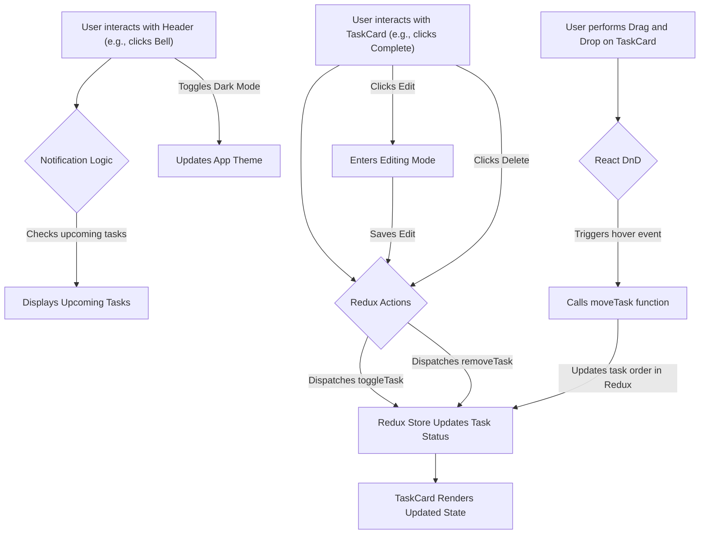
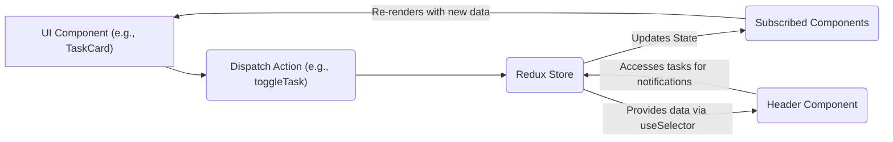

# Component Library

This section provides documentation for the reusable UI components used within the TaskBuddy application. These components are designed to ensure consistency, maintainability, and a pleasant user experience.

---

## Common Components

### CategoryBadge

The `CategoryBadge` component displays a visually distinct badge for task categories. It utilizes predefined color schemes to represent different categories, enhancing the readability and scannability of task lists.

**Features:**

*   **Color Coding:** Assigns specific background and text colors based on the provided category.
*   **Icon Integration:** Includes a "Tag" icon for visual identification.
*   **Dynamic Styling:** Adapts to dark mode by using corresponding dark theme colors.
*   **Fallback:** Defaults to a gray badge if an unknown category is provided.

**Code Snippet:**

```jsx
import React from 'react';
import { Tag } from 'lucide-react';

const categoryColors = {
  personal: { bg: 'bg-purple-100', text: 'text-purple-800', darkBg: 'dark:bg-purple-900', darkText: 'dark:text-purple-200' },
  work: { bg: 'bg-blue-100', text: 'text-blue-800', darkBg: 'dark:bg-blue-900', darkText: 'dark:text-blue-200' },
  groceries: { bg: 'bg-green-100', text: 'text-green-800', darkBg: 'dark:bg-green-900', darkText: 'dark:text-green-200' },
  health: { bg: 'bg-red-100', text: 'text-red-800', darkBg: 'dark:bg-red-900', darkText: 'dark:text-red-200' },
  finance: { bg: 'bg-yellow-100', text: 'text-yellow-800', darkBg: 'dark:bg-yellow-900', darkText: 'dark:text-yellow-200' },
  education: { bg: 'bg-indigo-100', text: 'text-indigo-800', darkBg: 'dark:bg-indigo-900', darkText: 'dark:text-indigo-200' },
};

const CategoryBadge = ({ category }) => {
  // Default to 'personal' if category is falsy (undefined, null, '')
  const effectiveCategory = category || 'personal';
  const color = categoryColors[effectiveCategory] || {
    bg: 'bg-gray-100',
    text: 'text-gray-800',
    darkBg: 'dark:bg-gray-700',
    darkText: 'dark:text-gray-200'
  };

  return (
    <div className={`inline-flex items-center rounded-full px-2 py-1 text-xs ${color.bg} ${color.text} ${color.darkBg} ${color.darkText}`}>
      <Tag size={12} className="mr-1" />
      {effectiveCategory.charAt(0).toLowerCase() + effectiveCategory.slice(1)} {/* Capitalize */}
    </div>
  );
};

export default CategoryBadge;
```

[View on GitHub](https://github.com/meekhumor/TaskBuddy/blob/main/src/components/common/CategoryBadge.jsx)

### PriorityBadge

The `PriorityBadge` component visually represents the priority level of a task. It uses distinct colors and icons to communicate urgency at a glance.

**Features:**

*   **Priority Icons:** Displays `ArrowUp` for high, `ArrowRight` for medium, and `ArrowDown` for low priority.
*   **Themed Colors:** Uses a color palette that matches the priority level and supports dark mode.
*   **Clear Labeling:** Shows the priority level text alongside the icon.
*   **Default to Medium:** If no priority is specified, it defaults to "medium".

**Code Snippet:**

```jsx
import React from 'react';
import { ArrowUp, ArrowRight, ArrowDown } from 'lucide-react';

const priorityConfig = {
  high: {
    bg: 'bg-red-100',
    text: 'text-red-800',
    darkBg: 'dark:bg-red-900',
    darkText: 'dark:text-red-200',
    icon: ArrowUp
  },
  medium: {
    bg: 'bg-orange-100',
    text: 'text-orange-800',
    darkBg: 'dark:bg-orange-900',
    darkText: 'dark:text-orange-200',
    icon: ArrowRight
  },
  low: {
    bg: 'bg-blue-100',
    text: 'text-blue-800',
    darkBg: 'dark:bg-blue-900',
    darkText: 'dark:text-blue-200',
    icon: ArrowDown
  }
};

const PriorityBadge = ({ priority }) => {
  const config = priorityConfig[priority] || priorityConfig.medium;
  const Icon = config.icon;

  return (
    <div className={`inline-flex items-center rounded-full px-2 py-1 text-xs ${config.bg} ${config.text} ${config.darkBg} ${config.darkText}`}>
      <Icon size={12} className="mr-1" />
      {priority}
    </div>
  );
};

export default PriorityBadge;
```

[View on GitHub](https://github.com/meekhumor/TaskBuddy/blob/main/src/components/common/PriorityBadge.jsx)

---

## Layout Components

### Header

The `Header` component serves as the primary navigation and information bar for the TaskBuddy application. It includes branding, notification access, help access, and a dark mode toggle.

**Features:**

*   **Branding:** Displays the application logo and name.
*   **Notifications:** Shows a badge for upcoming tasks and allows access to a notification dropdown.
*   **Help Access:** Provides a button to open a help guide.
*   **Dark Mode Toggle:** Allows users to switch between light and dark themes.
*   **Dynamic Task Count:** The notification bell updates with the count of tasks due within the next 3 days.

**Code Snippet:**

```jsx
import React, { useState, useEffect } from "react";
import { useSelector } from "react-redux";
import { Moon, Sun, Bell, HelpCircle } from "lucide-react";
import HelpGuide from "../common/HelpGuide";

const Header = () => {
  const [showNotifications, setShowNotifications] = useState(false);
  const [showHelp, setShowHelp] = useState(false);
  const [darkMode, setDarkMode] = useState(true);

  const tasks = useSelector((state) => state.tasks);

  useEffect(() => {
    if (darkMode) {
      document.documentElement.classList.add("dark");
    } else {
      document.documentElement.classList.remove("dark");
    }
  }, [darkMode]);

  const upcomingTasks = tasks.filter((task) => {
    if (!task.dueDate || task.completed) return false;
    const dueDate = new Date(task.dueDate);
    const today = new Date();
    const diffTime = dueDate - today;
    const diffDays = Math.ceil(diffTime / (1000 * 60 * 60 * 24));
    return diffDays >= 0 && diffDays <= 3;
  });

  const toggleNotifications = () => setShowNotifications(!showNotifications);
  const toggleHelp = () => setShowHelp(!showHelp);

  return (
    <header className="bg-indigo-600 text-white shadow-lg">
      <div className="container mx-auto px-4">
        <div className="flex items-center justify-between py-4">

          {/* logo */}
          <div className="flex items-center space-x-3">
            <div className="h-10 w-10 bg-white rounded-lg flex items-center justify-center">
              <span className="text-indigo-600 font-bold text-xl">TB</span>
            </div>
            <h1 className="text-2xl font-bold hidden md:block">TaskBuddy</h1>
          </div>

          <div className="flex items-center space-x-4">

            {/* notification button */}
            <div className="relative">
              <button
                onClick={toggleNotifications}
                className="p-2 hover:bg-indigo-500 rounded-full transition relative"
              >
                <Bell size={20} />
                {upcomingTasks.length > 0 && (
                  <span className="absolute top-0 right-0 h-4 w-4 bg-red-500 rounded-full text-xs flex items-center justify-center">
                    {upcomingTasks.length}
                  </span>
                )}
              </button>

              {/* notification dropdown */}
              {showNotifications && (
                <div className="absolute right-0 mt-2 w-80 bg-white dark:bg-gray-800 rounded-lg shadow-lg py-2 z-10 text-gray-800 dark:text-gray-200">
                  <h3 className="px-4 py-2 text-sm font-semibold border-b border-gray-200 dark:border-gray-700">
                    Upcoming Tasks
                  </h3>
                  {upcomingTasks.length === 0 ? (
                    <p className="px-4 py-3 text-sm text-gray-600 dark:text-gray-400">
                      No upcoming tasks
                    </p>
                  ) : (
                    <div className="max-h-60 overflow-y-auto">
                      {upcomingTasks.map((task) => (
                        <div
                          key={task.id}
                          className="px-4 py-2 hover:bg-gray-100 dark:hover:bg-gray-700 border-b border-gray-200 dark:border-gray-700 last:border-0"
                        >
                          <div className="flex justify-between items-start">
                            <span className="font-medium text-sm">
                              {task.title}
                            </span>
                            <span className="text-xs bg-yellow-100 dark:bg-yellow-900 text-yellow-800 dark:text-yellow-200 px-2 py-1 rounded">
                              {new Date(task.dueDate).toLocaleDateString()}
                            </span>
                          </div>
                          <div className="flex mt-1">
                            <span
                              className={`text-xs rounded px-2 py-1 ${
                                task.priority === "high"
                                  ? "bg-red-100 text-red-800 dark:bg-red-900 dark:text-red-200"
                                  : task.priority === "medium"
                                  ? "bg-orange-100 text-orange-800 dark:bg-orange-900 dark:text-orange-200"
                                  : "bg-blue-100 text-blue-800 dark:bg-blue-900 dark:text-blue-200"
                              }`}
                            >
                              {task.priority}
                            </span>
                            <span className="text-xs bg-purple-100 dark:bg-purple-900 text-purple-800 dark:text-purple-200 rounded px-2 py-1 ml-2">
                              {task.category}
                            </span>
                          </div>
                        </div>
                      ))}
                    </div>
                  )}
                </div>
              )}
            </div>

            {/* help button */}
            <button
              onClick={toggleHelp}
              className="p-2 hover:bg-indigo-500 rounded-full transition"
            >
              <HelpCircle size={20} />
            </button>

            {/* darkmode */}
            <button
              onClick={() => setDarkMode(!darkMode)}
              className="p-2 hover:bg-indigo-500 rounded-full transition"
            >
              {darkMode ? <Sun size={20} /> : <Moon size={20} />}
            </button>
          </div>
        </div>
      </div>

      {showHelp && <HelpGuide onClose={toggleHelp} />}
    </header>
  );
};

export default Header;
```

[View on GitHub](https://github.com/meekhumor/TaskBuddy/blob/main/src/components/layout/Header.jsx)

---

## Task Components

### TaskCard

The `TaskCard` component is a fundamental building block for displaying individual tasks. It provides a comprehensive view of a task's details, including its title, category, priority, and due date. It also supports interactive features like toggling completion, editing, and deletion, along with drag-and-drop functionality for reordering.

**Features:**

*   **Task Details:** Displays title, category, priority, and due date.
*   **Status Indicators:** Visually indicates overdue, due soon, or completed tasks with colored borders.
*   **Interactive Elements:** Includes buttons for toggling completion, editing, and deleting tasks.
*   **Drag and Drop:** Integrates with `react-dnd` for reordering tasks within a list.
*   **Editing Mode:** Allows inline editing of the task title.
*   **Themed Badges:** Utilizes `CategoryBadge` and `PriorityBadge` for consistent styling.
*   **Date Formatting:** Displays due dates in a user-friendly format.

**Code Snippet:**

```jsx
import React, { useState, useRef } from 'react';
import { useDispatch } from 'react-redux';
import { useDrag, useDrop } from 'react-dnd';
import { Calendar, CheckCircle, Circle, Clock, Edit, Trash2, AlertTriangle } from 'lucide-react';
import { toggleTask, removeTask, updateTask } from '../../redux/actions/taskActions';
import CategoryBadge from '../common/CategoryBadge';
import PriorityBadge from '../common/PriorityBadge';

const TaskCard = ({ task, index, moveTask }) => {
  const [isEditing, setIsEditing] = useState(false);
  const [editTitle, setEditTitle] = useState(task.title);
  const dispatch = useDispatch();
  const ref = useRef(null);

  const isDueSoon = () => {
    if (!task.dueDate) return false;
    const dueDate = new Date(task.dueDate);
    const today = new Date();
    const diffTime = dueDate - today;
    const diffDays = Math.ceil(diffTime/(1000*60*60*24));
    return diffDays >= 0 && diffDays <= 2;
  };

  const isOverdue = () => {
    if (!task.dueDate) return false;
    const dueDate = new Date(task.dueDate);
    const today = new Date();
    return dueDate < today && !task.completed;
  };

  const [{ isDragging }, drag] = useDrag({
    type: 'TASK',
    item: { id: task.id, index },
    collect: (monitor) => ({
      isDragging: monitor.isDragging(),
    }),
  });

  const [, drop] = useDrop({
    accept: 'TASK',
    hover: (item, monitor) => {
      if (!ref.current || item.id === task.id) {
        return;
      }
      moveTask(item.id, task.id);
      item.index = index;
    },
  });

  drag(drop(ref));

  const handleToggle = () => {
    dispatch(toggleTask(task.id));
  };

  const handleRemove = () => {
    dispatch(removeTask(task.id));
  };

  const handleEdit = () => {
    if (isEditing) {
      dispatch(updateTask(task.id, { title: editTitle }));
    }
    setIsEditing(!isEditing);
  };

  const formatDate = (dateString) => {
    const options = { month: 'short', day: 'numeric' };
    return new Date(dateString).toLocaleDateString(undefined, options);
  };

  return (
    <div
      ref={ref}
      className={`bg-white dark:bg-gray-800 rounded-lg shadow-md p-4 mb-4 border-l-8
        ${task.completed ? 'border-green-500' :
         isOverdue() ? 'border-red-500' :
         isDueSoon() ? 'border-yellow-500' :
         'border-indigo-500'}
        ${isDragging ? 'opacity-50' : 'opacity-100'}
        transition-all duration-300 hover:shadow-lg transform hover:-translate-y-1`}
    >
      <div className="flex items-start justify-between">
        <div className="flex items-start space-x-3 flex-grow">

          {/* current status*/}
          <button
            onClick={handleToggle}
            className={`mt-1 flex-shrink-0 text-${task.completed ? 'green' : 'gray'}-500 hover:text-${task.completed ? 'green' : 'gray'}-700`}
          >
            {task.completed ? <CheckCircle size={20} /> : <Circle size={20} />}
          </button>


          <div className="flex-grow">
            {isEditing ? (
              <input
                type="text"
                value={editTitle}
                onChange={(e) => setEditTitle(e.target.value)}
                className="w-full p-1 border border-gray-300 dark:border-gray-600 rounded dark:bg-gray-700 dark:text-white"
                autoFocus
                onKeyDown={(e) => {
                  if (e.key === 'Enter') {
                    handleEdit();
                  }
                }}
              />
            ) : (
              <h3 className={`font-medium text-gray-800 dark:text-gray-200 ${task.completed ? 'line-through text-gray-500 dark:text-gray-400' : ''}`}>
                {task.title}
              </h3>
            )}

            {/* details badge */}
            <div className="mt-2 flex flex-wrap gap-2">
              <CategoryBadge category={task.category} />
              <PriorityBadge priority={task.priority} />

              {task.dueDate && (
                <div className={`flex items-center text-xs px-2 py-1 rounded-full
                  ${isOverdue() ? 'bg-red-100 text-red-800 dark:bg-red-900 dark:text-red-200' :
                   isDueSoon() ? 'bg-yellow-100 text-yellow-800 dark:bg-yellow-900 dark:text-yellow-200' :
                   'bg-blue-100 text-blue-800 dark:bg-blue-900 dark:text-blue-200'}`}
                >
                  {isOverdue() ? (
                    <AlertTriangle size={12} className="mr-1" />
                  ) : isDueSoon() ? (
                    <Clock size={12} className="mr-1" />
                  ) : (
                    <Calendar size={12} className="mr-1" />
                  )}
                  {formatDate(task.dueDate)}
                </div>
              )}
            </div>
          </div>
        </div>

        {/* update and delete task  */}
        <div className="flex space-x-2 ml-2">
          <button
            onClick={handleEdit}
            className="text-gray-400 hover:text-indigo-500 dark:text-gray-500 dark:hover:text-indigo-400"
          >
            <Edit size={16} />
          </button>
          <button
            onClick={handleRemove}
            className="text-gray-400 hover:text-red-500 dark:text-gray-500 dark:hover:text-red-400"
          >
            <Trash2 size={16} />
          </button>
        </div>
      </div>
    </div>
  );
};

export default TaskCard;
```

[View on GitHub](https://github.com/meekhumor/TaskBuddy/blob/main/src/components/tasks/TaskCard.jsx)

---

## Key Integration Points

### Task Management Flow

The components work together to manage tasks effectively. The `Header` provides global actions and notifications, while `TaskCard` handles individual task interactions and displays. State management, likely via Redux, orchestrates updates and data flow between these components. The drag-and-drop functionality in `TaskCard` directly impacts the task order, which is then persisted through the application's state management.





### Data Flow and State Management

The interaction of these components relies heavily on a centralized state management solution. For TaskBuddy, this appears to be Redux, as indicated by the use of `useSelector` and Redux actions like `toggleTask`, `removeTask`, and `updateTask`.

*   **`Header`**: `useSelector` is used to fetch the task list to determine the number of upcoming tasks.
*   **`TaskCard`**: `useDispatch` is used to dispatch actions to modify the Redux store (e.g., toggling completion, removing, updating). The `TaskCard` also receives task data as props, which it uses to render its state and apply conditional styling.

This pattern ensures that UI updates are consistent across the application and that changes made in one part of the UI are reflected everywhere.





### Styling and Theming

The components leverage Tailwind CSS for styling, enabling rapid development and consistent theming. The use of dark mode classes (`dark:bg-...`, `dark:text-...`) ensures a seamless transition between light and dark themes, enhancing user experience across different preferences and environments. Components like `CategoryBadge` and `PriorityBadge` are designed to be theme-aware, applying appropriate styles based on the application's current theme. The `Header` component directly controls the application's dark mode state by manipulating the `documentElement` classes.