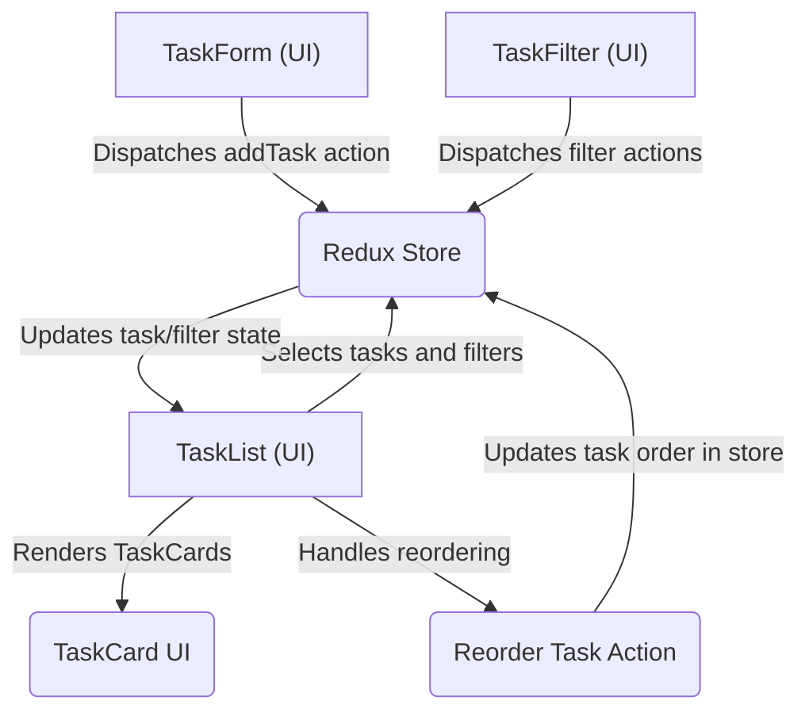

```md
# Task Management Features

This section delves into the core task management functionalities of TaskBuddy, exploring how users can create, view, filter, and organize their tasks effectively. We will examine the components responsible for these features, their underlying logic, and how they integrate within the Redux state management system.

---

## Task Creation and Management

The `TaskForm.jsx` component is the gateway for users to add new tasks to their list. It provides a user-friendly interface for inputting task details, including a title, priority, category, and an optional due date. Advanced options can be toggled for more detailed task configuration.

### TaskForm.jsx

This component handles the creation of new tasks. It manages the local state for the input fields and dispatches an `addTask` action to the Redux store when a new task is submitted. It also supports adding new categories on the fly.

```javascript
// src/components/tasks/TaskForm.jsx
import React, { useState } from "react";
import { useDispatch, useSelector } from "react-redux";
import DatePicker from "react-datepicker";
import "react-datepicker/dist/react-datepicker.css";
import { addTask } from "../../redux/actions/taskActions";
import { addCategory } from "../../redux/actions/categoryActions";
import { Plus, ChevronDown } from "lucide-react";

const TaskForm = () => {
  const [title, setTitle] = useState("");
  const [priority, setPriority] = useState("medium");
  const [category, setCategory] = useState("personal");
  const [dueDate, setDueDate] = useState(null);
  const [showAdvanced, setShowAdvanced] = useState(false);
  const [showNewCategoryInput, setShowNewCategoryInput] = useState(false);
  const [newCategory, setNewCategory] = useState("");

  const dispatch = useDispatch();
  const categories = useSelector((state) => state.categories);

  const handleSubmit = (e) => {
    e.preventDefault();
    if (!title.trim()) return;

    dispatch(
      addTask({
        title: title.trim(),
        priority,
        category,
        dueDate,
      })
    );

    // Reset form fields after submission
    setTitle("");
    setPriority("medium");
    setCategory("personal");
    setDueDate(null);
  };

  const handleAddCategory = () => {
    if (newCategory.trim()) {
      const normalizedCategory = newCategory.toLowerCase();
      dispatch(addCategory(normalizedCategory));
      setCategory(normalizedCategory);
      setNewCategory("");
      setShowNewCategoryInput(false);
    }
  };

  const isSubmitDisabled = !title.trim();

  return (
    <div className="bg-white dark:bg-gray-800 rounded-lg shadow-md p-5">
      <h2 className="text-lg font-semibold mb-4 text-gray-800 dark:text-gray-200">
        Add New Task
      </h2>
      <form onSubmit={handleSubmit}>
        <div className="mb-4">
          <input
            type="text"
            placeholder="What needs to be done?"
            value={title}
            onChange={(e) => setTitle(e.target.value)}
            className="w-full p-2 border border-gray-300 dark:border-gray-600 rounded-md 
                      focus:ring-2 focus:ring-indigo-500 focus:border-indigo-500 transition
                      dark:bg-gray-700 dark:text-white"
          />
        </div>

        <div className="mb-3">
          <button
            type="button"
            onClick={() => setShowAdvanced(!showAdvanced)}
            className="flex items-center text-sm text-gray-600 dark:text-gray-400 hover:text-indigo-600 dark:hover:text-indigo-400 transition"
          >
            <ChevronDown
              size={16}
              className={`mr-1 transition-transform ${
                showAdvanced ? "transform rotate-180" : ""
              }`}
            />
            {showAdvanced ? "Hide" : "Show"} Advanced Options
          </button>
        </div>

        {showAdvanced && (
          <div className="grid grid-cols-1 sm:grid-cols-2 gap-3 mb-4 animate-fade-in">
            <div>
              <label className="block text-sm font-medium text-gray-700 dark:text-gray-300 mb-1">
                Priority
              </label>
              <select
                value={priority}
                onChange={(e) => setPriority(e.target.value)}
                className="w-full p-2 border border-gray-300 dark:border-gray-600 rounded-md
                          dark:bg-gray-700 dark:text-white"
              >
                <option value="high">High</option>
                <option value="medium">Medium</option>
                <option value="low">Low</option>
              </select>
            </div>

            <div>
              <label className="block text-sm font-medium text-gray-700 dark:text-gray-300 mb-1">
                Category
              </label>
              <div className="flex items-center space-x-2">
                <select
                  value={category}
                  onChange={(e) => setCategory(e.target.value)}
                  className="w-full p-2 border border-gray-300 dark:border-gray-600 rounded-md
                            dark:bg-gray-700 dark:text-white"
                >
                  {categories.map((cat) => (
                    <option key={cat.id} value={cat.name}>
                      {cat.name.charAt(0).toUpperCase() + cat.name.slice(1)}
                    </option>
                  ))}
                </select>
                <button
                  type="button"
                  onClick={() => setShowNewCategoryInput(!showNewCategoryInput)}
                  className="p-2 bg-indigo-600 text-white rounded-md hover:bg-indigo-700 transition"
                >
                  <Plus size={16} />
                </button>
              </div>
              {showNewCategoryInput && (
                <div className="mt-2">
                  <input
                    type="text"
                    value={newCategory}
                    onChange={(e) => setNewCategory(e.target.value)}
                    placeholder="New category"
                    className="w-full p-2 rounded-md dark:bg-gray-700 dark:text-white"
                    onKeyDown={(e) => e.key === "Enter" && handleAddCategory()}
                  />
                  <button
                    type="button"
                    onClick={handleAddCategory}
                    className="mt-1 w-full p-1 bg-indigo-600 text-white rounded-md hover:bg-indigo-700"
                  >
                    Add Category
                  </button>
                </div>
              )}
            </div>

            <div className="sm:col-span-2">
              <label className="block text-sm font-medium text-gray-700 dark:text-gray-300 mb-1">
                Due Date
              </label>
              <DatePicker
                selected={dueDate}
                onChange={(date) => setDueDate(date)}
                placeholderText="Select a due date"
                dateFormat="MMMM d, yyyy"
                minDate={new Date()}
                className="w-full p-2 border border-gray-300 dark:border-gray-600 rounded-md
                          dark:bg-gray-700 dark:text-white"
              />
            </div>
          </div>
        )}

        <button
          type="submit"
          disabled={isSubmitDisabled}
          className={`w-full flex items-center justify-center p-2 rounded-md text-white transition duration-200 ${
            isSubmitDisabled
              ? "bg-gray-500 cursor-not-allowed opacity-70"
              : "bg-indigo-600 hover:bg-indigo-700"
          }`}
        >
          <Plus size={18} className="mr-2" />
          Add Task
        </button>
      </form>
    </div>
  );
};

export default TaskForm;
```

[View on GitHub](https://github.com/meekhumor/TaskBuddy/blob/main/src/components/tasks/TaskForm.jsx)

---

## Task Display and Organization

The `TaskList.jsx` component is responsible for rendering the list of tasks. It fetches tasks from the Redux store and applies filters and sorting logic to display them in a user-defined order. Each task is rendered as a `TaskCard` component.

### TaskList.jsx

This component fetches all tasks from the Redux store and applies filtering based on the current filter state (status, category, priority, search query). It then sorts the tasks according to user preferences and renders them using individual `TaskCard` components.

```javascript
// src/components/tasks/TaskList.jsx
import React, { useCallback } from 'react';
import { useDispatch, useSelector } from 'react-redux';
import { reorderTasks } from '../../redux/actions/taskActions';
import TaskCard from './TaskCard';
import EmptyState from '../common/EmptyState';

const TaskList = () => {
  const dispatch = useDispatch();
  const tasks = useSelector(state => state.tasks);
  const filters = useSelector(state => state.filter);
  
  // Apply filters to the tasks
  const filteredTasks = tasks.filter(task => {
    if (filters.status === 'completed' && !task.completed) return false;
    if (filters.status === 'active' && task.completed) return false;
    if (filters.category !== 'all' && task.category !== filters.category) return false;
    if (filters.priority !== 'all' && task.priority !== filters.priority) return false;
    if (filters.searchQuery && !task.title.toLowerCase().includes(filters.searchQuery.toLowerCase())) return false;
    return true;
  });
  
  // Define priority order for sorting
  const priorityOrder = { high: 1, medium: 2, low: 3 };
  
  // Sort tasks based on various criteria
  const sortedTasks = [...filteredTasks].sort((a, b) => {
    if (a.order !== b.order) return a.order - b.order; // Manual order if set
    if (a.completed !== b.completed) return a.completed ? 1 : -1; // Completed tasks last
    if (a.priority !== b.priority) return priorityOrder[a.priority] - priorityOrder[b.priority]; // Priority
    if (a.dueDate && b.dueDate) return new Date(a.dueDate) - new Date(b.dueDate); // Due date
    if (a.dueDate && !b.dueDate) return -1; // Tasks with due dates first
    if (!a.dueDate && b.dueDate) return 1;
    return 0; // Default to no change
  });
  
  // Callback function for reordering tasks
  const moveTask = useCallback((dragId, hoverId) => {
    dispatch(reorderTasks(dragId, hoverId));
  }, [dispatch]);
  
  // Display an empty state if no tasks match the filters
  if (sortedTasks.length === 0) {
    return <EmptyState type={filters.status} searchQuery={filters.searchQuery} />;
  }
  
  return (
    <div className="space-y-4">
      {sortedTasks.map((task, index) => (
        <TaskCard 
          key={task.id} 
          task={task} 
          index={index} 
          moveTask={moveTask} 
        />
      ))}
    </div>
  );
};

export default TaskList;
```

[View on GitHub](https://github.com/meekhumor/TaskBuddy/blob/main/src/components/tasks/TaskList.jsx)

---

## Task Filtering

The `TaskFilter.jsx` component allows users to refine their task list by status, category, and priority. It utilizes Redux to manage the filter state and dispatches actions to update these filters.

### TaskFilter.jsx

This component renders the UI for filtering tasks. It uses Redux selectors to access the current filter state and the list of available categories. It dispatches actions (`setFilter`, `setCategoryFilter`, `setPriorityFilter`) to update the filter state in the Redux store based on user interactions.

```javascript
// src/components/tasks/TaskFilter.jsx
import React from 'react';
import { useDispatch, useSelector } from 'react-redux';
import { setFilter, setCategoryFilter, setPriorityFilter } from '../../redux/actions/filterActions';
import { CheckCircle, Circle, ListFilter, Tag, Flag } from 'lucide-react';

const TaskFilter = () => {
  const dispatch = useDispatch();
  const filter = useSelector(state => state.filter); // Current filter state
  const categories = useSelector(state => state.categories); // List of available categories
  
  return (
    <div className="bg-white dark:bg-gray-800 rounded-lg shadow-md p-5">
      <h2 className="text-lg font-semibold mb-4 flex items-center text-gray-800 dark:text-gray-200">
        <ListFilter size={18} className="mr-2" />
        Filter Tasks
      </h2>
      
      <div className="space-y-4">

        {/* Status filter */}
        <div>
          <h3 className="text-sm font-medium mb-2 text-gray-700 dark:text-gray-300 flex items-center">
            <Circle size={16} className="mr-2" />
            Status
          </h3>
          <div className="flex flex-wrap gap-2">
            <button
              onClick={() => dispatch(setFilter('all'))} // Dispatch action to set status filter to 'all'
              className={`px-3 py-1 text-sm rounded-full transition
                ${filter.status === 'all'
                  ? 'bg-indigo-100 text-indigo-800 dark:bg-indigo-900 dark:text-indigo-200'
                  : 'bg-gray-100 text-gray-600 hover:bg-gray-200 dark:bg-gray-700 dark:text-gray-300 dark:hover:bg-gray-600'}`}
            >
              All
            </button>
            <button
              onClick={() => dispatch(setFilter('active'))} // Dispatch action to set status filter to 'active'
              className={`px-3 py-1 text-sm rounded-full transition flex items-center
                ${filter.status === 'active'
                  ? 'bg-blue-100 text-blue-800 dark:bg-blue-900 dark:text-blue-200'
                  : 'bg-gray-100 text-gray-600 hover:bg-gray-200 dark:bg-gray-700 dark:text-gray-300 dark:hover:bg-gray-600'}`}
            >
              <Circle size={12} className="mr-1" />
              Active
            </button>
            <button
              onClick={() => dispatch(setFilter('completed'))} // Dispatch action to set status filter to 'completed'
              className={`px-3 py-1 text-sm rounded-full transition flex items-center
                ${filter.status === 'completed'
                  ? 'bg-green-100 text-green-800 dark:bg-green-900 dark:text-green-200'
                  : 'bg-gray-100 text-gray-600 hover:bg-gray-200 dark:bg-gray-700 dark:text-gray-300 dark:hover:bg-gray-600'}`}
            >
              <CheckCircle size={12} className="mr-1" />
              Completed
            </button>
          </div>
        </div>
        
        {/* Category filter */}
        <div>
          <h3 className="text-sm font-medium mb-2 text-gray-700 dark:text-gray-300 flex items-center">
            <Tag size={16} className="mr-2" />
            Category
          </h3>
          <div className="flex flex-wrap gap-2">
            <button
              onClick={() => dispatch(setCategoryFilter('all'))} // Dispatch action to set category filter to 'all'
              className={`px-3 py-1 text-sm rounded-full transition
                ${filter.category === 'all'
                  ? 'bg-indigo-100 text-indigo-800 dark:bg-indigo-900 dark:text-indigo-200'
                  : 'bg-gray-100 text-gray-600 hover:bg-gray-200 dark:bg-gray-700 dark:text-gray-300 dark:hover:bg-gray-600'}`}
            >
              All
            </button>
            {categories.map(cat => (
              <button
                key={cat.id}
                onClick={() => dispatch(setCategoryFilter(cat.name))} // Dispatch action to set specific category filter
                className={`px-3 py-1 text-sm rounded-full transition
                  ${filter.category === cat.name
                    ? 'bg-purple-100 text-purple-800 dark:bg-purple-900 dark:text-purple-200'
                    : 'bg-gray-100 text-gray-600 hover:bg-gray-200 dark:bg-gray-700 dark:text-gray-300 dark:hover:bg-gray-600'}`}
              >
                {cat.name}
              </button>
            ))}
          </div>
        </div>
        
        {/* Priority filter */}
        <div>
          <h3 className="text-sm font-medium mb-2 text-gray-700 dark:text-gray-300 flex items-center">
            <Flag size={16} className="mr-2" />
            Priority
          </h3>
          <div className="flex flex-wrap gap-2">
            <button
              onClick={() => dispatch(setPriorityFilter('all'))} // Dispatch action to set priority filter to 'all'
              className={`px-3 py-1 text-sm rounded-full transition
                ${filter.priority === 'all'
                  ? 'bg-indigo-100 text-indigo-800 dark:bg-indigo-900 dark:text-indigo-200'
                  : 'bg-gray-100 text-gray-600 hover:bg-gray-200 dark:bg-gray-700 dark:text-gray-300 dark:hover:bg-gray-600'}`}
            >
              All
            </button>
            <button
              onClick={() => dispatch(setPriorityFilter('high'))} // Dispatch action to set priority filter to 'high'
              className={`px-3 py-1 text-sm rounded-full transition
                ${filter.priority === 'high'
                  ? 'bg-red-100 text-red-800 dark:bg-red-900 dark:text-red-200'
                  : 'bg-gray-100 text-gray-600 hover:bg-gray-200 dark:bg-gray-700 dark:text-gray-300 dark:hover:bg-gray-600'}`}
            >
              High
            </button>
            <button
              onClick={() => dispatch(setPriorityFilter('medium'))} // Dispatch action to set priority filter to 'medium'
              className={`px-3 py-1 text-sm rounded-full transition
                ${filter.priority === 'medium'
                  ? 'bg-orange-100 text-orange-800 dark:bg-orange-900 dark:text-orange-200'
                  : 'bg-gray-100 text-gray-600 hover:bg-gray-200 dark:bg-gray-700 dark:text-gray-300 dark:hover:bg-gray-600'}`}
            >
              Medium
            </button>
            <button
              onClick={() => dispatch(setPriorityFilter('low'))} // Dispatch action to set priority filter to 'low'
              className={`px-3 py-1 text-sm rounded-full transition
                ${filter.priority === 'low'
                  ? 'bg-blue-100 text-blue-800 dark:bg-blue-900 dark:text-blue-200'
                  : 'bg-gray-100 text-gray-600 hover:bg-gray-200 dark:bg-gray-700 dark:text-gray-300 dark:hover:bg-gray-600'}`}
            >
              Low
            </button>
          </div>
        </div>
      </div>
    </div>
  );
};

export default TaskFilter;
```

[View on GitHub](https://github.com/meekhumor/TaskBuddy/blob/main/src/components/tasks/TaskFilter.jsx)

---

## Key Integration Points

The task management features in TaskBuddy are orchestrated through a cohesive integration of React components and Redux.

### Component Interaction Flow

The following diagram illustrates the flow of data and actions between the core task management components.





### State Management with Redux

Redux plays a central role in managing the global state of the application, including tasks, categories, and filters.

-   **Tasks:** An array of task objects, each containing properties like `id`, `title`, `priority`, `category`, `dueDate`, `completed`, and `order`.
-   **Categories:** An array of category objects, typically with `id` and `name` properties.
-   **Filters:** An object that holds the current filtering criteria, such as `status`, `category`, `priority`, and `searchQuery`.

Actions like `addTask`, `reorderTasks`, `setFilter`, `setCategoryFilter`, and `setPriorityFilter` are dispatched to modify this global state, ensuring consistency across the application.

### Reordering Tasks

The ability to reorder tasks is handled by the `TaskList.jsx` component, which uses a drag-and-drop mechanism. When a task is moved, a `reorderTasks` action is dispatched to update the `order` property of the affected tasks in the Redux store. This allows users to manually arrange their tasks, further enhancing organization.

```javascript
// src/redux/actions/taskActions.js (Conceptual Snippet for reorderTasks)

export const reorderTasks = (dragId, hoverId) => ({
  type: 'REORDER_TASKS',
  payload: { dragId, hoverId },
});

// In your reducers:
// case 'REORDER_TASKS': {
//   const { dragId, hoverId } = action.payload;
//   const newState = [...state.tasks]; // Assuming state.tasks is the array of tasks
//   const dragIndex = newState.findIndex(task => task.id === dragId);
//   const hoverIndex = newState.findIndex(task => task.id === hoverId);
//
//   // Simple reordering logic (can be more sophisticated based on actual needs)
//   const [draggedItem] = newState.splice(dragIndex, 1);
//   newState.splice(hoverIndex, 0, draggedItem);
//
//   // Update the 'order' property for each task based on its new index
//   const updatedTasks = newState.map((task, index) => ({
//     ...task,
//     order: index, // Assigning new order based on position
//   }));
//
//   return {
//     ...state,
//     tasks: updatedTasks,
//   };
// }
```

[View on GitHub](https://github.com/meekhumor/TaskBuddy/blob/main/src/redux/actions/taskActions.js) (Conceptual: Actual implementation may vary)
```