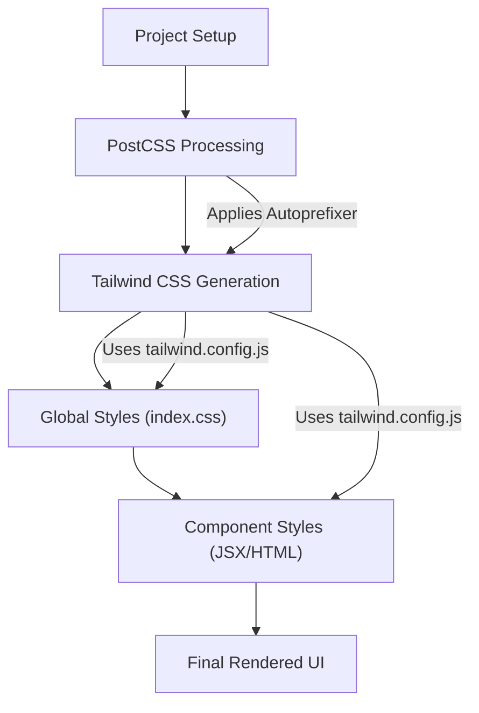

# Styling and Theming

This section details how TaskBuddy handles its visual appearance, focusing on the technologies and configurations that shape its user interface. TaskBuddy leverages Tailwind CSS for rapid UI development and provides a foundation for easy customization through its configuration files.

## Core Styling Technologies

TaskBuddy's styling is primarily managed by **Tailwind CSS**, a utility-first CSS framework. This approach allows for highly composable and maintainable styles directly within your JSX/HTML.

### Tailwind CSS Configuration

The `tailwind.config.js` file is the central hub for customizing Tailwind's behavior. Here, you can define your design system, including colors, typography, spacing, and more.

```javascript
// tailwind.config.js
module.exports = {
  content: [
    "./src/**/*.{js,jsx}",
    "./public/index.html"
  ],
  darkMode: 'class',
  theme: {
    extend: {},
  },
  plugins: [],
}
```

*   **`content`**: This array specifies the files that Tailwind should scan for class names. By including `./src/**/*.{js,jsx}` and `./public/index.html`, Tailwind will analyze all JavaScript, JSX, and HTML files within the `src` and `public` directories, respectively, to generate the necessary CSS. This ensures that only the CSS classes actually used in your project are included in the final build, leading to smaller bundle sizes.
*   **`darkMode: 'class'`**: This setting enables dark mode support. When the `dark` class is applied to the root HTML element (or any ancestor), Tailwind will apply styles defined in the `dark:` variant. This is a common pattern for implementing theme switching.
*   **`theme.extend`**: This is where you can override or extend Tailwind's default theme. For example, you could add custom colors, fonts, or breakpoints here. In this configuration, `extend` is an empty object, indicating that no further extensions to the default theme have been made yet.
*   **`plugins`**: This array is used to include any custom Tailwind CSS plugins you might be using. Currently, no custom plugins are listed.

[View on GitHub](https://github.com/meekhumor/TaskBuddy/blob/main/tailwind.config.js)

### Global Styles

The `src/styles/index.css` file serves as the entry point for your global CSS. It's where you import Tailwind's directives and can add any custom global styles.

```css
/* src/styles/index.css */
@tailwind base;
@tailwind components;
@tailwind utilities;

.task-item-dragging {
    box-shadow: 0 5px 10px rgba(0,0,0,0.15);
}
```

*   **`@tailwind base;`**: This directive injects Tailwind's base styles, which are a collection of pre-flight styles that reset CSS and provide a clean slate for your application.
*   **`@tailwind components;`**: This directive injects Tailwind's component classes. These are higher-level, more opinionated styles that you can use to build common UI components.
*   **`@tailwind utilities;`**: This directive injects Tailwind's utility classes. These are low-level, single-purpose classes that allow you to style elements directly in your markup (e.g., `text-blue-500`, `p-4`, `flex`).
*   **`.task-item-dragging`**: This is a custom CSS class. It demonstrates how you can add your own specific styles that might not be directly achievable with Tailwind's utility classes alone, or for more complex states like when a task item is being dragged. The `box-shadow` property adds a subtle visual cue to indicate that an item is in a draggable state.

[View on GitHub](https://github.com/meekhumor/TaskBuddy/blob/main/src/styles/index.css)

### PostCSS Configuration

PostCSS is a tool for transforming CSS with JavaScript. TaskBuddy uses it to process Tailwind CSS and Autoprefixer.

```javascript
// postcss.config.js
module.exports = {
  plugins: {
    tailwindcss: {},
    autoprefixer: {},
  }
}
```

*   **`plugins.tailwindcss: {}`**: This instructs PostCSS to run the Tailwind CSS plugin. This is where Tailwind's magic happens, scanning your files and generating the appropriate CSS based on your configuration.
*   **`plugins.autoprefixer: {}`**: Autoprefixer is a PostCSS plugin that adds vendor prefixes to CSS rules. This ensures that your styles are compatible with a wider range of browsers, saving you from manually adding prefixes like `-webkit-` or `-moz-`.

[View on GitHub](https://github.com/meekhumor/TaskBuddy/blob/main/postcss.config.js)

## Styling Workflow and Best Practices

TaskBuddy's styling approach is built around the efficiency and flexibility of Tailwind CSS.

### Utility-First Development

The primary method for styling components is by applying Tailwind's utility classes directly in your JSX/HTML. This leads to:

*   **Rapid Prototyping**: Quickly assemble UIs without leaving your markup.
*   **Consistency**: Encourages the use of predefined design tokens.
*   **Maintainability**: Styles are co-located with the elements they affect.

For example, a simple button might look like this:

```jsx
<button className="bg-blue-500 hover:bg-blue-700 text-white font-bold py-2 px-4 rounded">
  Click Me
</button>
```

This button has a blue background, a darker blue on hover, white text, bold font weight, padding, and rounded corners.

### Customization and Theming

While Tailwind provides a robust set of utilities out-of-the-box, TaskBuddy's `tailwind.config.js` is the place to extend this.

**Example: Adding a custom color**

If you wanted to introduce a new brand color, you could modify `tailwind.config.js`:

```javascript
// tailwind.config.js (excerpt)
module.exports = {
  // ... other configurations
  theme: {
    extend: {
      colors: {
        'brand-primary': '#1a73e8', // Google Blue
        'brand-secondary': '#fbbc04', // Google Yellow
      },
    },
  },
  // ...
}
```

You could then use this new color like any other Tailwind color:

```jsx
<div className="bg-brand-primary text-white p-4">
  This is a brand-colored div.
</div>
```

[View on GitHub](https://github.com/meekhumor/TaskBuddy/blob/main/tailwind.config.js)

### Dark Mode Implementation

The `darkMode: 'class'` configuration in `tailwind.config.js` is crucial for implementing dark mode. You typically manage this by adding or removing a `dark` class to the `<html>` or `<body>` element using JavaScript.

**Example of applying dark mode styles:**

In your CSS or within your JSX, you can use the `dark:` prefix to apply styles only when dark mode is active.

```css
/* In src/styles/index.css or a component's CSS module */
.dark .dark-mode-background {
  background-color: #121212; /* Dark background for dark mode */
  color: #ffffff; /* White text for dark mode */
}

.light-mode-background {
  background-color: #ffffff; /* Default light background */
  color: #000000; /* Default dark text */
}
```

And in your JSX:

```jsx
<div className="light-mode-background dark:dark-mode-background p-4">
  This div adapts to dark mode.
</div>
```

This approach allows for a seamless transition between light and dark themes.

### Handling Complex States and Custom Styles

For states that require more intricate styling or are not easily represented by simple utility classes, you can define custom CSS classes in `src/styles/index.css` or within component-specific CSS files. The `.task-item-dragging` class is a prime example of this.

When a task item is being dragged, its appearance might need to change to provide visual feedback.

```jsx
// Example of applying the class conditionally
function TaskItem({ task, isDragging }) {
  return (
    <div className={`task-item ${isDragging ? 'task-item-dragging' : ''}`}>
      {task.title}
    </div>
  );
}
```

This allows for clear visual distinction of an element in a specific interactive state.

[View on GitHub](https://github.com/meekhumor/TaskBuddy/blob/main/src/styles/index.css)

## Styling Integration Flow

The styling in TaskBuddy follows a logical flow from configuration to application.





This diagram illustrates how PostCSS, configured in `postcss.config.js`, processes the styles. It first runs Tailwind CSS, which generates styles based on `tailwind.config.js` and your project's content. These generated styles are then combined with any global styles defined in `src/styles/index.css` and applied directly within your component's markup using Tailwind's utility classes. Autoprefixer ensures cross-browser compatibility during the PostCSS phase.

### Key Integration Points

*   **`tailwind.config.js`**: This file is the single source of truth for your application's design system. Any modifications to colors, spacing, typography, or breakpoints should be made here.
*   **`src/styles/index.css`**: Use this file for Tailwind directives (`@tailwind`) and any global CSS rules or custom class definitions that apply across your application.
*   **Component Markup**: Leverage Tailwind's utility classes extensively within your JSX/HTML for rapid development and consistent styling. Use custom CSS classes for more complex or state-specific styling.
*   **Dark Mode Toggling**: Ensure your application logic correctly adds and removes the `dark` class to the document root to enable dark mode transitions.

By understanding these key files and the utility-first approach of Tailwind CSS, you can effectively style and theme TaskBuddy to meet your specific needs.