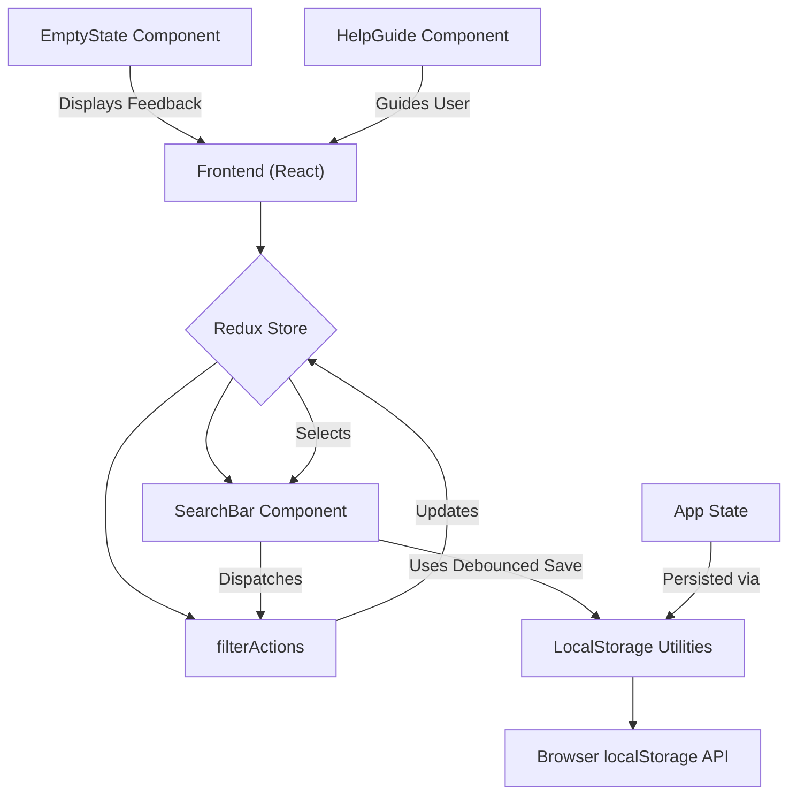

```md
# Utility and Helper Components

This section documents the common utility functions and components used throughout the TaskBuddy application. These components are designed to provide reusable functionality, improve user experience, and manage application state effectively.

## EmptyState Component

The `EmptyState` component is a presentational component used to display a helpful message and icon when a list of tasks is empty or filtered to show no results. It dynamically adjusts its content based on the context, such as whether a search query is active or if the user is viewing completed or active tasks.

**Key Features:**

*   **Contextual Messages:** Displays tailored messages for different scenarios:
    *   No tasks at all.
    *   No tasks matching a search query.
    *   No completed tasks.
    *   No active tasks (all are completed).
*   **Dynamic Icons:** Uses `lucide-react` icons to visually represent the state.
*   **Styling:** Employs Tailwind CSS classes for consistent theming and layout.

**Code Snippet:**

```jsx
import React from 'react';
import { CheckCircle, Circle, Search } from 'lucide-react';

const EmptyState = ({ type, searchQuery }) => {
  let icon = <Circle size={48} className="text-gray-400" />;
  let title = "No tasks yet";
  let message = "Add your first task to get started";
  
  if (searchQuery) {
    icon = <Search size={48} className="text-gray-400" />;
    title = "No matching tasks";
    message = `No tasks found matching "${searchQuery}"`;
  } else if (type === 'completed') {
    icon = <CheckCircle size={48} className="text-gray-400" />;
    title = "No completed tasks";
    message = "Tasks you complete will appear here";
  } else if (type === 'active') {
    icon = <Circle size={48} className="text-gray-400" />;
    title = "No active tasks";
    message = "All your tasks are completed!";
  }
  
  return (
    <div className="flex flex-col items-center justify-center py-16 text-center">
      <div className="mb-4">{icon}</div>
      <h3 className="text-xl font-semibold text-gray-700 dark:text-gray-300 mb-2">{title}</h3>
      <p className="text-gray-500 dark:text-gray-400">{message}</p>
    </div>
  );
};

export default EmptyState
```

[View on GitHub](https://github.com/meekhumor/TaskBuddy/blob/main/src/components/common/EmptyState.jsx)

---

## HelpGuide Component

The `HelpGuide` component provides an interactive modal that serves as a tutorial for users, explaining the core functionalities of TaskBuddy. It uses icons and descriptive text to guide users on how to add, edit, reorder, complete, and delete tasks, as well as understand the notification system.

**Key Features:**

*   **Overlay and Modal:** Implemented as a fixed overlay with a modal window for focused guidance.
*   **Action Explanations:** Each section details a specific action with a corresponding icon and clear instructions.
*   **Visual Cues:** Integrates icons from `lucide-react` to make the guide visually appealing and intuitive.
*   **Theming:** Adapts to dark and light modes using Tailwind CSS.
*   **Close Functionality:** Allows users to close the guide easily.

**Code Snippet:**

```jsx
import React from "react";
import {
  X,
  Plus,
  Edit,
  Move,
  CheckCircle,
  Trash2,
  Bell,
} from "lucide-react";

const HelpGuide = ({ onClose }) => {
  return (
    <div className="fixed inset-0 bg-black bg-opacity-50 flex items-center justify-center z-50">
      <div
        className="bg-white dark:bg-gray-800 rounded-xl shadow-2xl w-full max-w-xl p-8 transform transition-all duration-300 scale-100 hover:scale-105"
      >
        <div className="flex items-center justify-end mb-6">
          <button
            onClick={onClose}
            className="text-gray-500 hover:text-gray-700 dark:text-gray-400 dark:hover:text-gray-200"
          >
            <X size={28} />
          </button>
        </div>

        <div className="max-h-[32rem] overflow-y-auto space-y-6">
          {/* add task */}
          <div className="flex items-start space-x-4 p-4 bg-indigo-50 dark:bg-indigo-900 rounded-lg">
            <Plus className="text-indigo-500 dark:text-indigo-300 flex-shrink-0" size={24} />
            <div>
              <h3 className="font-semibold text-indigo-700 dark:text-indigo-300 text-lg">
                Add Tasks
              </h3>
              <p className="text-base text-gray-700 dark:text-gray-300">
                Enter a title, pick a category, set a priority, and choose a due
                date in the input field below.
              </p>
            </div>
          </div>

          {/* edit task */}
          <div className="flex items-start space-x-4 p-4 bg-green-50 dark:bg-green-900 rounded-lg">
            <Edit className="text-green-500 dark:text-green-300 flex-shrink-0" size={24} />
            <div>
              <h3 className="font-semibold text-green-700 dark:text-green-300 text-lg">
                Edit Tasks
              </h3>
              <p className="text-base text-gray-700 dark:text-gray-300">
                Click the <Edit size={16} className="inline" /> icon, update the
                title, then press Enter to save or Escape to cancel.
              </p>
            </div>
          </div>

          {/* reorder task */}
          <div className="flex items-start space-x-4 p-4 bg-yellow-50 dark:bg-yellow-900 rounded-lg">
            <Move className="text-yellow-500 dark:text-yellow-300 flex-shrink-0" size={24} />
            <div>
              <h3 className="font-semibold text-yellow-700 dark:text-yellow-300 text-lg">
                Reorder Tasks
              </h3>
              <p className="text-base text-gray-700 dark:text-gray-300">
                Drag and drop tasks to prioritize them your way.
              </p>
            </div>
          </div>

          {/* complete task */}
          <div className="flex items-start space-x-4 p-4 bg-blue-50 dark:bg-blue-900 rounded-lg">
            <CheckCircle className="text-blue-500 dark:text-blue-300 flex-shrink-0" size={24} />
            <div>
              <h3 className="font-semibold text-blue-700 dark:text-blue-300 text-lg">
                Complete Tasks
              </h3>
              <p className="text-base text-gray-700 dark:text-gray-300">
                Click the circle next to a task to mark it done.
              </p>
            </div>
          </div>

          {/* delete task */}
          <div className="flex items-start space-x-4 p-4 bg-red-50 dark:bg-red-900 rounded-lg">
            <Trash2 className="text-red-500 dark:text-red-300 flex-shrink-0" size={24} />
            <div>
              <h3 className="font-semibold text-red-700 dark:text-red-300 text-lg">
                Delete Tasks
              </h3>
              <p className="text-base text-gray-700 dark:text-gray-300">
                Hit the <Trash2 size={16} className="inline" /> icon to remove a
                task permanently.
              </p>
            </div>
          </div>

          {/* notifications */}
          <div className="flex items-start space-x-4 p-4 bg-purple-50 dark:bg-purple-900 rounded-lg">
            <Bell className="text-purple-500 dark:text-purple-300 flex-shrink-0" size={24} />
            <div>
              <h3 className="font-semibold text-purple-700 dark:text-purple-300 text-lg">
                Stay Notified
              </h3>
              <p className="text-base text-gray-700 dark:text-gray-300">
                Check the <Bell size={16} className="inline" /> icon for tasks
                due within 3 days.
              </p>
            </div>
          </div>
        </div>
      </div>
    </div>
  );
};

export default HelpGuide;
```

[View on GitHub](https://github.com/meekhumor/TaskBuddy/blob/main/src/components/common/HelpGuide.jsx)

---

## LocalStorage Utilities

The `LocalStorage` utilities provide functions for interacting with the browser's `localStorage` API. This is crucial for persisting application state, allowing users to pick up where they left off.

**Key Functions:**

*   **`loadState()`:** Retrieves the serialized state from `localStorage`. If no state is found or an error occurs, it returns `undefined`.
*   **`saveState(state)`:** Serializes the given state object and saves it to `localStorage` under the key `taskManagerState`. Handles potential errors during serialization or storage.
*   **`debounce(func, wait)`:** A utility function that limits the rate at which a function can be called. It returns a new function that, when invoked, will only call the original function after a specified `wait` period has elapsed without any further calls. This is particularly useful for expensive operations like saving state to `localStorage` in response to frequent user input (e.g., typing in a search bar).

**Code Snippet:**

```javascript
export const loadState = () => {
  try {
    const serializedState = localStorage.getItem('taskManagerState');
    if (serializedState === null) {
      return undefined;
    }
    return JSON.parse(serializedState);
  } catch (err) {
    console.error('Could not load state:', err);
    return undefined;
  }
};

export const saveState = (state) => {
  try {
    const serializedState = JSON.stringify(state);
    localStorage.setItem('taskManagerState', serializedState);
  } catch (err) {
    console.error('Could not save state:', err);
  }
};

export const debounce = (func, wait) => {
  let timeout;
  return (...args) => {
    clearTimeout(timeout);
    timeout = setTimeout(() => func(...args), wait);
  };
};
```

[View on GitHub](https://github.com/meekhumor/TaskBuddy/blob/main/src/components/common/LocalStorage.jsx)

**Integration Example (Debounced Save):**

The `debounce` function is often used in conjunction with `saveState` to prevent excessive writes to `localStorage` during rapid user interactions.

```javascript
import { saveState, debounce } from './LocalStorage'; // Assuming these are in the same directory

// ... inside a React component or Redux middleware

const debouncedSave = debounce(saveState, 1000); // Save state at most once per second

// When some state changes that needs to be persisted:
const currentState = getMyCurrentAppState(); // Function to get the current state
debouncedSave(currentState);
```

---

## SearchBar Component

The `SearchBar` component provides a user-friendly interface for filtering tasks. It integrates with the Redux store to manage the search query and update the displayed tasks accordingly.

**Key Features:**

*   **Input Field:** A standard text input for users to type their search terms.
*   **Search Icon:** A magnifying glass icon is displayed within the input field for visual cues.
*   **Redux Integration:**
    *   Uses `useSelector` to get the current `searchQuery` from the Redux state.
    *   Uses `useDispatch` to dispatch the `setSearchQuery` action when the input value changes.
*   **Styling:** Utilizes Tailwind CSS for a clean and responsive design, including dark mode support.

**Code Snippet:**

```jsx
import React from 'react';
import { useDispatch, useSelector } from 'react-redux';
import { setSearchQuery } from '../../redux/actions/filterActions';
import { Search } from 'lucide-react';

const SearchBar = () => {
  const dispatch = useDispatch();
  const searchQuery = useSelector(state => state.filter.searchQuery);

  const handleSearchChange = (e) => {
    dispatch(setSearchQuery(e.target.value));
  };

  return (
    <div className="relative">
      <div className="absolute inset-y-0 left-0 pl-3 flex items-center pointer-events-none">
        <Search size={18} className="text-gray-400" />
      </div>
      <input
        type="text"
        value={searchQuery || ''}
        onChange={handleSearchChange}
        placeholder="Search tasks..."
        className="w-full pl-10 pr-4 py-2 border border-gray-300 dark:border-gray-600 rounded-md 
                  focus:ring-2 focus:ring-indigo-500 focus:border-indigo-500 transition
                  dark:bg-gray-700 dark:text-white dark:placeholder-gray-400"
      />
    </div>
  );
};

export default SearchBar;
```

[View on GitHub](https://github.com/meekhumor/TaskBuddy/blob/main/src/components/common/SearchBar.jsx)

---

## Key Integration Points

These utility and helper components play a vital role in the overall architecture and user experience of TaskBuddy.

*   **State Management:** `LocalStorage` utilities are fundamental for achieving persistence. They work in tandem with a state management solution (like Redux) to load and save the application's state, ensuring that user data is not lost between sessions. The `debounce` function is a critical optimization for `saveState` to manage `localStorage` writes efficiently.

*   **User Interface Feedback:** `EmptyState` provides essential visual feedback to the user, making the application feel more complete and informative even when there's no content to display. It enhances usability by guiding the user on next steps.

*   **Guided User Experience:** `HelpGuide` is a key component for onboarding new users and reinforcing the usage of features. Its clear, icon-driven explanations make it easy for users to understand how to interact with the application's core functionalities.

*   **Feature Interconnectivity:** `SearchBar` demonstrates how utility components can be deeply integrated with the application's core logic (Redux) to enable dynamic features like real-time filtering.

These components, while seemingly simple, are building blocks that contribute significantly to TaskBuddy's maintainability, scalability, and user-friendliness.





```