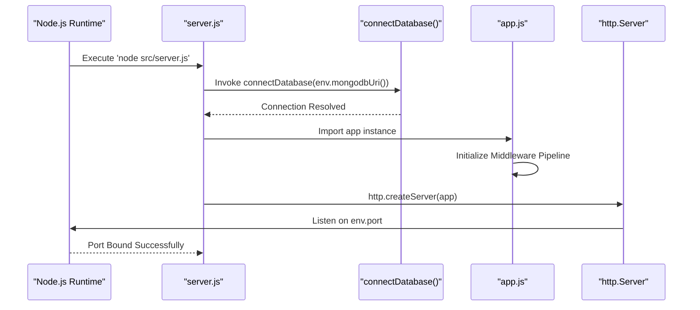

# Server Runtime Orchestration

## System Role & Architectural Position

The Server Runtime Orchestration layer serves as the entry point and lifecycle manager for the `codeRoom` backend. It is responsible for the atomic transition of the system from a dormant state to an active, request-handling state. This layer encapsulates the synchronization between the database connectivity state and the HTTP server's availability, ensuring that the Express application does not accept ingress traffic until the persistence layer is fully operational.

### Runtime Dependency Matrix

| Dependency | Version | Architectural Role | Criticality |
| :--- | :--- | :--- | :--- |
| `express` | `^5.2.1` | Routing engine and middleware orchestration | Critical |
| `mongoose` | `^9.9.5` | ODM for MongoDB connectivity and schema enforcement | Critical |
| `cors` | `^2.8.6` | Cross-Origin Resource Sharing (CORS) policy enforcement | High |
| `cookie-parser` | `^1.4.7` | HTTP request cookie parsing and normalization | Medium |
| `dotenv` | `^17.4.2` | Environmental variable injection and configuration | Critical |

## Core Execution & Data Flow Mechanics

The bootstrap sequence follows a strictly linear, asynchronous execution path. The system implements a "Fail-Fast" philosophy: any failure in the critical path (specifically database connectivity) triggers an immediate `process.exit(1)` to prevent the application from entering a zombie state where the server is listening but cannot fulfill data requests.

### Bootstrap Sequence Diagram



### Key Execution Invariants
*   **Dependency Order**: The database connection is awaited *prior* to the creation of the HTTP server. This prevents "race conditions" where API requests arrive before the Mongoose connection is established.
*   **Middleware Sequencing**: The Express pipeline is ordered to prioritize security and parsing (`cors` $\rightarrow$ `json` $\rightarrow$ `cookieParser`) before routing, and concludes with global error handlers to capture all unhandled exceptions.
*   **Payload Constraints**: A strict `16kb` limit is enforced on `json` and `urlencoded` bodies to mitigate Denial of Service (DoS) attacks via oversized payloads.

## Implementation Deep Dive

### The Bootstrapper Logic
The `server.js` file manages the asynchronous lifecycle of the process. It wraps the startup logic in a `startServer` closure to allow for `async/await` syntax during the database handshake.

```js title="server/src/server.js"
const startServer = async () => {
    await connectDatabase(env.mongodbUri())

    const server = http.createServer(app)

    server.listen(env.port, () => {
        console.log(`codeRoom server listening on port: ${env.port}`)
    })

    return server
}

startServer().catch((error) => {
    console.error("Unable to start codeRoom server:", error.message)
    process.exit(1)
})
```
**Mechanics:**
1.  **`connectDatabase(env.mongodbUri())`**: An awaited call to the Mongoose wrapper. If the URI is invalid or the cluster is unreachable, the promise rejects.
2.  **`http.createServer(app)`**: Wraps the Express `app` instance in a native Node.js HTTP server, allowing for potential future extensions (e.g., Socket.io integration).
3.  **`process.exit(1)`**: Ensures the process terminates with a non-zero exit code upon failure, signaling orchestrators (like PM2 or Kubernetes) to attempt a restart.

### Express Application Instantiation
The `app.js` file defines the request-response pipeline. It configures the system's global middleware and defines the top-level routing architecture.

```js title="server/src/app.js"
const app = express()

app.use(cors({
	origin: env.corsOrigin,
	credentials: true
}))
app.use(express.json({ limit: "16kb" }))
app.use(express.urlencoded({ extended: true, limit: "16kb" }))
app.use(cookieParser())

app.use("/api/health", healthRouter)

app.use(notFoundHandler)
app.use(errorHandler)
```
**Mechanics:**
1.  **CORS Configuration**: Restricted to `env.corsOrigin` to prevent unauthorized cross-domain requests while permitting `credentials: true` for cookie-based authentication.
2.  **Body Parsing**: `express.json()` and `express.urlencoded()` are configured with a `16kb` ceiling to protect server memory.
3.  **Error Pipeline**: The `notFoundHandler` catches any request that fails to match a defined route, while `errorHandler` acts as the final sink for all `next(err)` calls in the application.

## Method / State Reference & Error Recovery

### Server Configuration Schema

| Variable | Source | Type | Description | Default/Constraint |
| :--- | :--- | :--- | :--- | :--- |
| `env.port` | `.env` | `Number` | TCP port for the HTTP server | e.g., `8000` |
| `env.mongodbUri` | `.env` | `String` | MongoDB Connection String | Must be a valid `mongodb+srv://` URI |
| `env.corsOrigin` | `.env` | `String` | Allowed origin for CORS | Valid URL or `*` |

### Runtime Failure Modes

| Failure Scenario | Trigger | System Response | Recovery Action |
| :--- | :--- | :--- | :--- |
| **DB Connection Timeout** | Network partition or invalid credentials | `startServer().catch()` $\rightarrow$ `process.exit(1)` | Verify `MONGODB_URI` and whitelist IP in MongoDB Atlas |
| **Port Collision** | Port `env.port` already in use | `EADDRINUSE` error thrown by `server.listen` | Change `PORT` in `.env` or kill existing process |
| **Payload Overflow** | Request body $> 16\text{kb}$ | `413 Payload Too Large` | Increase `limit` in `app.use(express.json())` if required |
| **Unhandled Route** | Request to undefined endpoint | `notFoundHandler` middleware | Verify API endpoint path against `routes/` definitions |