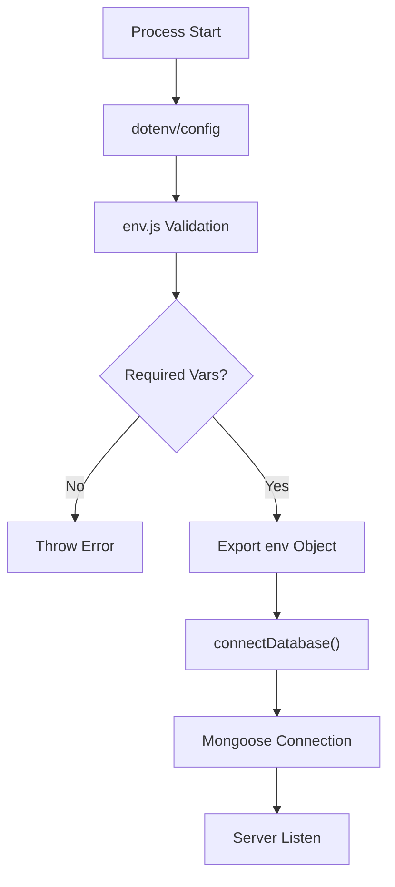

# Infrastructure Configuration & Persistence

## System Role & Architectural Position

The Infrastructure Configuration & Persistence layer serves as the foundational bootstrap mechanism for the `codeRoom` server. It is responsible for the deterministic resolution of environment-specific constants and the orchestration of the persistence layer's lifecycle. By decoupling configuration from application logic, the system ensures portability across development, staging, and production environments while enforcing strict validation of required runtime dependencies.

### Infrastructure Specification Matrix

| Component | Responsibility | Dependency | Scope | Constraint |
| :--- | :--- | :--- | :--- | :--- |
| `env.js` | Variable Mapping & Validation | `dotenv` | Global | Fail-fast on missing required keys |
| `db/index.js` | Persistence Lifecycle | `mongoose` | Singleton | Asynchronous connection blocking |
| `.vscode/settings.json` | IDE Runtime DX | VS Code / Postman | Local | Suppress noise for `.env` detection |

## Core Execution & Data Flow Mechanics

The system employs a synchronous configuration loading phase followed by an asynchronous persistence initialization phase. The `env` module acts as a gatekeeper, ensuring that the application does not attempt to instantiate the database connection if the required URI is absent from the process environment.

### Initialization Sequence



### Key Execution Invariants
*   **Strict Validation**: The `getRequiredEnv` utility prevents the server from entering a "zombie state" where it is running but unable to communicate with the database.
*   **Type Casting**: Environment variables (which are strings by default in Node.js) are explicitly cast to required types (e.g., `Number` for `PORT`) to prevent logic errors in network binding.
*   **Lazy Resolution**: The `mongodbUri` is implemented as a function call within the `env` object, ensuring the validation logic in `getRequiredEnv` is executed at the moment of access.

## Implementation Deep Dive & Code Snippets

### Environmental Mapping Logic
The configuration layer utilizes a centralized `env` object to provide a single source of truth for all system constants.

```js title="server/src/config/env.js"
import "dotenv/config"

const getRequiredEnv = (name) => {
    const value = process.env[name]

    if (!value) {
        throw new Error(`Missing required environment variable: ${name}`)
    }

    return value
}

const env = {
    nodeEnv: process.env.NODE_ENV || "development",
    port: Number(process.env.PORT) || 8000,
    corsOrigin: process.env.CORS_ORIGIN || "http://localhost:5173",
    mongodbUri: () => getRequiredEnv("MONGODB_URI")
}

export { env }
```

**Line-by-Line Mechanics:**
1.  `import "dotenv/config"`: Immediately loads `.env` file variables into `process.env` before any other logic executes.
2.  `getRequiredEnv(name)`: A higher-order validation utility that throws a hard `Error` if a key is missing, halting the bootstrap sequence.
3.  `nodeEnv`: Defaults to `"development"`, allowing for environment-specific logging or middleware behavior.
4.  `port`: Casts `process.env.PORT` to a `Number` type to satisfy the `http.Server` requirements.
5.  `mongodbUri`: Encapsulated as a function to trigger the `getRequiredEnv` validation logic during the database connection phase.

### Database Connection Lifecycle
The persistence layer wraps the Mongoose connection logic to provide clear error propagation to the server's main entry point.

```js title="server/src/db/index.js"
import mongoose from "mongoose"

const connectDatabase = async (mongodbUri) => {
	try {
		await mongoose.connect(mongodbUri)
		console.log("MongoDB connected")
	} catch (error) {
		throw new Error(`MongoDB connection failed: ${error.message}`)
	}
}

export { connectDatabase }
```

**Line-by-Line Mechanics:**
1.  `async (mongodbUri)`: Accepts the validated URI string from the `env` configuration.
2.  `await mongoose.connect()`: Initiates the asynchronous TCP handshake with the MongoDB instance.
3.  `try...catch` block: Intercepts network-level failures (e.g., DNS resolution failure, authentication rejection).
4.  `throw new Error(...)`: Re-throws the error with a prefixed message to facilitate rapid debugging in the server logs.

## Method / State Reference & Error Recovery

### Environment Variable Schema

| Variable | Type | Default | Requirement | Description |
| :--- | :--- | :--- | :--- | :--- |
| `NODE_ENV` | String | `development` | Optional | Defines runtime mode (dev/prod/test). |
| `PORT` | Number | `8000` | Optional | TCP port for Express server binding. |
| `CORS_ORIGIN` | String | `http://localhost:5173` | Optional | Allowed origin for Cross-Origin Resource Sharing. |
| `MONGODB_URI` | String | `N/A` | **Mandatory** | Connection string for MongoDB Atlas/Local. |

### Failure Modes & Recovery

| Failure Scenario | Detection Point | Result | Recovery Action |
| :--- | :--- | :--- | :--- |
| Missing `MONGODB_URI` | `env.mongodbUri()` | `Error: Missing required...` | Populate `.env` file with valid URI. |
| Invalid Port Format | `Number(process.env.PORT)` | `NaN` | Ensure `PORT` is a numeric string in `.env`. |
| DB Auth Failure | `connectDatabase()` | `Error: MongoDB connection failed...` | Verify database user credentials and IP whitelist. |
| Connection Timeout | `mongoose.connect()` | Promise Rejection | Check network connectivity to MongoDB cluster. |