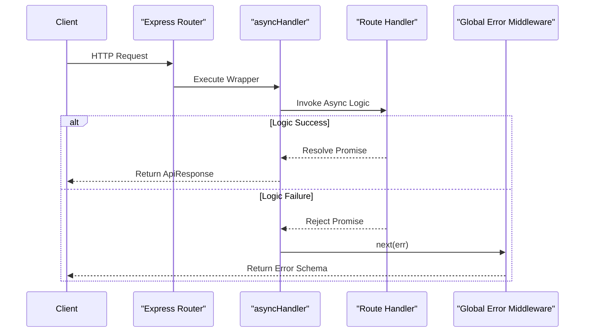

# API Execution Pipeline

## System Role & Architectural Position

The API Execution Pipeline serves as the critical middleware layer between the Express routing engine and the business logic controllers. Its primary architectural objective is to ensure execution atomicity and failure transparency. By decoupling the asynchronous request handling from the Express error-handling mechanism, the pipeline prevents process termination resulting from unhandled promise rejections and provides a standardized mechanism for system observability.

The pipeline is positioned immediately after the routing layer and before the controller execution phase, acting as a safety wrapper for all asynchronous operations.

### Component Specifications

| Component | Responsibility | Dependency | Critical Invariant |
| :--- | :--- | :--- | :--- |
| `asyncHandler` | Asynchronous wrapper HOF | `Promise` API | All rejected promises must be passed to `next()` |
| `healthRouter` | Liveness & Readiness probes | `mongoose`, `ApiResponse` | Must return `503` if `readyState !== 1` |
| `ApiResponse` | Schema standardization | N/A | Consistent JSON structure for all pipeline exits |

## Core Execution & Data Flow Mechanics

The pipeline utilizes a Higher-Order Function (HOF) pattern to intercept the execution of controller functions. Instead of requiring `try-catch` blocks in every route handler, the `asyncHandler` promotes errors to the global exception framework.

### Request Execution Lifecycle



### Key Execution Mechanics
*   **Promise Resolution**: The pipeline forces the return value of the `requestHandler` into a `Promise` using `Promise.resolve()`, ensuring that both synchronous and asynchronous functions are handled uniformly.
*   **Error Propagation**: Any rejection in the asynchronous chain is captured via `.catch()`, which immediately invokes the `next(err)` callback, shifting the execution context to the Express error-handling middleware.
*   **Health Probing**: The health endpoint performs a synchronous check of the MongoDB connection state machine to determine the service's readiness.

## Implementation Deep Dive & Code Snippets

### Asynchronous Wrapper Implementation

The `asyncHandler` eliminates boilerplate error handling and ensures that the Node.js event loop does not encounter unhandled rejections.

```js title="server/src/utils/asyncHandler.js"
const asyncHandler = (requestHandler) => {
    return (req, res, next) => {
        Promise.resolve(requestHandler(req,res,next)).catch((err) => next(err))
    }
}
export {asyncHandler}
```

**Technical Analysis:**
1.  **HOF Closure**: The function accepts a `requestHandler` and returns a standard Express middleware function `(req, res, next)`.
2.  **`Promise.resolve()`**: This ensures that even if the passed `requestHandler` is not explicitly marked as `async`, it is treated as a promise, providing a consistent interface for the `.catch()` method.
3.  **Error Tunneling**: The `.catch((err) => next(err))` block acts as the bridge to the `Standardized Response & Exception Framework`, preventing the application from crashing.

### System Health Monitoring

The health router implements a readiness probe that integrates the database state with the HTTP status code.

```js title="server/src/routes/health.routes.js"
healthRouter.get("/", (req, res) => {
    const databaseReady = mongoose.connection.readyState === 1
    const statusCode = databaseReady ? 200 : 503

    res.status(statusCode).json(new ApiResponse(statusCode, {
        service: "codeRoom-server",
        database: databaseReady ? "up" : "down",
        uptime: process.uptime()
    }, databaseReady ? "Service is healthy" : "Service is not ready"))
})
```

**Technical Analysis:**
1.  **`mongoose.connection.readyState`**: Evaluates the current connection state. A value of `1` indicates a connected state; any other value (0: disconnected, 2: connecting, 3: disconnecting) triggers a failure state.
2.  **HTTP 503 Service Unavailable**: Used specifically when the database is unreachable, signalling to load balancers or orchestrators (like Kubernetes) that the pod is not ready to receive traffic.
3.  **`process.uptime()`**: Returns the number of seconds the current Node.js process has been running, providing a metric for stability and restart tracking.

## Method / State Reference & Error Recovery

### Health Endpoint API Contract

| Field | Type | Description | Example |
| :--- | :--- | :--- | :--- |
| `statusCode` | `Number` | HTTP Status (200 or 503) | `200` |
| `data.service` | `String` | Identifier of the microservice | `"codeRoom-server"` |
| `data.database` | `String` | Connection status of MongoDB | `"up"` |
| `data.uptime` | `Number` | Process runtime in seconds | `1245.67` |
| `message` | `String` | Human-readable status description | `"Service is healthy"` |

### Failure Modes & Recovery

| Failure Scenario | Detection Mechanism | Pipeline Response | Recovery Action |
| :--- | :--- | :--- | :--- |
| **DB Connection Drop** | `readyState !== 1` | `503 Service Unavailable` | Mongoose automatic reconnection logic |
| **Unhandled Exception** | `Promise.reject()` | `next(err)` $\rightarrow$ Global Middleware | Log stack trace $\rightarrow$ Return 500 Error |
| **Process Hang** | TCP Timeout | Request Timeout | Orchestrator health-check restart |
| **Async Timeout** | Controller Latency | Pending Promise | Implementation of timeout middleware (optional) |