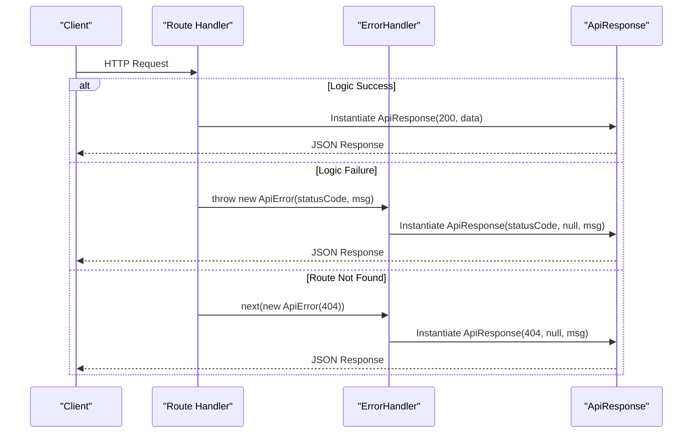

# Standardized Response & Exception Framework

## System Role & Architectural Position

The Standardized Response & Exception Framework serves as the egress control layer for the `codeRoom` server. It decouples business logic from HTTP transport concerns by enforcing a rigid contract for all outbound communication. This architecture ensures that whether a request terminates in a successful operation or a catastrophic failure, the client receives a predictably structured JSON payload.

The framework implements a centralized error propagation pattern, leveraging Express middleware to intercept thrown exceptions and map them to a unified response schema. This prevents leakages of sensitive system internals (e.g., raw database stack traces) and provides a consistent interface for frontend state management.

### Component Specifications

| Component | Type | Responsibility | Dependency |
| :--- | :--- | :--- | :--- |
| `ApiError` | Class | Specialized Error extension for operational failures | `Error` (Native) |
| `ApiResponse` | Class | Unified Data Transfer Object (DTO) for all API egress | None |
| `errorHandler` | Middleware | Global exception interceptor and response serializer | `ApiError`, `ApiResponse` |
| `notFoundHandler` | Middleware | Route-exhaustion handler for undefined endpoints | `ApiError` |

## Core Execution & Data Flow Mechanics

The framework operates as the final stage of the API Execution Pipeline. It utilizes a "Throw-to-Catch" mechanism where controllers and services throw `ApiError` instances, which are then propagated through the Express middleware chain until they reach the global `errorHandler`.

### Response Propagation Lifecycle



### Execution Invariants
*   **Atomicity**: Every request must terminate in exactly one `ApiResponse` instance.
*   **Status Mapping**: The `success` boolean in the response is strictly derived from the `statusCode` (True if $< 400$, False otherwise).
*   **Stack Preservation**: `ApiError` preserves the V8 stack trace unless explicitly overridden, ensuring debuggability in non-production environments.
*   **Fallback Safety**: Any error not inheriting from `ApiError` is automatically coerced to a `500 Internal Server Error` to prevent application crashes.

## Implementation Deep Dive

### Exception Specialization
The `ApiError` class extends the native JavaScript `Error` object to include HTTP-specific metadata.

```js title="server/src/utils/ApiError.js"
class ApiError extends Error {
    constructor(
        statusCode,
        message= "Something went wrong",
        errors = [],
        stack = ""
    ){
        super(message)
        this.statusCode = statusCode
        this.data = null
        this.message = message
        this.success = false
        this.errors = errors
        if (stack) {
            this.stack = stack
        } else { 
            Error.captureStackTrace(this, this.constructor)
        }
    }
}
export {ApiError}
```
**Technical Mechanics:**
1.  **`super(message)`**: Invokes the base `Error` constructor to set the message property.
2.  **`this.success = false`**: Hardcoded invariant for all `ApiError` instances.
3.  **`Error.captureStackTrace`**: V8-specific optimization that hides the constructor call from the stack trace, providing a cleaner trace from the point the error was actually thrown.

### Response Standardization
The `ApiResponse` class ensures a consistent JSON shape across the entire API surface.

```js title="server/src/utils/ApiResponse.js"
class ApiResponse {
    constructor(statusCode, data, message = "Success"){
        this.statusCode = statusCode
        this.data = data
        this.message = message
        this.success = statusCode < 400
    }
}
export {ApiResponse}
```
**Technical Mechanics:**
1.  **Dynamic Success Boolean**: Evaluates `statusCode < 400` to automatically determine the `success` flag, aligning with RFC 7231 HTTP semantics.
2.  **Data Payload**: The `data` field remains polymorphic, allowing for single objects, arrays, or `null` in the case of errors.

### Global Exception Middleware
The middleware layer handles the translation of internal errors into external responses.

```js title="server/src/middlewares/error.js"
const notFoundHandler = (req, res, next) => {
    next(new ApiError(404, `Route not found: ${req.method} ${req.originalUrl}`))
}

const errorHandler = (error, req, res, next) => {
    const statusCode = error.statusCode || 500
    const message = statusCode === 500 ? "Internal server error" : error.message

    res.status(statusCode).json(new ApiResponse(statusCode, null, message))
}
```
**Technical Mechanics:**
1.  **`notFoundHandler`**: Acts as a catch-all for requests that do not match any defined route, explicitly injecting an `ApiError(404)` into the `next()` function.
2.  **`errorHandler`**: An Express error-handling middleware (identified by its four arguments).
3.  **Security Masking**: If the `statusCode` is `500`, the original error message is suppressed and replaced with `"Internal server error"` to avoid leaking sensitive system details to the client.

## Method & State Reference

### ApiError Constructor Contract

| Parameter | Type | Default | Description |
| :--- | :--- | :--- | :--- |
| `statusCode` | `Number` | Required | HTTP status code (e.g., 400, 401, 404, 500). |
| `message` | `String` | `"Something went wrong"` | Human-readable error description. |
| `errors` | `Array` | `[]` | Array of specific validation errors or sub-errors. |
| `stack` | `String` | `""` | Custom stack trace override. |

### ApiResponse Schema (JSON)

| Key | Type | Description | Invariant |
| :--- | :--- | :--- | :--- |
| `statusCode` | `Number` | The HTTP response status. | Matches `res.status()` |
| `data` | `Any \| null` | The payload of the response. | `null` if `success === false` |
| `message` | `String` | Summary of the operation result. | Always present. |
| `success` | `Boolean` | Boolean indicator of operation success. | `true` if `statusCode < 400` |

### Error Recovery & Failure Modes

| Failure Mode | System Response | Recovery Mechanism |
| :--- | :--- | :--- |
| **Undefined Route** | `notFoundHandler` $\rightarrow$ `ApiError(404)` | Client must correct the endpoint URI. |
| **Unhandled Exception** | `errorHandler` $\rightarrow$ `statusCode: 500` | Server logs stack trace; returns generic error. |
| **Validation Failure** | `ApiError(400, msg, [errorList])` | Client parses `errors` array for field-level fixes. |
| **Authentication Gap** | `ApiError(401, "Unauthorized")` | Client must refresh JWT or re-authenticate. |