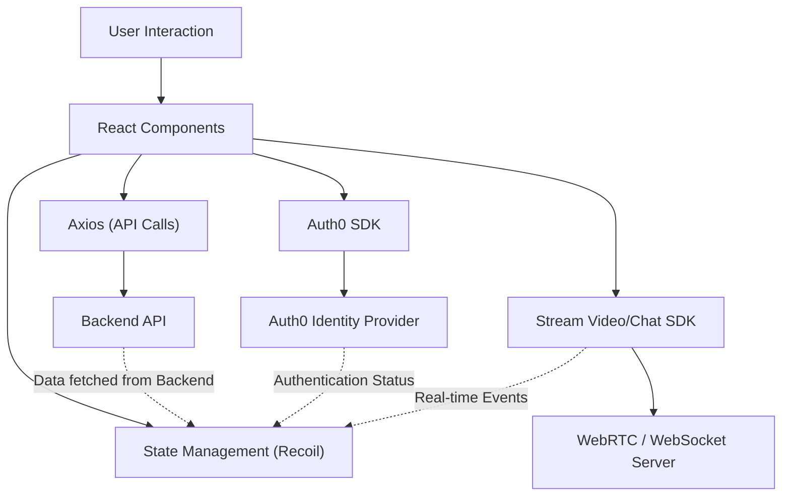
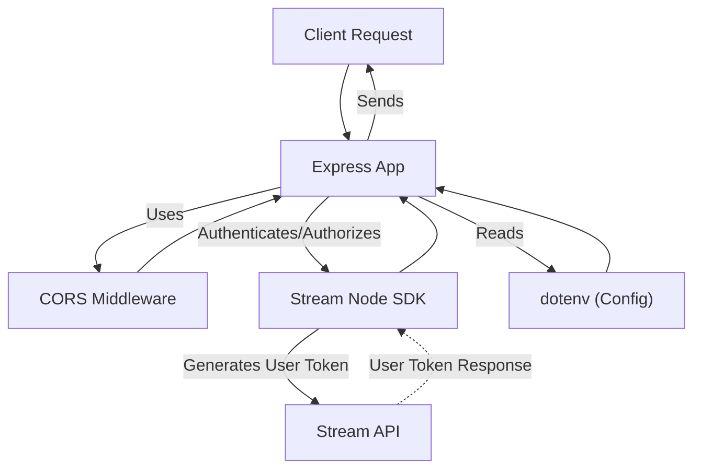

 # Development Setup

This document provides comprehensive instructions for setting up your local development environment for both the client (frontend) and server (backend) components of the application. It outlines the necessary steps, key dependencies, and configuration details to get you up and running quickly.

## Client Setup

The client-side application is a React-based frontend, utilizing Vite for a fast development experience. It integrates various UI libraries, authentication, and real-time communication features.

### Prerequisites

Ensure you have [Node.js](https://nodejs.org/en/download/) (version 18 or higher recommended) and npm (or Yarn/pnpm) installed on your system.

### Installation

1.  Navigate to the `client` directory:
    ```bash
    cd client
    ```
2.  Install the dependencies using npm:
    ```bash
    npm install
    ```
    This command reads the `client/package.json` file and installs all listed dependencies and development dependencies.

### Key Client Dependencies

Below are some of the critical dependencies and their roles in the client application:

*   **`react` & `react-dom`**: The core libraries for building user interfaces.
*   **`react-router-dom`**: For declarative routing in the React application.
*   **`axios`**: A promise-based HTTP client for making API requests to the backend.
*   **`recoil`**: A state management library for React.
*   **`@auth0/auth0-react`**: Integrates Auth0 for user authentication and authorization.
*   **`@monaco-editor/react` & `monaco-editor`**: Provides the rich code editor experience within the application.
*   **`@stream-io/video-react-sdk` & `stream-chat-react`**: SDKs for building real-time video and chat functionalities.
*   **`tailwindcss` & `autoprefixer`**: For utility-first CSS styling and automatic vendor prefixing.
*   **`@radix-ui/*` components**: A collection of high-quality, accessible UI components.
*   **`framer-motion`**: A library for production-ready motion and animation.

### Development Scripts

The `client/package.json` defines several scripts to streamline development:

```json
"scripts": {
  "dev": "vite",
  "build": "vite build",
  "lint": "eslint .",
  "preview": "vite preview"
}
```

*   **`npm run dev`**: Starts the development server using Vite. The application will be accessible typically at `http://localhost:5173`.
*   **`npm run build`**: Compiles the client application for production deployment.
*   **`npm run lint`**: Runs ESLint to check for code style and potential errors.
*   **`npm run preview`**: Serves the production build locally for testing.

### Client-Side Data Flow

The following diagram illustrates a simplified data flow within the client application:





## Server Setup

The server-side application is built with Node.js and Express, providing API endpoints for the frontend. It handles authentication, data persistence, and real-time communication integration.

### Prerequisites

Ensure you have [Node.js](https://nodejs.org/en/download/) (version 18 or higher recommended) and npm (or Yarn/pnpm) installed on your system.

### Installation

1.  Navigate to the `server` directory:
    ```bash
    cd server
    ```
2.  Install the dependencies using npm:
    ```bash
    npm install
    ```
    This command reads the `server/package.json` file and installs all listed dependencies.

### Configuration

The server relies on environment variables for sensitive information and configuration. Create a `.env` file in the `server` directory and populate it with necessary variables (e.g., database connection strings, API keys). An example `.env` structure might look like:

```ini
PORT=5000
STREAM_API_KEY=YOUR_STREAM_API_KEY
STREAM_API_SECRET=YOUR_STREAM_API_SECRET
```

### Key Server Dependencies

Below are some of the critical dependencies and their roles in the server application:

*   **`express`**: A fast, unopinionated, minimalist web framework for Node.js.
*   **`cors`**: Middleware to enable Cross-Origin Resource Sharing, allowing the frontend to make requests to the backend.
*   **`dotenv`**: Loads environment variables from a `.env` file into `process.env`.
*   **`nodemon`**: A utility that automatically restarts the Node.js application when file changes are detected during development.
*   **`@stream-io/node-sdk` & `stream-chat`**: Server-side SDKs for interacting with Stream Chat and Video services, including token generation and API calls.

### Development Scripts

The `server/package.json` defines a script to run the server in development mode:

```json
"scripts": {
  "start": "nodemon index.js"
}
```

*   **`npm run start`**: Starts the Express server using Nodemon. This will watch for changes in `index.js` and restart the server automatically. The server will typically run on `http://localhost:5000`.

### Server-Side Request Flow

This diagram illustrates a typical request flow through the server application:





## Key Integration Points

Both client and server are designed to work together seamlessly.

*   **Authentication**: The client uses Auth0 for user login. Upon successful authentication, the client might send user information to the backend (via `axios`) to register or update the user and potentially retrieve a Stream API token, which is then used by the `Stream Video/Chat SDK`.
*   **API Communication**: The frontend makes HTTP requests to the backend using `axios` for data fetching and state updates. The server (Express) processes these requests, potentially interacting with external services (like Stream API) or a database.
*   **Real-time Features**: The `Stream Video/Chat SDK` on the client-side communicates directly with Stream's WebRTC/WebSocket servers for real-time video and chat functionalities. The backend (using `@stream-io/node-sdk`) handles server-side operations such as generating user tokens or managing channels.

To ensure smooth operation, always verify that both the client and server applications are running and correctly configured with the appropriate environment variables.