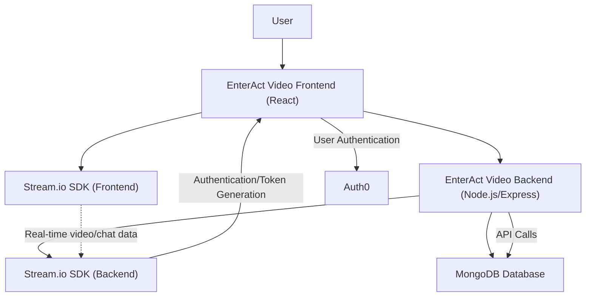
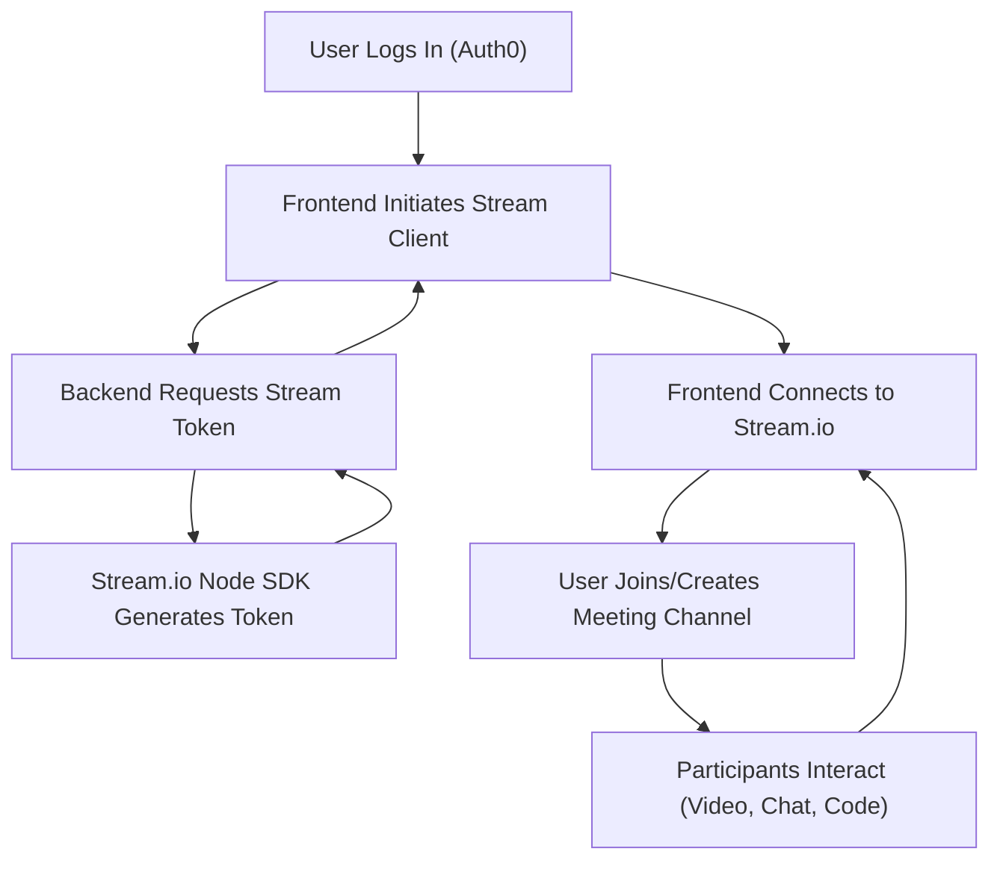

 # Project Overview

EnterAct Video is an advanced collaborative video conferencing platform that integrates real-time video communication with an interactive coding environment. Designed to enhance remote meetings and teamwork, it is particularly useful for developers, technical teams, and educators who require simultaneous coding and discussion.

The platform leverages **React** for a dynamic and responsive user interface and the **Stream SDK** for robust real-time functionality, including low-latency video streaming and chat. Key features include real-time code editing, screen sharing, live chat, and collaborative whiteboarding, making remote collaboration more productive and engaging.

## Core Purpose

The primary purpose of EnterAct Video is to provide a seamless and integrated environment for technical collaboration. This involves:

*   **Facilitating Technical Interviews**: Candidates and interviewers can code together in real-time.
*   **Enabling Remote Pair Programming**: Developers can collaborate on codebases efficiently.
*   **Supporting Online Coding Workshops**: Educators can demonstrate and debug code live with participants.
*   **Enhancing Corporate Meetings**: Collaborative note-taking and brainstorming alongside video calls.

## Architecture and Key Components

EnterAct Video is built as a full-stack application with a clear separation of concerns between the client and server.

### Frontend (Client)

The client-side application is developed using **React**, providing a rich and interactive user experience. It handles video rendering, chat interfaces, code editor integration, and user authentication flows.

**Core Technologies:**
*   **React**: For building the user interface.
*   **Stream SDK (Video-React-SDK)**: For real-time video, audio, and chat functionalities.
*   **Code Mirror**: Integrated for the real-time collaborative code editing feature.
*   **ShadCn**: UI component library for building accessible and customizable user interfaces.
*   **Auth0**: For user authentication.

#### Frontend Dependencies Example

The `client/package.json` file outlines the core dependencies for the frontend application. Here's a snippet showcasing some key libraries:

```json
{
  "name": "client",
  "private": true,
  "version": "0.0.0",
  "type": "module",
  "scripts": {
    "dev": "vite",
    "build": "vite build",
    "lint": "eslint .",
    "preview": "vite preview"
  },
  "dependencies": {
    "@auth0/auth0-react": "^2.2.4",
    "@monaco-editor/react": "^4.6.0",
    "@stream-io/video-react-sdk": "^1.8.5",
    "axios": "^1.7.9",
    "class-variance-authority": "^0.7.1",
    "clsx": "^2.1.1",
    "framer-motion": "^12.0.5",
    "react": "^18.3.1",
    "react-dom": "^18.3.1",
    "react-router-dom": "^7.0.2",
    "recoil": "^0.7.7",
    "stream-chat": "^8.48.0",
    "stream-chat-react": "^12.8.1",
    "tailwind-merge": "^2.6.0",
    "tailwindcss-animate": "^1.0.7"
  }
}
```
[View on GitHub](https://github.com/rushichavan21/axios/blob/main/client/package.json)

### Backend (Server)

The backend is built with **Node.js** and **Express.js**, providing APIs for user management, Stream SDK integration, and any persistent data operations.

**Core Technologies:**
*   **Node.js**: Runtime environment.
*   **Express.js**: Web application framework for building APIs.
*   **Stream SDK (Node-SDK)**: For server-side integration with Stream.io services, managing tokens, and user sessions.
*   **MongoDB**: For database storage.
*   **CORS**: Middleware for enabling Cross-Origin Resource Sharing.

#### Backend Dependencies Example

The `server/package.json` file details the backend dependencies, including `express` and the `stream-io/node-sdk`.

```json
{
  "name": "server",
  "version": "1.0.0",
  "description": "",
  "main": "index.js",
  "type": "module",
  "scripts": {
    "start": "nodemon index.js"
  },
  "keywords": [],
  "author": "",
  "license": "ISC",
  "dependencies": {
    "@stream-io/node-sdk": "^0.4.5",
    "cors": "^2.8.5",
    "dotenv": "^16.4.7",
    "express": "^4.21.2",
    "nodemon": "^3.1.9",
    "stream-chat": "^8.48.0"
  }
}
```
[View on GitHub](https://github.com/rushichavan21/axios/blob/main/server/package.json)

### Data Persistence

**MongoDB** serves as the primary database for EnterAct Video, storing user information, meeting data, and chat history. This NoSQL database offers flexibility and scalability for handling various types of application data.

## System Architecture Diagram





This diagram illustrates the primary data flow and component interactions within the EnterAct Video application. The user interacts with the React frontend, which communicates with both the Stream.io SDK for real-time features and the custom Node.js/Express backend for other API operations. The backend also interacts with its Stream.io SDK counterpart and the MongoDB database. Auth0 is integrated for secure user authentication.

## Key Features

EnterAct Video offers a comprehensive set of features designed to enhance remote collaboration:

*   **Real-time Video Conferencing**: High-quality, low-latency video and audio calls.
*   **Live Chat and Messaging**: Integrated chat for text communication during meetings.
*   **Screen Sharing**: Share desktops or specific applications with participants.
*   **Real-time Code Editor**: Collaborative code editing environment using Code Mirror. This allows multiple users to edit code simultaneously, with changes reflected in real-time for all participants.
*   **User Authentication**: Secure login and user management via Auth0.
*   **Live Attendance**: Track participant presence during meetings.
*   **Strict Mode**: Enhanced control over meeting participant interactions.

## Project Setup Highlights

Setting up the project involves cloning the repository, installing dependencies for both client and server, and then running each part separately.

#### Client Setup

```bash
# Clone the repository
git clone https://github.com/rushichavan21/axios.git

# Navigate to the client directory
cd axios/client

# Install frontend dependencies
npm install

# Start the frontend development server
npm run dev
```
[View client setup instructions on GitHub](https://github.com/rushichavan21/axios#project-setup)

#### Server Setup

```bash
# Navigate to the server directory
cd axios/server

# Install backend dependencies
npm install

# Start the backend server (using nodemon for auto-restarts)
npm start
```
[View server setup instructions on GitHub](https://github.com/rushichavan21/axios#project-setup)

This setup ensures that both the frontend and backend services are running, allowing the application to function correctly. The frontend will typically run on a different port (e.g., `localhost:5173` via Vite), while the backend runs on its designated port (e.g., `localhost:5000` or as configured in `index.js`).

## Future Enhancements

The project has a clear roadmap for future development:

*   **AI-driven Transcription and Summarization**: Implement AI to transcribe meeting audio and generate concise summaries.
*   **Expanded Language Support**: Increase accessibility by supporting multiple languages.
*   **Optimized Video Streaming**: Enhance video quality and reduce bandwidth usage, especially for low-bandwidth connections.
*   **Cloud-based Code Session Storage**: Allow users to save and retrieve code sessions from the cloud.

## Key Integration Points

The seamless functionality of EnterAct Video relies on several critical integration points:

### 1. Stream.io SDK Integration
The Stream.io SDK is fundamental to EnterAct Video's real-time capabilities.
*   **Frontend**: The `@stream-io/video-react-sdk` provides React hooks and components for easily integrating video calls, chat, and participant management into the UI. This abstracts away the complexities of WebRTC and real-time communication.
*   **Backend**: The `@stream-io/node-sdk` is used on the server to generate authentication tokens for users, manage Stream.io resources (e.g., creating channels, updating user metadata), and handle server-side events if necessary. This ensures secure and controlled access to Stream.io services.
    ```javascript
    // Example from a server-side Stream.io token generation (conceptual)
    import { StreamChat } from 'stream-chat';
    import dotenv from 'dotenv';
    dotenv.config();

    const api_key = process.env.STREAM_API_KEY;
    const api_secret = process.env.STREAM_API_SECRET;

    const serverClient = StreamChat.getInstance(api_key, api_secret);

    // In an API endpoint:
    app.post('/api/create-token', (req, res) => {
        const { userId } = req.body;
        const expirationTime = Math.floor(Date.now() / 1000) + (60 * 60); // 1 hour
        const issuedAt = Math.floor(Date.now() / 1000) - 60; // 1 minute ago

        const token = serverClient.createToken(userId, expirationTime, issuedAt);
        res.json({ token });
    });
    ```
    This snippet demonstrates how the backend acts as a secure intermediary to generate user-specific tokens for Stream.io, preventing API secrets from being exposed on the client.

### 2. Real-time Code Editor (Code Mirror)
The integration of Code Mirror is crucial for the collaborative coding feature.
*   **Frontend**: Code Mirror is embedded as a component within the React application. To achieve real-time collaboration, a synchronization mechanism (often using WebSockets, possibly via Stream.io's messaging capabilities or a dedicated WebSocket server) is implemented to broadcast changes made by one user to all other participants.
*   **Operational Transformation/Conflict Resolution**: For true real-time collaborative editing, a robust system for handling concurrent edits is essential. This typically involves Operational Transformation (OT) or Conflict-Free Replicated Data Types (CRDTs) to ensure consistency across all clients.

### 3. User Authentication (Auth0)
Auth0 provides a secure and scalable authentication solution.
*   **Frontend**: The `@auth0/auth0-react` SDK is used to handle login, logout, and manage user sessions within the React application. It redirects users to the Auth0 universal login page and provides mechanisms to access user profile information and authentication tokens.
    ```javascript
    // Example of Auth0Provider in client/src/main.jsx (conceptual)
    import React from 'react';
    import ReactDOM from 'react-dom/client';
    import App from './App.jsx';
    import { Auth0Provider } from '@auth0/auth0-react';

    ReactDOM.createRoot(document.getElementById('root')).render(
      <React.StrictMode>
        <Auth0Provider
          domain={import.meta.env.VITE_AUTH0_DOMAIN}
          clientId={import.meta.env.VITE_AUTH0_CLIENT_ID}
          authorizationParams={{
            redirect_uri: window.location.origin
          }}
        >
          <App />
        </Auth0Provider>
      </React.StrictMode>,
    );
    ```
    This shows how the `Auth0Provider` wraps the main application, making authentication contexts available throughout.
*   **Backend**: The backend can validate incoming tokens issued by Auth0 to secure API endpoints, ensuring that only authenticated and authorized users can access sensitive resources.

## Workflow for a New Meeting





This sequence details the typical workflow when a user initiates or joins a meeting. After logging in via Auth0, the frontend requests a Stream.io token from the backend. The backend securely generates this token, allowing the frontend to establish a secure connection to Stream.io. Once connected, users can join or create meeting channels and begin collaborating through video, chat, and the real-time code editor.

## Conclusion

EnterAct Video offers a robust and comprehensive solution for real-time collaborative video conferencing with integrated code editing. Its modular architecture, leveraging React, Node.js, Stream SDK, and MongoDB, provides a scalable and maintainable platform for diverse technical collaboration needs. The detailed setup instructions and clear feature roadmap ensure the project's continued development and usability.