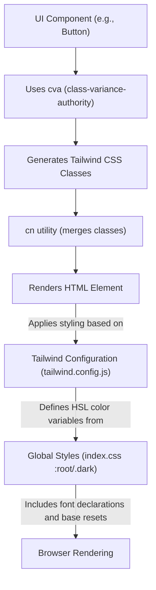

 # UI Components and Styling

This document provides comprehensive documentation for the reusable UI components, styling conventions, and utility classes implemented within the client-side application. It covers how components like `Button` and `Dialog` are structured, how styling is managed using Tailwind CSS, and the role of global stylesheets.

## Overview

The client-side UI is built with a strong emphasis on reusability and maintainability. Components are designed to be generic and configurable, leveraging libraries like Radix UI for accessibility and `class-variance-authority` (CVA) for robust styling. Styling is primarily handled by Tailwind CSS, with a custom configuration and a global stylesheet (`index.css`) defining base styles, custom properties, and fonts.

## Reusable UI Components

The `client/src/components/ui` directory houses a collection of foundational UI components. These components encapsulate common UI patterns, ensuring consistency and simplifying development across the application.

### Button Component

The `Button` component (`client/src/components/ui/button.jsx`) is a versatile component designed to handle various actions and visual styles. It utilizes `class-variance-authority` (CVA) to define multiple `variants` and `sizes`, allowing for flexible styling with a clean API.

The core `buttonVariants` definition uses CVA to manage different visual states:

```jsx file=client/src/components/ui/button.jsx lines=10-38
const buttonVariants = cva(
  "inline-flex items-center justify-center gap-2 whitespace-nowrap rounded-md text-sm font-medium transition-colors focus-visible:outline-none focus-visible:ring-1 focus-visible:ring-ring disabled:pointer-events-none disabled:opacity-50 [&_svg]:pointer-events-none [&_svg]:size-4 [&_svg]:shrink-0",
  {
    variants: {
      variant: {
        default:
          "bg-primary text-primary-foreground shadow hover:bg-primary/90",
        destructive:
          "bg-destructive text-destructive-foreground shadow-sm hover:bg-destructive/90",
        outline:
          "border border-input bg-background shadow-sm hover:bg-accent hover:text-accent-foreground",
        secondary:
          "bg-secondary text-secondary-foreground shadow-sm hover:bg-secondary/80",
        ghost: "hover:bg-accent hover:text-accent-foreground",
        link: "text-primary underline-offset-4 hover:underline",
      },
      size: {
        default: "h-9 px-4 py-2",
        sm: "h-8 rounded-md px-3 text-xs",
        lg: "h-10 rounded-md px-8",
        icon: "h-9 w-9",
      },
    },
    defaultVariants: {
      variant: "default",
      size: "default",
    },
  }
)
```
[View on GitHub](https://github.com/realrnvr/axios/blob/main/client/src/components/ui/button.jsx#L10-L38)

The `Button` component itself is a `React.forwardRef` component that conditionally renders either a `button` element or a `Slot` component from Radix UI, depending on the `asChild` prop. This allows for seamless integration with other components that require a trigger element, ensuring styles are correctly applied.

```jsx file=client/src/components/ui/button.jsx lines=40-50
const Button = React.forwardRef(({ className, variant, size, asChild = false, ...props }, ref) => {
  const Comp = asChild ? Slot : "button"
  return (
    (<Comp
      className={cn(buttonVariants({ variant, size, className }))}
      ref={ref}
      {...props} />)
  );
})
Button.displayName = "Button"

export { Button, buttonVariants }
```
[View on GitHub](https://github.com/realrnvr/axios/blob/main/client/src/components/ui/button.jsx#L40-L50)

### Dialog Component

The `Dialog` component (`client/src/components/ui/dialog.jsx`) provides a flexible and accessible modal experience, built upon Radix UI's `DialogPrimitive`. It includes components for the root `Dialog`, `DialogTrigger`, `DialogOverlay`, `DialogContent`, `DialogHeader`, `DialogFooter`, `DialogTitle`, and `DialogDescription`.

The `DialogContent` is particularly notable, handling fixed positioning, animations, and including a close button:

```jsx file=client/src/components/ui/dialog.jsx lines=26-49
const DialogContent = React.forwardRef(({ className, children, ...props }, ref) => (
  <DialogPortal>
    <DialogOverlay />
    <DialogPrimitive.Content
      ref={ref}
      className={cn(
        "fixed left-[50%] top-[50%] z-50 grid w-full max-w-lg translate-x-[-50%] translate-y-[-50%] gap-4 border bg-background p-6 shadow-lg duration-200 data-[state=open]:animate-in data-[state=closed]:animate-out data-[state=closed]:fade-out-0 data-[state=open]:fade-in-0 data-[state=closed]:zoom-out-95 data-[state=open]:zoom-in-95 data-[state=closed]:slide-out-to-left-1/2 data-[state=closed]:slide-out-to-top-[48%] data-[state=open]:slide-in-from-left-1/2 data-[state=open]:slide-in-from-top-[48%] sm:rounded-lg",
        className
      )}
      {...props}>
      {children}
      <DialogPrimitive.Close
        className="absolute right-4 top-4 rounded-sm opacity-70 ring-offset-background transition-opacity hover:opacity-100 focus:outline-none focus:ring-2 focus:ring-ring focus:ring-offset-2 disabled:pointer-events-none data-[state=open]:bg-accent data-[state=open]:text-muted-foreground">
        <X className="h-4 w-4" />
        <span className="sr-only">Close</span>
      </DialogPrimitive.Close>
    </DialogPrimitive.Content>
  </DialogPortal>
))
DialogContent.displayName = DialogPrimitive.Content.displayName
```
[View on GitHub](https://github.com/realrnvr/axios/blob/main/client/src/components/ui/dialog.jsx#L26-L49)

The component leverages Tailwind CSS classes for its complex styling, including animation properties for entry and exit transitions, ensuring a smooth user experience.

## Styling Conventions and Utilities

The application's styling strategy revolves around Tailwind CSS for utility-first styling, complemented by a global CSS file for base styles and custom properties.

### Tailwind CSS Configuration

The `client/tailwind.config.js` file is the central point for configuring Tailwind CSS. It extends the default Tailwind theme to include custom colors, border radii, and a `darkMode` setting. It also integrates a custom plugin (`addVariablesForColors`) to expose CSS variables.

The `theme.extend.colors` section defines a comprehensive set of semantic color variables, including support for light and dark modes:

```javascript file=client/tailwind.config.js lines=20-69
      colors: {
        background: "hsl(var(--background))",
        foreground: "hsl(var(--foreground))",
        card: {
          DEFAULT: "hsl(var(--card))",
          foreground: "hsl(var(--card-foreground))",
        },
        popover: {
          DEFAULT: "hsl(var(--popover))",
          foreground: "hsl(var(--popover-foreground))",
        },
        primary: {
          DEFAULT: "hsl(var(--primary))",
          foreground: "hsl(var(--primary-foreground))",
        },
        secondary: {
          DEFAULT: "hsl(var(--secondary))",
          foreground: "hsl(var(--secondary-foreground))",
        },
        muted: {
          DEFAULT: "hsl(var(--muted))",
          foreground: "hsl(var(--muted-foreground))",
        },
        accent: {
          DEFAULT: "hsl(var(--accent))",
          foreground: "hsl(var(--accent-foreground))",
        },
        destructive: {
          DEFAULT: "hsl(var(--destructive))",
          foreground: "hsl(var(--destructive-foreground))",
        },
        border: "hsl(var(--border))",
        input: "hsl(var(--input))",
        ring: "hsl(var(--ring))",
        chart: {
          "1": "hsl(var(--chart-1))",
          "2": "hsl(var(--chart-2))",
          "3": "hsl(var(--chart-3))",
          "4": "hsl(var(--chart-4))",
          "5": "hsl(var(--chart-5))",
        },
        sidebar: {
          DEFAULT: "hsl(var(--sidebar-background))",
          foreground: "hsl(var(--sidebar-foreground))",
          primary: "hsl(var(--sidebar-primary))",
          "primary-foreground": "hsl(var(--sidebar-primary-foreground))",
          accent: "hsl(var(--sidebar-accent))",
          "accent-foreground": "hsl(var(--sidebar-accent-foreground))",
          border: "hsl(var(--sidebar-border))",
          ring: "hsl(var(--sidebar-ring))",
        },
      },
```
[View on GitHub](https://github.com/realrnvr/axios/blob/main/client/tailwind.config.js#L20-L69)

This setup ensures that all UI elements consistently use a defined color palette, and these colors can be easily swapped for different themes (e.g., dark mode) by updating the underlying CSS variables. The `addVariablesForColors` plugin makes all Tailwind colors available as CSS variables, facilitating dynamic styling.

```javascript file=client/tailwind.config.js lines=81-90
function addVariablesForColors({ addBase, theme }) {
  const allColors = flattenColorPalette(theme("colors"));
  const newVars = Object.fromEntries(
    Object.entries(allColors).map(([key, val]) => [`--${key}`, val])
  );

  addBase({
    ":root": newVars,
  });
}
```
[View on GitHub](https://github.com/realrnvr/axios/blob/main/client/tailwind.config.js#L81-L90)

### Global Styles (`index.css`)

The `client/src/index.css` file serves as the main entry point for global styles. It imports Tailwind's base, components, and utilities layers, and defines custom CSS properties for colors, font families, font sizes, and font weights. It also handles font declarations for the "Poppins" typeface.

Global CSS variables for typography and general styling are defined in the `:root` selector:

```css file=client/src/index.css lines=75-107
:root {
  /* font family */
  --ff-primary: "Poppins", sans-serif;

  /* colors */
  --clr-bg: hsla(20, 14%, 4%, 0.979);
  --clr-border: hsl(240 3.7% 15.9%);
  --clr-primary: hsl(0 0% 98%);
  --clr-secondary: hsl(240 3.7% 15.9%);
  --primary: 210 40.6% 60.3%;

  /* font sizes */
  --fs-100: 1rem;
  --fs-200: 1.15rem;
  --fs-300: 1.5rem;
  --fs-400: 2rem;
  --fs-500: 3rem;
  --fs-550: 3.5rem;
  --fs-600: 4rem;
  --fs-700: 5rem;
  --fs-800: 6rem;
  --fs-900: 8rem;

  /* font weights */
  --fw-200: 200;
  --fw-300: 300;
  --fw-400: 400;
  --fw-500: 500;
  --fw-600: 600;
  --fw-700: 700;
  --fw-800: 800;
  --fw-900: 900;
}
```
[View on GitHub](https://github.com/realrnvr/axios/blob/main/client/src/index.css#L75-L107)

These variables provide a centralized way to manage fundamental design tokens that can be referenced throughout the application, including by Tailwind's configuration.

The `@layer base` directives in `index.css` are crucial for integrating custom properties with Tailwind's class system, allowing the application to define its core color palette and font settings that Tailwind then extends:

```css file=client/src/index.css lines=134-196
@layer base {
  :root {
    --background: 240 10% 3.9%;
    --foreground: 240 10% 3.9%;
    --card: 0 0% 100%;
    --card-foreground: 240 10% 3.9%;
    --popover: 0 0% 100%;
    --popover-foreground: 240 10% 3.9%;
    --primary: 240 5.9% 10%;
    --primary-foreground: 0 0% 98%;
    --secondary: 240 4.8% 95.9%;
    --secondary-foreground: 240 5.9% 10%;
    --muted: 240 4.8% 95.9%;
    --muted-foreground: 240 3.8% 46.1%;
    --accent: 240 4.8% 95.9%;
    --accent-foreground: 240 5.9% 10%;
    --destructive: 0 84.2% 60.2%;
    --destructive-foreground: 0 0% 98%;
    --border: 240 5.9% 90%;
    --input: 240 5.9% 90%;
    --ring: 240 10% 3.9%;
    --chart-1: 12 76% 61%;
    --chart-2: 173 58% 39%;
    --chart-3: 197 37% 24%;
    --chart-4: 43 74% 66%;
    --chart-5: 27 87% 67%;
    --radius: 0.5rem;
    --sidebar-background: 0 0% 98%;
    --sidebar-foreground: 240 5.3% 26.1%;
    --sidebar-primary: 240 5.9% 10%;
    --sidebar-primary-foreground: 0 0% 98%;
    --sidebar-accent: 240 4.8% 95.9%;
    --sidebar-accent-foreground: 240 5.9% 10%;
    --sidebar-border: 220 13% 91%;
    --sidebar-ring: 217.2 91.2% 59.8%;
  }
  .dark {
    --background: 240 10% 3.9%;
    --foreground: 240 10% 3.9%;
    --card: 240 10% 3.9%;
    --card-foreground: 0 0% 98%;
    --popover: 240 10% 3.9%;
    --popover-foreground: 0 0% 98%;
    --primary: 0 0% 98%;
    --primary-foreground: 240 5.9% 10%;
    --secondary: 240 3.7% 15.9%;
    --secondary-foreground: 0 0% 98%;
    --muted: 240 3.7% 15.9%;
    --muted-foreground: 240 5% 64.9%;
    --accent: 240 3.7% 15.9%;
    --accent-foreground: 0 0% 98%;
    --destructive: 0 62.8% 30.6%;
    --destructive-foreground: 0 0% 98%;
    --border: 240 3.7% 15.9%;
    --input: 240 3.7% 15.9%;
    --ring: 240 4.9% 83.9%;
    --chart-1: 220 70% 50%;
    --chart-2: 160 60% 45%;
    --chart-3: 30 80% 55%;
    --chart-4: 280 65% 60%;
    --chart-5: 340 75% 55%;
    --sidebar-background: 240 5.9% 10%;
    --sidebar-foreground: 240 4.8% 95.9%;
    --sidebar-primary: 224.3 76.3% 48%;
    --sidebar-primary-foreground: 0 0% 100%;
    --sidebar-accent: 240 3.7% 15.9%;
    --sidebar-accent-foreground: 240 4.8% 95.9%;
    --sidebar-border: 240 3.7% 15.9%;
    --sidebar-ring: 217.2 91.2% 59.8%;
  }
}
```
[View on GitHub](https://github.com/realrnvr/axios/blob/main/client/src/index.css#L134-L196)

These `:root` and `.dark` blocks define the HSL color values for various UI elements like `--background`, `--primary`, `--accent`, etc., and are directly consumed by the `tailwind.config.js` to create dynamic Tailwind classes. This dual-layer approach provides a robust and flexible styling system.

## UI Component and Styling Flow

The following diagram illustrates how UI components interact with the styling system to render styled elements.





## Key Integration Points

1.  **CVA and Tailwind**: The `class-variance-authority` (CVA) library is a cornerstone for creating flexible and maintainable component styles. It allows developers to define `variants` and `sizes` for components like `Button`, generating appropriate Tailwind CSS classes. This ensures consistency and reduces boilerplate.
2.  **Radix UI**: For accessible and unstyled primitives, Radix UI components (e.g., `DialogPrimitive`, `Slot`) are integrated. This offloads complex accessibility and interaction logic, allowing styling to be applied purely via Tailwind CSS and `cn` utility.
3.  **Custom CSS Variables**: The `index.css` file defines global CSS variables (e.g., `--background`, `--primary`, `--ff-primary`) that are consumed by `tailwind.config.js`. This creates a single source of truth for design tokens and enables easy theme switching (e.g., light/dark mode) by updating these variables.
4.  **`cn` Utility**: The `cn` utility (likely from `clsx` or a similar library) is used across components to conditionally join class names, handling variants, overrides, and default styles effectively. This utility is vital for dynamic class generation.
5.  **Font Management**: `index.css` is responsible for importing custom fonts (`Poppins`) via `@font-face` rules and setting the primary font family through a CSS variable (`--ff-primary`), ensuring consistent typography across the application.
6.  **Dark Mode Integration**: The `tailwind.config.js` specifies `darkMode: ["class"]`, and `index.css` includes a `.dark` class block to define alternative CSS variable values. This allows the application to switch between light and dark themes by toggling a `dark` class on the `html` element.