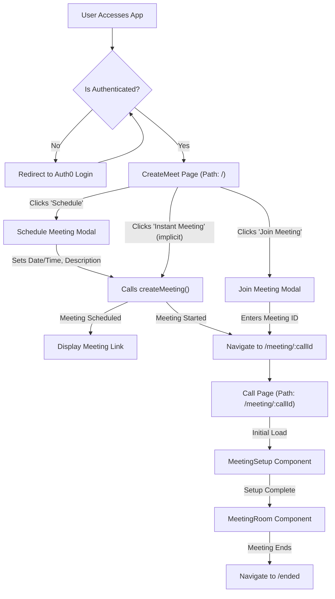
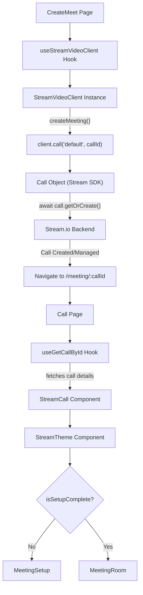

 # Client-Side Pages and Routing

The client-side application, built with React, manages its user interface through a well-defined set of pages and a robust routing system powered by `react-router-dom`. This section details the main pages, their responsibilities, and how navigation and route protection are implemented.

## Routing Architecture

The core of the client-side routing is configured within `RouterProviderBase.jsx`. This file centralizes all route definitions, handles lazy loading for improved performance, and applies route protection using the `ProtectedRoute` component.

```jsx title="client/src/services/provider/RouterProviderBase.jsx"
import { createBrowserRouter, RouterProvider } from "react-router-dom";
import { lazy, Suspense } from "react";
import Home from "@/pages/home/Home";
import ProtectedRoute from "../gaurd/ProtectedRoute";

const Call = lazy(() => import("@/pages/call/Call"));
const Chat_Layout = lazy(() => import("@/pages/chat/Chat"));
const CreateMeet = lazy(() => import("@/pages/createMeet/CreateMeet"));
const Upcoming = lazy(() => import("@/pages/upcoming/Upcoming"));
const Ended = lazy(() => import("@/pages/ended/Ended"));

const LoadingFallback = () => <div>Loading...</div>;

const SuspenseWrapper = ({ children }) => (
  <Suspense fallback={<LoadingFallback />}>
    {children}
  </Suspense>
);

const router = createBrowserRouter([
  {
    path: "/",
    element: (
        <ProtectedRoute element={<CreateMeet />} />
    ),
  },
  {
    path: "/onboarding",
    element: <Home />,
  },
  {
    path: "/chat",
    element: (
      <SuspenseWrapper>
        <Chat_Layout />
      </SuspenseWrapper>
    ),
  },
  {
    path: "/meeting/:callId",
    element: (
      <SuspenseWrapper>
        <Call />
      </SuspenseWrapper>
    ),
  },
  {
    path: "/upcoming",
    element: (
      <SuspenseWrapper>
        <Upcoming />
      </SuspenseWrapper>
    ),
  },
  {
    path: "/ended",
    element: (
      <SuspenseWrapper>
        <Ended />
      </SuspenseWrapper>
    ),
  },
]);

export const RouterProviderBase = () => {
  return <RouterProvider router={router} />;
};
```
[View on GitHub](https://github.com/realrnvr/axios/blob/main/client/src/services/provider/RouterProviderBase.jsx)

### Key Aspects of Routing:
*   **Lazy Loading:** Pages like `Call`, `Chat_Layout`, `CreateMeet`, `Upcoming`, and `Ended` are loaded lazily using `React.lazy` and `SuspenseWrapper`. This improves initial load times by splitting the application bundle.
*   **Root Route (`/`):** The default route redirects to the `CreateMeet` page, protected by `ProtectedRoute`. This ensures that users are authenticated before accessing the primary meeting creation functionality.
*   **Dynamic Routes:** The `/meeting/:callId` route is a dynamic segment, allowing specific meeting rooms to be accessed directly via their unique `callId`.

## Core Client-Side Pages

The application is structured around several key pages, each serving a distinct purpose in the video conferencing workflow.

### Home Page (`Home.jsx`)

The `Home` component serves as an onboarding or initial landing page. It provides a visual introduction or placeholder before the user dives into the main application functionalities.

```jsx title="client/src/pages/home/Home.jsx"
import "./home.css";
import CenterPart from "@/components/centerPart/CenterPart";
import Navbar from "@/components/navbar/Navbar";
import { BackgroundLines } from "../../components/extraUicom/backgroundLines";

const Home = () => {
  return (
    <div className="Home_main_container ">
      <Navbar />
      <div className="home__content">
        <CenterPart />
      </div>
      <BackgroundLines className={"opacity-50"} />
    </div>
  );
};

export default Home;
```
[View on GitHub](https://github.com/realrnvr/axios/blob/main/client/src/pages/home/Home.jsx)

### Create Meeting Page (`CreateMeet.jsx`)

The `CreateMeet` component is the central hub for initiating and scheduling video calls. It integrates with the Stream.io Video SDK to manage call creation and provides user interfaces for instant meetings, scheduled meetings, and joining existing meetings.

This page handles:
*   **Meeting Creation:** Generates a unique `callId` and initializes a new call using `client.call("default", callId)`.
*   **Scheduling:** Allows users to pick a future date and time for a meeting.
*   **Instant Meetings:** Starts a meeting immediately, redirecting the user to the `/meeting/:callId` route.
*   **Join Meeting:** Provides an interface for users to enter a meeting ID and join.
*   **Authentication Check:** Ensures the user is authenticated before allowing meeting creation.

```jsx title="client/src/pages/createMeet/CreateMeet.jsx"
// ... (imports)

const CreateMeet = () => {
  // ... (state and hooks)

  const createMeeting = async () => {
    if (!isClientReady || !user) {
      console.error("Client not ready or user not authenticated");
      return;
    }

    try {
      if (!values.dateTime) {
        toast({ title: "Please select a date and time" });
        return;
      }

      const callId = crypto.randomUUID();
      const call = client.call("default", callId);

      if (!call) {
        throw new Error("Failed to create call");
      }

      const startsAt = values.dateTime.toISOString();
      const description = values.description || "Instant meeting";

      const isFutureMeeting = values.dateTime > new Date();

      await call.getOrCreate({
        data: {
          starts_at: startsAt,
          custom: { description },
        },
      });

      setCallDetails(call);

      if (isFutureMeeting) {
        setIsSchedule(true);
        toast({ title: "Meeting scheduled successfully!" });
      } else {
        toast({ title: "Meeting started" });
        navigate(`/meeting/${call.id}`);
      }
    } catch (error) {
      console.log(error);
      toast({
        title: "Failed to create meeting",
      });
    }
  };

  if (!isClientReady) return <CustomLoader />;

  return (
    // ... (JSX for meeting options and modals)
  );
};

export default CreateMeet;
```
[View on GitHub](https://github.com/realrnvr/axios/blob/main/client/src/pages/createMeet/CreateMeet.jsx)

### Call Page (`Call.jsx`)

The `Call` component is dedicated to hosting active video meetings. It retrieves call details based on the `callId` from the URL parameters and dynamically renders either a setup screen or the full meeting room.

Key features:
*   **Dynamic `callId` Retrieval:** Uses `useParams` from `react-router-dom` to get the meeting ID.
*   **Stream SDK Integration:** Utilizes `StreamCall` and `StreamTheme` components from `@stream-io/video-react-sdk` to manage the video call's state and UI.
*   **Setup vs. Room:** Presents `MeetingSetup` initially to configure audio/video, then switches to `MeetingRoom` once setup is complete.
*   **Authentication Check:** Verifies user authentication and redirects to login if necessary.

```jsx title="client/src/pages/call/Call.jsx"
import CustomLoader from "@/components/customLoader/CustomLoader";
import MeetingRoom from "@/components/meetingRoom/MeetingRoom";
import MeetingSetup from "@/components/meetingSetup/MeetingSetup";
import { useGetCallById } from "@/hooks/useGetCallByid";
import { useAuth0 } from "@auth0/auth0-react";
import { StreamCall, StreamTheme } from "@stream-io/video-react-sdk";
import { useEffect, useState } from "react";
import { useParams } from "react-router-dom";

const Call = () => {
  const { callId } = useParams();
  const {
    isLoading,
    isAuthenticated,
    loginWithRedirect
  } = useAuth0();
  const [isSetupComplete, setIsSetupComplete] = useState(false);
  const { call, isCallLoading } = useGetCallById(callId);
  useEffect(()=>{
    if(!isAuthenticated){
      loginWithRedirect();

    }
  },[isAuthenticated,loginWithRedirect])
  if (isLoading || isCallLoading) return <CustomLoader />;
  // If not authenticated, return null to prevent rendering

  return (
    <main className="h-screen w-full">
      <StreamCall call={call}>
        <StreamTheme>
          {!isSetupComplete ? (
            <MeetingSetup setIsSetupComplete={setIsSetupComplete} />
          ) : (
            <MeetingRoom />
          )}
        </StreamTheme>
      </StreamCall>
    </main>
  );
};

export default Call;
```
[View on GitHub](https://github.com/realrnvr/axios/blob/main/client/src/pages/call/Call.jsx)

## Page Flow and Interactions

The client-side pages work in concert to provide a seamless user experience, from initiating a meeting to participating in one.





## Key Integration Points

### Authentication and Protected Routes

The `ProtectedRoute` component ensures that certain routes are only accessible to authenticated users. It leverages `Auth0`'s authentication state to guard components.

```jsx title="client/src/services/gaurd/ProtectedRoute.jsx"
// Simplified example of ProtectedRoute logic
import { useAuth0 } from "@auth0/auth0-react";
import { useEffect } from "react";
import CustomLoader from "@/components/customLoader/CustomLoader";

const ProtectedRoute = ({ element }) => {
  const { isAuthenticated, isLoading, loginWithRedirect } = useAuth0();

  useEffect(() => {
    if (!isLoading && !isAuthenticated) {
      loginWithRedirect();
    }
  }, [isAuthenticated, isLoading, loginWithRedirect]);

  if (isLoading || !isAuthenticated) {
    return <CustomLoader />; // Or a simple loading indicator
  }

  return element;
};

export default ProtectedRoute;
```
[View on GitHub](https://github.com/realrnvr/axios/blob/main/client/src/services/gaurd/ProtectedRoute.jsx)

This setup ensures that unauthorized users attempting to access protected routes (like the root `/` which renders `CreateMeet`) are redirected to the Auth0 login flow.

### Stream.io Video SDK Integration

Both `CreateMeet.jsx` and `Call.jsx` heavily rely on the Stream.io Video SDK for their core functionality.

*   `CreateMeet` uses `useStreamVideoClient` to get the client instance and then `client.call()` to create new call instances.
*   `Call` wraps its UI with `StreamCall` and `StreamTheme` components, providing the context necessary for all Stream.io UI components (e.g., `MeetingSetup`, `MeetingRoom`) to function.





This architecture ensures a clear separation of concerns, with dedicated pages for different phases of the user's interaction with video meetings, while maintaining a consistent and protected routing experience.