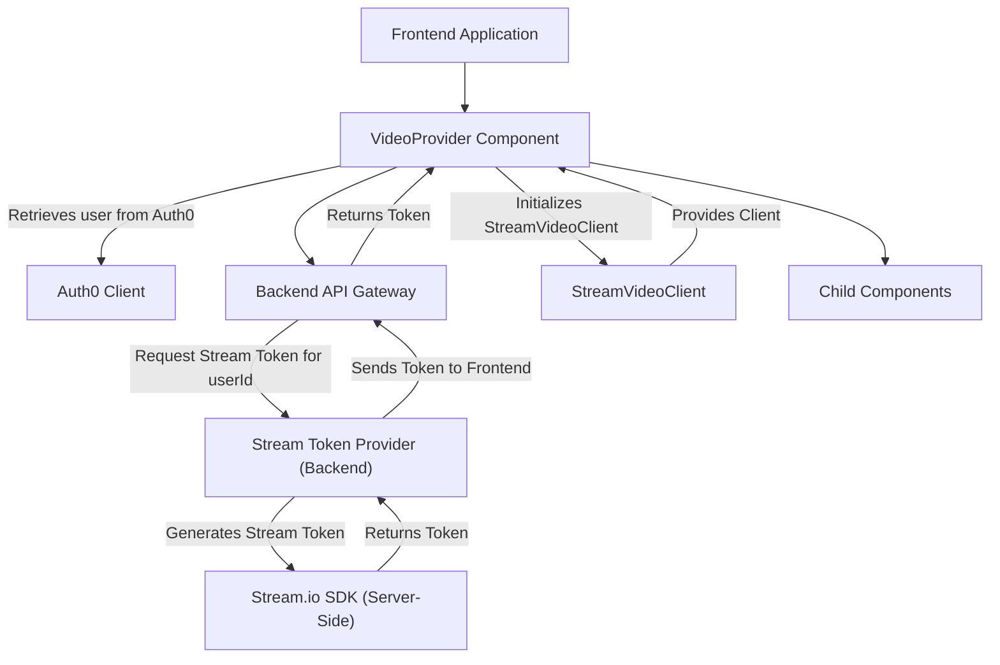
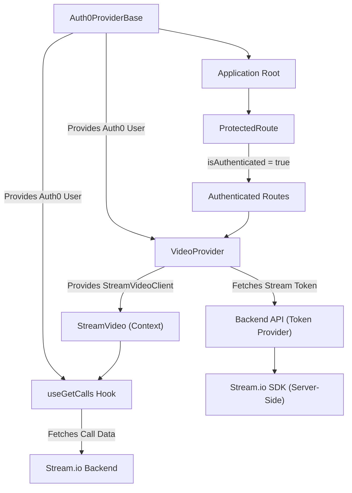

 # Client-Side Services and Hooks

The client-side architecture leverages a combination of third-party services and custom React hooks to manage user authentication, real-time video streaming, and data fetching. This document details the implementation of these services and hooks, providing insight into how they integrate to deliver a seamless user experience.

## Authentication with Auth0

Authentication is handled through Auth0, providing a robust and secure mechanism for user identity management. The `Auth0ProviderBase` component initializes the Auth0 client, making authentication state and functions available throughout the application.

### Auth0 Provider

The `Auth0ProviderBase` component wraps the entire application or relevant sections to provide authentication context. It configures the Auth0 client with the necessary domain, client ID, and redirect URI, ensuring that users are properly authenticated and their sessions are managed.

```jsx
// client/src/services/provider/Auth0ProviderBase.jsx
import { Auth0Provider } from "@auth0/auth0-react";
import PropTypes from "prop-types";

const Auth0ProviderBase = ({ children }) => {
  return (
    <Auth0Provider
      domain={
        import.meta.VITE_AUTH0_DOMAIN || "dev-riaw1h1kzszelhv5.us.auth0.com"
      }
      clientId={
        import.meta.VITE_AUTH0_CLIENT_ID || "w5dAqh53hZqBrhmIIwytz4Sr9eSF3AR8"
      }
      authorizationParams={{
        redirect_uri: window.location.origin,
      }}
    >
      {children}
    </Auth0Provider>
  );
};

Auth0ProviderBase.propTypes = {
  children: PropTypes.node.isRequired,
};

export default Auth0ProviderBase;
```
[View on GitHub](https://github.com/realrnvr/axios/blob/main/client/src/services/provider/Auth0ProviderBase.jsx)

### Protected Routes

To ensure only authenticated users can access certain parts of the application, a `ProtectedRoute` component is implemented. This component leverages the `useAuth0` hook to check the user's authentication status and redirects them to an onboarding page if they are not authenticated. A custom loader is displayed while the authentication status is being determined.

```jsx
// client/src/services/gaurd/ProtectedRoute.jsx
import PropTypes from "prop-types";
import { useAuth0 } from "@auth0/auth0-react";
import { Navigate } from "react-router-dom";
import CustomLoader from "@/components/customLoader/CustomLoader";

const ProtectedRoute = ({ element }) => {
  const { isAuthenticated, isLoading } = useAuth0();

  if (isLoading) {
    return <CustomLoader />;
  }
  if (!isAuthenticated) {
    return <Navigate to="/onboarding" replace />;
  }
  return element;
};

ProtectedRoute.propTypes = {
  element: PropTypes.node.isRequired,
};

export default ProtectedRoute;
```
[View on GitHub](https://github.com/realrnvr/axios/blob/main/client/src/services/gaurd/ProtectedRoute.jsx)

## Video Streaming with Stream.io

The application integrates with Stream.io for real-time video communication capabilities. The `VideoProvider` component initializes the Stream Video client, handling user authentication with Stream and providing the client instance to its children components.

### Stream Video Provider

The `VideoProvider` component is responsible for setting up the Stream Video client. It fetches an authentication token from a backend API using the authenticated user's details from Auth0, ensuring secure and authorized access to Stream.io services. The user ID is sanitized before being sent to the backend to comply with Stream.io's requirements.

```jsx
// client/src/services/stream/VideoProvider.jsx
import { useEffect, useState } from "react";
import { useAuth0 } from "@auth0/auth0-react";
import { StreamVideo, StreamVideoClient } from "@stream-io/video-react-sdk";
import axios from "axios";
import PropTypes from "prop-types";
import CustomLoader from "@/components/customLoader/CustomLoader";

const apiKey = import.meta.env.VITE_STREAM_API_KEY || "3ua7rmk2epdb";

const VideoProvider = ({ children }) => {
  const { user, isLoading } = useAuth0();
  const [client, setClient] = useState();

  useEffect(() => {
    if (isLoading || !user) return;

    const sanitizedId = user.sub.replace(/[^a-z0-9@_-]/gi, "_");

    const tokenProvider = async () => {
      try {
        const response = await axios.get(
          `https://axios-fky5.vercel.app/api/v1/stream/token-provider/${sanitizedId}`
        );

        const { token } = response.data;
        if (!token) {
          throw new Error("Token is missing in the response");
        }

        return token;
      } catch (error) {
        console.error("Error fetching token:", error);
        throw error;
      }
    };

    const myClient = StreamVideoClient.getOrCreateInstance({
      apiKey,
      user: {
        id: sanitizedId,
        name: user.name || user.nickname,
        image: user.picture || "https://via.placeholder.com/150",
      },
      tokenProvider,
    });

    setClient(myClient);

    return () => {
      if (myClient) {
        myClient.disconnectUser();
        setClient(undefined);
      }
    };
  }, [isLoading, user]);

  if (!client && user) return <CustomLoader />;

  return <StreamVideo client={client}>{children}</StreamVideo>;
};

VideoProvider.propTypes = {
  children: PropTypes.node.isRequired,
};

export default VideoProvider;
```
[View on GitHub](https://github.com/realrnvr/axios/blob/main/client/src/services/stream/VideoProvider.jsx)

### Token Provider Flow

The `tokenProvider` function within `VideoProvider` demonstrates a crucial aspect of secure integration with Stream.io. It makes an API call to a custom backend endpoint to retrieve a user-specific authentication token for Stream. This prevents exposing Stream API secrets on the client-side and allows for server-side validation and management of user sessions.

```javascript
// client/src/services/stream/VideoProvider.jsx (Snippet from within useEffect)
    const tokenProvider = async () => {
      try {
        const response = await axios.get(
          `https://axios-fky5.vercel.app/api/v1/stream/token-provider/${sanitizedId}`
        );

        const { token } = response.data;
        if (!token) {
          throw new Error("Token is missing in the response");
        }

        return token;
      } catch (error) {
        console.error("Error fetching token:", error);
        throw error;
      }
    };
```
[View on GitHub](https://github.com/realrnvr/axios/blob/main/client/src/services/stream/VideoProvider.jsx#L20-L37)

The backend endpoint `/api/v1/stream/token-provider/:userId` is responsible for generating this token securely.





## Custom Hooks for Data Fetching

A custom React hook, `useGetCalls`, is implemented to fetch and manage video call data from the Stream.io client. This hook centralizes the logic for querying calls, filtering them by status (upcoming or ended), and managing loading states.

### `useGetCalls` Hook

The `useGetCalls` hook utilizes both the `useAuth0` and `useStreamVideoClient` hooks to access user information and the Stream client instance. It fetches calls associated with the current user, sorts them, and then provides memoized functions to filter these calls into "ended" and "upcoming" categories.

```jsx
// client/src/hooks/useGetCalls.js
import { useAuth0 } from "@auth0/auth0-react";
import { useStreamVideoClient } from "@stream-io/video-react-sdk";
import { useCallback, useEffect, useState } from "react";

export const useGetCalls = () => {
  const [calls, setCalls] = useState([]);
  const [isLoading, setIsLoading] = useState(false);

  const client = useStreamVideoClient();
  const { user } = useAuth0();

  useEffect(() => {
    const fetchCalls = async () => {
      if (!client || !user) return;
      setIsLoading(true);

      try {
        const { calls: fetchedCalls } = await client.queryCalls({
          sort: [{ field: "starts_at", direction: -1 }],
          filter_conditions: {
            starts_at: { $exists: true },
            $or: [
              { created_by_user_id: user.sub.replace(/[^a-z0-9@_-]/gi, "_") },
              { members: { $in: [user.sub.replace(/[^a-z0-9@_-]/gi, "_")] } },
            ],
          },
          limit: 100,
          watch: true,
        });

        setCalls(fetchedCalls);
      } catch (error) {
        console.error("Failed to fetch calls:", error);
      } finally {
        setIsLoading(false);
      }
    };

    fetchCalls();
  }, [client, user]);

  const now = new Date().toISOString();

  const endedCalls = useCallback(
    () =>
      calls.filter(({ state }) => {
        const startsAt = state?.startsAt
          ? new Date(state.startsAt).toISOString()
          : null;
        const endedAt = state?.endedAt
          ? new Date(state.endedAt).toISOString()
          : null;

        return (startsAt && startsAt < now) || (endedAt && endedAt < now);
      }),
    [calls, now]
  );

  const upcomingCalls = useCallback(
    () =>
      calls.filter(({ state }) => {
        const startsAt = state?.startsAt
          ? new Date(state.startsAt).toISOString()
          : null;

        return startsAt && startsAt > now;
      }),
    [calls, now]
  );

  return { endedCalls, upcomingCalls, isLoading };
};
```
[View on GitHub](https://github.com/realrnvr/axios/blob/main/client/src/hooks/useGetCalls.js)

### Call Filtering Logic

The `useEffect` hook handles the initial fetching of calls, while `useCallback` is used to memoize the filtering functions for `endedCalls` and `upcomingCalls`. This optimization prevents unnecessary re-renders when the `calls` array or `now` date changes, enhancing performance. The `queryCalls` method includes specific `filter_conditions` to retrieve calls relevant to the current user, either as the creator or a member.

```javascript
// client/src/hooks/useGetCalls.js (Snippet from within useEffect)
        const { calls: fetchedCalls } = await client.queryCalls({
          sort: [{ field: "starts_at", direction: -1 }],
          filter_conditions: {
            starts_at: { $exists: true },
            $or: [
              { created_by_user_id: user.sub.replace(/[^a-z0-9@_-]/gi, "_") },
              { members: { $in: [user.sub.replace(/[^a-z0-9@_-]/gi, "_")] } },
            ],
          },
          limit: 100,
          watch: true,
        });
```
[View on GitHub](https://github.com/realrnvr/axios/blob/main/client/src/hooks/useGetCalls.js#L20-L33)

This filtering condition ensures that users only see calls they are involved in, whether they created them or were invited as members. The `user.sub` is sanitized to match the format used by Stream.io.

## Key Integration Points

The client-side services and hooks form a cohesive system for managing user experience.

*   **Auth0 Integration:** The `Auth0ProviderBase` provides the foundational authentication context.
*   **Protected Routing:** `ProtectedRoute` ensures that application access is gated by authentication status, relying on `useAuth0`.
*   **Stream.io Setup:** `VideoProvider` initializes the Stream.io client, using user data from `useAuth0` and a secure token from the backend.
*   **Data Fetching:** `useGetCalls` integrates directly with the `StreamVideoClient` provided by `VideoProvider` and uses `useAuth0` for user identification to fetch relevant call data.

This layered approach ensures that authentication, real-time communication, and data management are handled efficiently and securely, promoting a modular and maintainable codebase. The use of custom hooks centralizes complex logic, making it reusable across the application.


