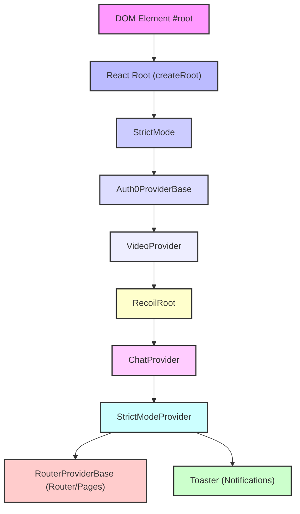
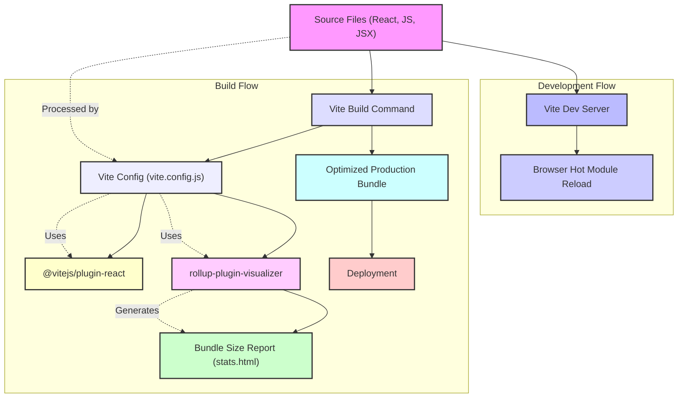

 # Client-Side Architecture

This document provides a comprehensive overview of the client-side application's architecture, detailing its core structure, key technologies, main entry points, and development configurations. The client application is built using React, bundled with Vite, styled with Tailwind CSS, and uses ESLint for code quality.

## Application Entry Point (`client/src/main.jsx`)

The `main.jsx` file serves as the primary entry point for the client-side application. It initializes the React application, sets up various context providers, and renders the root component into the DOM. This file demonstrates a common pattern of wrapping the application with multiple providers to make global state, authentication, and other services available to the component tree.

```jsx
// client/src/main.jsx - Simplified for brevity
import "./resets.css";
import "./utils.css";
import "./index.css";
import "@stream-io/video-react-sdk/dist/css/styles.css";
import "react-datepicker/dist/react-datepicker.css";
import ChatProvider from "./services/chat/ChatProvider";
import { RecoilRoot } from "recoil";
import { StrictMode } from "react";
import { createRoot } from "react-dom/client";
import { RouterProviderBase } from "./services/provider/RouterProviderBase";
import Auth0ProviderBase from "./services/provider/Auth0ProviderBase";
import { Toaster } from "./components/ui/toaster";
import VideoProvider from "./services/stream/VideoProvider";
import { StrictModeProvider } from "./hooks/useStrictMode";

createRoot(document.getElementById("root")).render(
  <StrictMode>
    <Auth0ProviderBase>
      <VideoProvider>
        <RecoilRoot>
          <ChatProvider>
            <StrictModeProvider>
              <RouterProviderBase />
              <Toaster />
            </StrictModeProvider>
          </ChatProvider>
        </RecoilRoot>
      </VideoProvider>
    </Auth0ProviderBase>
  </StrictMode>
);
```

**Key aspects of `main.jsx`:**

*   **CSS Imports**: It imports various CSS files, including global styles, utility styles, and styles from third-party libraries like `@stream-io/video-react-sdk` and `react-datepicker`.
*   **Root Rendering**: `createRoot(document.getElementById("root")).render(...)` is used for concurrent React rendering.
*   **Provider Nesting**: The application is wrapped in a series of context providers, establishing a clear hierarchy for global state management and service availability:
    *   `StrictMode`: React's development mode for highlighting potential issues.
    *   `Auth0ProviderBase`: Provides authentication context and services.
    *   `VideoProvider`: Integrates with the Stream.io video SDK.
    *   `RecoilRoot`: Manages global application state using Recoil.
    *   `ChatProvider`: Handles chat-related services and state.
    *   `StrictModeProvider`: A custom provider for managing strict mode behavior.
    *   `RouterProviderBase`: Configures and provides routing capabilities.
    *   `Toaster`: A component for displaying transient notifications.

[View `client/src/main.jsx` on GitHub](https://github.com/realrnvr/axios/blob/main/client/src/main.jsx)

### Application Provider Hierarchy

The following diagram illustrates the nesting of providers in `main.jsx`, showing how different services and global states are made available to the application's components.





## Styling with Tailwind CSS (`client/tailwind.config.js`)

The client application leverages Tailwind CSS for utility-first styling. The `tailwind.config.js` file customizes Tailwind's default configuration, extending its theme with custom colors, border radii, and integrating additional plugins. This setup ensures a consistent design system and efficient styling workflow.

```javascript
// client/tailwind.config.js - Snippet
/** @type {import('tailwindcss').Config} */
const defaultTheme = require("tailwindcss/defaultTheme");
const colors = require("tailwindcss/colors");
const {
  default: flattenColorPalette,
} = require("tailwindcss/lib/util/flattenColorPalette");

module.exports = {
  darkMode: ["class"],
  content: [
    "./index.html",
    "./src/**/*.{ts,tsx,js,jsx}",
    "./node_modules/acernity-ui/**/*.{js,ts,jsx,tsx}",
  ],
  theme: {
    extend: {
      borderRadius: {
        lg: "var(--radius)",
        md: "calc(var(--radius) - 2px)",
        sm: "calc(var(--radius) - 4px)",
      },
      colors: {
        background: "hsl(var(--background))",
        foreground: "hsl(var(--foreground))",
        card: {
          DEFAULT: "hsl(var(--card))",
          foreground: "hsl(var(--card-foreground))",
        },
        // ... more custom colors
      },
    },
  },
  plugins: [
    require("tailwindcss-animate"),
    addVariablesForColors, // Add custom Acernity UI color variables
  ],
};
```

**Key configurations in `tailwind.config.js`:**

*   **`darkMode: ["class"]`**: Enables dark mode switching based on a class applied to the HTML element.
*   **`content`**: Specifies files where Tailwind should scan for class names to generate the CSS bundle. This includes local source files and external UI components like `acernity-ui`.
*   **`theme.extend`**:
    *   **`borderRadius`**: Customizes border radius values to use CSS variables, allowing for dynamic adjustments.
    *   **`colors`**: Defines a rich palette of custom colors, largely based on HSL values derived from CSS variables. This enables dynamic theming capabilities.
*   **`plugins`**: Includes `tailwindcss-animate` for animating UI components and `addVariablesForColors`, a custom plugin to expose all defined Tailwind colors as CSS variables.

[View `client/tailwind.config.js` on GitHub](https://github.com/realrnvr/axios/blob/main/client/tailwind.config.js)

## Build and Development Configuration (`client/vite.config.js`)

Vite is used as the build tool for the client application, offering fast development server restarts and optimized production builds. The `vite.config.js` file configures Vite's behavior, including plugins and path aliases.

```javascript
// client/vite.config.js - Snippet
import path from "path";
import react from "@vitejs/plugin-react";
import { defineConfig } from "vite";
import { visualizer } from "rollup-plugin-visualizer";

export default defineConfig({
  plugins: [
    react(),
    visualizer({
      open: true,
      filename: "stats.html",
      gzipSize: true,
      brotliSize: true,
      template: "treemap"
    })
  ],
  resolve: {
    alias: {
      "@": path.resolve(__dirname, "./src"),
    },
  },
});
```

**Key configurations in `vite.config.js`:**

*   **`plugins`**:
    *   `@vitejs/plugin-react`: Provides React Fast Refresh and other React-specific optimizations.
    *   `rollup-plugin-visualizer`: Generates an interactive treemap visualization of the bundle, helping to identify large dependencies and optimize bundle size. It's configured to open automatically and show gzip/brotli sizes.
*   **`resolve.alias`**: Defines an alias `@` to point to the `client/src` directory, simplifying import paths (e.g., `import MyComponent from "@/components/MyComponent"`).

[View `client/vite.config.js` on GitHub](https://github.com/realrnvr/axios/blob/main/client/vite.config.js)

### Client Build Process Overview

This diagram illustrates the role of `vite.config.js` in the client's build and development workflow.





## Linting and Code Quality (`client/eslint.config.js`)

ESLint is configured to maintain code quality and consistency across the client-side codebase. The `eslint.config.js` file defines rules, plugins, and parsers tailored for a React application, ensuring adherence to best practices and preventing common pitfalls.

```javascript
// client/eslint.config.js - Snippet
import js from "@eslint/js";
import globals from "globals";
import react from "eslint-plugin-react";
import reactHooks from "eslint-plugin-react-hooks";
import reactRefresh from "eslint-plugin-react-refresh";

export default [
  { ignores: ["dist"] },
  {
    files: ["**/*.{js,jsx}"],
    languageOptions: {
      ecmaVersion: 2020,
      globals: globals.browser,
      parserOptions: {
        ecmaVersion: "latest",
        ecmaFeatures: { jsx: true },
        sourceType: "module",
      },
    },
    settings: { react: { version: "18.3" } },
    plugins: {
      react,
      "react-hooks": reactHooks,
      "react-refresh": reactRefresh,
    },
    rules: {
      ...js.configs.recommended.rules,
      ...react.configs.recommended.rules,
      ...react.configs["jsx-runtime"].rules,
      ...reactHooks.configs.recommended.rules,
      "react/jsx-no-target-blank": "off",
      "react-refresh/only-export-components": [
        "warn",
        { allowConstantExport: true },
      ],
    },
  },
];
```

**Key aspects of `eslint.config.js`:**

*   **`ignores: ["dist"]`**: Prevents ESLint from checking generated build files.
*   **`files: ["**/*.{js,jsx}"]`**: Specifies that these rules apply to JavaScript and JSX files.
*   **`languageOptions`**:
    *   `ecmaVersion`: Sets the ECMAScript version for parsing.
    *   `globals.browser`: Defines browser global variables (e.g., `window`, `document`).
    *   `parserOptions`: Configures the parser for JSX support, latest ECMAScript features, and module source type.
*   **`settings.react: { version: "18.3" }`**: Informs ESLint of the React version being used for plugin compatibility.
*   **`plugins`**: Integrates several ESLint plugins:
    *   `eslint-plugin-react`: Enforces React-specific best practices.
    *   `eslint-plugin-react-hooks`: Enforces rules of hooks.
    *   `eslint-plugin-react-refresh`: Warns about non-exporting components that might break React Fast Refresh.
*   **`rules`**: Extends recommended rule sets from `eslint/js`, `eslint-plugin-react`, and `eslint-plugin-react-hooks`.
    *   `"react/jsx-no-target-blank": "off"`: Disables a rule that prevents `target="_blank"` without `rel="noopener noreferrer"`.
    *   `"react-refresh/only-export-components"`: Configured as a warning, allowing constant exports for better Fast Refresh compatibility.

[View `client/eslint.config.js` on GitHub](https://github.com/realrnvr/axios/blob/main/client/eslint.config.js)

## Key Integration Points

The client-side architecture is designed around several key integration points that ensure modularity, maintainability, and efficient development:

*   **Provider-based Architecture**: The deep nesting of providers in `main.jsx` is a core architectural pattern. It centralizes the initialization of global services like authentication (`Auth0ProviderBase`), video communication (`VideoProvider`), and state management (`RecoilRoot`). This ensures that these services are available throughout the component tree without prop drilling.
*   **Configurable Build Process**: `vite.config.js` with its plugins (`@vitejs/plugin-react`, `rollup-plugin-visualizer`) provides a robust and observable build process. The alias configuration (`@`) streamlines module imports, enhancing developer experience.
*   **Themeable Styling**: Tailwind CSS, extended with custom colors and a dedicated plugin (`addVariablesForColors`), enables a highly flexible and themeable design system. The use of CSS variables for colors facilitates dynamic theming, allowing for easy adaptation to different branding or user preferences (e.g., light/dark mode).
*   **Automated Code Quality**: `eslint.config.js` acts as a gatekeeper for code quality. By integrating recommended rules from various React-specific plugins, it automates the enforcement of coding standards, leading to more consistent, readable, and maintainable code. The configuration also caters to development workflow considerations like React Fast Refresh.
*   **External UI Library Integration**: The `tailwind.config.js` `content` array includes `node_modules/acernity-ui`, demonstrating the integration of external UI component libraries. This approach allows for leveraging pre-built components while still maintaining a consistent theme via Tailwind.