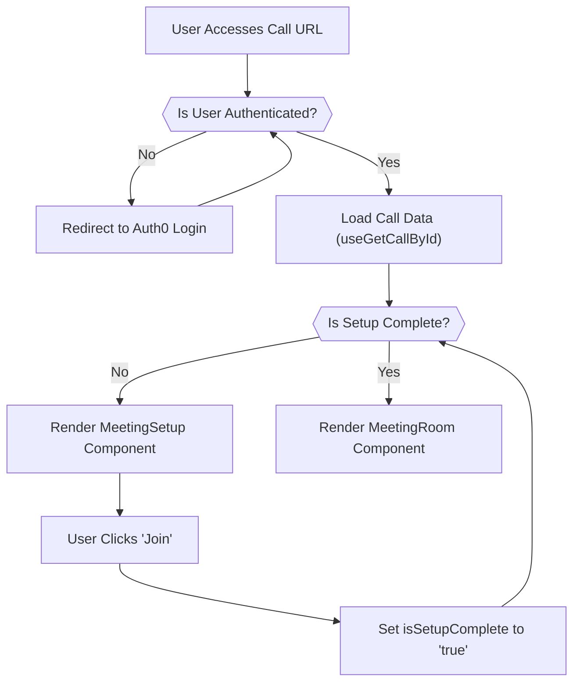

 # Meeting and Call Management

This section outlines the process of creating, joining, and managing meetings and calls within the application. It covers the user's journey from accessing call lists, setting up audio/video, to participating in an active meeting room, including host controls and strict mode enforcement.

## Call Initialization and Authentication

The `Call.jsx` page serves as the entry point for individual calls. It orchestrates the initial authentication, loads call details, and determines whether the user needs to complete a setup phase or can directly enter the meeting room.

Before a user can access a specific call, the system verifies their authentication status using Auth0. If the user is not authenticated, they are redirected to the login page. This ensures that only authorized users can participate in calls.

```jsx
// client/src/pages/call/Call.jsx
import CustomLoader from "@/components/customLoader/CustomLoader";
import MeetingRoom from "@/components/meetingRoom/MeetingRoom";
import MeetingSetup from "@/components/meetingSetup/MeetingSetup";
import { useGetCallById } from "@/hooks/useGetCallByid";
import { useAuth0 } from "@auth0/auth0-react";
import { StreamCall, StreamTheme } from "@stream-io/video-react-sdk";
import { useEffect, useState } from "react";
import { useParams } from "react-router-dom";

const Call = () => {
  const { callId } = useParams();
  const {
    isLoading,
    isAuthenticated,
    loginWithRedirect
  } = useAuth0();
  const [isSetupComplete, setIsSetupComplete] = useState(false);
  const { call, isCallLoading } = useGetCallById(callId);
  useEffect(()=>{
    if(!isAuthenticated){
      loginWithRedirect();

    }
  },[isAuthenticated,loginWithRedirect])
  if (isLoading || isCallLoading) return <CustomLoader />;
  // If not authenticated, return null to prevent rendering

  return (
    <main className="h-screen w-full">
      <StreamCall call={call}>
        <StreamTheme>
          {!isSetupComplete ? (
            <MeetingSetup setIsSetupComplete={setIsSetupComplete} />
          ) : (
            <MeetingRoom />
          )}
        </StreamTheme>
      </StreamCall>
    </main>
  );
};

export default Call;
```
[View on GitHub](https://github.com/realrnvr/web-rtc-app/blob/main/client/src/pages/call/Call.jsx#L1-L40)

### Call Flow Diagram

The following diagram illustrates the high-level flow from call access to entering the meeting room:





## Meeting Setup

The `MeetingSetup` component provides a pre-call screen allowing users to configure their audio and video devices. This crucial step ensures participants can manage their mic and camera settings before joining the main meeting, preventing disruptions. Users can choose to join with their mic and camera off, and utilize the `DeviceSettings` component for more granular control over their input/output devices.

```jsx
// client/src/components/meetingSetup/MeetingSetup.jsx
import "./meeting-setup.css";
import {
  DeviceSettings,
  useCall,
  VideoPreview,
} from "@stream-io/video-react-sdk";
import { useEffect, useState } from "react";
import PropTypes from "prop-types";
import { Button } from "../ui/button";

const MeetingSetup = ({ setIsSetupComplete }) => {
  const [isMicCamToggleOn, setIsMicCamToggleOn] = useState(false);

  const call = useCall();

  if (!call) {
    throw new Error("useCall must be used within StreamCall wrapper");
  }

  useEffect(() => {
    if (isMicCamToggleOn) {
      call?.camera.disable();
      call?.microphone.disable();
    } else {
      call?.camera.enable();
      call?.microphone.enable();
    }
  }, [isMicCamToggleOn, call?.camera, call?.microphone]);

  return (
    <div className="flex h-screen w-full flex-col items-center justify-center gap-3 text-white">
      <h1 className="text-2xl font-bold">Setup</h1>
      <VideoPreview />
      <div className="flex h-16 items-center justify-center gap-3">
        <label className="flex items-center justify-center gap-2 font-medium">
          <input
            type="checkbox"
            checked={isMicCamToggleOn}
            onChange={(e) => setIsMicCamToggleOn(e.target.checked)}
          />
          Join with mic and camera off
        </label>
        <DeviceSettings />
      </div>
      <Button
        className="rounded-md bg-green-500 px-4 py-2.5"
        variant="secondary"
        onClick={() => {
          call.join();
          setIsSetupComplete(true);
        }}
      >
        Join
      </Button>
    </div>
  );
};

MeetingSetup.propTypes = {
  setIsSetupComplete: PropTypes.func,
};

export default MeetingSetup;
```
[View on GitHub](https://github.com/realrnvr/web-rtc-app/blob/main/client/src/components/meetingSetup/MeetingSetup.jsx#L1-L57)

## Meeting Room Functionality

The `MeetingRoom` component is the central hub for active calls, providing a rich set of features for interaction and management. It dynamically adjusts its layout and available tools based on user roles and screen size.

### Dynamic Layouts and Side Panels

The meeting room supports various video layouts (Grid, Speaker-Left, Speaker-Right) and allows participants to toggle side panels for participants list, chat, and a collaborative code editor. These panels are conditionally rendered and optimized for different screen sizes.

```jsx
// client/src/components/meetingRoom/MeetingRoom.jsx (Excerpt for Layout and Panels)
// ...
const [layout, setLayout] = useState("speaker-left");
const [showParticipants, setShowParticipants] = useState(false);
const [showChat, setShowChat] = useState(false);
const [showCodeEditor, setShowCodeEditor] = useState(false);
// ...
const CallLayout = () => {
  switch (layout) {
    case "grid": {
      return <PaginatedGridLayout />;
    }
    case "speaker-right": {
      return <SpeakerLayout participantsBarPosition="left" />;
    }
    default: {
      return <SpeakerLayout participantsBarPosition="right" />;
    }
  }
};
// ...
return (
  <section className="relative h-screen w-full overflow-hidden pt-4 text-white">
    {/* ... other components ... */}
    <div className="relative flex size-full item-center justify-center">
      {showCodeEditor ? (
        // ... Code Editor Layout ...
      ) : (
        <div className={cn(
          "flex size-full max-w-[1000px] items-center",
          showChat ? "max-w-[800px]" : "max-w-[1000px]"
        )}>
          <CallLayout />
        </div>
      )}

      {/* Participants List */}
      <div
        className={cn(
          "h-[calc(100vh-86px)] ml-2 transition-all duration-300 call__participants-list",
          showParticipants ? "block" : "hidden"
        )}
      >
        <CallParticipantsList onClose={() => setShowParticipants(false)} />
      </div>

      {/* Chat Section */}
      <div
        className={cn(
          "h-[calc(100vh-100px)] w-80 ml-10 transition-all duration-300 bg-white rounded-lg overflow-hidden",
          showChat ? "block" : "hidden"
        )}
      >
        <Suspense fallback={<div>Loading...</div>}>
          <ChatMeet meetingId={meetingId} />
        </Suspense>
      </div>
    </div>
    {/* ... call controls ... */}
  </section>
);
```
[View on GitHub](https://github.com/realrnvr/web-rtc-app/blob/main/client/src/components/meetingRoom/MeetingRoom.jsx#L98-L232)

### Host Controls and Strict Mode

For hosts, additional controls are available via a `FloatingDock` component. These include options for `Strict Mode`, `Attendance`, and `Hang Up`. Strict Mode enforces fullscreen and focus, providing a focused environment.

```jsx
// client/src/components/meetingRoom/MeetingRoom.jsx (Excerpt for Host Controls)
// ...
import { useStrictMode } from "../../hooks/useStrictMode";
import { useStrictModeEnforcement } from "../../hooks/useStrictModeEnforcement";
import { isAttendanceActiveAtom ,isHostAtom } from "../../Atoms/Atom";
import { useRecoilValue } from "recoil";
// ...
const MeetingRoom = () => {
  // ...
  const { isStrictMode } = useStrictMode();
  const isHost=useRecoilValue(isHostAtom);
  // ...
  const items = [
    {
      title: "Strict Mode",
      href: "/",
      icon: <FocusIcon/>,
      bgColor: "bg-yellow-600",
      hoverColor: "bg-yellow-600",
      iconColor: "text-red-100",
      onClick: (prev) => setIsStrictPopup(!prev),
    },
    {
      title: "Attendence",
      href: "/",
      icon: <NotebookIcon/>,
      bgColor: "bg-blue-600",
      hoverColor: "bg-blue-600",
      iconColor: "text-blue-100",
      onClick: (prev) => setIsAttendencePopup(!prev),
    },
    {
      title: "Hang up",
      href: "/",
      icon: <PhoneCall/>,
      bgColor: "bg-red-600",
      hoverColor: "bg-red-600",
      iconColor: "text-red-100",
      onClick: (prev) =>setEndCallPopup(!prev),
    }
  ];
  // ...
  useStrictModeEnforcement({
    isStrictMode,
    onShowDialog: handleShowDialog,
  });
  // ...
  return (
    <section className="relative h-screen w-full overflow-hidden pt-4 text-white">
      {/* ... other components ... */}
      {isHost && <div className="dock-div">
          <FloatingDock
  items={items}
  desktopClassName="dock-css"
  mobileClassName="mobile-dock"
  defaultBgColor="bg-neutral-800"
  defaultHoverColor="bg-neutral-700"
/>
HOST CONTROLS
</div>
       }
       <Suspense fallback={<div>Loading</div>}>
    <StrictModePopup isStrictPopop={isStrictPopop} setIsStrictPopup={setIsStrictPopup}/>
       </Suspense>
    <Suspense fallback={<div>Loading</div>}>
    <AttendenceHostPopup isAttendencePopop={isAttendencePopop} setIsAttendencePopup={setIsAttendencePopup}/>
    </Suspense>
    <Suspense fallback={<div>Loading</div>} >
    <EndCallPopup isEndCallPopop={isEndCallPopop} setEndCallPopup={setEndCallPopup}/>
    </Suspense>
    {isStrictMode &&  <div className="warn-strict">Strict Mode is ON </div>}
    {/* {isHost &&  <div className="warn-strict">welcome Host</div>} */}
    <div className="check-temp"><EnableStrictModeButton/></div>
    </section>
  );
};
```
[View on GitHub](https://github.com/realrnvr/web-rtc-app/blob/main/client/src/components/meetingRoom/MeetingRoom.jsx#L42-L281)

## Call Listing and Management

The `CallList` component displays a dynamic list of either upcoming or ended calls, based on the `type` prop. It allows users to view meeting details, copy meeting IDs, and initiate upcoming calls.

```jsx
// client/src/components/callList/CallList.jsx
import "./call-list.css";
import { useGetCalls } from "@/hooks/useGetCalls";
import { useNavigate } from "react-router-dom";
import { Button } from "../ui/button";
import { toast } from "@/hooks/use-toast";
import CustomLoader from "../customLoader/CustomLoader";
import PropTypes from "prop-types";
import { Copy } from "lucide-react";

const CallList = ({ type }) => {
  const { endedCalls, upcomingCalls, isLoading } = useGetCalls();

  const navigate = useNavigate();

  // select data based on 'type'
  const getCalls = (type) => {
    switch (type) {
      case "ended":
        return endedCalls();
      case "upcoming":
        return upcomingCalls();
      default:
        return [];
    }
  };

  // fallback message based on 'type'
  const getNoCallsMessage = (type) => {
    switch (type) {
      case "ended":
        return "No Previous Calls";
      case "upcoming":
        return "No Upcoming Calls";
      default:
        return "";
    }
  };

  const calls = getCalls(type);
  const NoCallsMessage = getNoCallsMessage(type);

  if (isLoading) {
    return <CustomLoader />;
  }

  return (
    <>
      {calls && calls.length > 0 ? (
        calls.map((meeting, idx) => {
          return (
            <div key={idx} className="meeting__card">
              <div>
                <div className="meeting__top-card">
                  <label htmlFor="meeting-title" className="meeting__label">
                    Meet Id:
                  </label>
                  <Copy
                    color="#fff"
                    width={17}
                    style={{ cursor: "pointer" }}
                    onClick={() => {
                      navigator.clipboard.writeText(meeting?.id);
                      toast({ title: "Copied!" });
                    }}
                  />
                </div>
                <div className="meeting__id">
                  <p id="meeting-id" className="meeting__id-para">
                    {meeting?.id}
                  </p>
                </div>
              </div>
              <div>
                <label htmlFor="meeting-title" className="meeting__label">
                  Title:
                </label>
                <p className="meetin__date" id="meeting-title">
                  {meeting?.state?.custom?.description || "----"}
                </p>
              </div>
              <div>
                <label htmlFor="meeting-title" className="meeting__label">
                  Date:
                </label>
                <p className="meetin__date">
                  {new Date(meeting?.state?.startsAt).toLocaleString() ||
                    new Date(meeting?.start_time).toLocaleString()}
                </p>
              </div>
              <div className="meeting__btn-container">
                {type !== "ended" && (
                  <Button
                    variant="secondary"
                    onClick={() => {
                      navigator.clipboard.writeText(
                        `http://localhost:5173/meeting/${meeting?.id}`
                      );
                      toast({ title: "copied!" });
                    }}
                  >
                    Copy link
                  </Button>
                )}
                {type === "ended" ? null : (
                  <Button
                    variant="secondary"
                    onClick={() => navigate(`/meeting/${meeting?.id}`)}
                  >
                    Start
                  </Button>
                )}
              </div>
            </div>
          );
        })
      ) : (
        <h2>{NoCallsMessage}</h2>
      )}
    </>
  );
};

CallList.propTypes = {
  type: PropTypes.string,
};

export default CallList;
```
[View on GitHub](https://github.com/realrnvr/web-rtc-app/blob/main/client/src/components/callList/CallList.jsx#L1-L121)

### Retrieving Call Data

The `useGetCalls` custom hook is responsible for fetching and categorizing calls into `endedCalls` and `upcomingCalls`. This abstraction simplifies data management within the `CallList` component.

```jsx
// client/src/components/callList/CallList.jsx (Excerpt for Data Retrieval)
import { useGetCalls } from "@/hooks/useGetCalls";
// ...
const CallList = ({ type }) => {
  const { endedCalls, upcomingCalls, isLoading } = useGetCalls();
  // ...
  const getCalls = (type) => {
    switch (type) {
      case "ended":
        return endedCalls();
      case "upcoming":
        return upcomingCalls();
      default:
        return [];
    }
  };
  const calls = getCalls(type);
  // ...
};
```
[View on GitHub](https://github.com/realrnvr/web-rtc-app/blob/main/client/src/components/callList/CallList.jsx#L5-L29)

## Key Integration Points

The meeting and call management system is tightly integrated across several components to provide a seamless user experience.

1.  **Authentication & Call Loading**: The `Call` page uses `useAuth0` for user authentication and `useGetCallById` to fetch specific call details, ensuring authorized and data-rich entry into a meeting.
2.  **Pre-Meeting Setup**: `MeetingSetup` acts as a crucial pre-flight check, allowing users to configure their devices. It utilizes `useCall` from `@stream-io/video-react-sdk` to interact with the current call's audio/video streams, enabling or disabling them based on user preference. The `setIsSetupComplete` prop is then used to transition to the `MeetingRoom`.
3.  **Dynamic Meeting Environment**: `MeetingRoom` is highly interactive, relying on `@stream-io/video-react-sdk` components like `CallControls`, `CallParticipantsList`, `PaginatedGridLayout`, and `SpeakerLayout` for core video conferencing functionalities.
4.  **Responsive UI**: The `MeetingRoom` dynamically adjusts the visibility of features like the code editor and chat based on `window.innerWidth`, ensuring optimal usability across various devices. This is managed using `useEffect` for resize events.
5.  **Host-Specific Features**: The `isHostAtom` (Recoil) determines the visibility of `FloatingDock` host controls, enabling privileged actions like strict mode enforcement and attendance tracking. Strict mode leverages custom hooks (`useStrictMode`, `useStrictModeEnforcement`) and a dedicated `EventListener` for browser behavior monitoring.
6.  **Call Listing**: `CallList` uses the `useGetCalls` custom hook to efficiently retrieve and categorize calls, presenting them with actions to join or copy links, providing a centralized place for managing current and past interactions.

This modular architecture ensures that each aspect of meeting management, from authentication to in-call features and host controls, is handled efficiently and integrated to deliver a robust communication platform.