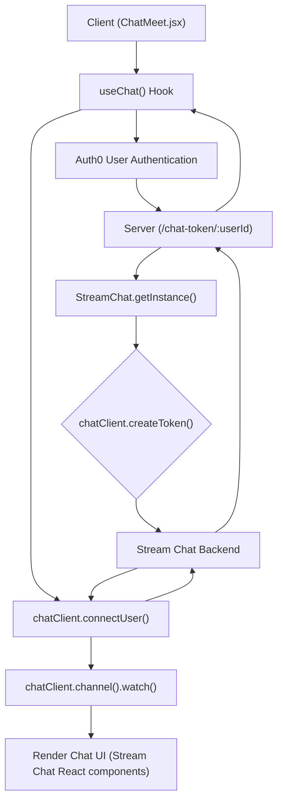
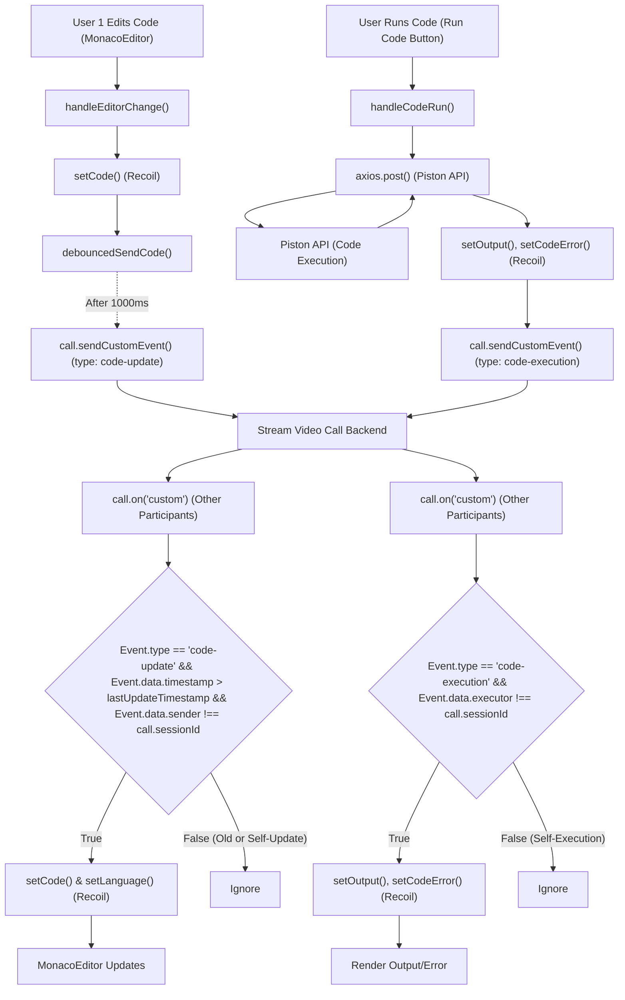

 # Chat and Code Editor

This document provides technical details and architecture for the real-time chat functionality and the integrated code editor within the application. These features are crucial for collaborative environments, enabling users to communicate seamlessly and work together on code in real-time during meetings.

The chat system leverages [Stream Chat](https://getstream.io/) for robust, scalable messaging, while the code editor integrates [Monaco Editor](https://microsoft.github.io/monaco-editor/) with real-time synchronization capabilities built using Stream's custom event system.

## Chat Functionality

The chat feature allows participants in a meeting to communicate instantly. It is powered by the Stream Chat SDK on the frontend and includes a backend service to generate secure authentication tokens.

### Client-Side Implementation (`ChatMeet.jsx`)

The `ChatMeet.jsx` component is responsible for initializing and rendering the chat interface. It connects the user to the Stream Chat service, creates or joins a meeting-specific channel, and displays messages.

**Key Features:**

*   **Stream Chat Integration**: Utilizes `stream-chat-react` components for a pre-built UI.
*   **User Authentication**: Connects users to Stream Chat using a unique `userId` and a server-generated `chatToken`.
*   **Dynamic Channel Management**: Creates a dedicated messaging channel for each meeting, identified by `meetingId`.
*   **Real-time Updates**: Automatically watches the channel for new messages and participant updates.
*   **Error Handling and Loading States**: Provides visual feedback during initialization and in case of errors.

**Code Snippets:**

1.  **Stream Chat Initialization & User Connection**:
    The `useEffect` hook handles the connection to Stream Chat and channel setup. It fetches a token from the `ChatProvider` and uses `chatClient.connectUser` to authenticate the user.

    ```jsx
    // client/src/components/chat/ChatMeet.jsx
    useEffect(() => {
      const initializeChat = async () => {
        if (!userId || !chatToken) {
          setError("Unable to initialize chat: missing credentials");
          return;
        }

        setLoading(true);
        try {
          await chatClient.connectUser(
            {
              id: userId,
              name: user?.name || userId,
              image: user?.picture,
            },
            chatToken
          );

          const channelId = `${meetingId.toLowerCase().replace(/\s/g, "-")}`;
          const channel = chatClient.channel("messaging", channelId, {
            name: `Meeting: ${meetingId}`,
            members: [userId],
          });

          await channel.watch();
          setChannel(channel);
          setError(null);
        } catch (error) {
          setError("Failed to initialize chat. Please try again.");
          // ... toast notification ...
        } finally {
          setLoading(false);
        }
      };

      if (chatToken && userId && !isClientReady) {
        initializeChat();
      }

      return () => {
        if (isClientReady) {
          chatClient.disconnectUser();
          setIsClientReady(false);
        }
      };
    }, [chatToken, userId, meetingId, user?.name, user?.picture, isClientReady]);
    ```
    [View on GitHub](https://github.com/realrnvr/axios/blob/main/client/src/components/chat/ChatMeet.jsx#L29-L78)

2.  **Chat UI Rendering**:
    Once connected and the channel is set, the `Chat`, `Channel`, `Window`, `MessageList`, and `MessageInput` components from `stream-chat-react` are used to render the chat interface.

    ```jsx
    // client/src/components/chat/ChatMeet.jsx
    return (
      <div className="h-full flex flex-col bg-neutral-800">
        {channel ? (
          <Chat client={chatClient} theme="str-chat__theme-dark">
            <Channel channel={channel}>
              <Window>
                <div className="p-4 border-b border-neutral-800 flex items-center justify-between bg-neutral-900">
                  <div className="flex items-center gap-2">
                    <MessageCircle className="h-5 w-5 text-blue-500" />
                    <span className="font-medium text-white">Meeting Chat</span>
                  </div>
                  <div className="flex items-center gap-2 text-sm text-neutral-400">
                    <Users className="h-4 w-4" />
                  </div>
                </div>
                <MessageList
                  className="bg-neutral-950"
                  highlightUnreadMessages
                  messageActions={["edit", "delete", "react", "reply"]}
                />
                <MessageInput
                  focus
                  className="border-t border-neutral-800 bg-neutral-900"
                  attachButton={false}
                />
              </Window>
              <Thread fullWidth />
            </Channel>
          </Chat>
        ) : (
          // ... error state rendering ...
        )}
      </div>
    );
    ```
    [View on GitHub](https://github.com/realrnvr/axios/blob/main/client/src/components/chat/ChatMeet.jsx#L97-L135)

### Server-Side Chat Token Generation (`chat.js`, `router.js`)

The backend is responsible for generating authentication tokens for Stream Chat. This ensures that users are securely authenticated before connecting to the chat service.

**Endpoint:** `/chat-token/:userId` (GET)

**Code Snippets:**

1.  **Chat Token Generator Controller**:
    The `chatTokenGenerator` function uses the Stream Chat server-side SDK to create a token for a given `userId`. It also upserts the user into Stream Chat, ensuring their profile exists or is updated.

    ```javascript
    // server/controller/chat.js
    import {StreamChat} from "stream-chat"
    const apiChat="az7swwjyh7mr";
    const secretChat="62j53umaeay6tr433g3h9m889z7xz8xswvawcxr633fphtcevxtabc9jxewp6keq";
    const chatClient= StreamChat.getInstance(apiChat,secretChat);

    export const chatTokenGenerator=async (req,res)=>{
        const {userId}=req.params;
        if (!userId) {
            return res.status(400).json({ error: "user_id is required" });
          }
          try {
            const token=chatClient.createToken(userId);
            await chatClient.upsertUser({
              id: userId,
              role: 'admin',
          });
            res.status(200).json({token});
          } catch (error) {
            res.status(500).json({error:"error in generating token"});
          }
    };
    ```
    [View on GitHub](https://github.com/realrnvr/axios/blob/main/server/controller/chat.js#L1-L22)

2.  **Chat Router Definition**:
    The `chatRouter` defines the API route for requesting chat tokens.

    ```javascript
    // server/router/chat.js
    import { Router } from "express";
    import {chatTokenGenerator} from "../controller/chat.js"

    const chatRouter=Router();
    chatRouter.route("/chat-token/:userId").get(chatTokenGenerator);

    export default chatRouter;
    ```
    [View on GitHub](https://github.com/realrnvr/axios/blob/main/server/router/chat.js#L1-L7)

### Chat System Flow





## Code Editor Functionality

The integrated code editor facilitates real-time collaborative coding during meetings. It uses Monaco Editor for the UI and Stream's custom event system for synchronization. Code execution is handled by an external API.

### Client-Side Implementation (`CodeEditor.jsx`)

The `CodeEditor.jsx` component manages the Monaco Editor instance, handles code and language changes, synchronizes code with other participants, and executes code via an external API.

**Key Features:**

*   **Monaco Editor Integration**: Provides a rich, in-browser code editing experience.
*   **Recoil State Management**: Utilizes Recoil atoms (`languageAtom`, `codeAtom`, `inputAtom`, `outputAtom`, `codeErrorAtom`) for managing editor state across components.
*   **Real-time Code Synchronization**: Uses Stream's `call.sendCustomEvent` to broadcast code changes to all participants and `call.on('custom')` to receive and apply remote changes.
*   **Debouncing**: Implements debouncing for code updates to prevent excessive event traffic.
*   **Code Execution**: Sends code to the [Piston API](https://emkc.org/api/v1/piston) for execution and displays the output.
*   **Error Handling**: Catches and displays errors during code execution and synchronization.
*   **Language Support**: Supports JavaScript, Python, C++, and Java with default code templates.

**Code Snippets:**

1.  **Debounced Code Synchronization**:
    The `debouncedSendCode` function ensures that code changes are not sent immediately but after a short delay, reducing network load. The `timestamp` is crucial for resolving conflicts in concurrent edits.

    ```jsx
    // client/src/components/codeEditor/CodeEditor.jsx
    const debouncedSendCode = useCallback(
        debounce(async (newCode, newLanguage) => {
          try {
            const timestamp = Date.now();
            setLastUpdateTimestamp(timestamp);
            await call.sendCustomEvent({
              type: "code-update",
              data: {
                code: newCode,
                language: newLanguage,
                timestamp,
                sender: call.sessionId
              }
            });
            setSyncError(null);
          } catch (error) {
            setSyncError('Failed to sync code: ' + error.message);
            console.error('Error sending code:', error);
          }
        }, 1000),
        [call,language]
      );

    const handleEditorChange = (value) => {
        setCode(value);
        debouncedSendCode(value, language);
    };
    ```
    [View on GitHub](https://github.com/realrnvr/axios/blob/main/client/src/components/codeEditor/CodeEditor.jsx#L42-L65)

2.  **Receiving Remote Code Updates**:
    This `useEffect` hook listens for `code-update` custom events from other participants. It only applies updates if the remote event is newer than the last local update and is not from the current session.

    ```jsx
    // client/src/components/codeEditor/CodeEditor.jsx
    useEffect(() => {
        const handleRemoteUpdate = (event) => {
          if (event.type === "code-update" &&
              event.data.timestamp > lastUpdateTimestamp &&
              event.data.sender !== call.sessionId) {
            setCode(event.data.code);
            setLanguage(event.data.language);
          }
        };

        const unsubscribe = call.on('custom', handleRemoteUpdate);

        return () => {
          debouncedSendCode.cancel();
          unsubscribe();
        };
      }, [call, lastUpdateTimestamp,debouncedSendCode,setCode,setLanguage]);
    ```
    [View on GitHub](https://github.com/realrnvr/axios/blob/main/client/src/components/codeEditor/CodeEditor.jsx#L71-L88)

3.  **Code Execution Handler**:
    The `handleCodeRun` function sends the current code and language to the Piston API for execution. It then updates the output and error states and broadcasts the execution result to other participants.

    ```jsx
    // client/src/components/codeEditor/CodeEditor.jsx
    const handleCodeRun = async () => {
        setIsLoading(true);
        try {
          setOutput("");
          const response = await API.post("/execute", {
            language: language,
            source: code,
            stdin: input,
            args: [],
          });

          const { output, error } = response.data;
          setOutput(output || "No output");
          setCodeError(error || "");

          await call.sendCustomEvent({
            type: "code-execution",
            data: {
              output: output || "No output",
              error: error || "",
              executor: call.sessionId
            }
          });
        } catch (err) {
          setCodeError("Error occurred while running code, sorry for the inconvenience.");
          setOutput("");
        } finally {
          setIsLoading(false);
        }
      };
    ```
    [View on GitHub](https://github.com/realrnvr/axios/blob/main/client/src/components/codeEditor/CodeEditor.jsx#L96-L124)

### Code Editor Synchronization Flow





## Key Integration Points

*   **Auth0 and Stream Chat**: User authentication for the main application (via Auth0) is leveraged to create unique user IDs for Stream Chat, ensuring a consistent user identity across the platform.
*   **Stream SDK for Chat and Editor Sync**: Both chat and code editor synchronization rely heavily on the Stream SDK. The chat uses `StreamChat` for messaging, while the code editor utilizes `StreamVideoClient`'s custom event system for real-time collaboration. This design centralizes real-time communication within a single SDK.
*   **Recoil for State Management**: Recoil provides a robust and scalable way to manage the complex state of the code editor, including language, code content, input, output, and errors. This allows for easy sharing and updates of state across the component hierarchy.
*   **Debouncing for Performance**: The use of `lodash/debounce` is critical for the code editor's performance. It prevents every keystroke from triggering a network request, reducing server load and improving the perceived responsiveness of the application.
*   **External Code Execution API**: Outsourcing code execution to the Piston API simplifies the application's backend by offloading resource-intensive compilation and execution tasks. This allows the primary server to focus on real-time event handling and core business logic.
*   **Meeting ID as a Unifier**: The `meetingId` parameter is central to both features, ensuring that chat messages and code edits are confined and synchronized within the context of a specific meeting.