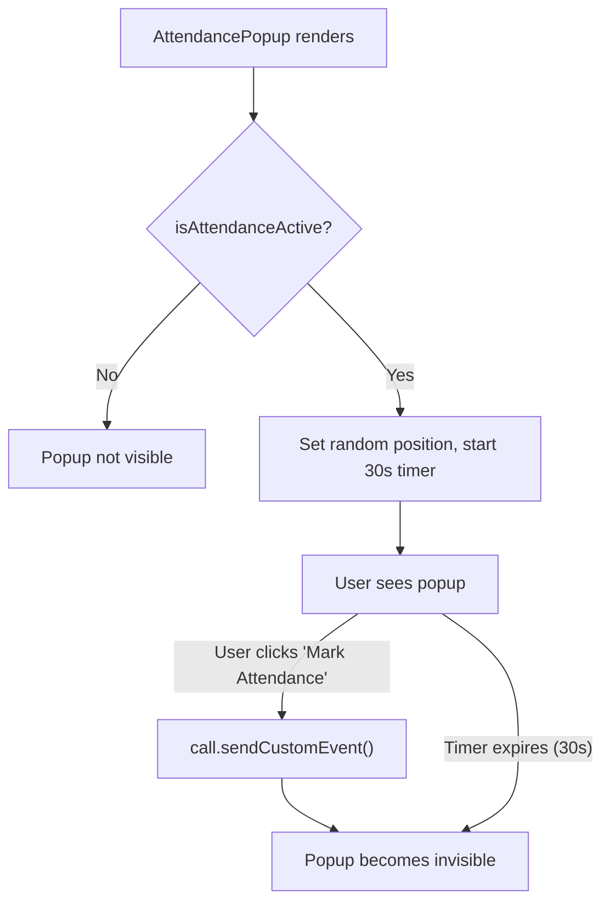
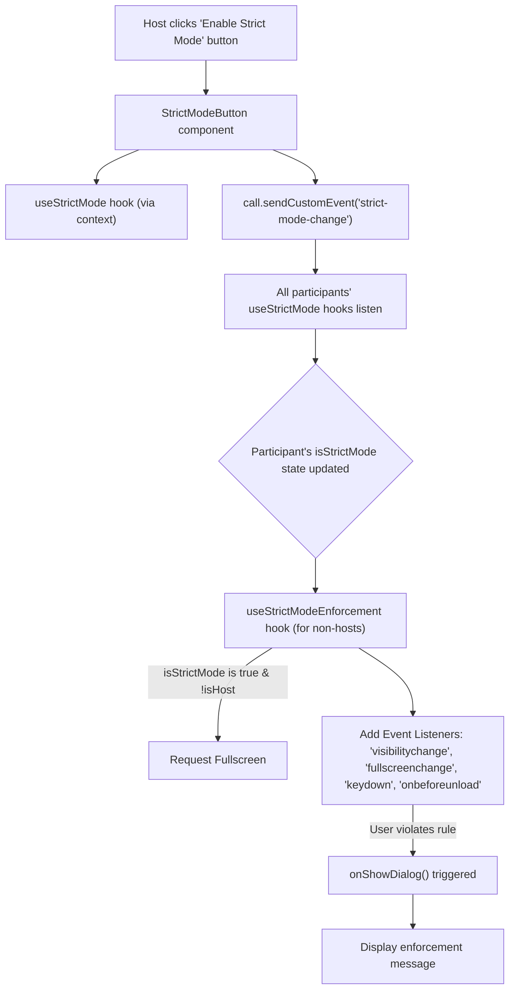

 # Attendance and Strict Mode

This document details the implementation of the attendance tracking system and the strict mode enforcement feature within the application. These features are designed to enhance participant engagement and ensure a focused environment, particularly in educational or professional contexts.

## Attendance Tracking

The attendance system provides a mechanism for participants to mark their presence during a call. A unique aspect of this system is the dynamically positioned attendance popup, which aims to ensure active engagement by requiring users to locate and click the button.

### Core Components

The attendance functionality primarily revolves around the `AttendancePopup` component, which manages the display and interaction for marking attendance.

#### `AttendancePopup.jsx`

This component is responsible for rendering a timed, randomly positioned popup that prompts users to mark their attendance. It utilizes Recoil for state management (`isAttendanceActiveAtom`, `isHostAtom`) and the Stream Video SDK's `useCall` hook to send attendance events.

**Random Positioning and Timer:**
When attendance is active, the popup's position is randomized within the viewport, and a 30-second countdown begins. If the user doesn't mark attendance within this time, the popup disappears.

```jsx
import { useState, useEffect } from 'react';
import { useRecoilValue } from 'recoil';
import { useCall } from "@stream-io/video-react-sdk";
import { isAttendanceActiveAtom, isHostAtom } from "../../Atoms/Atom";

const AttendancePopup = () => {
  const [position, setPosition] = useState({ x: 0, y: 0 });
  const [timeLeft, setTimeLeft] = useState(30);
  const [isVisible, setIsVisible] = useState(false);
  const isActive = useRecoilValue(isAttendanceActiveAtom);
  // ... other hooks and state

  useEffect(() => {
    if (isActive) {
      const maxWidth = window.innerWidth - 300;
      const maxHeight = window.innerHeight - 200;
      
      const randomX = Math.floor(Math.random() * maxWidth);
      const randomY = Math.floor(Math.random() * maxHeight);
      
      setPosition({ x: randomX, y: randomY });
      setTimeLeft(30);
      setIsVisible(true);
    }
  }, [isActive]);

  useEffect(() => {
    let timer;
    if (isVisible && timeLeft > 0) {
      timer = setInterval(() => {
        setTimeLeft(prev => prev - 1);
      }, 1000);
    } else if (timeLeft === 0) {
      setIsVisible(false);
    }
    return () => clearInterval(timer);
  }, [isVisible, timeLeft]);
  // ... rest of component
};
```
[View on GitHub](https://github.com/realrnvr/StreamApp/blob/main/client/src/components/attendance/AttendancePopup.jsx#L1-L38)

**Marking Attendance:**
When the user clicks the "Mark Attendance" button, a custom event is sent via the Stream Video SDK's `sendCustomEvent` method, containing the user's ID, name, and timestamp.

```jsx
  const markAttendance = async () => {
    try {
      await call.sendCustomEvent({
        type: "mark-attendance",
        data: {
          userId: user.email,
          name: user.name,
          time: Date.now(),
          attendanceStatus: "present"
        }
      });
      console.log("Attendance marked successfully");
      setIsVisible(false);
    } catch (error) {
      console.error("Error marking attendance:", error);
    }
  };
```
[View on GitHub](https://github.com/realrnvr/StreamApp/blob/main/client/src/components/attendance/AttendancePopup.jsx#L61-L73)

### Attendance Flow

This diagram illustrates the process of attendance marking.





## Strict Mode Enforcement

Strict mode is a feature designed to create a highly focused environment during a call by enforcing certain user behaviors and preventing common distractions. This mode is toggleable by the host of the call.

### Enabling/Disabling Strict Mode

The `EnableStrictModeButton` component allows the host to activate or deactivate strict mode. The state of strict mode is synchronized across all participants using Stream's custom events.

#### `StrictModeButton.jsx`

This component renders a button that toggles strict mode. It determines if the current user is the host and, if so, enables the button. Toggling strict mode sends a custom event to all participants.

**Host Detection:**
The `useEffect` hook determines if the local participant is the host by comparing their `userId` with the `createdBy.id` of the call.

```jsx
import { useCall, useCallStateHooks } from "@stream-io/video-react-sdk";
import { isHostAtom } from "../../Atoms/Atom";
import { useRecoilState } from "recoil";
import { useEffect } from "react";

const EnableStrictModeButton = () => {
  // ... other hooks and state
  const { useLocalParticipant } = useCallStateHooks();
  const localParticipant = useLocalParticipant();
  const [isHost, setIsHost] = useRecoilState(isHostAtom);

  useEffect(() => {
    if (
      localParticipant &&
      call?.state.createdBy &&
      localParticipant.userId === call?.state.createdBy.id
    ) {
      setIsHost(true);
    } else {
      setIsHost(false);
    }
  }, [localParticipant, call, setIsHost]);
  // ... rest of component
};
```
[View on GitHub](https://github.com/realrnvr/StreamApp/blob/main/client/src/components/strictModeButton/StrictModeButton.jsx#L7-L23)

**Toggling Strict Mode:**
When the button is clicked, `toggleStrictMode` is called, which updates the local `isStrictMode` state and sends a `strict-mode-change` custom event.

```jsx
  const toggleStrictMode = async () => {
    const newStrictMode = !isStrictMode;
    setStrictMode(newStrictMode);

    console.log("Sending custom event");
    await call.sendCustomEvent({
      type: "strict-mode-change",
      data: {
        isStrictMode: newStrictMode,
      },
    });
    console.log("Custom event sent");
  };
```
[View on GitHub](https://github.com/realrnvr/StreamApp/blob/main/client/src/components/strictModeButton/StrictModeButton.jsx#L34-L45)

### Strict Mode State Management

The global state of strict mode is managed through a React context and synchronized using Stream custom events.

#### `useStrictMode.jsx`

This custom hook and its associated `StrictModeProvider` handle the `isStrictMode` state. It listens for `custom` events from the Stream `call` object to update its state based on messages from the host.

```jsx
import { createContext, useContext, useEffect, useState } from 'react';
import { useCall } from "@stream-io/video-react-sdk";

const StrictModeContext = createContext();

export const StrictModeProvider = ({ children }) => {
  const [isStrictMode, setStrictMode] = useState(false);
  const call = useCall();

  useEffect(() => {
    const handleCustomEvent = (event) => {
      if (event.customData?.isStrictMode !== undefined) {
        setStrictMode(event.customData.isStrictMode);
      }
    };

    call?.on('custom', handleCustomEvent);
    return () => call?.off('custom', handleCustomEvent);
  }, [call]);

  return (
    <StrictModeContext.Provider value={{ isStrictMode, setStrictMode }}>
      {children}
    </StrictModeContext.Provider>
  );
};

export const useStrictMode = () => useContext(StrictModeContext);
```
[View on GitHub](https://github.com/realrnvr/StreamApp/blob/main/client/src/hooks/useStrictMode.jsx#L1-L26)

### Strict Mode Enforcement Logic

The `useStrictModeEnforcement` hook applies various restrictions to non-host participants when strict mode is active.

#### `useStrictModeEnforcement.js`

This hook contains the logic for enforcing strict mode behaviors. It uses browser APIs to detect changes in tab visibility, fullscreen status, and specific keyboard actions, triggering a dialog when a rule is violated.

**Enforced Behaviors:**
*   **Fullscreen Mandatory:** Users are prompted to enter fullscreen and prevented from exiting it.
*   **Tab Visibility:** Users are prevented from switching tabs.
*   **Keyboard Shortcuts:** Specific shortcuts (like `Escape` or `Ctrl+Tab`) are blocked.
*   **Page Exit:** Users are warned if they try to close or navigate away from the page.

```jsx
import { useEffect, useCallback } from "react";
import {isHostAtom} from "../Atoms/Atom"
import { useRecoilValue } from "recoil";

export const useStrictModeEnforcement = ({ isStrictMode, onShowDialog }) => {
  const isHost = useRecoilValue(isHostAtom);

  const handleVisibilityChange = useCallback(() => {
    if (document.hidden && isStrictMode) {
      onShowDialog("Please stay on this tab. Strict mode is enabled.");
    }
  }, [isStrictMode, onShowDialog]);

  const handleKeydown = useCallback(
    (e) => {
      if (isStrictMode && (e.key === "Escape" || (e.ctrlKey && e.key === "Tab"))) {
        e.preventDefault();
        onShowDialog("This action is blocked in strict mode.");
      }
    },
    [isStrictMode, onShowDialog]
  );

  useEffect(() => {
    if (!isStrictMode || isHost) return;
    document.documentElement.requestFullscreen(); // Request fullscreen on activation

    document.addEventListener("visibilitychange", handleVisibilityChange);
    document.addEventListener("keydown", handleKeydown);
    // ... other event listeners and cleanup
    return () => {
      document.removeEventListener("visibilitychange", handleVisibilityChange);
      document.removeEventListener("keydown", handleKeydown);
      // ... cleanup other listeners
    };
  }, [isStrictMode, handleVisibilityChange, handleKeydown, isHost]);

  // ... rest of hook
};
```
[View on GitHub](https://github.com/realrnvr/StreamApp/blob/main/client/src/hooks/useStrictModeEnforcement.js#L1-L58)

### Strict Mode Workflow

This diagram illustrates the activation and enforcement process of Strict Mode.





## Key Integration Points

*   **Stream Video SDK Custom Events:** Both attendance marking and strict mode toggling leverage `call.sendCustomEvent()` and `call.on('custom', ...)` for real-time synchronization across all call participants. This is crucial for keeping the state consistent without relying on a separate backend.
*   **Recoil State Management:** `isAttendanceActiveAtom` and `isHostAtom` provide global state for the active status of attendance and host identification, ensuring components react appropriately to these critical flags. `isHostAtom` is particularly important for conditionally rendering host-only features like the strict mode button.
*   **React Context for `StrictMode`:** The `StrictModeContext` offers a clean way to manage and access the `isStrictMode` state throughout the application, decoupling its management from direct Recoil usage for this specific feature.
*   **Browser APIs for Enforcement:** `useStrictModeEnforcement` directly interacts with browser APIs (`document.hidden`, `document.fullscreenElement`, `addEventListener`, `onbeforeunload`) to implement strict behavioral controls. This direct interaction is necessary for low-level enforcement.
*   **Modular Hooks:** The use of custom hooks (`useStrictMode`, `useStrictModeEnforcement`) encapsulates complex logic, making components cleaner and promoting reusability.