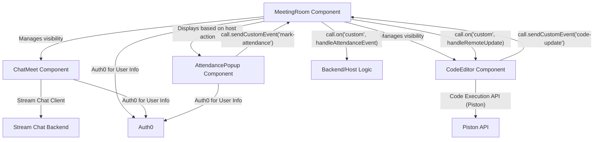
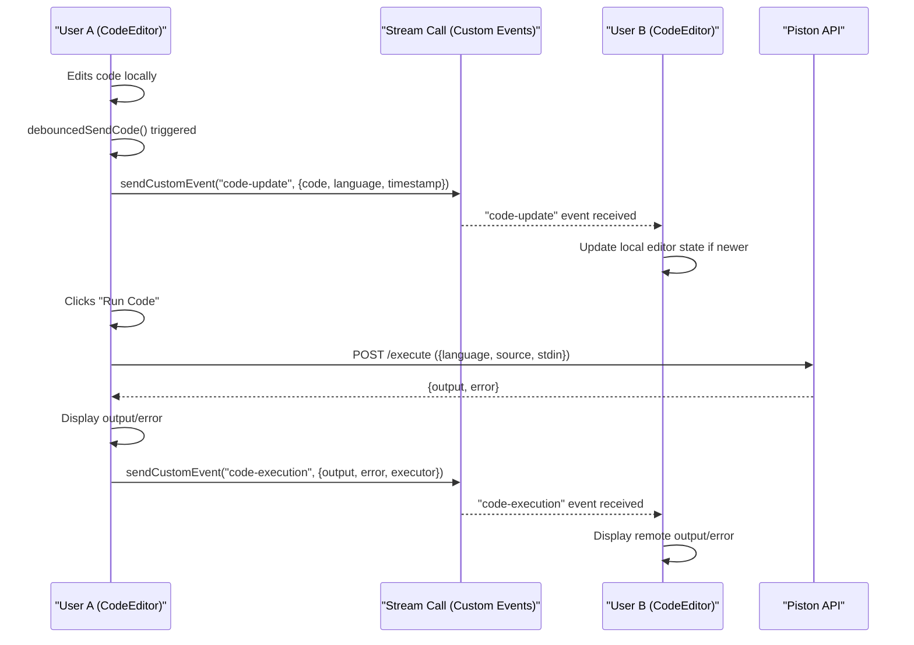

 # Key Features Implementation

This document provides a detailed overview of the implementation for core features within the application, focusing on the `MeetingRoom`, `ChatMeet`, `CodeEditor`, and `AttendancePopup` components. These components collectively deliver a rich, interactive, and collaborative meeting experience.

## Meeting Room Orchestration (`MeetingRoom.jsx`)

The `MeetingRoom` component is the central hub for user interaction during a meeting. It orchestrates the display of video feeds, manages various interactive panels (participants, chat, code editor), and integrates host-specific controls. It dynamically adjusts its layout based on user preferences and screen real estate, ensuring a responsive user experience.

### Dynamic Layout Management

The meeting room supports various video layouts, including `grid`, `speaker-left`, and `speaker-right`, which can be toggled via a dropdown menu. It also manages the visibility of side panels for participants, chat, and the code editor.

```jsx
// client/src/components/meetingRoom/MeetingRoom.jsx
// Line 122
const CallLayout = () => {
  switch (layout) {
    case "grid": {
      return <PaginatedGridLayout />;
    }
    case "speaker-right": {
      return <SpeakerLayout participantsBarPosition="left" />;
    }
    default: {
      return <SpeakerLayout participantsBarPosition="right" />;
    }
  }
};
```
[View on GitHub](https://github.com/realrnvr/axios/blob/main/client/src/components/meetingRoom/MeetingRoom.jsx#L122-L133)

This snippet demonstrates how `PaginatedGridLayout` and `SpeakerLayout` from `@stream-io/video-react-sdk` are used to render different video arrangements based on the `layout` state.

### Panel Toggle Logic

The visibility of the Participants List, Chat, and Code Editor panels is controlled by state variables (`showParticipants`, `showChat`, `showCodeEditor`) and is toggled by dedicated buttons in the call controls. This ensures that only one supplementary panel is visible at a time to optimize screen space.

```jsx
// client/src/components/meetingRoom/MeetingRoom.jsx
// Line 256
<button
  onClick={() => {
    setShowParticipants((prevShowParticipants) => !prevShowParticipants);
    setShowChat(false);
    setShowCodeEditor(false);
  }}
>
  {/* ... */}
</button>
```
[View on GitHub](https://github.com/realrnvr/axios/blob/main/client/src/components/meetingRoom/MeetingRoom.jsx#L256-L264)

The example above illustrates the click handler for the "Participants" button, which toggles `showParticipants` and ensures `showChat` and `showCodeEditor` are false. Similar logic applies to the chat and code editor buttons.

### Host Controls Integration

For hosts, a `FloatingDock` component is rendered, providing quick access to administrative functions like "Strict Mode", "Attendance", and "Hang up". These actions trigger respective popups or functionalities.

```jsx
// client/src/components/meetingRoom/MeetingRoom.jsx
// Line 293
{isHost && <div className="dock-div"> 
  <FloatingDock 
    items={items}
    desktopClassName="dock-css"
    mobileClassName="mobile-dock"
    defaultBgColor="bg-neutral-800"
    defaultHoverColor="bg-neutral-700"
  />
  HOST CONTROLS
</div>}
```
[View on GitHub](https://github.com/realrnvr/axios/blob/main/client/src/components/meetingRoom/MeetingRoom.jsx#L293-L302)

This conditional rendering ensures the host-specific controls are only visible to the meeting host, identified by the `isHost` Recoil atom.

## Real-time Chat Functionality (`ChatMeet.jsx`)

The `ChatMeet` component provides real-time messaging capabilities within the meeting, powered by Stream Chat. It handles user authentication with Stream Chat, channel management, and message display.

### Stream Chat Initialization

The component connects the user to Stream Chat upon mounting, using the user's `Auth0` credentials and a `chatToken` obtained from a custom `ChatProvider`. It creates or watches a `messaging` channel specific to the `meetingId`.

```jsx
// client/src/components/chat/ChatMeet.jsx
// Line 30
useEffect(() => {
  const initializeChat = async () => {
    if (!userId || !chatToken) {
      setError("Unable to initialize chat: missing credentials");
      return;
    }

    setLoading(true);
    try {
      await chatClient.connectUser(
        {
          id: userId,
          name: user?.name || userId,
          image: user?.picture,
        },
        chatToken
      );

      const channelId = `${meetingId.toLowerCase().replace(/\s/g, "-")}`;
      const channel = chatClient.channel("messaging", channelId, {
        name: `Meeting: ${meetingId}`,
        members: [userId],
      });

      await channel.watch();
      setChannel(channel);
      setError(null);
    } catch (error) {
      setError("Failed to initialize chat. Please try again.");
      toast({
        title: "Chat Error",
        description: "Failed to initialize chat. Please try again.",
        variant: "destructive",
      });
    } finally {
      setLoading(false);
    }
  };

  if (chatToken && userId && !isClientReady) {
    initializeChat();
  }

  return () => {
    if (isClientReady) {
      chatClient.disconnectUser();
      setIsClientReady(false);
    }
  };
}, [chatToken, userId, meetingId, user?.name, user?.picture, isClientReady]);
```
[View on GitHub](https://github.com/realrnvr/axios/blob/main/client/src/components/chat/ChatMeet.jsx#L30-L77)

This `useEffect` hook ensures that the Stream Chat client is properly initialized and connected. It also handles cleanup by disconnecting the user when the component unmounts.

### Chat UI Rendering

Once connected, the component renders the `Chat` and `Channel` components from `stream-chat-react`, providing a `MessageList` and `MessageInput` for users to interact.

```jsx
// client/src/components/chat/ChatMeet.jsx
// Line 102
<Chat client={chatClient} theme="str-chat__theme-dark">
  <Channel channel={channel}>
    <Window>
      <div className="p-4 border-b border-neutral-800 flex items-center justify-between bg-neutral-900">
        <div className="flex items-center gap-2">
          <MessageCircle className="h-5 w-5 text-blue-500" />
          <span className="font-medium text-white">Meeting Chat</span>
        </div>
        <div className="flex items-center gap-2 text-sm text-neutral-400">
          <Users className="h-4 w-4" />
        </div>
      </div>
      <MessageList
        className="bg-neutral-950"
        highlightUnreadMessages
        messageActions={["edit", "delete", "react", "reply"]}
      />
      <MessageInput 
        focus 
        className="border-t border-neutral-800 bg-neutral-900"
        attachButton={false}
      />
    </Window>
    <Thread fullWidth />
  </Channel>
</Chat>
```
[View on GitHub](https://github.com/realrnvr/axios/blob/main/client/src/components/chat/ChatMeet.jsx#L102-L127)

This code provides the basic structure for the chat interface, including a header, message display, and input field.

## Collaborative Code Editor (`CodeEditor.jsx`)

The `CodeEditor` component offers a real-time collaborative code editing environment within the meeting, utilizing Monaco Editor and `@stream-io/video-react-sdk` for synchronization.

### Real-time Code Synchronization

Code changes made by any participant are synchronized across all connected users using Stream's `call.sendCustomEvent` API. A `debounce` function is employed to prevent excessive event transmission.

```jsx
// client/src/components/codeEditor/CodeEditor.jsx
// Line 40
const debouncedSendCode = useCallback(
  debounce(async (newCode, newLanguage) => {
    try {
      const timestamp = Date.now();
      setLastUpdateTimestamp(timestamp);
      await call.sendCustomEvent({
        type: "code-update",
        data: {
          code: newCode,
          language: newLanguage,
          timestamp,
          sender: call.sessionId
        }
      });
      setSyncError(null);
    } catch (error) {
      setSyncError('Failed to sync code: ' + error.message);
      console.error('Error sending code:', error);
    }
  }, 1000),
  [call,language]
);

// Line 62
useEffect(() => {
  const handleRemoteUpdate = (event) => {
    if (event.type === "code-update" && 
        event.data.timestamp > lastUpdateTimestamp && 
        event.data.sender !== call.sessionId) {
      setCode(event.data.code);
      setLanguage(event.data.language);
    }
  };

  // Subscribe to custom events
  const unsubscribe = call.on('custom', handleRemoteUpdate);

  return () => {
    debouncedSendCode.cancel();
    unsubscribe();
  };
}, [call, lastUpdateTimestamp,debouncedSendCode,setCode,setLanguage]);
```
[View on GitHub](https://github.com/realrnvr/axios/blob/main/client/src/components/codeEditor/CodeEditor.jsx#L40-L60)
[View on GitHub](https://github.com/realrnvr/axios/blob/main/client/src/components/codeEditor/CodeEditor.jsx#L62-L78)

The first snippet shows the debounced function for sending code updates. The second snippet demonstrates the `useEffect` hook that listens for `code-update` custom events from other participants, updating the local editor state only if the remote update is newer and not from the current session.

### Code Execution and Output

The component integrates with an external API (Piston) to execute code in various languages. The output and any errors are then displayed to the user and broadcast to other participants.

```jsx
// client/src/components/codeEditor/CodeEditor.jsx
// Line 87
const handleCodeRun = async () => {
  setIsLoading(true);
  try {
    setOutput("");
    const response = await API.post("/execute", {
      language: language,
      source: code,
      stdin: input,
      args: [],
    });

    const { output, error } = response.data;
    setOutput(output || "No output");
    setCodeError(error || "");

    // Notify others about code execution result
    await call.sendCustomEvent({
      type: "code-execution",
      data: {
        output: output || "No output",
        error: error || "",
        executor: call.sessionId
      }
    });
  } catch (err) {
    setCodeError("Error occurred while running code, sorry for the inconvenience.");
    setOutput("");
  } finally {
    setIsLoading(false);
  }
};
```
[View on GitHub](https://github.com/realrnvr/axios/blob/main/client/src/components/codeEditor/CodeEditor.jsx#L87-L117)

This function sends the current code and input to the Piston API for execution and then updates the UI with the results, broadcasting them to other meeting participants.

## Attendance Tracking (`AttendancePopup.jsx`)

The `AttendancePopup` component presents a timed, randomly positioned popup for non-host participants to mark their attendance.

### Timed Visibility and Random Positioning

The popup appears when attendance is active (`isAttendanceActiveAtom`) and moves to a random position on the screen, remaining visible for a fixed duration.

```jsx
// client/src/components/attendance/AttendancePopup.jsx
// Line 18
useEffect(() => {
  if (isActive) {
    const maxWidth = window.innerWidth - 300;
    const maxHeight = window.innerHeight - 200;
    
    const randomX = Math.floor(Math.random() * maxWidth);
    const randomY = Math.floor(Math.random() * maxHeight);
    
    setPosition({ x: randomX, y: randomY });
    setTimeLeft(30);
    setIsVisible(true);
  }
}, [isActive]);


// Line 31
useEffect(() => {
  let timer;
  if (isVisible && timeLeft > 0) {
    timer = setInterval(() => {
      setTimeLeft(prev => prev - 1);
    }, 1000);
  } else if (timeLeft === 0) {
    setIsVisible(false);
  }

  return () => clearInterval(timer);
}, [isVisible, timeLeft]);
```
[View on GitHub](https://github.com/realrnvr/axios/blob/main/client/src/components/attendance/AttendancePopup.jsx#L18-L29)
[View on GitHub](https://github.com/realrnvr/axios/blob/main/client/src/components/attendance/AttendancePopup.jsx#L31-L43)

The first `useEffect` initializes the popup's position and timer when `isActive` becomes true. The second `useEffect` manages the countdown, hiding the popup once `timeLeft` reaches zero.

### Marking Attendance

When a user clicks "Mark Attendance", a custom event is sent via `call.sendCustomEvent` to signal their presence, including user details.

```jsx
// client/src/components/attendance/AttendancePopup.jsx
// Line 46
const markAttendance = async () => {
  try {
    await call.sendCustomEvent({
      type: "mark-attendance",
      data: {
        userId: user.email,
        name: user.name,
        time: Date.now(),
        attendanceStatus: "present"
      }
    });
    console.log("Attendance marked successfully");
    setIsVisible(false);
  } catch (error) {
    console.error("Error marking attendance:", error);
  }
};
```
[View on GitHub](https://github.com/realrnvr/axios/blob/main/client/src/components/attendance/AttendancePopup.jsx#L46-L61)

This function captures the user's details and sends them as a custom event, allowing the host or a backend service to log their attendance.

## Key Integration Points

The application's core features are tightly integrated, leveraging Recoil for global state management and Stream's `call.sendCustomEvent` for real-time communication beyond video/audio streams.

### Data Flow for Meeting Features

The following diagram illustrates the primary data flow and communication channels between the main components during a meeting.





### Real-time Communication and State Management

The `MeetingRoom` acts as an orchestrator, controlling which interactive panels (`ChatMeet`, `CodeEditor`) are visible. Recoil atoms, such as `isAttendanceActiveAtom` and `isHostAtom`, manage global states that influence component behavior and rendering. Custom events via `Stream.io`'s `call.sendCustomEvent` and `call.on('custom', ...)` are crucial for peer-to-peer data synchronization (like code updates) and signaling (like attendance marking).

### Collaborative Code Editor Process

The collaboration in the code editor follows a specific sequence to ensure updates are synchronized and processed efficiently.





This sequence diagram clarifies how local code edits are debounced and broadcast, and how code execution requests and their results are managed and synchronized across participants. The reliance on Stream's custom events ensures that the collaborative features are seamlessly integrated into the video call experience.