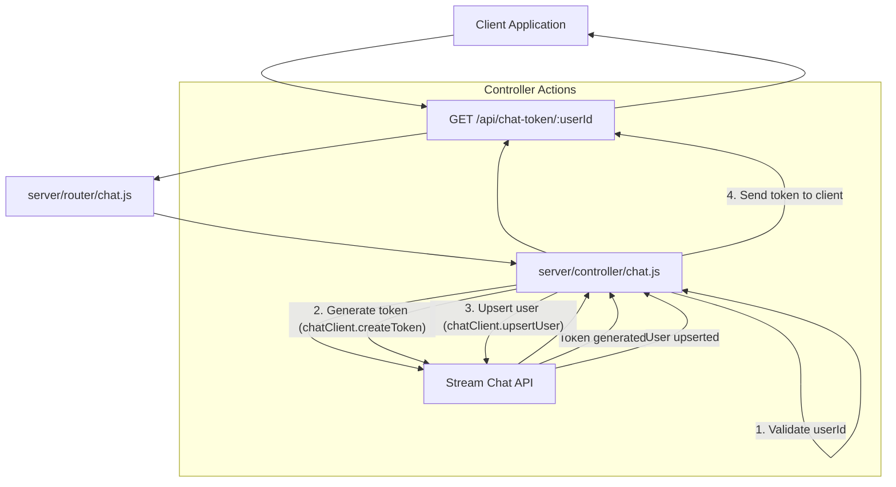
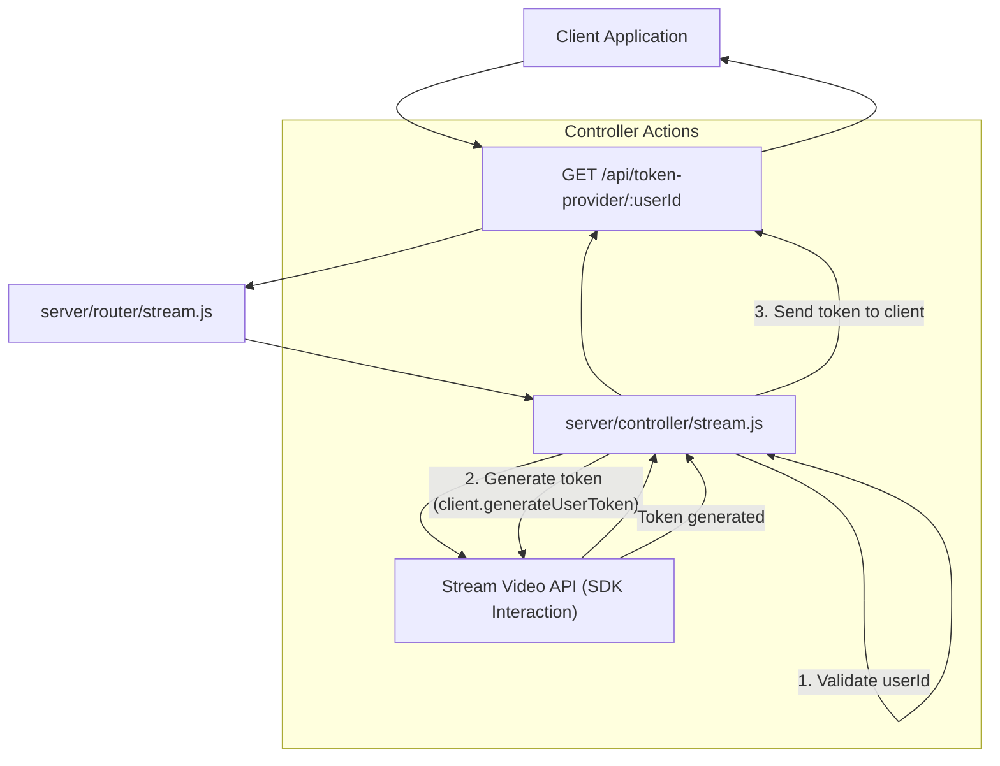

 # API Endpoints and Controllers

This document provides a comprehensive overview of the server-side API endpoints designed for managing user authentication tokens for external streaming services. It details the routing mechanisms and controller logic responsible for generating secure tokens, ensuring seamless integration with client-side applications for both chat and streaming functionalities. The architecture is built around Express.js for routing and dedicated controllers for business logic.

## Overview of Token Generation

Authentication tokens are crucial for securely connecting users to third-party services like Stream Chat and Stream Video. These tokens are generated server-side, preventing exposure of API secrets on the client and ensuring that user identities are properly managed and authorized by the backend before interacting with external APIs. Each service requires a specific token generation process, handled by its respective controller.

## Chat Token Management

The chat token management system handles the authentication process for users interacting with the Stream Chat service. It involves an API endpoint that, upon receiving a request with a user ID, generates a unique token and optionally registers the user with Stream Chat.

### Chat Controller Logic

The `chatTokenGenerator` function in `server/controller/chat.js` is responsible for creating authentication tokens for Stream Chat. It utilizes the `stream-chat` SDK to interact with the Stream Chat API.

```javascript
// server/controller/chat.js
import { StreamChat } from "stream-chat";

const apiChat = "az7swwjyh7mr"; // Placeholder API key
const secretChat =
  "62j53umaeay6tr433g3h9m889z7xz8xswvawcxr633fphtcevxtabc9jxewp6keq"; // Placeholder API secret
const chatClient = StreamChat.getInstance(apiChat, secretChat);

export const chatTokenGenerator = async (req, res) => {
  const { userId } = req.params;
  if (!userId) {
    return res.status(400).json({ error: "user_id is required" });
  }
  try {
    const token = chatClient.createToken(userId);
    await chatClient.upsertUser({
      id: userId,
      role: "admin", // Example role
    });
    res.status(200).json({ token });
  } catch (error) {
    res.status(500).json({ error: "error in generating token" });
  }
};
```

**Explanation:**
*   **Initialization:** The `StreamChat.getInstance` method is used to initialize the Stream Chat client with the provided API key and secret.
*   **`chatTokenGenerator` Function:**
    *   Extracts `userId` from request parameters.
    *   Validates the presence of `userId`.
    *   Generates a token using `chatClient.createToken(userId)`.
    *   Performs an `upsertUser` operation to ensure the user exists and has the specified role (e.g., 'admin') in Stream Chat.
    *   Responds with the generated token or an error message.

[View on GitHub](https://github.com/realrnvr/axios/blob/main/server/controller/chat.js#L1-L24)

### Chat Router Configuration

The `server/router/chat.js` file defines the API endpoint for generating chat tokens. It maps a specific URL path to the `chatTokenGenerator` controller function.

```javascript
// server/router/chat.js
import { Router } from "express";
import { chatTokenGenerator } from "../controller/chat.js";

const chatRouter = Router();
chatRouter.route("/chat-token/:userId").get(chatTokenGenerator);

export default chatRouter;
```

**Explanation:**
*   **Router Initialization:** An Express `Router` instance is created.
*   **Endpoint Definition:** The `.route("/chat-token/:userId")` method defines an endpoint that accepts a `userId` as a URL parameter.
*   **HTTP Method:** The `.get(chatTokenGenerator)` specifies that GET requests to this endpoint will be handled by the `chatTokenGenerator` function.

[View on GitHub](https://github.com/realrnvr/axios/blob/main/server/router/chat.js#L1-L7)

### Chat Token Generation Flow





## Stream Video Token Management

The stream video token management handles the authentication process for users accessing the Stream Video service. Similar to chat, it provides an API endpoint to securely generate user tokens.

### Stream Controller Logic

The `tokenProvider` function in `server/controller/stream.js` is responsible for generating authentication tokens specifically for Stream Video. It uses the `@stream-io/node-sdk` to interact with the Stream Video API.

```javascript
// server/controller/stream.js
import { StreamClient } from "@stream-io/node-sdk";

const apiKey = process.env.STREAM_API_KEY || "3ua7rmk2epdb"; // Placeholder API key
const apiSecret =
  process.env.STREAM_SECRET_KEY ||
  "m2wkrug656zr977jy8ta445fjn5t4k76t39d2d4wf892auqy7deyybrfh6ms84aw"; // Placeholder API secret

const client = new StreamClient(apiKey, apiSecret);

export const tokenProvider = (req, res) => {
  const { userId } = req.params;

  if (!userId) {
    return res.status(400).json({ error: "user_id is required" });
  }

  try {
    const token = client.generateUserToken({
      user_id: userId,
      validity_in_seconds: 3600, // 1hr
    });

    res.status(200).json({ token });
  } catch (error) {
    res.status(500).json({ error: "something went wrong!" });
  }
};
```

**Explanation:**
*   **Initialization:** The `StreamClient` is initialized with the API key and secret, preferably sourced from environment variables for security.
*   **`tokenProvider` Function:**
    *   Retrieves `userId` from request parameters.
    *   Validates `userId` presence.
    *   Generates a user token using `client.generateUserToken`, specifying the user ID and token validity period (e.g., 3600 seconds for 1 hour).
    *   Sends the generated token as a JSON response.

[View on GitHub](https://github.com/realrnvr/axios/blob/main/server/controller/stream.js#L1-L28)

### Stream Router Configuration

The `server/router/stream.js` file defines the API endpoint for providing Stream Video tokens. It links a particular URL path to the `tokenProvider` controller function.

```javascript
// server/router/stream.js
import { Router } from "express";
import { tokenProvider } from "../controller/stream.js";

const router = Router();

router.route("/token-provider/:userId").get(tokenProvider);

export default router;
```

**Explanation:**
*   **Router Initialization:** An Express `Router` instance is created.
*   **Endpoint Definition:** The `.route("/token-provider/:userId")` defines an endpoint that accepts a `userId` as a URL parameter.
*   **HTTP Method:** The `.get(tokenProvider)` assigns the `tokenProvider` function to handle GET requests for this route.

[View on GitHub](https://github.com/realrnvr/axios/blob/main/server/router/stream.js#L1-L7)

### Stream Video Token Generation Flow





## Key Integration Points

*   **Centralized Authentication:** Both chat and video services rely on the backend to provide secure, time-limited authentication tokens, ensuring that sensitive API keys remain server-side.
*   **Express.js Routing:** Express.js `Router` instances (`chatRouter`, `router`) are used to modularize API endpoints, promoting clean code organization and maintainability. Each service's routing is self-contained.
*   **Parameter-Based User Identification:** The use of `/:userId` in the endpoint paths (`/chat-token/:userId`, `/token-provider/:userId`) allows client applications to request tokens for specific users dynamically.
*   **Error Handling:** Both controllers include basic error handling (`try...catch`) to gracefully manage issues during token generation, providing informative responses to the client.
*   **Environment Variables for Secrets:** Although placeholders are shown, best practice dictates that `STREAM_API_KEY` and `STREAM_SECRET_KEY` (and their Stream Chat equivalents) should be loaded from environment variables for production deployments to enhance security.
*   **Idempotency (Chat):** The `chatClient.upsertUser` call in the chat controller ensures that a user's profile is created or updated if they already exist, making the user provisioning process idempotent.