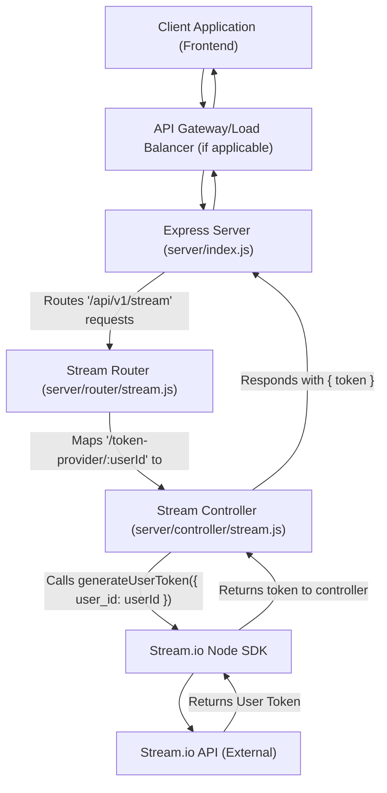
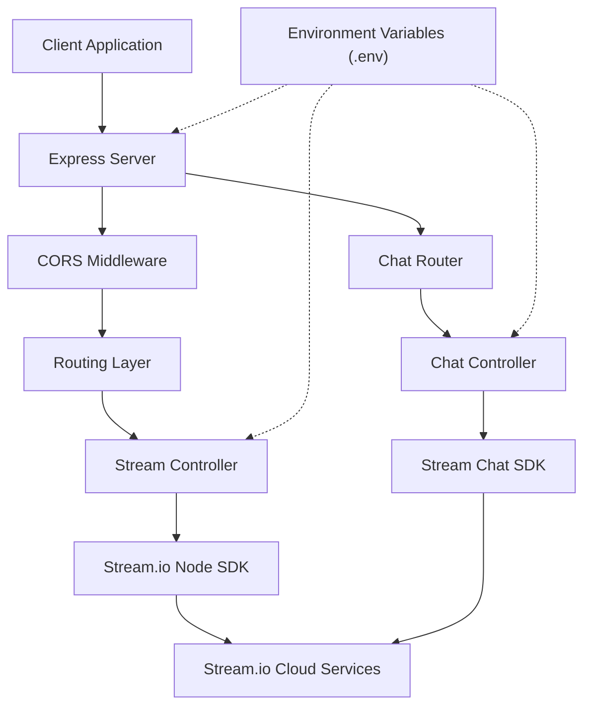

 # Server-Side Architecture

This document provides a comprehensive overview of the server-side architecture for the application, focusing on its structure, the technologies employed, and the primary API endpoints. The backend is built on Node.js with the Express.js framework, designed to serve API requests and interact with third-party services like Stream.io for real-time functionalities.

## Core Technologies

The server-side application leverages a set of robust technologies to ensure efficient and scalable operation:

*   **Node.js**: The runtime environment for executing JavaScript on the server.
*   **Express.js**: A fast, unopinionated, minimalist web framework for Node.js, used for building RESTful APIs.
*   **Stream.io Node SDK**: Integrates with the Stream.io platform for managing real-time functionalities such as chat and video streams, particularly for generating user tokens.
*   **CORS**: Middleware for Express.js to enable Cross-Origin Resource Sharing, allowing controlled access from specified frontend domains.
*   **Dotenv**: A zero-dependency module that loads environment variables from a `.env` file into `process.env`.

The project's dependencies are managed via `package.json`, ensuring all necessary libraries are installed:

```json
// server/package.json
{
  "name": "server",
  "version": "1.0.0",
  "description": "",
  "main": "index.js",
  "type": "module",
  "scripts": {
    "start": "nodemon index.js"
  },
  "keywords": [],
  "author": "",
  "license": "ISC",
  "dependencies": {
    "@stream-io/node-sdk": "^0.4.5",
    "cors": "^2.8.5",
    "dotenv": "^16.4.7",
    "express": "^4.21.2",
    "nodemon": "^3.1.9",
    "stream-chat": "^8.48.0"
  }
}
```

[View on GitHub](https://github.com/realrnvr/axios/blob/main/server/package.json)

## Application Structure

The server application follows a modular structure, separating concerns into distinct files for better maintainability and scalability.

### Main Entry Point (`server/index.js`)

The `server/index.js` file acts as the main entry point for the server application. It initializes the Express app, configures middleware such as CORS, mounts various routers, and starts the HTTP server. It also includes a basic root endpoint to confirm the API is running.

```javascript
// server/index.js
import express from "express";
const app = express();

import { config } from "dotenv";
config();

import cors from "cors";
import router from "./router/stream.js";
import chatRouter from "./router/chat.js";

// frontend ports to allow
app.use(
  cors({
    origin: 
      "https://enteract-video.vercel.app",
    
    credentials: true,
  })
);

app.get("/", (req, res) => {
  res.send("API running!");
});

app.use("/api/v1/stream", router);
app.use("/api/v1/chat", chatRouter);

const PORT = process.env.PORT || 3000;

app.listen(PORT, () => {
  console.log(`Server is listening to PORT ${PORT}`);
});
```

[View on GitHub](https://github.com/realrnvr/axios/blob/main/server/index.js)

### Routing (`server/router/stream.js`)

Routers define the application's API endpoints and map them to specific controller functions. The `server/router/stream.js` file is responsible for defining routes related to Stream.io functionalities, such as providing user tokens.

```javascript
// server/router/stream.js
import { Router } from "express";
import { tokenProvider } from "../controller/stream.js";

const router = Router();

router.route("/token-provider/:userId").get(tokenProvider);

export default router;
```

[View on GitHub](https://github.com/realrnvr/axios/blob/main/server/router/stream.js)

### Controllers (`server/controller/stream.js`)

Controllers contain the business logic for handling incoming requests. The `server/controller/stream.js` file implements the `tokenProvider` function, which uses the Stream.io Node SDK to generate authentication tokens for users. This function is crucial for client-side applications to authenticate with the Stream.io services.

```javascript
// server/controller/stream.js
import { StreamClient } from "@stream-io/node-sdk";

const apiKey = process.env.STREAM_API_KEY || "3ua7rmk2epdb";
const apiSecret =
  process.env.STREAM_SECRET_KEY ||
  "m2wkrug656zr977jy8ta445fjn5t4k76t39d2d4wf892auqy7deyybrfh6ms84aw";

const client = new StreamClient(apiKey, apiSecret);

export const tokenProvider = (req, res) => {
  const { userId } = req.params;

  if (!userId) {
    return res.status(400).json({ error: "user_id is required" });
  }

  try {
    const token = client.generateUserToken({
      user_id: userId,
      validity_in_seconds: 3600, // 1hr
    });

    res.status(200).json({ token });
  } catch (error) {
    res.status(500).json({ error: "something went wrong!" });
  }
};
```

[View on GitHub](https://github.com/realrnvr/axios/blob/main/server/controller/stream.js)

## API Endpoints

The server exposes several API endpoints, primarily under the `/api/v1/stream` and `/api/v1/chat` base paths.

### Stream Token Provider

*   **Endpoint:** `/api/v1/stream/token-provider/:userId`
*   **Method:** `GET`
*   **Description:** This endpoint is responsible for generating a unique authentication token for a given user ID, which is then used by the client-side application to connect to Stream.io services.
*   **Parameters:**
    *   `userId` (Path Parameter): The unique identifier for the user requesting the token.
*   **Responses:**
    *   `200 OK`: Returns a JSON object containing the generated token: `{"token": "eyJhbGciOiJIUzI1Ni..."}`.
    *   `400 Bad Request`: If `userId` is missing in the request parameters: `{"error": "user_id is required"}`.
    *   `500 Internal Server Error`: If an unexpected error occurs during token generation: `{"error": "something went wrong!"}`.

## Server-Side Architectural Flow

The diagram below illustrates the high-level flow of how client requests are handled by the server, specifically for Stream.io token generation.





## Key Integration Points

The server-side architecture is designed with key integration points that facilitate communication between different components and external services:

*   **CORS Configuration**: The `cors` middleware in `server/index.js` explicitly defines `https://enteract-video.vercel.app` as the allowed origin. This is a critical security measure, ensuring that only trusted frontend applications can make requests to the API.
*   **Environment Variables**: Sensitive information like `STREAM_API_KEY` and `STREAM_SECRET_KEY` are managed through environment variables, loaded by `dotenv`. This keeps credentials out of the codebase and allows for easy configuration across different environments (development, production).
*   **Stream.io Node SDK**: The `@stream-io/node-sdk` is the primary interface for interacting with Stream.io. The `tokenProvider` function encapsulates the logic for secure token generation, which is fundamental for user authentication and authorization within the Stream.io ecosystem. This ensures that users can securely connect to chat and video functionalities.
*   **Modular Routing**: The separation of routes (`server/router/stream.js`, `server/router/chat.js`) and controllers (`server/controller/stream.js`) promotes a clean and scalable codebase. New API features can be added by simply creating new routers and controllers without affecting existing functionalities.

## Overall System Interaction

This diagram shows how different server-side components interact with each other and with external services to provide the application's core functionalities.


