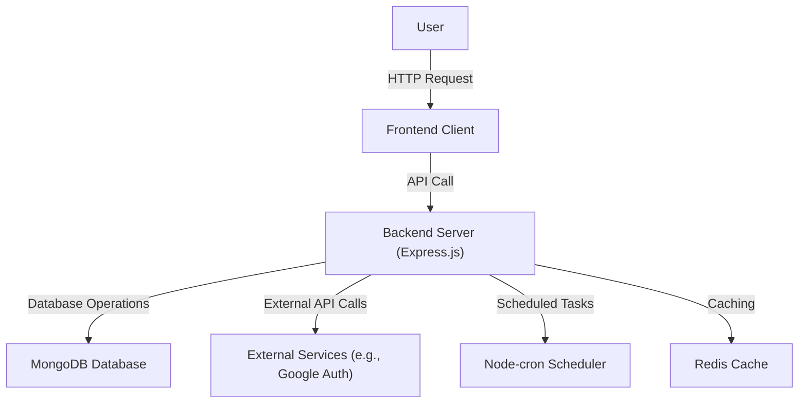

# Project Overview

This project, `realrnvr/puck`, is a full-stack application designed to provide a robust platform for user authentication, data management, and asynchronous operations. It leverages modern JavaScript technologies for both the frontend and backend, ensuring a scalable and efficient user experience.

## Purpose and Functionality

The primary goal of `realrnvr/puck` is to create a secure and performant web application. Key functionalities include:

*   **User Authentication**: Secure registration and login mechanisms.
*   **Data Persistence**: Interacting with a MongoDB database for storing and retrieving application data.
*   **Asynchronous Task Management**: Handling background processes and scheduled tasks.
*   **API Development**: Building a RESTful API to serve frontend requests.

## Technology Stack

The project utilizes a powerful combination of technologies:

*   **Backend**: Node.js with Express.js forms the core of the server-side logic. It employs various middleware for security, rate limiting, and request parsing.
*   **Database**: MongoDB is used as the primary database, integrated via Mongoose ODM.
*   **Frontend**: While not fully detailed in the provided context, the Vite build tool (`vite.config.js`) suggests a modern JavaScript framework like React, Vue, or Svelte is likely used on the client-side.
*   **Security**: Bcrypt.js for password hashing, JSON Web Tokens (JWT) for session management, and Google Auth library for potential third-party authentication.
*   **DevOps & Utilities**: Nodemon for development server restarts, Dotenv for environment variable management, and Axios for HTTP requests.

## Architecture Overview

The application follows a typical client-server architecture. The backend server exposes APIs that the frontend client consumes. Asynchronous tasks and scheduled jobs are handled internally by the backend.





## Key Dependencies

The backend relies on a comprehensive set of npm packages to deliver its functionality. Notable dependencies include:

*   `express`: For building the web server and API.
*   `mongoose`: For interacting with MongoDB.
*   `bcryptjs`: For secure password hashing.
*   `jsonwebtoken`: For creating and verifying JSON Web Tokens.
*   `dotenv`: For managing environment variables.
*   `cors`: For enabling Cross-Origin Resource Sharing.
*   `axios`: For making HTTP requests to external services.

Here's a snippet from `server/package.json` highlighting some core dependencies:

```json
{
  "dependencies": {
    "express": "^4.21.1",
    "mongoose": "^8.6.1",
    "bcryptjs": "^2.4.3",
    "jsonwebtoken": "^9.0.2",
    "dotenv": "^16.4.5",
    "cors": "^2.8.5",
    "axios": "^1.7.7"
  }
}
```

## Development Setup

The development environment is configured to facilitate rapid iteration. The `server/package.json` includes a script for starting the server with `nodemon`, which automatically restarts the server upon file changes.

```bash
"scripts": {
  "start": "nodemon app.js"
}
```

The Vite configuration file (`vite.config.js`) suggests a similar development setup for the frontend, likely enabling hot module replacement for a smooth development experience.

## Key Takeaways

*   `realrnvr/puck` is a full-stack Node.js application built with Express.js and Mongoose.
*   It prioritizes security through bcryptjs and JWT.
*   Asynchronous operations and external API calls are supported using libraries like `node-cron` and `axios`.
*   Development efficiency is enhanced by tools like `nodemon` and Vite.