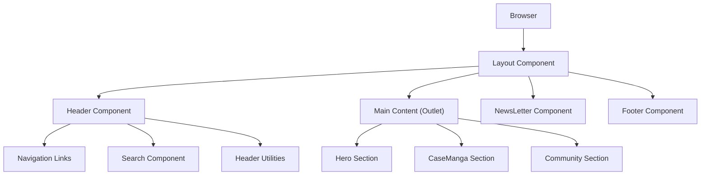

# UI Components and Layout

This section details the reusable UI elements, page structures, and the overall application layout of the Puck application. It covers components like the Header, MangaCard, and the primary page layout.

## Header Component

The `Header` component is a critical navigation and branding element. It features a prominent logo, primary and secondary navigation links, search functionality, and utility links. It also includes a responsive mobile menu that can be toggled to optimize the user experience across different screen sizes.

The header handles the display of popular manga links, a search bar, and navigation items for "read," "watch," "community," and "about." It also incorporates a prefetching mechanism for random manga data to enhance performance when users interact with the "read" navigation item.

```jsx
// client/src/components/ui/header/Header.jsx
import "./header.css";
import { memo, useState } from "react";
import { Link } from "react-router-dom";
import { useDisableScroll } from "../../../hooks/useDisableScroll";
import { usePrefetchRandomManga } from "../../../hooks/usePrefetchRandomManga";
import Search from "../../Search";
import HeaderUtilities from "../../HeaderUtilities";
import HeaderNavLink from "../../HeaderNavLink";
import HeaderGoto from "../../HeaderGoto";

const RANDOM_MANGA_LIMIT = Number(import.meta.env.VITE_RANDOM_MANGA_LIMIT) || 8;

const Header = () => {
  const [MobileMenu, setMobileMenu] = useState(false);

  useDisableScroll(MobileMenu);
  const { prefetch } = usePrefetchRandomManga(RANDOM_MANGA_LIMIT);

  const toggleMobileMenu = () => {
    setMobileMenu((prevMobileMenu) => {
      return !prevMobileMenu;
    });
  };

  const handleNavClick = () => {
    setMobileMenu(false);
  };

  return (
    <header className="header">
      <div className="header__sec-nav-wrapper header__lg-screen">
        <nav className="container" aria-label="Secondary Navigation">
          <ul className="header__sec-ul">
            <li>
              <h2 className="header__title">Manga & Anime</h2>
            </li>
            <HeaderGoto
              title={"Berserk"}
              mangaId={"801513ba-a712-498c-8f57-cae55b38cc92"}
              authorId={"5863578d-4e4f-4b57-b64d-1dd45a893cb0"}
            />
            {/* ... other HeaderGoto components */}
          </ul>
        </nav>
      </div>
      <div className="header__main-wrapper">
        <div className="header__main | container">
          <button
            className="header__btn header__btn--opacity header__sm-screen"
            onClick={toggleMobileMenu}
            style={MobileMenu ? { opacity: 0 } : null}
          >
            <svg
              fill="none"
              viewBox="0 0 24 24"
              strokeWidth={2}
              stroke="currentColor"
              className="header__icon"
              aria-hidden="true"
              color="#fff"
            >
              <path
                strokeLinejoin="round"
                d="M3.75 6.75h16.5M3.75 12h16.5m-16.5 5.25h16.5"
              />
            </svg>
            <span className="visually-hidden">Open Menu</span>
          </button>
          <nav
            className="header__pri-nav header__lg-screen"
            aria-label="Primary Navigation"
          >
            <div className="header__actions">
              <HeaderUtilities />
              <Search />
            </div>
            <div>
              <ul className="header__pri-ul header__pri-ul--flex-d">
                <HeaderNavLink
                  value={"read"}
                  onMouseEnter={prefetch}
                  onTouchStart={prefetch}
                />
                <HeaderNavLink value={"watch"} />
                <HeaderNavLink value={"community"} />
                <HeaderNavLink value={"about"} />
              </ul>
            </div>
          </nav>
          <div className="header__img-wrapper">
            <Link to="/">
              
              <span className="visually-hidden">Go to Home page</span>
            </Link>
          </div>
        </div>
      </div>
      {/* Mobile menu content */}
    </header>
  );
};

export default memo(Header);
```

## Layout Component

The `Layout` component serves as the main structural wrapper for the application. It ensures a consistent experience by including the `Header` at the top, the main content area (rendered by `Outlet`), a newsletter signup section, and the `Footer` at the bottom. It also utilizes a custom hook `useScrollToTopOrSection` to manage scroll behavior, ensuring users return to the top of the page or a specific section when navigating.

```jsx
// client/src/pages/layout/Layout.jsx
import "./layout.css";
import { Outlet } from "react-router-dom";
import Footer from "../../components/ui/footer/Footer";
import Header from "../../components/ui/header/Header";
import NewsLetter from "../../components/ui/newsLetter/NewsLetter";
import useScrollToTopOrSection from "../../hooks/useScrollToTopOrSection";

const Layout = () => {
  useScrollToTopOrSection();

  return (
    <>
      <Header />
      <main>
        <Outlet />
        <NewsLetter />
      </main>
      <Footer />
    </>
  );
};

export default Layout;
```

## MangaCard Component

The `MangaCard` component is designed to display individual manga entries in a visually appealing and interactive card format. It showcases the manga title and its cover image, fetched dynamically using React Query. Each card includes a "favorite" button and is clickable, navigating the user to the detailed manga page upon interaction. Loading and error states are handled gracefully with skeleton loaders and placeholder images.

```jsx
// client/src/components/ui/mangaCard/MangaCard.jsx
import "./manga-card.css";
import { useQuery } from "@tanstack/react-query";
import { useNavigate } from "react-router-dom";
import { fetchMangaCover } from "../../../services/query/query";
import FavBtn from "../favBtn/FavBtn";
import PropTypes from "prop-types";
import MangaCardImgSkeleton from "../../../utils/skeletons/mangaCardImg/MangaCardImgSkeleton";

const MangaCard = ({ title, mangaId, authorId }) => {
  const navigate = useNavigate();

  const { data, isLoading, isError } = useQuery({
    queryKey: ["manga-cover", { mangaId, volume: "desc", width: 256 }],
    queryFn: () => fetchMangaCover({ mangaId, volume: "desc", width: 256 }),
  });

  const coverUrl = data?.data?.coverImgUrl;

  const mangaData = {
    mangaTitle: title,
    mangaId: mangaId,
    authorId: authorId,
    coverUrl: coverUrl,
  };

  const handleMangaClick = () => {
    navigate(`/manga/${mangaId}/${authorId}`);
  };

  return (
    <div className="manga-card" onClick={handleMangaClick}>
      
      <div className="manga-card__fav-btn-wrapper">
        <FavBtn
          mangaId={mangaId}
          mangaData={mangaData}
          className="manga-card__fav-btn"
        />
      </div>
      <div className="manga-card__content">
        {isLoading ? (
          <MangaCardImgSkeleton />
        ) : (
          
        )}
        <p className="manga-card__title">{title || "---"} </p>
      </div>
    </div>
  );
};

MangaCard.propTypes = {
  title: PropTypes.string,
  mangaId: PropTypes.string,
  authorId: PropTypes.string,
};

export default MangaCard;
```

## Home Page Structure

The `Home` page (`client/src/pages/home/Home.jsx`) orchestrates the presentation of key content sections. It utilizes a composition of several components to create a engaging landing experience. Specifically, it includes a `Hero` section for an impactful introduction, a `CaseManga` component likely showcasing featured or trending manga, and a `Community` section to foster user interaction.

```jsx
// client/src/pages/home/Home.jsx
import "./home.css";
import Hero from "../../components/ui/hero/Hero";
import Community from "../../components/ui/community/Community";
import CaseManga from "../../components/ui/caseManga/CaseManga";

const Home = () => {
  return (
    <>
      <Hero />
      <CaseManga />
      <Community />
    </>
  );
};

export default Home;
```

## Application Layout Flow

The following diagram illustrates the general flow of components and their relationship within the application's layout.





## Key Takeaways

- The application employs a consistent layout structure defined by the `Layout` component, ensuring a cohesive user experience.
- Reusable UI components like `Header` and `MangaCard` promote code maintainability and a consistent design language.
- State management for UI elements like mobile menus is handled effectively using React's `useState` hook.
- Data fetching and state management for dynamic content (e.g., manga covers) are managed by React Query, with appropriate loading and error handling.
- Navigation is handled using `react-router-dom`, with specific routing logic embedded within components like `MangaCard` and `Header`.