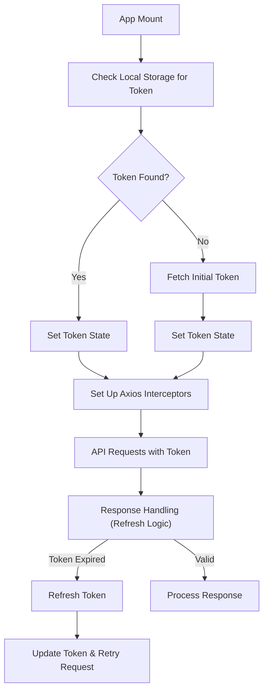

# State Management and Hooks

This section details the custom hooks and state management patterns employed within the client application, focusing on authentication, data fetching, and persistent storage.

## Authentication with `useAuth` and `AuthProvider`

The application utilizes a custom hook, `useAuth`, to access authentication state and user information. This hook relies on an `AuthContext` provided by the `AuthProvider` component.

The `AuthProvider` manages the user's authentication token and fetches user data using React Query's `useQuery`. It also sets up Axios interceptors to automatically include the authentication token in requests and handle token refresh logic.

```jsx
// client/src/hooks/useAuth.js
import { createContext, useContext } from "react";

export const AuthContext = createContext();

export function useAuth() {
  const authContext = useContext(AuthContext);
  if (!authContext) {
    throw new Error("useAuth must be used within an AuthProvider");
  }
  return authContext;
}
```

```jsx
// client/src/services/provider/AuthProvider.jsx
import { useEffect, useLayoutEffect, useState } from "react";
import { axiosInstance } from "../api/axios.js";
import { AuthContext } from "../../hooks/useAuth.js";
import { useMutation, useQuery, useQueryClient } from "@tanstack/react-query";
import toast from "react-hot-toast";
import PropTypes from "prop-types";

export const AuthProvider = ({ children }) => {
  const [token, setToken] = useState(undefined);
  const [isPending, setIsPending] = useState(true);
  const queryClient = useQueryClient();

  const { data, isLoading, isError } = useQuery({
    queryKey: ["user"],
    queryFn: () => axiosInstance.get("/api/v1/client/user"),
    enabled: !!token,
  });

  // ... (rest of the AuthProvider logic)

  return (
    <AuthContext.Provider
      value={{
        token,
        setToken,
        user: data?.data,
        userError: isError,
        logout: logoutMutate,
        isPending: isLoading,
        mutateTokenPending: isPending,
        mutateLogoutPending,
      }}
    >
      {children}
    </AuthContext.Provider>
  );
};
```

### Authentication Flow

The following diagram illustrates the authentication flow, from initial token fetching to interceptor-based request handling.





## Infinite Scrolling with `useInfiniteManga`

The `useInfiniteManga` hook leverages React Query's `useInfiniteQuery` and `react-intersection-observer` to implement an infinite scrolling mechanism for fetching manga data. It automatically fetches the next page of results when the user scrolls close to the bottom of the list.

```jsx
// client/src/hooks/useInfiniteManga.js
import { useInfiniteQuery } from "@tanstack/react-query";
import { useInView } from "react-intersection-observer";
import { useEffect } from "react";
import { fetchMangas } from "../services/query/query";

export const useInfiniteManga = (LIMIT) => {
  const {
    data,
    fetchNextPage,
    hasNextPage,
    isFetchingNextPage,
    isFetching,
    isError,
  } = useInfiniteQuery({
    queryKey: ["mangas", { LIMIT }],
    queryFn: ({ pageParam = "" }) => fetchMangas({ LIMIT, pageParam }),
    initialPageParam: "",
    getNextPageParam: (lastPage) => lastPage.nextCursor,
  });

  const { ref, inView } = useInView({
    threshold: 0.1,
  });

  useEffect(() => {
    if (inView && hasNextPage && !isFetchingNextPage && !isError) {
      fetchNextPage();
    }
  }, [inView, fetchNextPage, hasNextPage, isFetchingNextPage, isError]);

  return { data, isFetching, isFetchingNextPage, isError, ref };
};
```

## Local Storage Persistence with `useLocalStorage`

The `useLocalStorage` hook provides a convenient way to interact with the browser's `localStorage` API. It allows components to store and retrieve data from local storage, with built-in error handling and support for JSON parsing.

```jsx
// client/src/hooks/useLocalStorage.js
import { useCallback, useState } from "react";

export const useLocalStorage = (key, initialValue) => {
  const [value, setValue] = useState(() => {
    try {
      const item = window.localStorage.getItem(key);
      return item !== null && item !== undefined && item !== "undefined"
        ? JSON.parse(item)
        : initialValue;
    } catch (error) {
      console.log("Error accessing localStorage", error);
      return initialValue;
    }
  });

  const setValueWrapper = useCallback(
    (updatedValue) => {
      try {
        const valueToStore =
          updatedValue instanceof Function ? updatedValue(value) : updatedValue;
        setValue(valueToStore);
        window.localStorage.setItem(key, JSON.stringify(valueToStore));
      } catch (error) {
        console.log("Error adding into localStorage", error);
      }
    },
    [key, value]
  );

  return [value, setValueWrapper];
};
```

## Key Takeaways

*   **Context API for Global State:** `AuthContext` provides a centralized way to manage authentication state across the application.
*   **Custom Hooks for Reusability:** Hooks like `useAuth`, `useInfiniteManga`, and `useLocalStorage` encapsulate complex logic, making it reusable and easier to manage.
*   **React Query for Data Fetching:** `useInfiniteQuery` is instrumental in efficiently fetching and managing paginated data, while `useQuery` handles single data fetches.
*   **Axios Interceptors for Cross-Cutting Concerns:** Interceptors streamline tasks like adding authentication headers and handling token refresh, ensuring a robust API interaction layer.
*   **LocalStorage for Client-Side Persistence:** `useLocalStorage` offers a simple interface for storing user preferences or session data directly in the browser.