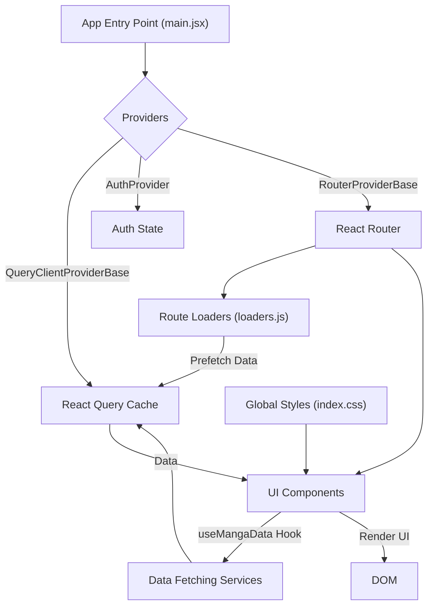

# Client-Side Architecture

This document details the client-side architecture of the `puck` application, focusing on its structure, core components, and data management strategies. The client is built using React, leveraging modern hooks and state management solutions for a dynamic and responsive user experience.

## Core Components and Entry Point

The application's lifecycle begins in `client/src/main.jsx`. This file serves as the root of the React application, orchestrating the setup of essential providers before rendering the main application components.

```tsx
import { StrictMode } from "react";
import { createRoot } from "react-dom/client";
import { AuthProvider } from "./services/provider/AuthProvider";
import { QueryClientProviderBase } from "./services/provider/QueryClient/QueryClientProviderBase";
import { RouterProviderBase } from "./services/provider/RouterProviderBase";
import { ReactQueryDevtools } from "@tanstack/react-query-devtools";
import Notification from "./utils/notification/Notification";

import "./resets.css";
import "./utils.css";
import "./index.css";

createRoot(document.getElementById("root")).render(
  <StrictMode>
    <QueryClientProviderBase>
      <AuthProvider>
        <RouterProviderBase />
        <Notification />
        <ReactQueryDevtools initialIsOpen={false} />
      </AuthProvider>
    </QueryClientProviderBase>
  </StrictMode>
);
```

Key providers initialized here include:
*   `QueryClientProviderBase`: Manages the React Query cache and client instance for efficient data fetching and state management.
*   `AuthProvider`: Handles user authentication and authorization logic.
*   `RouterProviderBase`: Configures and manages application routing.
*   `Notification`: A utility for displaying user notifications.

The global stylesheets `resets.css`, `utils.css`, and `index.css` are imported to establish a consistent visual foundation.

## Styling and Theming

Global styling is managed through `client/src/index.css`. This file defines CSS variables for font families, colors, font sizes, and font weights, enabling a themable and consistent design system across the application.

```css
:root {
  /* font family */
  --ff-primary: "Poppins", sans-serif;

  /* colors */
  --bg-clr-primary: #191815;
  --bg-clr-secondary: #2e2d2d;
  --bg-clr-tertiary: #1d1d1d;
  --clr-primary: #ffffe3;
  --clr-secondary: #606055;

  /* font size */
  --fs-3xs: 0.75rem;
  /* ... other font sizes */
}

body {
  font-family: var(--ff-primary);
  font-size: var(--fs-xxs);
  background-color: var(--bg-clr-primary);
  color: var(--clr-primary);
}
```

The use of CSS variables ensures that visual styles can be easily updated and maintained.

## Data Fetching and State Management with React Query

The `useMangaData` custom hook, located in `client/src/hooks/useMangaData.js`, is central to fetching and managing manga-related data. It utilizes React Query (`@tanstack/react-query`) to handle asynchronous data fetching, caching, and state updates.

```tsx
import { useQuery, useQueryClient } from "@tanstack/react-query";
import { useMemo } from "react";
import {
  fetchStatics,
  fetchAuthor,
  fetchMangaCover,
} from "../services/query/query";

export const useMangaData = ({ mangaId, authorId }) => {
  const queryClient = useQueryClient();

  const {
    data: statics,
    isPending: isStatics,
    isError: isStaticsError,
    error: staticsError,
  } = useQuery({
    queryKey: ["statics", { mangaId }],
    queryFn: () => fetchStatics({ mangaId }),
  });

  // ... other queries for author and cover image

  const mangaData = useMemo(
    () => ({
      mangaTitle: statics?.data?.data?.attributes?.title?.en,
      mangaId: mangaId,
      authorId: authorId,
      coverUrl: coverImg?.data?.coverImgUrl,
    }),
    [
      statics?.data?.data?.attributes?.title?.en,
      mangaId,
      authorId,
      coverImg?.data?.coverImgUrl,
    ]
  );

  return {
    statics,
    isStatics,
    isStaticsError,
    staticsError,
    // ... other return values
    mangaData,
  };
};
```

This hook fetches:
*   Manga static information (`statics`)
*   Author details (`authorData`)
*   Manga cover image (`coverImg`)

It also uses `useMemo` to create a derived `mangaData` object for convenience, ensuring that computed values are only recalculated when their dependencies change.

## Route Loading and Data Pre-fetching

Route loaders, defined in `client/src/routes/loaders.js`, play a crucial role in pre-fetching data before a route is rendered. This enhances the user experience by ensuring data is available as soon as the route transitions.

```js
import { queryClient } from "../services/provider/QueryClient/client";
import {
  fetchAuthor,
  fetchMangaCover,
  fetchStatics,
} from "../services/query/query";

export const mangaLoader = ({ params }) => {
  const { mangaId, authorId } = params;

  if (!mangaId || !authorId) {
    return null;
  }

  queryClient.prefetchQuery({
    queryKey: ["statics", { mangaId }],
    queryFn: () => fetchStatics({ mangaId }),
  });

  // ... prefetch queries for author and cover image

  return { mangaId, authorId };
};
```

The `mangaLoader` function for manga routes pre-fetches data for manga statistics, author information, and the manga cover image using `queryClient.prefetchQuery`. This ensures that when a user navigates to a manga detail page, the necessary data is already in the React Query cache, leading to faster render times and a smoother transition.

## Architectural Diagram

The following diagram illustrates the high-level flow of client-side architecture, from initialization to data fetching and rendering.





## Key Takeaways

*   **React and Ecosystem**: The client is built using React, leveraging its component-based architecture and hooks.
*   **Data Management**: React Query is the primary tool for managing server-state, providing efficient data fetching, caching, and synchronization.
*   **Routing**: React Router handles navigation and declarative routing, with route loaders optimizing data availability.
*   **Modularity**: Code is organized into logical modules, including hooks for data fetching and services for API interactions.
*   **Styling**: A centralized CSS file with CSS variables ensures a consistent and maintainable design system.