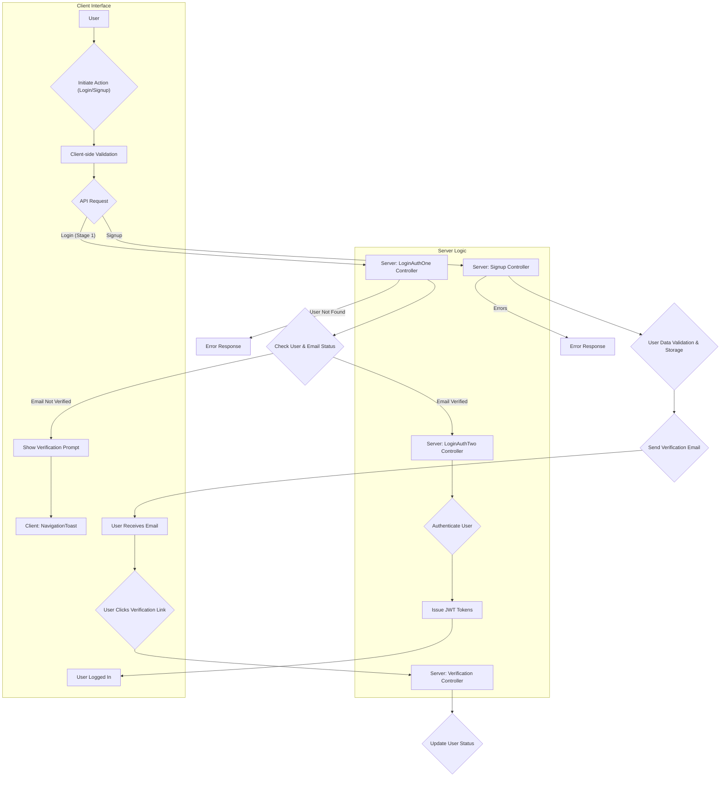

# Authentication Flows

This section details the various user authentication and registration processes supported by Puck, covering user sign-up, login, and password recovery.

## User Registration (Sign Up)

The sign-up process allows new users to create an account. It involves providing a username, email, and password. Upon successful submission, user data is stored, and a verification email is sent.

The `Signup.jsx` component handles the user interface for registration. It utilizes `react-hook-form` for form management and `zod` for schema validation. The `signup` mutation from `authMutation` service is called to submit the form data to the backend. Error handling is in place to display specific messages for username or email conflicts, and for cases where email verification is incomplete.

```tsx
// client/src/components/auth/signup/Signup.jsx
import "./signup.css";
import { useForm } from "react-hook-form";
import { zodResolver } from "@hookform/resolvers/zod";
import { useNavigate } from "react-router-dom";
import { SignUpSchema } from "../../../assets/schema/SignUpSchema";
import { formData } from "../../../assets/data/signUpData";
import { signup } from "../../../services/mutation/authMutation";
import { useMutation } from "@tanstack/react-query";
import { hasErrors } from "../../../helper/hasErrors";
import Input from "../../ui/input/Input";
import toast from "react-hot-toast";
import Loader from "../../ui/loader/Loader";
import NavigationToast from "../navigationToast/NavigationToast";

const Signup = () => {
  const {
    register,
    handleSubmit,
    setError,
    watch,
    setFocus,
    formState: { errors, isValid },
  } = useForm({
    defaultValues: {
      username: "",
      email: "",
      password: "",
    },
    resolver: zodResolver(SignUpSchema),
    mode: "onChange",
  });

  const navigate = useNavigate();

  const { mutate: signupMutate, isPending } = useMutation({
    mutationFn: signup,
    onSuccess: (data) => {
      localStorage.setItem("sign-mail", data?.data?.user?.email);
      navigate("/verification");
    },
    onError: (error) => {
      const { type, message, email } = error.response.data;
      switch (type) {
        case "username":
          setError("username", { message });
          setFocus("username");
          break;

        case "email":
          setError("email", { message });
          setFocus("email");
          break;

        case "verification-incomplete":
          setError("email", { message });
          setFocus("email");
          toast(
            <NavigationToast
              message={"Please verify your email to continue."}
              btnText={"Verification here"}
              email={email}
              navigate={navigate}
              to={"/verification"}
              toastId={"verification-toast"}
              path={"sign-mail"}
            />,
            {
              duration: 10000,
              id: "verification-toast",
            }
          );
          break;
        default:
          toast.error("Something went wrong");
      }
    },
  });

  const onSubmit = (data) => {
    signupMutate(data);
  };

  return (
    <form className="signup__form" onSubmit={handleSubmit(onSubmit)}>
      {formData.map((val, idx) => {
        return (
          <Input
            key={idx}
            register={register}
            watch={watch}
            errors={errors}
            formData={val}
          />
        );
      })}
      <div className="signup__btn-wrapper">
        <button
          disabled={isPending || !isValid || hasErrors(errors)}
          className="signup__btn"
          type="submit"
        >
          Sign Up
        </button>
        {isPending && <Loader />}
      </div>
    </form>
  );
};

export default Signup;
```

## User Login

The login flow is designed in two stages for enhanced security.

### Login - Stage 1 (Email Verification)

The first stage of login (`loginAuthOne`) requires the user to provide their email address. This is to check if the user exists and if their email has been verified. If the email is not verified, a prompt is shown to the user to verify their email.

```tsx
// client/src/components/auth/login/Login.jsx
import "./login.css";
import { useForm } from "react-hook-form";
import { zodResolver } from "@hookform/resolvers/zod";
import { useNavigate } from "react-router-dom";
import { formData } from "../../../assets/data/logInData";
import { EmailSchema } from "../../../assets/schema/EmailSchema";
import { useMutation } from "@tanstack/react-query";
import { loginAuthOne } from "../../../services/mutation/authMutation";
import { hasErrors } from "../../../helper/hasErrors";
import Input from "../../ui/input/Input";
import toast from "react-hot-toast";
import NavigationToast from "../navigationToast/NavigationToast";

const Login = () => {
  const navigate = useNavigate();

  const {
    register,
    handleSubmit,
    setError,
    setFocus,
    watch,
    formState: { errors, isValid },
  } = useForm({
    defaultValues: {
      email: "",
    },
    resolver: zodResolver(EmailSchema),
    mode: "onChange",
  });

  const { mutate: loginAuthOneMutate, isPending } = useMutation({
    mutationFn: loginAuthOne,
    onSuccess: (data) => {
      localStorage.setItem("log-mail", data?.data?.user?.email);
      navigate(data?.data?.navigate);
    },
    onError: (error) => {
      const { type, message, email } = error.response.data;
      setError("email", { message });
      setFocus("email");
      if (type === "email") {
        toast(
          <NavigationToast
            message={"Please verify your email to continue."}
            btnText={"Verification here"}
            email={email}
            to={"/verification"}
            navigate={navigate}
            toastId={"verification-toast"}
            path={"sign-mail"}
          />,
          {
            duration: 10000,
            id: "verification-toast",
          }
        );
      }
    },
  });

  const onSubmit = (data) => {
    loginAuthOneMutate(data);
  };

  return (
    <>
      <form className="login__form" onSubmit={handleSubmit(onSubmit)}>
        <Input
          register={register}
          watch={watch}
          errors={errors}
          formData={formData[0]}
        />
        <button
          className="login__btn"
          type="submit"
          disabled={!isValid || isPending || hasErrors(errors)}
        >
          continue
        </button>
      </form>
    </>
  );
};

export default Login;
```

### Login - Stage 2 (Password/Code Entry)

Following successful email verification in Stage 1, the user proceeds to the second stage of login, which may involve entering a password or a one-time code, depending on the authentication strategy. This is handled by `loginAuthTwo` and `loginGoogleAuthTwo` on the server-side.

```plaintext
# server/router/auth.js
// ... other imports
router.route("/loginAuthOne").post(loginAuthOne);
router.route("/loginAuthTwo").post(loginAuthTwo);
router.route("/loginGoogleAuthTwo").post(loginGoogleAuthTwo);
// ... other routes
```

## Password Recovery

The password recovery flow is designed to help users regain access to their accounts if they forget their password.

### Forgot Password

Users can initiate the password recovery process by providing their registered email address via the `ForgotPassword.jsx` component. This triggers the `forgotPassword` mutation, which sends a password reset verification email to the user.

```tsx
// client/src/pages/auth/forgotPassword/ForgotPassword.jsx
import "./forgot-password.css";
import { useForm } from "react-hook-form";
import { zodResolver } from "@hookform/resolvers/zod";
import { EmailSchema } from "../../../assets/schema/EmailSchema";
import { useNavigate } from "react-router-dom";
import { forgotPassword } from "../../../services/mutation/authMutation";
import { useMutation } from "@tanstack/react-query";
import Input from "../../../components/ui/input/Input";
import toast from "react-hot-toast";
import { hasErrors } from "../../../helper/hasErrors";

const ForgotPassword = () => {
  const navigate = useNavigate();

  const {
    register,
    handleSubmit,
    formState: { errors, isValid },
    watch,
  } = useForm({
    defaultValues: {
      email: localStorage.getItem("log-mail") || "",
    },
    resolver: zodResolver(EmailSchema),
    mode: "onChange",
  });

  const { mutate: forgotPasswordMutate, isPending } = useMutation({
    mutationFn: forgotPassword,
    onMutate: () => {
      toast.loading("Sending verification email...", {
        id: "toast-verification",
      });
    },
    onSuccess: (data) => {
      toast.success(data?.data?.message, {
        id: "toast-verification",
      });
      localStorage.setItem("pass-mail", data?.data?.user?.email);
      navigate("/password-verification");
    },
    onError: (error) => {
      toast.error(error.response?.data?.message, {
        id: "toast-verification",
      });
    },
  });

  const onSubmit = (data) => {
    forgotPasswordMutate(data);
  };

  return (
    <article className="forgot">
      <div className="forgot__content">
        <h2 className="forgot__title">PUCK</h2>
        <p className="forgot__description">Forgot Password</p>
        <p className="forgot__description forgot__description--fs">
          Enter your email to proceed for verification.
        </p>
        <form onSubmit={handleSubmit(onSubmit)}>
          <Input
            register={register}
            watch={watch}
            errors={errors}
            formData={{
              label: "Email",
              name: "email",
              type: "text",
              serverErr: "user not found.",
              defaultMsg: "Valid email.",
              toggle: false,
            }}
          />
          <button
            className="forgot__btn"
            type="submit"
            disabled={!isValid || isPending || hasErrors(errors)}
          >
            Continue
          </button>
        </form>
      </div>
    </article>
  );
};

export default ForgotPassword;
```

### Reset Password

After receiving the password reset email, the user is directed to a password reset page where they can set a new password. This process is secured by a verification ID and rate limiting to prevent abuse.

```plaintext
# server/router/auth.js
// ... other imports
router
  .route("/resetPassword/:verificationId")
  .post(validateResetPassword, passwordLimiter, resetPassword);
// ... other routes
```

## Email Verification

Both the sign-up and login flows involve email verification. Users must verify their email address to activate their account or to proceed with certain login actions. The system provides mechanisms to resend verification emails if needed.

```plaintext
# server/router/auth.js
// ... other imports
router.route("/verification/:verificationId").post(verification);
router.route("/resendVerification").post(resendLimiter, resendVerification);
router.route("/resendPasswordVerification").post(resendLimiter, resendPasswordVerification);
// ... other routes
```

## Mermaid Diagram: Authentication Flow





## Key Takeaways

*   Puck supports a multi-stage authentication process for enhanced security.
*   Email verification is a crucial step in both user registration and login.
*   The system includes features for password recovery and resending verification emails.
*   Client-side and server-side validation, along with rate limiting, are employed to secure authentication endpoints.