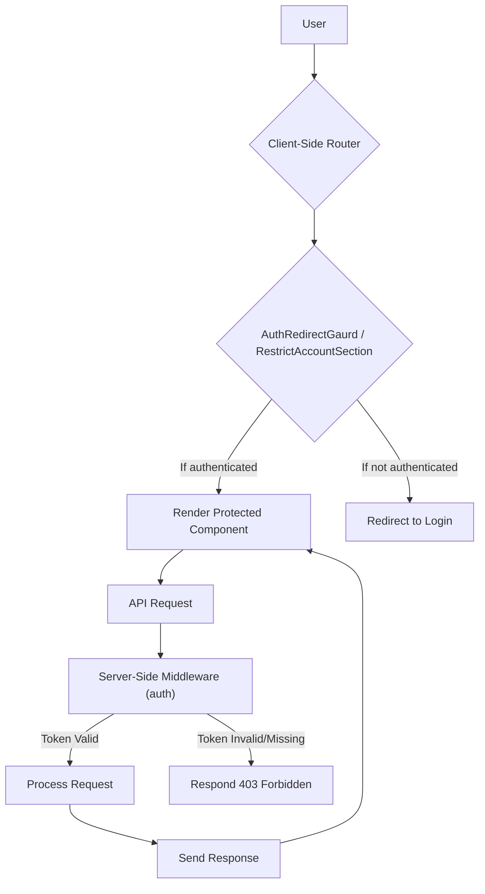

# Authorization Guards

Authorization guards are crucial for securing specific routes and functionalities within your application, ensuring that only authenticated and authorized users can access sensitive information or perform protected actions. This section outlines the implementation of these guards on both the client and server sides of your application.

## Client-Side Guards

On the client-side, React components are used to conditionally render content or redirect users based on their authentication status.

### `AuthRedirectGaurd`

The `AuthRedirectGaurd` component is designed to protect routes that should only be accessible to unauthenticated users, such as the login or registration pages. If a user is already authenticated (i.e., possesses a token), they will be redirected to the home page.

```jsx
import { Navigate } from "react-router-dom";
import { useAuth } from "../../hooks/useAuth";
import PropTypes from "prop-types";
import Loader from "../../components/ui/loader/Loader";

const AuthRedirectGaurd = ({ children }) => {
  const { token, mutateTokenPending } = useAuth();

  if (mutateTokenPending) {
    return (
      <div className="redirect">
        <Loader />
      </div>
    );
  }

  if (token) {
    return <Navigate to="/" replace />;
  }

  return children;
};

AuthRedirectGaurd.propTypes = {
  children: PropTypes.node.isRequired,
};

export default AuthRedirectGaurd;
```

### `RestrictAccountSection`

The `RestrictAccountSection` component is more versatile. It can be used to protect various sections of the application, particularly those related to account management. It checks for the presence of an authentication token and redirects the user to a specified login page if they are not authenticated. It also supports displaying skeleton loaders for a better user experience while authentication state is being determined.

```jsx
import { Navigate } from "react-router-dom";
import { useAuth } from "../../hooks/useAuth";
import PropTypes from "prop-types";
import AccountSettingSkeleton from "../../utils/skeletons/accountSettingSkeleton/AccountSettingSkeleton";
import ChangePasswordSkeleton from "../../utils/skeletons/changePassword/ChangePasswordSkeleton";
import AccountSkeleton from "../../utils/skeletons/account/AccountSkeleton";

const RestrictAccountSection = ({
  children,
  to = "/login",
  type = "account",
}) => {
  const auth = useAuth();

  const skeleton = {
    account: <AccountSkeleton />,
    accountSetting: <AccountSettingSkeleton />,
    changePassword: <ChangePasswordSkeleton />,
  };

  const getSkeleton = (type) => {
    return skeleton[type];
  };

  if (auth.mutateTokenPending) {
    return getSkeleton(type);
  }

  if (!auth.token) {
    return <Navigate to={to} replace />;
  }

  return children;
};

RestrictAccountSection.propTypes = {
  children: PropTypes.node.isRequired,
  to: PropTypes.string,
  type: PropTypes.oneOf(["account", "accountSetting", "changePassword"]),
};

export default RestrictAccountSection;
```

## Server-Side Middleware

On the server, middleware functions are used to intercept incoming requests and verify the authenticity of the user based on the provided token.

### `auth` Middleware

The `auth` middleware in `server/middleware/authorization.js` is responsible for authenticating requests. It checks for a `Bearer` token in the `Authorization` header, verifies its validity using JWT, and attaches user information (userId, email) to the request object if successful. If the token is missing or invalid, it returns a `403 Forbidden` response.

```javascript
import jwt from "jsonwebtoken";

export const auth = (req, res, next) => {
  const authHeader = req.headers.authorization;
  if (!authHeader || !authHeader.startsWith("Bearer ")) {
    return res.json({ statusCode: 403, message: "Forbidden" });
  }

  const accessToken = authHeader.split(" ")[1];
  if (!accessToken) {
    return res.json({ statusCode: 403, message: "Forbidden" });
  }

  try {
    const payload = jwt.verify(accessToken, process.env.JWT_ACCESS_SECRET);
    req.user = {
      userId: payload.userId,
      email: payload.email,
    };
    next();
  } catch (error) {
    return res.json({ statusCode: 403, message: "Forbidden" });
  }
};
```

## Request Flow Diagram

The following diagram illustrates the general flow of an authorized request from the client to the server.





## Key Takeaways

*   Client-side guards (`AuthRedirectGaurd`, `RestrictAccountSection`) enhance user experience by handling redirects and loading states.
*   Server-side middleware (`auth`) enforces security by validating authentication tokens on every protected request.
*   A consistent use of JWT for token management ensures secure and efficient authentication.
*   Error handling for invalid or missing tokens is critical on both client and server to prevent unauthorized access.