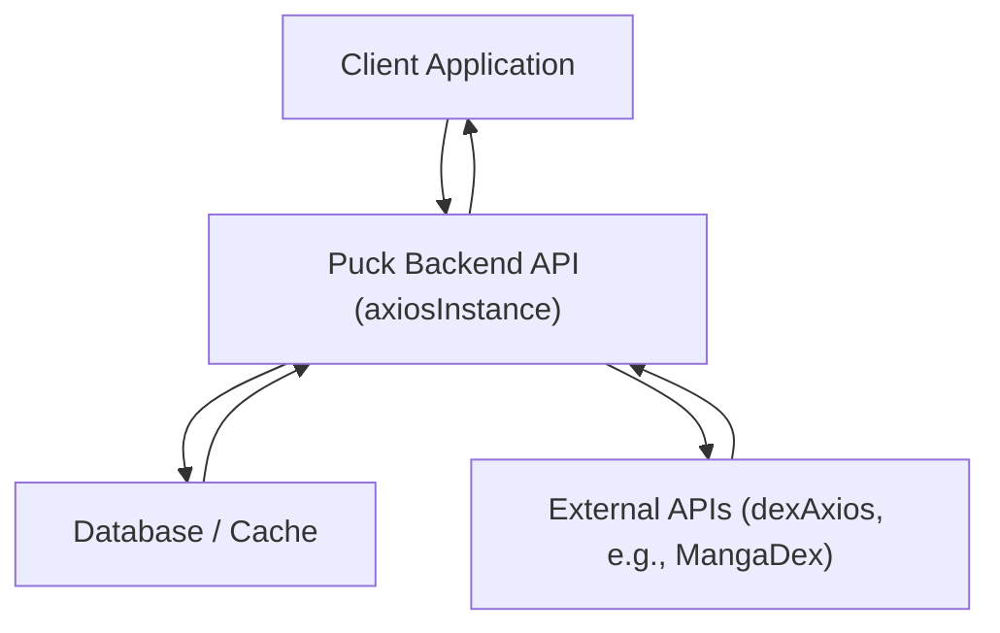

# API Interactions

This section details how the Puck client interacts with backend APIs for data retrieval and manipulation, leveraging both internal and external services.

## Client-Side API Service

The client-side `axiosInstance` is configured to communicate with the backend. It sets the base URL using an environment variable and enables credential passing.

```javascript
// client/src/services/api/axios.js
import axios from "axios";

export const axiosInstance = axios.create({
  baseURL: import.meta.env.VITE_BACKEND_BASE_URL,
  withCredentials: true,
});
```

The `query.js` file encapsulates various API calls for fetching manga-related data. These functions utilize the `axiosInstance` to interact with the Puck backend.

### Manga Data Retrieval

Functions like `fetchRandomManga` and `fetchMangas` are responsible for retrieving lists of manga. `fetchMangas` also includes prefetching logic for manga covers to optimize user experience.

```javascript
// client/src/services/query/query.js
export const fetchRandomManga = async (LIMIT) => {
  const response = await axiosInstance.get(
    `/api/v1/manga/random-manga?limit=${LIMIT}`
  );
  return response;
};

export const fetchMangas = async ({ LIMIT, pageParam = "" }) => {
  const { data } = await axiosInstance.get(
    `/api/v1/manga/mangas?limit=${LIMIT}&cursor=${pageParam}`
  );

  data?.manga.forEach((val) => {
    queryClient.prefetchQuery({
      queryKey: ["manga-cover", { mangaId: val.mangaId }],
      queryFn: () =>
        fetchMangaCover({ mangaId: val.mangaId, volume: "desc", width: 256 }),
    });
  });

  return data;
};
```

### Specific Manga Details

APIs for fetching detailed information such as covers, statistics, authors, and chapters are also provided.

```javascript
// client/src/services/query/query.js
export const fetchMangaCover = ({ mangaId, volume = "asc", width = 512 }) => {
  return axiosInstance.get(
    `/api/v1/manga/cover/${mangaId}?volume=${volume}&width=${width}`
  );
};

export const fetchStatics = ({ mangaId }) => {
  return axiosInstance.get(`/api/v1/manga/statics/${mangaId}`);
};

export const fetchChapter = ({ mangaId, CHUNK_SIZE, offset }) => {
  return axiosInstance.get(
    `/api/v1/manga/chapters/${mangaId}?limit=${CHUNK_SIZE}&offset=${offset}`
  );
};
```

### User-Specific Data and Search

The client also interacts with APIs for managing user favorites and performing searches.

```javascript
// client/src/services/query/query.js
export const fetchFavourites = async ({ LIMIT, pageParam = "" }) => {
  const { data } = await axiosInstance.get(
    `/api/v1/client/all-favourites?limit=${LIMIT}&cursor=${pageParam}`
  );
  return data;
};

export const fetchSearch = ({ query }) => {
  return axiosInstance.get(`/api/v1/manga/search?query=${query}`);
};
```

## External API Interaction (MangaDex)

The `dexAxios` instance is used to communicate with the external MangaDex API. This instance is configured with a specific base URL and includes a custom `User-Agent` header.

```javascript
// server/services/dexAxios.js
import axios from "axios";
const BASE_URL = "https://api.mangadex.org";

export const dexAxios = axios.create({
  baseURL: BASE_URL,
  headers: {
    "User-Agent": "puck/1.0",
  },
});
```

## API Interaction Flow

The following diagram illustrates a typical data flow for fetching manga information from the Puck backend, which may itself utilize external APIs like MangaDex.





## Key Takeaways

- The client uses a dedicated `axiosInstance` for secure and credential-aware communication with the Puck backend.
- The `query.js` module centralizes all client-side API interaction logic, promoting code organization and maintainability.
- External API interactions, specifically with MangaDex, are handled by a separate `dexAxios` instance, clearly differentiating their purposes.
- Pre-fetching strategies are employed to enhance user experience by anticipating data needs.