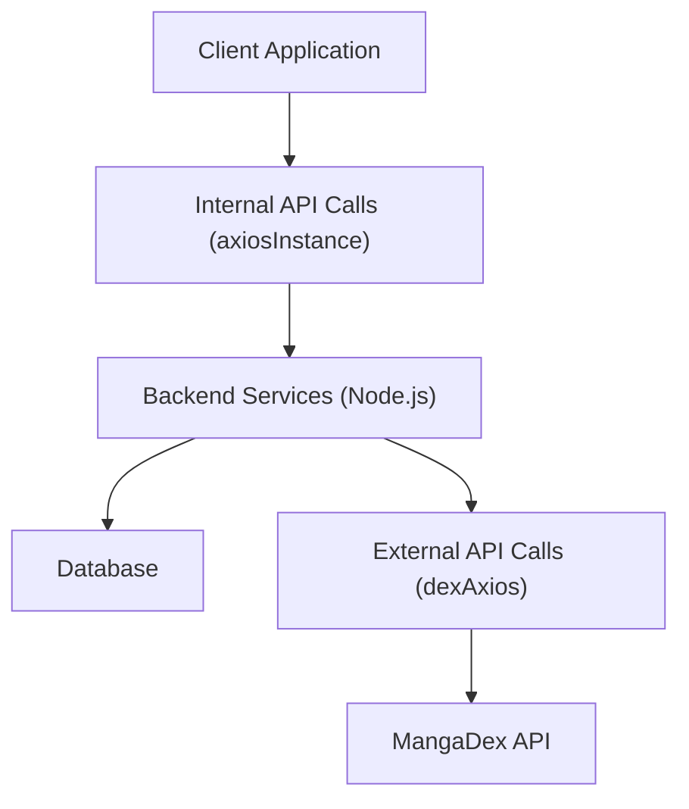

# Data Management and Services

This section details the data fetching, API interaction, and utility functions employed within the `puck` project. It covers how data is retrieved from various sources, processed, and utilized across the application.

## API Client Configuration

The project utilizes `axios` for making HTTP requests. Two primary `axios` instances are configured:

1.  `axiosInstance`: This instance is used for internal API calls, configured with a base URL sourced from environment variables (`VITE_BACKEND_BASE_URL`) and designed to handle credentials (`withCredentials: true`).

    ```javascript
    // client/src/services/api/axios.js
    import axios from "axios";

    export const axiosInstance = axios.create({
      baseURL: import.meta.env.VITE_BACKEND_BASE_URL,
      withCredentials: true,
    });
    ```

2.  `dexAxios`: This instance is specifically for interacting with the external MangaDex API, with a predefined `baseURL` and a custom `User-Agent` header.

    ```javascript
    // server/services/dexAxios.js
    import axios from "axios";
    const BASE_URL = "https://api.mangadex.org";

    export const dexAxios = axios.create({
      baseURL: BASE_URL,
      headers: {
        "User-Agent": "puck/1.0",
      },
    });
    ```

## Data Fetching Services

The `query.js` file encapsulates various functions for fetching manga-related data. These functions leverage the configured `axiosInstance` to interact with the backend API.

### Manga Data

-   `fetchRandomManga(LIMIT)`: Fetches a specified number of random manga.
-   `fetchMangaCover({ mangaId, volume, width })`: Retrieves the cover image for a given manga ID, with optional volume and width parameters.
-   `fetchMangas({ LIMIT, pageParam })`: Fetches paginated lists of manga, including prefetching cover images for improved user experience.

    ```javascript
    // client/src/services/query/query.js
    export const fetchMangas = async ({ LIMIT, pageParam = "" }) => {
      const { data } = await axiosInstance.get(
        `/api/v1/manga/mangas?limit=${LIMIT}&cursor=${pageParam}`
      );

      data?.manga.forEach((val) => {
        queryClient.prefetchQuery({
          queryKey: ["manga-cover", { mangaId: val.mangaId }],
          queryFn: () =>
            fetchMangaCover({ mangaId: val.mangaId, volume: "desc", width: 256 }),
        });
      });

      return data;
    };
    ```

-   `fetchStatics({ mangaId })`: Fetches statistical data for a specific manga.
-   `fetchAuthor({ authorId })`: Retrieves information about a manga author.
-   `fetchChapter({ mangaId, CHUNK_SIZE, offset })`: Fetches chapters for a manga, with support for chunking and offset.
-   `fetchChapterImage({ chapterId, quality })`: Retrieves a specific chapter image with a defined quality.

### User Specific Data

-   `fetchFavourites({ LIMIT, pageParam })`: Fetches a paginated list of the user's favorite manga.
-   `fetchFavourite({ mangaId })`: Checks if a specific manga is in the user's favorites.

### Search Functionality

-   `fetchSearch({ query })`: Performs a search query for manga.

## Error Handling Utility

The `hasErrors` function provides a simple mechanism to check if an `errors` object contains any entries, indicating the presence of errors.

```javascript
// client/src/helper/hasErrors.js
export const hasErrors = (errors) => {
  return Object.values(errors).length > 0;
};
```

## Architecture Overview

This diagram illustrates the general flow of data requests initiated from the client and their subsequent handling by the backend services and external APIs.





## Key Takeaways

*   `axios` is the primary HTTP client, with specialized instances for internal and external API interactions.
*   Data fetching is centralized in `query.js`, promoting code reusability and maintainability.
*   Prefetching strategies are employed to enhance user experience by loading related data asynchronously.
*   A dedicated utility function (`hasErrors`) simplifies error state management.