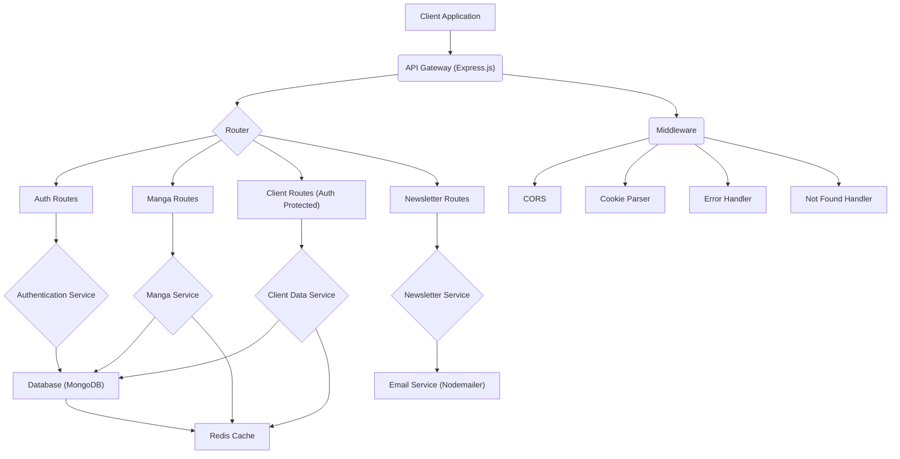

# Server-Side Implementation

This section details the backend architecture of the `puck` application, covering its core components, database integration, and error handling mechanisms.

## Backend Architecture

The server-side of `puck` is built using Node.js with the Express framework. It is designed to be scalable and maintainable, with clear separation of concerns between models, controllers, and services.

### Core Components

*   **Express.js**: The primary web application framework for building the API.
*   **dotenv**: Manages environment variables for configuration.
*   **cors**: Enables Cross-Origin Resource Sharing, allowing frontend applications to interact with the API.
*   **cookie-parser**: Parses incoming cookies from client requests.
*   **express-async-errors**: Simplifies asynchronous error handling in Express routes.
*   **http-status-codes**: Provides standardized HTTP status codes for API responses.
*   **node-cron**: Schedules recurring tasks, such as sending weekly newsletters.

```javascript
// server/app.js
import dotenv from "dotenv";
dotenv.config();

import express from "express";
const app = express();

import "express-async-errors";
import { errorHandlerMiddleware } from "./middleware/errorHandlerMiddleware.js";
import { notFound } from "./middleware/notFound.js";
import { connectDB } from "./connectDB/connectDB.js";
import { auth } from "./middleware/authorization.js";
import { redisClient } from "./config/redisClient.js";
import { sendNewsLetter } from "./services/newsletter.js";
import { StatusCodes } from "http-status-codes";
import cors from "cors";
import nodeCron from "node-cron";
import cookieParser from "cookie-parser";
// routers
import authRouter from "./router/auth.js";
import mangaRouter from "./router/manga.js";
import clientRouter from "./router/client.js";
import newsletterRouter from "./router/newsletter.js";

app.set("trust proxy", 1);
app.use(
  cors({
    origin: process.env.CLIENT_APP_URL,
    credentials: true,
  })
);
app.use(express.json());
app.use(cookieParser());

// ... (routes and middleware)

const PORT = process.env.PORT || 3000;

(async () => {
  try {
    await connectDB(process.env.MONGO_URI);
    await redisClient.connect();
    app.listen(PORT, () => {
      console.log(`Server listening to PORT ${PORT} ...`);
    });
  } catch (error) {
    console.log(error);
  }
})();
```

### Database Integration

The application utilizes MongoDB for data persistence, with Mongoose as the Object Data Modeling (ODM) library.

```javascript
// server/connectDB/connectDB.js
import mongoose from "mongoose";

export const connectDB = (url) => {
  return mongoose.connect(url);
};
```

### Middleware

Several middleware functions are employed to enhance the API's functionality and robustness:

*   **`errorHandlerMiddleware`**: A centralized error handler that standardizes error responses, categorizing different types of errors (validation, database, JWT, etc.) and returning appropriate status codes and messages.
*   **`notFound`**: Handles requests to routes that do not exist.
*   **`auth`**: Protects specific routes by verifying user authentication.

```javascript
// server/middleware/errorHandlerMiddleware.js
import { StatusCodes } from "http-status-codes";

export const errorHandlerMiddleware = (err, req, res, next) => {
  let errObj = {
    type: null,
    message: err.message || "Something Went Wrong, Please try Again later",
    statusCode: err.statusCode || StatusCodes.INTERNAL_SERVER_ERROR,
  };

  // validation errors
  if (err.name === "ValidationError") {
    errObj.type = "password";
    errObj.message = Object.values(err.errors)
      .map((errorObj) => {
        return errorObj.properties.type === "minlength"
          ? `Password must be greater than ${
              errorObj.properties.minlength - 1
            } characters.`
          : errorObj.message;
      })
      .join(", ");
    errObj.statusCode = StatusCodes.BAD_REQUEST;
  }

  if (err.code && err.code === 11000) {
    if (err.errorResponse.errmsg.includes("username")) {
      errObj.type = "username";
      errObj.message = "username already exists.";
    } else {
      errObj.type = "email";
      errObj.message = "email already exists.";
    }
    errObj.statusCode = StatusCodes.BAD_REQUEST;
  }

  // JWT errors
  if (err.name === "TokenExpiredError") {
    errObj.type = "jwt";
    errObj.message = "Link has been expired.";
    errObj.statusCode = StatusCodes.INTERNAL_SERVER_ERROR;
  }

  if (err.name === "JsonWebTokenError") {
    errObj.type = "jwt";
    errObj.message = "Invalid Verification Token";
    errObj.statusCode = StatusCodes.INTERNAL_SERVER_ERROR;
  }

  // mangadex api error
  if (err.response && err.response.status && err.response.statusText) {
    errObj.type = "dex-api-error";
    errObj.message = err.response.statusText;
    errObj.statusCode = err.response.status;
  }

  res
    .status(errObj.statusCode)
    .json({ message: errObj.message, type: errObj.type });
};
```

## Project Structure and Dependencies

The `package.json` file outlines the project's dependencies and development scripts. Key production dependencies include `express`, `mongoose`, `cors`, `dotenv`, `http-status-codes`, `jsonwebtoken`, and `nodemailer`. Development dependencies include `nodemon` for local development.

```json
// server/package.json
{
  "name": "server",
  "version": "1.0.0",
  "main": "app.js",
  "type": "module",
  "scripts": {
    "start": "nodemon app.js"
  },
  "keywords": [],
  "author": "",
  "license": "ISC",
  "description": "",
  "dependencies": {
    "axios": "^1.7.7",
    "bcryptjs": "^2.4.3",
    "cookie-parser": "^1.4.7",
    "cors": "^2.8.5",
    "dotenv": "^16.4.5",
    "express": "^4.21.1",
    "express-async-errors": "^3.1.1",
    "express-rate-limit": "^7.4.1",
    "google-auth-library": "^9.14.2",
    "http-status-codes": "^2.3.0",
    "jsonwebtoken": "^9.0.2",
    "mongoose": "^8.6.1",
    "node-cron": "^3.0.3",
    "nodemailer": "^8.0.4",
    "redis": "^4.7.0"
  },
  "overrides": {
    "gcp-metadata": "6.1.1"
  },
  "devDependencies": {
    "@types/bcryptjs": "^2.4.6",
    "@types/cookie-parser": "^1.4.7",
    "@types/cors": "^2.8.17",
    "@types/express": "^4.17.21",
    "@types/jsonwebtoken": "^9.0.7",
    "@types/nodemailer": "^6.4.16",
    "nodemon": "^3.1.14"
  }
}
```

## Scheduled Tasks

The server utilizes `node-cron` to schedule a weekly newsletter dispatch. This task is configured to run every Saturday at midnight.

```javascript
// server/app.js (snippet for node-cron)
nodeCron.schedule("0 0 * * 6", () => {
  console.log("Sending weekly newsletter...");
  sendNewsLetter();
});
```

## Architectural Diagram





## Key Takeaways

*   The server is built with Express.js, leveraging common Node.js patterns for API development.
*   Robust error handling is implemented through a dedicated middleware, providing consistent and informative error responses.
*   Database operations are managed by Mongoose, interacting with a MongoDB instance.
*   Scheduled tasks, like newsletter dispatch, are handled efficiently using `node-cron`.
*   Security is enhanced with authentication middleware and CORS configuration.