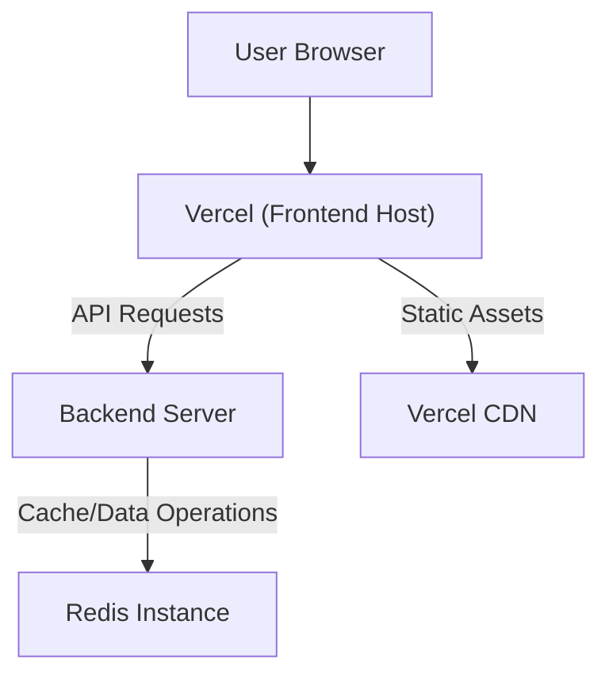

# Deployment and Configuration

This section details the deployment strategies, environment configuration, and build processes for the puck application, focusing on client-side rendering and server-side connectivity.

## Frontend Deployment (Vercel)

The frontend application is configured for deployment on Vercel. The `vercel.json` file ensures that all incoming requests to the root path are correctly routed to the `index.html` file, enabling client-side routing for single-page applications.

```json
{
  "rewrites": [{ "source": "/(.*)", "destination": "/index.html" }]
}
```

The build process for the frontend is managed by Vite, a fast and modern frontend build tool. The `vite.config.js` file configures Vite to use the React plugin for seamless React development and building.

```javascript
import { defineConfig } from "vite";
import react from "@vitejs/plugin-react";

// https://vitejs.dev/config/
export default defineConfig({
  plugins: [react()],
});
```

## Backend Configuration (Redis)

The backend service relies on Redis for caching and potentially session management. The `redisClient.js` module exports a configured Redis client instance.

### Environment Variables

The Redis client is configured using environment variables for host, port, username, and password. This allows for flexible deployment across different environments without hardcoding sensitive credentials.

- `REDIS_USER`: Username for Redis authentication.
- `REDIS_PASS`: Password for Redis authentication.
- `REDIS_HOST`: Hostname or IP address of the Redis server.
- `REDIS_PORT`: Port number of the Redis server.

```javascript
import { createClient } from "redis";

export const redisClient = createClient({
  username: process.env.REDIS_USER,
  password: process.env.REDIS_PASS,
  socket: {
    host: process.env.REDIS_HOST,
    port: process.env.REDIS_PORT,
    reconnectStrategy: function (retries) {
      if (retries > 20) {
        console.log(
          "Too many attempts to reconnect. Redis connection was terminated!"
        );
        return new Error("Too many retries.");
      } else {
        return retries * 500;
      }
    },
  },
});
```

### Redis Client Error Handling

The Redis client includes basic error handling to log connection errors. A reconnection strategy is implemented to attempt reconnection up to 20 times with an increasing delay.

```javascript
redisClient.on("error", (error) => {
  console.log("Redis Client error:", error);
});
```

## Deployment Architecture

A typical deployment might involve Vercel hosting the frontend and a separate server (e.g., Node.js) running the backend, which connects to a Redis instance.





## Key Takeaways

- Frontend routing is handled by Vercel's rewrite rules, pointing all paths to `index.html`.
- Vite is used as the build tool for the React-based frontend.
- Redis connection details are managed via environment variables for security and flexibility.
- A reconnection strategy is in place for the Redis client to handle temporary network issues.