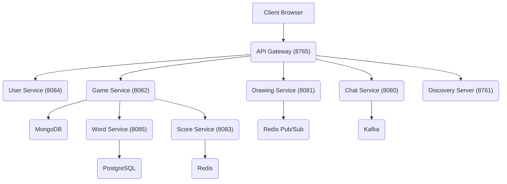
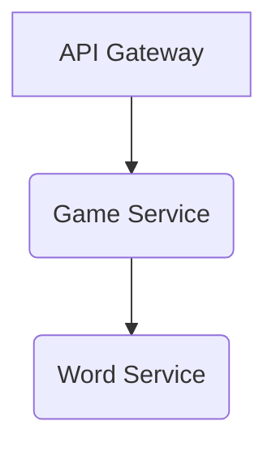

# Project Overview

Doodle-Sync is a real-time multiplayer drawing and guessing game meticulously engineered using a microservices architecture. It leverages modern technologies such as Java 21, Spring Boot 3.5, React 19, Kafka, Redis, and WebSockets to deliver a seamless and engaging gaming experience.

The project aims to provide a robust platform where players can join rooms, draw, and guess words in real-time, fostering a fun and interactive environment. The system is designed for scalability and resilience, with each core function handled by a dedicated microservice.

## Core Functionalities

Doodle-Sync offers a rich set of features, including:

*   **Real-time Drawing:** Players can draw on a shared canvas, with their strokes being broadcasted to other participants instantaneously.
*   **Guessing Game:** One player draws a word while others try to guess it. The game provides hints progressively to aid the guessers.
*   **Multiplayer Rooms:** Players can create or join game rooms, facilitating group play.
*   **Scoring System:** A dynamic scoring mechanism rewards players for guessing quickly, with points decaying over time.
*   **Chat Functionality:** An integrated chat allows players to communicate within the game room.
*   **User Authentication:** Secure user registration and login are handled, with WebSocket connections authenticated using a ticket-based system.
*   **Observability:** Comprehensive monitoring tools like Prometheus, Grafana, and Zipkin are integrated for insights into system performance and health.
*   **Load Testing:** The system's WebSocket throughput is validated through rigorous load testing using k6.

The architecture is built with a focus on efficient data handling and low latency, especially for real-time interactions like drawing.

## Technical Architecture

Doodle-Sync is composed of several microservices, each responsible for a specific aspect of the game's functionality. This modular approach enhances maintainability, scalability, and fault isolation.

### Services at a Glance

| Service          | Port | Responsibility                                                     | Data Store        |
|------------------|------|--------------------------------------------------------------------|-------------------|
| API Gateway      | 8765 | JWT auth, rate limiting, CORS, routing                             | Redis (tokens)    |
| User Service     | 8084 | Registration, login, JWT signing, WS ticket issuance               | PostgreSQL, Redis |
| Game Service     | 8082 | State machine, round timer                                         | MongoDB, Redis    |
| Drawing Service  | 8081 | Stroke ingestion via WebSocket, canvas replay, Redis Pub/Sub fan-out | Redis             |
| Chat Service     | 8080 | Guess validation, "close guess" detection                          | Redis, Kafka      |
| Word Service     | 8085 | Word bank, progressive hints                                       | PostgreSQL, Kafka |
| Score Service    | 8083 | Time-decay scoring, Redis sorted set leaderboard                   | PostgreSQL, Redis |
| Discovery Server | 8761 | Eureka service registry                                            | —                 |

A high-level overview of the system architecture can be visualized as follows:





## How It Works: Drawing Pipeline

The drawing pipeline is optimized for sub-millisecond latency, ensuring a fluid experience for participants.


```mermaid
graph TD
    A[Drawer's browser] -- WebSocket (STOMP + ticket auth) --> B(Drawing Service);
    B -- /app/room.{code}.stroke --> B;
    B --> C{Redis LIST (RPUSH canvas:{code})};
    B --> D{Redis Pub/Sub (draw:{code})};
    D -- StrokeBroadcastListener (pattern: draw:*) --> E{/topic/room.{code}.canvas};
    E --> F[Subscribed Guessers];
    C -- stroke persisted for late-join replay --> B;
```


Strokes are sent via WebSocket to the `Drawing Service`. They are immediately persisted to a Redis LIST for canvas replay purposes and simultaneously published to a Redis Pub/Sub channel. This Pub/Sub mechanism, rather than Kafka, is chosen for its in-memory, fire-and-forget nature, providing sub-millisecond latency ideal for ephemeral drawing data. Kafka is reserved for events requiring durability, such as game state transitions and chat events.

## How It Works: Guess Validation

When a guesser types a word, the process flows through the `Chat Service`.


```mermaid
graph TD
    A[Guesser types a word] -- WebSocket (STOMP) --> B(Chat Service);
    B -- /app/room.{code}.guess --> B;
    B --> C{Reads answer from Redis (word:{code})};
    B --> D{Checks if player already guessed (correct:{code}:{userId})};
    D -- CORRECT --> E{Broadcast "🎉 Player guessed it!"};
    D -- CLOSE --> F{Broadcast "so close!" (Levenshtein distance ≤ 1)};
    D -- WRONG --> G{Broadcast as regular chat message};
    E --> H{Publish to Kafka (chat-events)};
    H --> I(Score Service);
```


The `Chat Service` retrieves the correct word from Redis and checks if the player has already guessed. Based on the validation result (correct, close, or wrong), appropriate messages are broadcasted. Correct guesses are also published to the `chat-events` Kafka topic, which the `Score Service` consumes to award points.

The `Score Service` calculates points based on time decay (100 points minus seconds elapsed, with a minimum of 10 points) and updates a Redis sorted set for instant leaderboard retrieval.

## Resilience and Event Handling

Resilience is a key aspect of Doodle-Sync's design. For instance, the `Game Service` uses OpenFeign with Resilience4j to fetch words from the `Word Service`. This setup includes a circuit breaker, time limiter, and retry mechanism.

```
@CircuitBreaker → @TimeLimiter (2s) → @Retry (3 attempts)
```

If the `Word Service` becomes unavailable, a fallback word pool is utilized, ensuring the game continues uninterrupted. The circuit breaker automatically recovers by testing calls once the `Word Service` is back online.

Events are managed through distinct channels:

| Channel       | Type        | Producer → Consumer(s)                             | Purpose                                                              |
|---------------|-------------|----------------------------------------------------|----------------------------------------------------------------------|
| `game-events` | Kafka       | Game Service → Chat, Drawing, Score, Word          | Durable state transitions (ROUND\_STARTED, DRAWING\_STARTED, etc.) |
| `chat-events` | Kafka       | Chat Service → Score Service                       | Durable correct guess events for scoring                             |
| `draw:{roomCode}` | Redis Pub/Sub | Drawing Service → Drawing Service                  | Ephemeral stroke fan-out (sub-ms latency)                            |

## WebSocket Authentication

To address the inability of browsers to send `Authorization` headers during WebSocket upgrades, Doodle-Sync employs a ticket-based authentication system.

1.  The client requests a WebSocket ticket from the `User Service` via a POST request (requiring a valid JWT).
2.  The `User Service` generates a unique UUID ticket, stores it in Redis with a short Time-To-Live (TTL) of 30 seconds, and returns it to the client.
3.  The client initiates the WebSocket connection using the generated ticket in the URL: `ws://host/ws/websocket?ticket={uuid}`.
4.  A `HandshakeInterceptor` in the `Drawing Service` or `Chat Service` validates the ticket, consumes it (deleting it from Redis), and establishes the connection with the authenticated `userId` in the session.

This one-time-use ticket mechanism significantly enhances security by preventing replay attacks.

## Quick Start

To get Doodle-Sync up and running locally, follow these steps:

### Prerequisites

*   Docker and Docker Compose
*   Node.js 18+ (for frontend development server)

### Running with Docker Compose

1.  Clone the repository:
    ```bash
    git clone https://github.com/santrupt29/Doodle-Sync.git
    cd Doodle-Sync
    ```
2.  Start all services using Docker Compose:
    ```bash
    docker compose up --build
    ```
    *Note: The initial build may take 5-8 minutes due to Maven dependencies and Docker image creations. Services are configured to start in dependency order using health checks.*

3.  Once all services are healthy, navigate to the client directory and start the development server:
    ```bash
    cd client
    npm install
    npm run dev
    ```

### Accessing Services

| Service          | URL             | Credentials (Grafana) |
|------------------|-----------------|-----------------------|
| Frontend         | http://localhost:5173 | —                     |
| API Gateway      | http://localhost:8765 | —                     |
| Eureka Dashboard | http://localhost:8761 | —                     |
| Grafana          | http://localhost:3001 | admin / scribble      |
| Zipkin           | http://localhost:9411 | —                     |
| Prometheus       | http://localhost:9090 | —                     |

### Environment Variables

Ensure you have a `.env` file in the project root. A default is provided, but you may need to customize it:

```bash
DB_PASSWORD=password
JWT_SECRET=dev-secret-key-change-in-production-256bit
```

## Observability

Doodle-Sync integrates comprehensive observability tools to monitor system health and performance:

*   **Zipkin:** Collects and visualizes distributed traces across all microservices, providing insights into request lifecycles.
*   **Prometheus:** Scrapes metrics (e.g., request rate, latency, error rates, JVM heap usage) from each service every 15 seconds via the `/actuator/prometheus` endpoint.
*   **Grafana:** Offers pre-provisioned dashboards to visualize metrics from Prometheus, including request rates, P99 latency, 5xx error rates, JVM heap usage, and circuit breaker states.

A typical distributed trace in Zipkin showcases a user action spanning multiple services:





The Grafana dashboard provides key performance indicators:

*   Request rates and P99 latency per service.
*   5xx error rates and JVM heap usage.
*   Circuit breaker status for critical services like the Word Service.

## Load Testing

The WebSocket stroke throughput has been validated using k6. The test simulates 8 concurrent WebSocket connections, each sending 10 strokes per second for 60 seconds.

The results indicate:

*   **Stroke Latency:** p(99) of 1ms, with an average of 0.2ms.
*   **WebSocket Connections:** 16 active sessions (8 VUs × 2 connections), with minimal connection errors.
*   **Throughput:** Approximately 80 strokes per second were successfully sent.

You can run the load test yourself using:

```bash
k6 run load-tests/stroke-load-test.js 2>&1 | tee docs/k6-results.txt
```

## Project Structure

The project is organized into distinct modules, each containing the code for a specific microservice or component:

```
Doodle-Sync/
├── api-gateway/             Spring Cloud Gateway + JWT filter + rate limiter
├── discovery-server/        Eureka service registry
├── user-service/            Auth (register/login) + JWT + WS tickets + PostgreSQL + Redis
├── game-service/            Game state machine + round timer + MongoDB
├── drawing-service/         WebSocket strokes + Redis Pub/Sub fan-out + ticket auth
├── chat-service/            WebSocket guesses + Levenshtein validator + ticket auth
├── word-service/            Word bank + progressive hints
├── score-service/           Time-decay scoring + Redis leaderboard
├── client/                  React 19 + Vite + STOMP WebSocket
├── monitoring/
│   ├── prometheus.yml
│   └── grafana/provisioning/
│       ├── datasources/     Prometheus datasource (auto-provisioned)
│       └── dashboards/      Dashboard JSON + provisioner
├── load-tests/              k6 WebSocket stroke load test
├── postgres-init/           init.sql (3 databases, roles, grants)
├── docs/                    Architecture diagrams, screenshots, results
└── docker-compose.yml       15 containers, healthcheck chains
```

## Key Design Decisions

| Decision                      | Rationale                                                                                                                                         |
|-------------------------------|---------------------------------------------------------------------------------------------------------------------------------------------------|
| **Ticket-based WS Auth**      | Circumvents browser limitations on sending JWTs during WebSocket upgrade. A short-lived Redis ticket acts as a secure proxy, consumed on handshake. |
| **Redis Pub/Sub for Strokes** | Optimal for ephemeral drawing data due to in-memory, fire-and-forget nature and sub-millisecond latency. Kafka's durability is unnecessary here.        |
| **Kafka for Game/Chat Events**| Ensures at-least-once delivery guarantees for crucial state transitions and scoring events, where data durability is essential.                      |
| **Redis for Ephemeral State** | Efficiently manages transient data like canvas strokes, current words, guess deduplication, WS tickets, and leaderboards, utilizing TTL for expiration. |
| **MongoDB for Game Sessions** | Provides schema flexibility for dynamic elements like player lists, nested game states, and room configurations.                                  |
| **PostgreSQL for Structured Data**| Enforces relational integrity for user accounts, word lists, and score records, managed via Flyway database migrations.                           |
| **Levenshtein Distance**      | Accurately identifies "close" guesses by allowing for single-letter typos, improving the player experience in a fast-paced game.                 |
| **Time-Decay Scoring**        | Incentivizes quick guesses with points that decrease over time (100 − seconds elapsed), ensuring a competitive scoring dynamic with a minimum floor.  |
| **Fallback Word Pool**        | Guarantees game continuity by providing a hardcoded word list if the `word-service` becomes unavailable, preventing game interruptions.              |