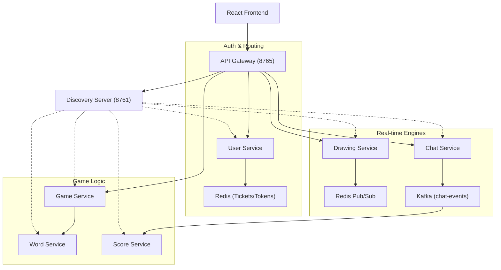

# System Overview

Doodle-Sync is a distributed, real-time multiplayer drawing and guessing game. The system is engineered as a suite of microservices to ensure high availability, low-latency data synchronization, and independent scalability of the drawing and chat pipelines.

## High-Level Architecture

The application follows a decoupled microservices pattern where a centralized **API Gateway** acts as the single entry point for the React frontend, and a **Discovery Server** manages the dynamic network locations of the backend services.

## Core Component Interaction

### 1. Request Orchestration (Gateway & Discovery)
The **API Gateway** handles cross-cutting concerns including JWT validation, rate limiting (100 req/min), and CORS. It does not maintain a static list of service IPs; instead, it queries the **Discovery Server (Eureka)** to route requests to available instances of the downstream services.

### 2. The WebSocket Lifecycle
Because standard WebSocket handshakes cannot include custom HTTP headers (like `Authorization: Bearer <token>`), Doodle-Sync implements a **Ticket-based Authentication** flow:
1. The client requests a short-lived (30s) UUID ticket from the **User Service** via a secure JWT-authenticated REST call.
2. The ticket is stored in **Redis**.
3. The client initiates the WebSocket connection, passing the ticket as a query parameter.
4. The **Drawing** or **Chat Service** validates the ticket against Redis and upgrades the connection to a STOMP session.

### 3. Real-time Drawing Pipeline
To achieve sub-millisecond latency for stroke synchronization, the system bypasses heavy message brokers for drawing data:
* **Ingestion:** The Drawer sends stroke coordinates to the `Drawing Service`.
* **Persistence:** Strokes are pushed to a **Redis List** for late-joining players to replay the canvas.
* **Fan-out:** The `Drawing Service` publishes the stroke to **Redis Pub/Sub**, which immediately broadcasts the data to all guessers in the room via WebSocket topics.

### 4. Guess Validation & Scoring Flow
While drawing is ephemeral, game state and scoring are durable:
* **Validation:** The **Chat Service** intercepts guesses, utilizing the **Levenshtein distance** algorithm to detect "close" guesses (typos) and validating them against the current word stored in Redis.
* **Event Streaming:** When a correct guess is identified, the Chat Service publishes a `correct-guess` event to a **Kafka** topic.
* **Asynchronous Scoring:** The **Score Service** consumes these Kafka events to calculate time-decayed points (higher points for faster guesses) and updates a **Redis Sorted Set** for real-time leaderboard rankings.

## Communication Matrix

| Interaction | Protocol | Pattern | Use Case |
| :--- | :--- | :--- | :--- |
| **Client $\rightarrow$ Gateway** | HTTPS / WS | Request-Response / Full-Duplex | User actions, Drawing, Chatting |
| **Gateway $\rightarrow$ Services** | REST | Synchronous | Routing and Auth |
| **Game $\rightarrow$ Word Svc** | OpenFeign | Synchronous (w/ Circuit Breaker) | Fetching game words |
| **Svc $\rightarrow$ Svc** | Kafka | Asynchronous (Event-Driven) | State transitions, Scoring events |
| **Svc $\rightarrow$ Svc** | Redis Pub/Sub | Asynchronous (Fire-and-Forget) | Real-time canvas stroke broadcast |