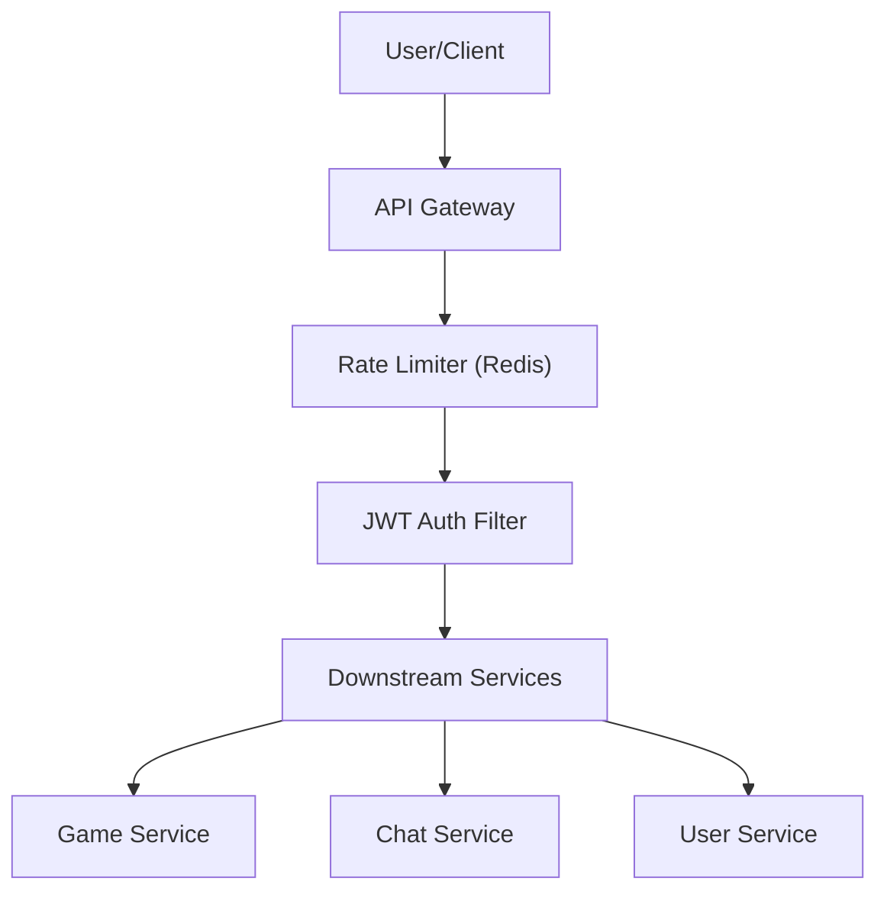

# API Gateway & Security

The API Gateway serves as the single entry point for all client requests in the Doodle-Sync ecosystem. It handles cross-cutting concerns such as request routing, authentication, rate limiting, and CORS policy enforcement, ensuring that downstream microservices remain lean and focused on business logic.

## Request Flow Architecture

The gateway intercepts every incoming request and processes it through a series of filters before routing it to the appropriate service.

## JWT-Based Authentication

Authentication is centralized at the gateway level via the `JwtAuthFilter`. This prevents every individual microservice from needing to implement JWT parsing and validation logic.

### Authentication Logic
The `JwtAuthFilter` implements a `GlobalFilter` with a high priority (`@Order(-1)`) to ensure security checks occur before any other routing logic.

1.  **Whitelisting**: Requests to the following paths bypass authentication:
    *   `/user/auth/register` & `/user/auth/login` (Auth endpoints)
    *   `/actuator/health` (Monitoring)
    *   `/ws` (WebSocket upgrades—authentication for WebSockets is handled via STOMP headers after the handshake).
2.  **Token Validation**: The filter extracts the `Authorization: Bearer <token>` header and verifies the signature using a shared `JWT_SECRET`.
3.  **Header Injection**: Upon successful validation, the gateway extracts the `subject` (User ID) and `username` from the claims and injects them as custom headers:
    *   `X-User-Id`: The unique identifier of the authenticated user.
    *   `X-Username`: The username of the authenticated user.

This mechanism allows downstream services to simply read the `X-User-Id` header to identify the requester without re-validating the JWT.

> **Critical Note:** The `JWT_SECRET` must be identical across the `api-gateway` and `user-service` to ensure tokens signed by the User Service can be verified by the Gateway.

## Rate Limiting

To protect the system from Denial-of-Service (DoS) attacks and brute-force attempts, the gateway implements a distributed rate limiter using **Redis**.

### Configuration
The system utilizes a **Token Bucket algorithm** mapped to the client's IP address:

*   **Key Resolver**: The `ipKeyResolver` identifies clients by their remote host address.
*   **Quota**: Each IP is allocated a bucket of **100 tokens**.
*   **Refill Rate**: Tokens refill at a rate of **100 tokens per minute**.
*   **Response**: If a client exceeds the limit, the gateway returns a `429 Too Many Requests` HTTP status.

## Security Configurations

### CORS Policy
The `SecurityConfig` explicitly defines which origins are permitted to interact with the API to prevent unauthorized cross-origin requests.

| Configuration | Value |
| :--- | :--- |
| **Allowed Origins** | `http://localhost:5173`, `http://localhost:5174`, `http://localhost:3000` |
| **Allowed Methods** | `GET`, `POST`, `PUT`, `DELETE`, `OPTIONS` |
| **Allowed Headers** | `*` (All headers) |
| **Allow Credentials** | `true` |

### General Security
*   **CSRF**: Disabled, as the system relies on stateless JWT authentication rather than session cookies.
*   **Exchange Authorization**: The gateway is configured with `.anyExchange().permitAll()`, as the actual access control is delegated to the `JwtAuthFilter` and individual microservices.