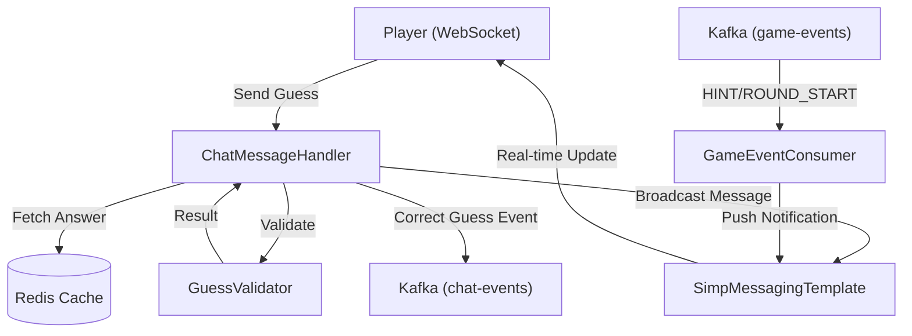

# Chat and Game Logic Service

The **Chat and Game Logic Service** is the real-time engine of Doodle-Sync. It manages the bidirectional communication between players using WebSockets, validates guesses against game state stored in Redis, and synchronizes game events via Kafka to ensure consistent state across distributed services.

## Architecture Overview

The service operates as a reactive hub, processing incoming player guesses and reacting to system-level game events (like new rounds or hints) triggered by the game coordinator.

## Core Components

### 1. ChatMessageHandler
The primary controller for handling real-time interactions. It processes guess attempts and manages the feedback loop for players.

- **Endpoint**: `/app/room.{roomCode}.guess`
- **State Management**: Uses Redis to retrieve the target word (`word:{roomCode}`) and track players who have already guessed correctly (`correct:{roomCode}:{playerId}`) to prevent duplicate scoring.
- **Logic Flow**:
    - **Correct Guess**: Marks the player as successful in Redis, broadcasts a "CORRECT" message to the room, and emits a `CORRECT_GUESS` event to Kafka for the scoring service to process.
    - **Close Guess**: If the guess is nearly correct, it broadcasts the guess to the room as a standard message but sends a **private** "so close!" hint to the specific player.
    - **Wrong Guess**: Broadcasts the guess as a standard chat message.

### 2. GuessValidator
A specialized utility service that implements fuzzy matching to improve user experience during fast-paced gameplay.

- **Normalization**: All inputs are trimmed, converted to lowercase, and stripped of non-alphanumeric characters.
- **Levenshtein Distance**: The validator calculates the edit distance between the guess and the answer. 
    - **Exact Match**: `CORRECT`
    - **Distance $\le 1$**: `CLOSE` (handles common typos like "elefant" vs "elephant").
    - **Distance $> 1$**: `WRONG`

### 3. GameEventConsumer
A Kafka listener that allows the chat service to react to global game state changes without direct coupling to the game management service.

- **Hint Delivery**: Listens for `HINT:` events and pushes the masked word to the room's chat topic.
- **Round Synchronization**: Listens for `ROUND_STARTED:` events to flush the Redis cache of "correct" guessers for that specific room, enabling players to participate in the next round.

## Technical Implementation Details

### Redis Strategy
To maintain low latency, the service utilizes Redis for two primary patterns:
1. **Key-Value Lookup**: Fast retrieval of the current target word for a room.
2. **TTL-based Locking**: Correct guess markers are stored with a 5-minute expiration to prevent memory leaks while ensuring a player cannot score multiple times in one round.

### Resilience and Reliability
Given the criticality of score recording, the service implements the following:
- **Retry Mechanism**: The `@Retry(name = "kafka-consumer")` annotation is applied to Redis write operations. This prevents transient network hiccups or Redis timeouts from silently dropping a player's successful guess.
- **Asynchronous Eventing**: By offloading score updates to Kafka (`chat-events`), the chat service remains responsive even if the scoring database is under heavy load.

## Message Flow Summary

| Event | Trigger | Action | Destination |
| :--- | :--- | :--- | :--- |
| **Guess** | Player Action | Validate $\to$ Broadcast $\to$ (Optional) Kafka Event | `/topic/room.{id}.chat` |
| **Hint** | Kafka `game-events` | Extract hint $\to$ Broadcast | `/topic/room.{id}.chat` |
| **New Round** | Kafka `game-events` | Clear `correct:{id}:*` keys in Redis | Internal Cache |
| **Close Hint** | `GuessValidator` $\to$ `CLOSE` | Private message to guesser | `/topic/room.{id}.hint.{playerId}` |