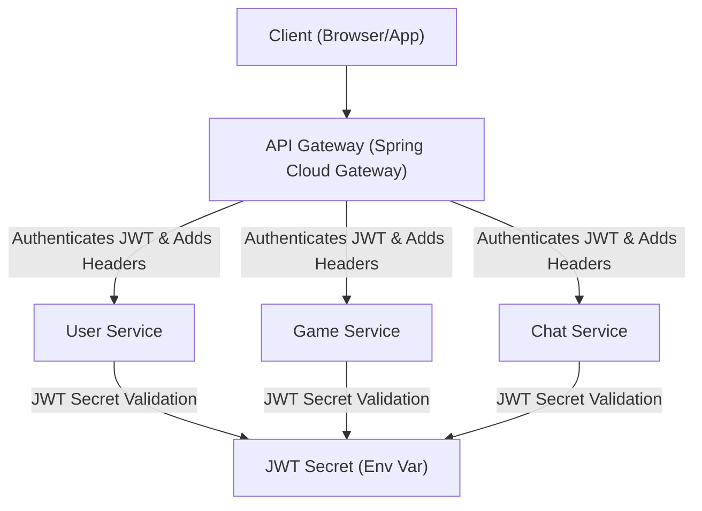

# API Gateway and Security

The API Gateway serves as the central entry point for all client requests, acting as a traffic manager and security enforcer before requests are forwarded to the appropriate microservices. This layer is crucial for maintaining a secure and efficient system.

## Request Handling and Security Configuration

The API Gateway leverages Spring Cloud Gateway and Spring Security to manage incoming requests and implement robust security measures.

### Security Configuration (`SecurityConfig.java`)

The `SecurityConfig` class configures the security aspects of the API Gateway, including Cross-Origin Resource Sharing (CORS) and request authorization.

```java
@Configuration
@EnableWebFluxSecurity
public class SecurityConfig {

    @Bean
    public SecurityWebFilterChain springSecurityFilterChain(ServerHttpSecurity http) {
        http
                .cors(Customizer.withDefaults()) // Enable CORS
                .csrf(csrf -> csrf.disable())     // Disable CSRF protection for APIs
                .authorizeExchange(exchanges -> exchanges
                        .anyExchange().permitAll() // Initially permit all, JWT filter handles specifics
                );
        return http.build();
    }

    @Bean
    public CorsConfigurationSource corsConfigurationSource() {
        CorsConfiguration configuration = new CorsConfiguration();

        configuration.setAllowedOrigins(List.of(
                "http://localhost:5173",
                "http://localhost:5174",
                "http://localhost:3000"
        ));
        configuration.setAllowedMethods(List.of("GET", "POST", "PUT", "DELETE", "OPTIONS"));
        configuration.setAllowedHeaders(List.of("*"));
        configuration.setAllowCredentials(true);

        UrlBasedCorsConfigurationSource source = new UrlBasedCorsConfigurationSource();
        source.registerCorsConfiguration("/**", configuration);
        return source;
    }
}
```

This configuration enables default CORS settings, disables CSRF, and initially allows all requests. Specific access control is then managed by the `JwtAuthFilter`.

### JWT Authentication Filter (`JwtAuthFilter.java`)

The `JwtAuthFilter` is a `GlobalFilter` that intercepts all incoming requests. It is responsible for validating JWTs and adding user information to the request headers before forwarding it to downstream services.

```java
@Component
@Slf4j
@Order(-1) // Ensure this filter runs before other filters
public class JwtAuthFilter implements GlobalFilter {

    @Value("${jwt.secret}")
    private String secret;

    private static final List<String> WHITELIST = List.of(
            "/user/auth/register",
            "/user/auth/login",
            "/actuator/health",
            "/ws"
    );

    @Override
    public Mono<Void> filter(ServerWebExchange exchange, GatewayFilterChain chain) {
        String path = exchange.getRequest().getURI().getPath();

        // Skip authentication for whitelisted paths
        boolean isWhitelisted = WHITELIST.stream().anyMatch(path::startsWith);
        if (isWhitelisted) {
            return chain.filter(exchange);
        }

        // Extract Authorization header
        String authHeader = exchange.getRequest().getHeaders().getFirst("Authorization");

        if (authHeader == null || !authHeader.startsWith("Bearer ")) {
            return reject(exchange, "Missing or invalid Authorization header");
        }

        String token = authHeader.substring(7);

        try {
            // Verify JWT and extract claims
            Claims claims = Jwts.parser()
                    .verifyWith(Keys.hmacShaKeyFor(secret.getBytes()))
                    .build()
                    .parseSignedClaims(token)
                    .getPayload();

            // Forward user info as headers
            ServerHttpRequest mutated = exchange.getRequest()
                    .mutate()
                    .header("X-User-Id", claims.getSubject())
                    .header("X-Username", claims.get("username", String.class))
                    .build();

            return chain.filter(exchange.mutate().request(mutated).build());

        } catch (JwtException e) {
            log.warn("JWT validation failed: {}", e.getMessage());
            return reject(exchange, "Invalid or expired token");
        }
    }

    private Mono<Void> reject(ServerWebExchange exchange, String message) {
        exchange.getResponse().setStatusCode(HttpStatus.UNAUTHORIZED);
        return exchange.getResponse().setComplete();
    }
}
```

The filter checks if the request path is in the `WHITELIST`. If not, it extracts the JWT from the `Authorization` header, validates it using the `jwt.secret`, and if valid, forwards the `X-User-Id` and `X-Username` headers to the downstream service. Invalid or expired tokens result in a 401 Unauthorized response.

## Architecture Overview

The API Gateway acts as a central orchestrator, simplifying the interaction with microservices by handling authentication, request routing, and potentially rate limiting or other cross-cutting concerns.





## Key Takeaways

*   **Centralized Security**: The API Gateway consolidates security logic, particularly JWT validation, preventing each microservice from duplicating this effort.
*   **Decoupling**: Downstream services can rely on `X-User-Id` and `X-Username` headers, decoupling them from the specifics of JWT parsing and validation.
*   **Whitelisting**: Important endpoints like authentication and health checks are explicitly excluded from JWT validation.
*   **CORS Configuration**: The gateway is configured to allow cross-origin requests from specified frontend origins.
*   **JWT Secret Synchronization**: The `jwt.secret` must be identical between the API Gateway and the User Service for token signing and verification to work correctly.