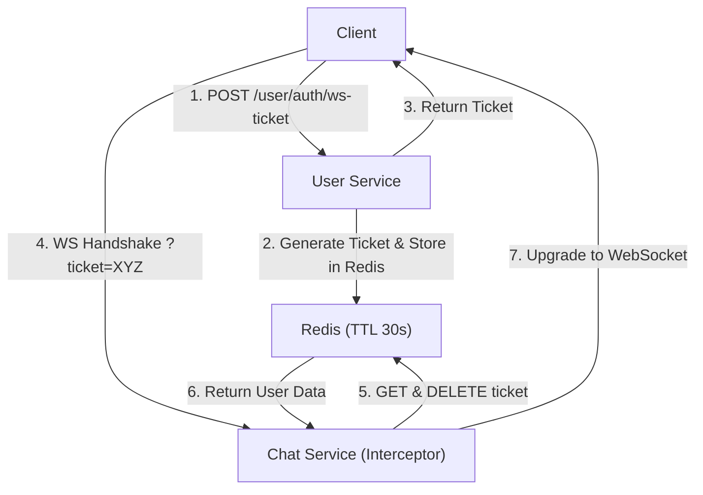

# Real-time Communication

Doodle-Sync employs a high-performance WebSocket architecture using the **STOMP** (Simple Text Oriented Messaging Protocol) over **SockJS** to achieve low-latency drawing synchronization and real-time chat functionality.

## Architecture Overview

The communication layer is designed around a pub/sub model, ensuring that drawing strokes are broadcasted to all participants in a specific room with minimal overhead. To maintain security without the overhead of constant JWT validation on every WebSocket frame, the system implements a **Short-Lived Ticket Authentication** mechanism.

### Authentication Handshake Flow

The system uses a one-time-use ticket pattern to bridge the gap between stateless REST authentication and stateful WebSocket connections.



## Server-Side Implementation

### WebSocket Configuration
The `WebSocketConfig` class defines the messaging infrastructure. It separates application-bound messages (sent to controllers) from broker-bound messages (broadcast to clients).

- **Broker Prefix (`/topic`)**: Used for broadcasting messages to multiple subscribers (e.g., drawing updates).
- **Application Prefix (`/app`)**: Used for messages that require server-side processing before being broadcasted.
- **Endpoint (`/ws-chat`)**: The entry point for the WebSocket connection, protected by the `WsTicketInterceptor`.

### Secure Handshake Interceptor
The `WsTicketInterceptor` implements `HandshakeInterceptor` to validate clients before the connection is upgraded to a WebSocket.

1. **Extraction**: It extracts the `ticket` query parameter from the request URI.
2. **Atomic Validation**: It uses `redisTemplate.opsForValue().getAndDelete(redisKey)`. This ensures the ticket is **one-time-use only**, preventing replay attacks.
3. **Session Hydration**: Upon successful validation, the `userId` and `username` are injected into the WebSocket session attributes, making them available for the duration of the connection.

## Client-Side Integration

The frontend utilizes a custom `useWebSocket` hook to manage the lifecycle of the STOMP client and handle automatic reconnections.

### Connection Lifecycle
The hook leverages the `@stomp/stompjs` library with a critical implementation in the `beforeConnect` lifecycle method:

```javascript
beforeConnect: async () => {
  try {
    const ticket = await fetchWsTicket();
    client.brokerURL = `ws://localhost:8081/ws/websocket?ticket=${ticket}`;
  } catch (e) {
    // Handle authentication failure
  }
}
```

This ensures that whenever the client disconnects (due to network instability or server restarts), it fetches a **fresh ticket** before attempting to reconnect, maintaining the security chain.

### Synchronization Logic
- **Outgoing (Publishing)**: Drawing strokes are sent to `/app/room.{roomCode}.stroke`. The server processes these strokes and forwards them to the broker.
- **Incoming (Subscribing)**: The client subscribes to `/topic/room.{roomCode}.canvas`. When a message arrives, it is parsed as a JSON stroke and passed to the `onStroke` callback to be rendered on the canvas.

## Message Specification

| Direction | Destination | Payload | Purpose |
| :--- | :--- | :--- | :--- |
| Client $\rightarrow$ Server | `/app/room.{id}.stroke` | `{ x, y, prevX, prevY, color, ... }` | Send a new drawing segment |
| Server $\rightarrow$ Client | `/topic/room.{id}.canvas` | `{ x, y, prevX, prevY, color, ... }` | Sync stroke to all peers |