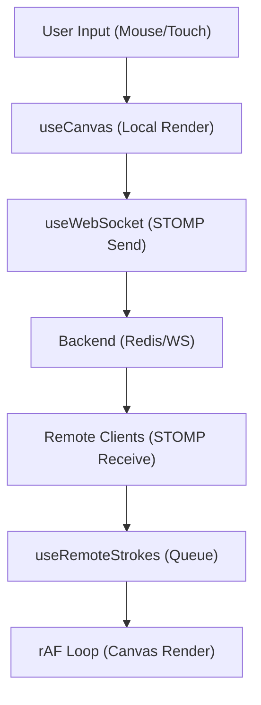

# Canvas and Drawing Engine

The drawing engine in Doodle-Sync is designed for high-performance, real-time collaboration. It employs a "local-first" rendering strategy to ensure zero latency for the artist, while using a buffered queue and animation frames to ensure smooth stroke playback for remote observers.

## Architecture Overview

The engine is split into three primary concerns: state management for the brush, the mathematical translation of mouse coordinates to canvas pixels, and the synchronization layer that handles WebSocket traffic.



## The Drawing Pipeline

### 1. Local Rendering (`useCanvas`)
To prevent the "laggy" feeling common in networked drawing apps, Doodle-Sync performs **Optimistic Rendering**. When a user moves their mouse, the stroke is drawn to the local canvas immediately before the data is even sent to the server.

The `useCanvas` hook manages this via `useRef` to avoid triggering React re-renders on every mouse movement:
- **`startDrawing`**: Captures the initial coordinate and sets the `isDrawing` flag.
- **`continueDrawing`**: Calculates a line segment from the `lastPos` to the `currentPos`.
- **`drawStroke`**: The low-level API that interacts with the HTML5 Canvas 2D Context.

#### Coordinate Scaling
Because the canvas CSS size may differ from its internal resolution (800x600), the engine uses a scaling factor to ensure accuracy across different screen sizes:

```javascript
const scaleX = canvasRef.current.width / rect.width;
const scaleY = canvasRef.current.height / rect.height;
const x = (e.clientX - rect.left) * scaleX;
```

### 2. Brush Tools (`BrushToolbar`)
The `BrushToolbar` provides the state inputs for the drawing engine. It controls three primary variables:
- **Color**: A hex string passed to the `strokeStyle`.
- **Brush Width**: Controls the `lineWidth`.
- **Eraser Mode**: A boolean that, when true, forces the `strokeStyle` to `#FFFFFF` (white), effectively mimicking an eraser on the white background.

### 3. Remote Synchronization (`useRemoteStrokes`)
Handling incoming WebSocket messages can lead to "stuttering" if the canvas is updated every time a packet arrives. To solve this, Doodle-Sync implements a **Frame-Buffered Queue**.

#### The rAF Loop
Instead of rendering immediately upon receipt, incoming strokes are pushed into a `queueRef`. A `requestAnimationFrame` (rAF) loop runs at ~60fps, draining the queue and rendering all pending strokes in a single batch.

```javascript
const flushQueue = useRef(() => {
  const strokes = queueRef.current.splice(0); // Atomic drain
  strokes.forEach(drawStroke);
  rafRef.current = requestAnimationFrame(flushQueue.current);
});
```

**Key Optimization**: To prevent "double-drawing," the `enqueueStroke` function checks the `playerId`. If the incoming stroke belongs to the local user, it is discarded because it has already been rendered optimistically.

## Lifecycle & State Persistence

### Late-Joiner Replay
To ensure players who join mid-round see the current state of the drawing, the `DrawingCanvas` component performs a replay on mount:
1. Calls `GET /draw/room/${roomCode}/replay`.
2. Iterates through the historical stroke array.
3. Passes each stroke to `drawStroke()` to reconstruct the image.

### Round Transitions
When `currentRound` increments, the canvas must be reset. This is a two-step process:
1. **Local Reset**: `ctx.clearRect()` is called to wipe the client-side canvas.
2. **Server Reset**: A `DELETE` request is sent to the backend to clear the stroke history stored in Redis, ensuring the next round starts with a blank slate for all participants.

## Technical Specifications

| Feature | Implementation | Benefit |
| :--- | :--- | :--- |
| **Input Latency** | Optimistic Local Rendering | Instant feedback for the artist |
| **Remote Smoothness** | `requestAnimationFrame` Queue | Prevents UI jank from network jitter |
| **Coordinate System** | Dynamic Rect Scaling | Consistent drawing across screen resolutions |
| **State Tracking** | `useRef` for drawing state | Avoids expensive React component re-renders |
| **Eraser Logic** | Color-override (`#FFFFFF`) | Simplifies the engine to a single "line" primitive |