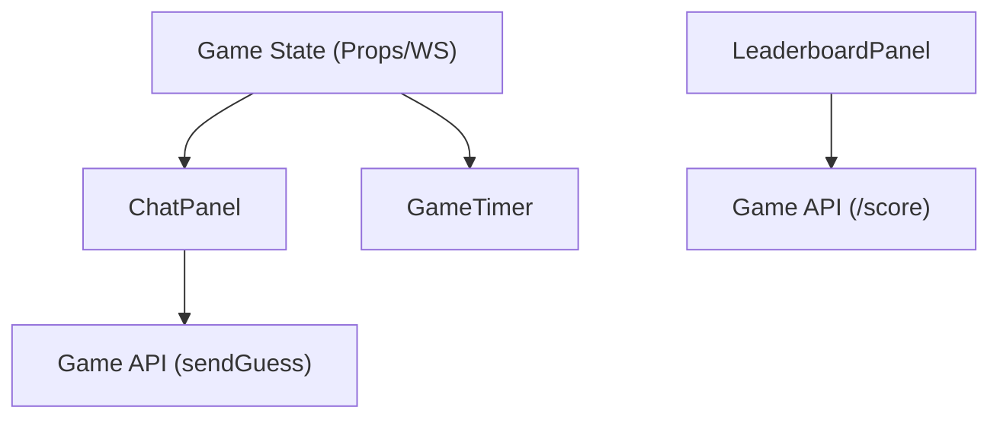

# Game UI Components

The Game UI layer of Doodle-Sync is designed to provide a real-time, responsive experience for players. It consists of specialized components that handle communication, time tracking, and competitive ranking.

## Architecture Overview

The UI components operate on a hybrid model: some rely on props passed down from the main game state (via WebSockets), while others poll the REST API for periodic updates.

---

## Chat Panel

The `ChatPanel` is the primary interaction hub. It handles the submission of guesses and displays a filtered stream of game messages.

### Implementation Details

- **Message Filtering**: To prevent spoilers and maintain game balance, messages with the type `CLOSE` (near-misses) are only visible to the player who sent them.
- **Auto-Scrolling**: Utilizes a `useRef` hook and `scrollIntoView` to ensure the latest messages are always visible.
- **Role-Based Access**: The component dynamically renders based on the `isDrawer` prop. If the user is the current artist, the input field is replaced with a status indicator.

### Message Styling Logic

| Message Type | Background | Text Style | Visibility |
| :--- | :--- | :--- | :--- |
| `CORRECT` | `#bef264` (Lime) | Bold, Black | Global |
| `CLOSE` | `#fef08a` (Yellow) | Semi-Bold, Black | Sender Only |
| `SYSTEM` | `#d4d4d4` (Gray) | Italic, Black | Global |
| `DEFAULT` | Transparent | Normal, Black | Global |

---

## Game Timer

The `GameTimer` provides a synchronized countdown for the drawing phase.

### Time Synchronization
To prevent clock drift between the client and server, the timer does not rely on a simple local `setInterval` countdown. Instead, it calculates the remaining time based on a server-provided timestamp:

$$\text{Remaining} = \max(0, \text{Total Duration} - (\text{Current Time} - \text{Start Time}))$$

### Visual States
The component implements a "Urgency State" when the remaining time is $\le 10$ seconds:
- **Normal State**: White background, black border.
- **Urgent State**: Red background, red border, and a `pulse` animation to alert players.

---

## Leaderboard Panel

The `LeaderboardPanel` manages the competitive ranking of players within a specific room.

### Data Strategy
Unlike the chat, which is pushed via sockets, the leaderboard uses a **polling strategy**:
1. It fetches current scores from `/score/room/{roomCode}/leaderboard`.
2. An interval is set to refresh this data every **5 seconds**.
3. The component maps the raw score data to the `players` list to resolve `userId` into human-readable `username` values.

### Ranking Logic
The panel performs a client-side sort on the retrieved data:
1. **Sort**: Arranges players by score in descending order.
2. **Re-rank**: Assigns a rank index (`#1`, `#2`, etc.) based on the sorted position.
3. **Styling**: Applies zebra-striping (alternating `#c0c0c0` and `#d9d9d9`) for better readability.