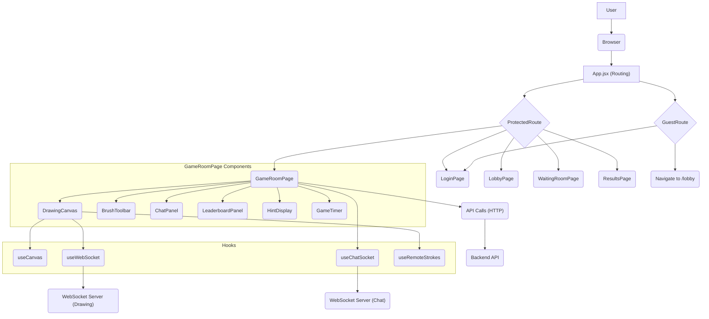

# Frontend Client

This section details the structure, components, and client-side logic of the Doodle-Sync user interface. It covers routing, component composition, state management, and real-time communication mechanisms.

## Application Structure and Routing

The `App.jsx` file serves as the entry point for the frontend application, defining the routing structure using `react-router-dom`. It employs protected and guest routes to manage user access to different parts of the application based on their authentication status.

```jsx
import { Routes, Route, Navigate } from 'react-router-dom';
import { useGame } from './context/GameContext';

import LoginPage       from './pages/LoginPage';
import LobbyPage       from './pages/LobbyPage';
import WaitingRoomPage from './pages/WaitingRoomPage';
import GameRoomPage    from './pages/GameRoomPage';
import ResultsPage     from './pages/ResultsPage';

function ProtectedRoute({ children }) {
  const { isAuthenticated } = useGame();
  if (!isAuthenticated) return <Navigate to="/" replace />;
  return children;
}

function GuestRoute({ children }) {
  const { isAuthenticated } = useGame();
  if (isAuthenticated) return <Navigate to="/lobby" replace />;
  return children;
}

export default function App() {
  return (
    <Routes>
      <Route path="/" element={
        <GuestRoute><LoginPage /></GuestRoute>
      } />
      <Route path="/lobby" element={
        <ProtectedRoute><LobbyPage /></ProtectedRoute>
      } />
      <Route path="/room/:code/waiting" element={
        <ProtectedRoute><WaitingRoomPage /></ProtectedRoute>
      } />
      <Route path="/room/:code/play" element={
        <ProtectedRoute><GameRoomPage /></ProtectedRoute>
      } />
      <Route path="/room/:code/results" element={
        <ProtectedRoute><ResultsPage /></ProtectedRoute>
      } />
      <Route path="*" element={
        <GuestRoute><Navigate to="/" replace /></GuestRoute>
      } />
    </Routes>
  );
}
```

## Game Room Page (`GameRoomPage.jsx`)

The `GameRoomPage` is the central hub for gameplay. It orchestrates various components, including the drawing canvas, chat, leaderboard, and timer, to provide a complete game experience.

Key responsibilities of this page include:
- Fetching and updating room state periodically.
- Managing brush settings (color, width, eraser).
- Interacting with the chat and drawing services via custom hooks.
- Displaying game-specific information like rounds, hints, and the current word.

```jsx
import { useState, useEffect, useCallback, useRef } from 'react';
import { useParams, useNavigate } from 'react-router-dom';
import { useGame } from '../context/GameContext';
import { useChatSocket } from '../hooks/useChatSocket';
import api from '../api/gameApi';
import Logo from '../components/Logo';

import DrawingCanvas from '../components/DrawingCanvas';
import BrushToolbar from '../components/BrushToolbar';
import ChatPanel from '../components/ChatPanel';
import LeaderboardPanel from '../components/LeaderboardPanel';
import HintDisplay from '../components/HintDisplay';
import GameTimer from '../components/GameTimer';

export default function GameRoomPage() {
  const { code } = useParams();
  const navigate = useNavigate();
  const {
    userId,
    updateFromSession,
    roomState,
    isDrawer,
    currentDrawerId,
    drawTimeSeconds,
    players,
    currentRound,
    totalRounds,
    drawStartedAt,
  } = useGame();

  // brush state
  const [color, setColor] = useState('#000000');
  const [brushWidth, setBrushWidth] = useState(5);
  const [isEraser, setIsEraser] = useState(false);
  const [wordLength, setWordLength] = useState(0);
  const [currentWord, setCurrentWord] = useState('');

  // chat socket
  const { messages, hints, sendGuess, clearChat, connected: chatConnected } = useChatSocket(code, userId);

  // ... (rest of the component logic) ...

  return (
    <div className="h-screen flex flex-col overflow-hidden" style={{ background: 'var(--color-bg)' }}>
      {/* Logo bar */}
      <div className="px-4 py-1 shrink-0">
        <Logo size="sm" />
      </div>

      {/* Game area */}
      <div className="flex-1 flex flex-col mx-3 mb-3 border-2 border-black rounded-lg overflow-hidden bg-white min-h-0">
        {/* Top bar */}
        <div className="flex items-center border-b-2 border-black bg-white shrink-0">
          {/* Timer + Round */}
          <div className="flex items-center gap-3 px-4 py-2 border-r-2 border-black">
            <GameTimer
              drawTimeSeconds={drawTimeSeconds}
              drawStartedAt={drawStartedAt}
            />
            <span className="text-lg font-extrabold text-black">
              Round {currentRound || 1} of {totalRounds || 3}
            </span>
          </div>

          {/* Center: Hint / Word area */}
          <div className="flex-1 text-center py-2">
            <HintDisplay
              hints={hints}
              wordLength={wordLength}
              isDrawer={isDrawer}
              roomState={roomState}
              chatConnected={chatConnected}
              currentWord={currentWord}
            />
          </div>

          {/* Chat Box label */}
          <div className="px-6 py-2 border-l-2 border-black">
            <span className="text-lg font-extrabold text-black">Chat Box</span>
          </div>
        </div>

        {/* Main content area */}
        <div className="flex-1 flex min-h-0">
          {/* Left: Leaderboard */}
          <div className="w-[180px] shrink-0 border-r-2 border-black bg-gray-100 overflow-y-auto">
            <LeaderboardPanel roomCode={code} players={players} />
          </div>

          {/* Center: Canvas */}
          <div className="flex-1 flex flex-col min-h-0 bg-white">
            {/* Status banner for CHOOSING/RESULTS */}
            {(roomState === 'CHOOSING' || roomState === 'RESULTS') && (
              <div className="flex items-center justify-center py-3 bg-[var(--color-card)] border-b-2 border-black">
                <span className="text-black font-bold text-sm animate-pulse">
                  {roomState === 'CHOOSING'
                    ? '🎯 Choosing a word...'
                    : '📊 Round over! Next round starting soon...'}
                </span>
              </div>
            )}

            {/* Canvas */}
            <div className="flex-1 flex items-center justify-center p-2 min-h-0">
              <DrawingCanvas
                roomCode={code}
                playerId={userId}
                isDrawer={isDrawer && roomState === 'DRAWING'}
                color={color}
                brushWidth={brushWidth}
                isEraser={isEraser}
                currentRound={currentRound}
              />
            </div>

            {/* Brush toolbar for drawer */}
            {isDrawer && roomState === 'DRAWING' && (
              <div className="shrink-0 border-t-2 border-black bg-white px-4 py-2">
                <BrushToolbar
                  color={color}
                  setColor={setColor}
                  brushWidth={brushWidth}
                  setBrushWidth={setBrushWidth}
                  isEraser={isEraser}
                  setIsEraser={setIsEraser}
                />
              </div>
            )}
          </div>

          {/* Right: Chat */}
          <div className="w-[250px] shrink-0 border-l-2 border-black flex flex-col min-h-0">
            <ChatPanel
              messages={messages}
              sendGuess={sendGuess}
              isDrawer={isDrawer}
              myPlayerId={userId}
              drawStartedAt={drawStartedAt}
              drawerName={drawerName}
            />
          </div>
        </div>
      </div>
    </div>
  );
}
```

## Drawing Canvas Component (`DrawingCanvas.jsx`)

The `DrawingCanvas` component handles the interactive drawing surface. It leverages custom hooks (`useCanvas`, `useWebSocket`, `useRemoteStrokes`) to manage drawing logic, real-time stroke synchronization, and canvas state.

- **Drawing Logic**: The `useCanvas` hook provides functions to start, continue, stop drawing, and clear the canvas.
- **Real-time Synchronization**: `useWebSocket` connects to the drawing service, sending local strokes and receiving remote strokes. `useRemoteStrokes` processes incoming strokes and calls the `drawStroke` function.
- **Round Management**: The canvas clears itself at the start of each new round and fetches previous strokes for late joiners.

```jsx
import { useEffect, useCallback, useRef } from 'react';
import { useCanvas }       from '../hooks/useCanvas';
import { useWebSocket }    from '../hooks/useWebSocket';
import { useRemoteStrokes } from '../hooks/useRemoteStrokes';

import api from '../api/gameApi';


export default function DrawingCanvas({
  roomCode,
  playerId,
  isDrawer,
  color,
  brushWidth,
  isEraser,
  currentRound,      
}) {
  const {
    canvasRef,
    drawStroke,
    startDrawing,
    continueDrawing,
    stopDrawing,
    clearCanvas,
  } = useCanvas();

  const { enqueue } = useRemoteStrokes(drawStroke, playerId);
  const { sendStroke, status } = useWebSocket(roomCode, enqueue);
  
  {status !== 'connected' && (
  <div style={{
    padding: '6px 12px',
    background: status === 'reconnecting' ? '#fef3c7' : '#fee2e2',
    color:      status === 'reconnecting' ? '#92400e' : '#991b1b',
    borderRadius: '6px', fontSize: '12px', marginBottom: '6px'
  }}>
    {status === 'reconnecting'
      ? 'Drawing server reconnecting... strokes paused'
      : 'Drawing server unreachable. Please refresh.'}
  </div>
)}
  

  // Track previous round to detect round changes
  const prevRoundRef = useRef(currentRound);

  // Clear canvas and reset Redis when a new round starts
  useEffect(() => {
    if (currentRound > 0 && currentRound !== prevRoundRef.current) {
      prevRoundRef.current = currentRound;
      clearCanvas();
      console.log(`[Canvas] Cleared for round ${currentRound}`);

      // Also clear the Redis canvas for the room (server-side cleanup)
      api.delete(`/draw/room/${roomCode}/canvas`).catch(() => {});
    }
  }, [currentRound, roomCode, clearCanvas]);

  // Replay strokes on mount for late joiners
  useEffect(() => {
    if (!roomCode) return;
    api.get(`/draw/room/${roomCode}/replay`)
      .then(res => {
        res.data.forEach(stroke => drawStroke(stroke));
        console.log(`Replayed ${res.data.length} strokes`);
      })
      .catch(err => console.error('Replay failed', err));
  }, [roomCode, drawStroke]);

  const handleMouseDown = useCallback((e) => {
    if (!isDrawer) return;
    startDrawing(e, color, brushWidth, isEraser);
  }, [isDrawer, startDrawing, color, brushWidth, isEraser]);

  const handleMouseMove = useCallback((e) => {
    if (!isDrawer) return;
    const stroke = continueDrawing(e, color, brushWidth, isEraser, playerId);
    if (stroke) sendStroke(stroke);
  }, [isDrawer, continueDrawing, color, brushWidth, isEraser, playerId, sendStroke]);

  const handleMouseUp = useCallback(() => {
    stopDrawing();
  }, [stopDrawing]);

  const handleMouseLeave = useCallback(() => {
    stopDrawing();
  }, [stopDrawing]);

  return (
    <div className="relative rounded-xl overflow-hidden shadow-lg border border-[var(--color-border)]">
      <canvas
        ref={canvasRef}
        width={800}
        height={600}
        style={{
          cursor: isDrawer ? 'crosshair' : 'default',
          background: '#ffffff',
          touchAction: 'none',
          display: 'block',
          maxWidth: '100%',
          height: 'auto',
        }}
        onMouseDown={handleMouseDown}
        onMouseMove={handleMouseMove}
        onMouseUp={handleMouseUp}
        onMouseLeave={handleMouseLeave}
      />
    </div>
  );
}
```

## WebSocket Integration (`useWebSocket.js`)

The `useWebSocket` hook manages the WebSocket connection for real-time communication, specifically for drawing strokes. It utilizes the `@stomp/stompjs` library to establish and maintain a STOMP over WebSocket connection.

- **Connection Management**: Handles connecting, reconnecting, and disconnecting from the WebSocket server.
- **Authentication**: Fetches a WebSocket ticket before connecting to authenticate the user.
- **Subscription**: Subscribes to a specific room's canvas topic to receive stroke data.
- **Publishing**: Provides a `sendStroke` function to publish local drawing actions to the server.

```jsx
import { useEffect, useRef, useCallback, useState } from 'react';
import { Client } from '@stomp/stompjs';
import { fetchWsTicket } from '../api/gameApi';

export function useWebSocket(roomCode, onStroke) {
  const clientRef       = useRef(null);
  const onStrokeRef     = useRef(onStroke);
  const subscriptionRef = useRef(null);
  const [status, setStatus] = useState('connecting');

  useEffect(() => {
    onStrokeRef.current = onStroke;
  }, [onStroke]);

  useEffect(() => {
    if (!roomCode) return;

    const client = new Client({
      // placeholder — overwritten by beforeConnect
      brokerURL: `ws://localhost:8081/ws/websocket`,
      reconnectDelay: 3000,

      // fires before EVERY connect attempt (initial + reconnects)
      beforeConnect: async () => {
        try {
          const ticket = await fetchWsTicket();
          client.brokerURL = `ws://localhost:8081/ws/websocket?ticket=${ticket}`;
        } catch (e) {
          console.error('[WS] Failed to fetch ticket:', e);
          setStatus('disconnected');
          client.deactivate();
        }
      },

      onConnect: () => {
        console.log('[WS] Connected to drawing-service (authenticated)');
        setStatus('connected');
        subscriptionRef.current = client.subscribe(
          `/topic/room.${roomCode}.canvas`,
          (message) => {
            try {
              const stroke = JSON.parse(message.body);
              onStrokeRef.current?.(stroke);
            } catch (e) {
              console.error('[WS] Failed to parse stroke', e);
            }
          }
        );
      },

      onDisconnect: () => {
        setStatus('reconnecting');
        console.warn('[WS] Disconnected, will reconnect with new ticket');
      },

      onStompError: () => setStatus('reconnecting'),
    });

    client.activate();
    clientRef.current = client;

    return () => client.deactivate();
  }, [roomCode]);

  const sendStroke = useCallback((stroke) => {
    if (!clientRef.current?.connected) return;
    clientRef.current.publish({
      destination: `/app/room.${roomCode}.stroke`,
      body: JSON.stringify(stroke),
    });
  }, [roomCode]);

  return { sendStroke, status };
}
```

## Frontend Architecture Overview

The frontend client is designed with a modular approach, utilizing React components and custom hooks for managing different aspects of the application. The `GameContext` provides global state management, while specific hooks handle complex logic like WebSocket communication and canvas manipulation.





## Key Takeaways

- **Component-Based Architecture**: The UI is broken down into reusable components, enhancing maintainability and organization.
- **Custom Hooks for Logic**: Custom hooks abstract complex stateful logic (e.g., `useWebSocket`, `useCanvas`), making components cleaner and more focused.
- **Real-time Communication**: WebSocket is leveraged for real-time drawing and chat functionalities, ensuring a dynamic user experience.
- **State Management**: `GameContext` provides a centralized store for application-wide state, simplifying data sharing between components.
- **Routing**: `react-router-dom` manages navigation, with protected and guest routes ensuring appropriate user access.

## Integration Details

The frontend client integrates with the backend API for initial data fetching, authentication, and game state management. Real-time updates for drawing and chat are handled via separate WebSocket connections managed by dedicated hooks. The `GameContext` acts as a bridge, sharing essential game data across various components.