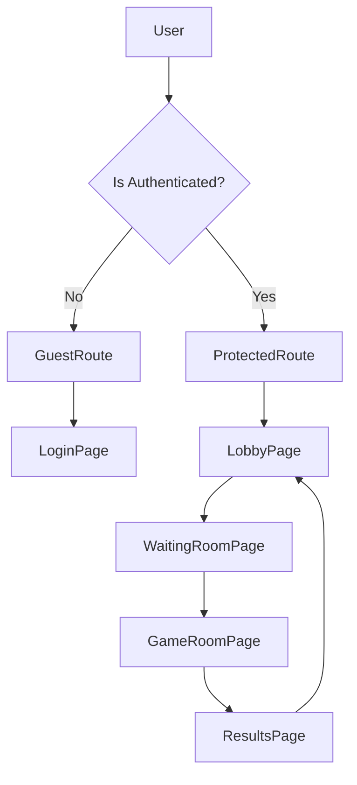

# Frontend Architecture

The Doodle-Sync frontend is built as a single-page application (SPA) using **React** and **React Router**. It employs a centralized state management pattern via the Context API to synchronize game states across multiple components and handle authentication.

## Navigation Flow

The application uses a guarded routing system to ensure users are in the correct state before accessing specific pages. Navigation is managed by two primary route guards: `ProtectedRoute` and `GuestRoute`.

### Route Definitions
- `/`: The entry point for unauthenticated users.
- `/lobby`: The central hub for joining or creating games.
- `/room/:code/waiting`: The pre-game lobby where players gather.
- `/room/:code/play`: The active drawing and guessing arena.
- `/room/:code/results`: The round/game summary screen.

## Global State Management

State is managed through the `GameProvider`, which wraps the entire application. This ensures that critical data—such as authentication tokens and active room details—is accessible from any component via the `useGame()` hook.

### Auth State
User credentials and session tokens are stored in `localStorage` to maintain persistence across browser restarts.
- `token`: JWT for API authentication.
- `userId`: Unique identifier for the player.
- `username`: Display name.

### Game State
The `room` state object tracks the real-time status of the current match, including:
- `roomState`: The current phase (`WAITING`, `CHOOSING`, `DRAWING`, `RESULTS`).
- `currentRound`: An integer tracking the progression of the game.
- `isDrawer`: A boolean derived state indicating if the current user is the artist.
- `drawStartedAt`: A timestamp used to calculate the remaining time on the client-side clock.

## Synchronization Logic

The frontend relies on a polling mechanism to sync with the backend. Because some backend state transitions (like `CHOOSING`) happen too quickly to be caught by polling, the `updateFromSession` function implements a **State Transition Detection** algorithm.

### Round Transition Detection
To prevent missing round increments, the client detects a new round if:
1. The state moves to `CHOOSING`.
2. The state jumps directly from `RESULTS` to `DRAWING`.
3. The state remains `DRAWING` but the time elapsed exceeds the maximum allowed draw time plus a buffer.

### Persistence Strategy
To prevent game state loss during page refreshes, the application utilizes a dual-storage approach:

| Storage | Purpose | Data |
| :--- | :--- | :--- |
| `localStorage` | Permanent Auth | Tokens, User ID, Username |
| `sessionStorage` | Session Recovery | `currentRound`, `drawStartedAt`, `lastKnownState` |

When a user refreshes the page, the `loadPersistedState` helper retrieves the specific room's progress from `sessionStorage`, allowing the client to accurately resume the timer and round count.

## Drawer Calculation
The current drawer is determined on the client side to ensure instant UI updates. It follows the backend's deterministic algorithm:
$$\text{drawerIndex} = (\text{currentRound} - 1) \pmod{\text{totalPlayers}}$$