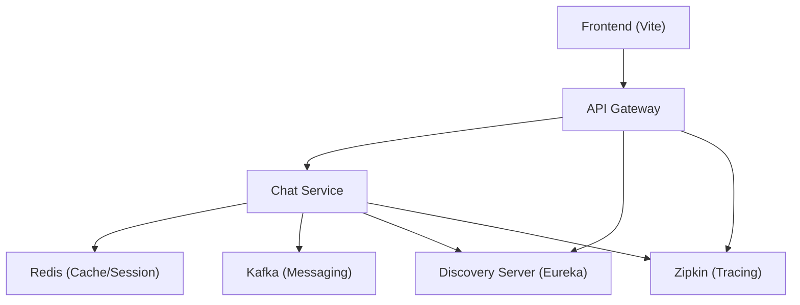

# Configuration and Deployment

Doodle-Sync utilizes a microservices architecture designed for scalability and observability. This section details the environment configurations required to run the system in both local and containerized environments.

## Deployment Architecture

The system relies on a centralized discovery server and a set of shared infrastructure components (Redis, Kafka, Zipkin) to facilitate communication and monitoring across services.



## Backend Configuration

The backend services use Spring Boot profiles to manage environment-specific settings. For Dockerized deployments, the `application-docker.yml` profile is activated to resolve services via Docker DNS.

### Infrastructure Endpoints

Across the microservices, the following shared infrastructure configurations are applied:

| Component | Host/Endpoint | Purpose |
| :--- | :--- | :--- |
| **Eureka** | `http://discovery-server:8761/eureka/` | Service registration and discovery |
| **Redis** | `redis:6379` | Distributed caching and state management |
| **Zipkin** | `http://scribble-zipkin:9411/api/v2/spans` | Distributed tracing and latency analysis |
| **Kafka** | `kafka:9092` | Asynchronous event streaming (Chat Service) |

### Service-Specific Profiles

#### API Gateway
The gateway acts as the entry point, routing requests to registered services via Eureka.
```yaml
# api-gateway/src/main/resources/application-docker.yml
spring:
  data:
    redis:
      host: redis
      port: 6379
eureka:
  client:
    service-url:
      defaultZone: http://discovery-server:8761/eureka/
```

#### Chat Service
The chat service integrates with Kafka for real-time messaging and Redis for session handling.
```yaml
# chat-service/src/main/resources/application-docker.yml
spring:
  data:
    redis:
      host: redis
  kafka:
    bootstrap-servers: kafka:9092
eureka:
  client:
    service-url:
      defaultZone: http://discovery-server:8761/eureka/
```

## Frontend Configuration

The client is built using Vite and React. The configuration focuses on optimizing the build pipeline and integrating Tailwind CSS for styling.

### Vite Configuration
The `vite.config.js` file enables the React plugin for JSX transformation and the Tailwind CSS plugin for utility-first styling.

```javascript
import { defineConfig } from 'vite'
import react from '@vitejs/plugin-react'
import tailwindcss from '@tailwindcss/vite'

export default defineConfig({
  plugins: [react(), tailwindcss()],
})
```

## Deployment Steps

1. **Infrastructure Setup**: Start the supporting containers (Eureka, Redis, Kafka, Zipkin).
2. **Service Deployment**: Launch the `api-gateway` and `chat-service` using the `docker` profile:
   ```bash
   -Dspring.profiles.active=docker
   ```
3. **Client Launch**: Install dependencies and start the Vite development server:
   ```bash
   npm install
   npm run dev