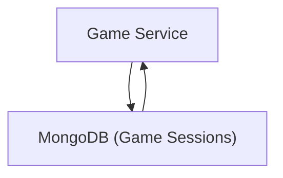

# Data Management and Persistence

This section details how Doodle-Sync manages and persists data across its various services, outlining the database strategies and caching mechanisms employed.

## User Data Management

User information, including credentials, game statistics, and account details, is stored in a relational database. The `user-service` utilizes a PostgreSQL database, with the initial schema defined in `V1__Create_users_table.sql`. This table stores essential user attributes and tracks game-related metrics such as total wins and games played.

```sql
CREATE TABLE users (
                       id VARCHAR(36) PRIMARY KEY,
                       username VARCHAR(50) NOT NULL UNIQUE,
                       email VARCHAR(100) NOT NULL UNIQUE,
                       password_hash VARCHAR(255) NOT NULL,
                       total_wins INT DEFAULT 0 NOT NULL,
                       games_played INT DEFAULT 0 NOT NULL,
                       created_at TIMESTAMP DEFAULT CURRENT_TIMESTAMP
);
```

## Word Data Management

The `word-service` is responsible for managing the vocabulary used in the game. A PostgreSQL database is used to store words and their associated difficulties. The `V1__create_words_table.sql` script defines the `words` table, allowing for efficient retrieval of words based on difficulty levels.

```sql
CREATE TABLE words (
                       id      BIGSERIAL PRIMARY KEY,
                       word    VARCHAR(100) NOT NULL,
                       difficulty VARCHAR(10) NOT NULL CHECK (difficulty IN ('EASY','MEDIUM','HARD'))
);
```

## Game Session Persistence

Game sessions and their states are managed by the `game-service`. This service leverages MongoDB as its primary data store, utilizing the `MongoRepository` interface for data access. `GameSessionRepository` provides methods for finding game sessions by room code, checking for their existence, and retrieving sessions based on their state and player availability.

```java
@Repository
public interface GameSessionRepository extends MongoRepository<GameSession, String> {

    Optional<GameSession> findByRoomCode(String roomCode);

    boolean existsByRoomCode(String roomCode);

    List<GameSession> findByStateAndMaxPlayersGreaterThan(
            GameState state, int minPlayers);  // Find all rooms a player can join

    @Query("{ 'players.userId': ?0 }")
    List<GameSession> findByPlayerId(String userId);  // Find all games a specific user has played in

    long countByState(GameState state);

}
```

## Caching Strategies

The `drawing-service` employs Redis for caching, particularly for frequently accessed drawing data or temporary game-related information. The `RedisConfig` class sets up a `RedisTemplate` configured to use `StringRedisSerializer` for both keys and values, ensuring efficient and consistent data handling within the Redis cache.

```java
@Configuration
public class RedisConfig {
    @Bean
    public RedisTemplate<String, String> redisTemplate(
            RedisConnectionFactory factory) {
        RedisTemplate<String, String> template = new RedisTemplate<>();
        template.setConnectionFactory(factory);
        template.setKeySerializer(new StringRedisSerializer());
        template.setValueSerializer(new StringRedisSerializer());
        template.setHashKeySerializer(new StringRedisSerializer());
        template.setHashValueSerializer(new StringRedisSerializer());
        return template;
    }
}
```

## Data Flow Overview

The following diagram illustrates a simplified data flow for managing game sessions, highlighting the interaction between the `game-service` and its MongoDB datastore.





## Key Takeaways

*   **Polyglot Persistence**: Doodle-Sync utilizes a polyglot persistence approach, employing PostgreSQL for user and word data due to its relational nature and MongoDB for game sessions, benefiting from its flexible document model.
*   **Caching for Performance**: Redis is integrated into the `drawing-service` to accelerate data retrieval and reduce load on primary data stores for frequently accessed information.
*   **Repository Pattern**: Spring Data repositories (e.g., `MongoRepository`, `JpaRepository` implicitly used by the SQL migrations) abstract database interactions, promoting clean code and maintainability.