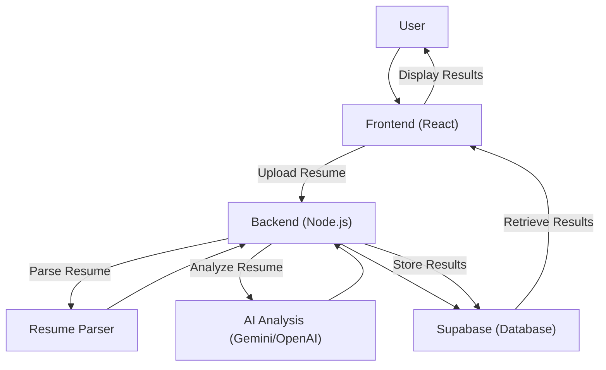
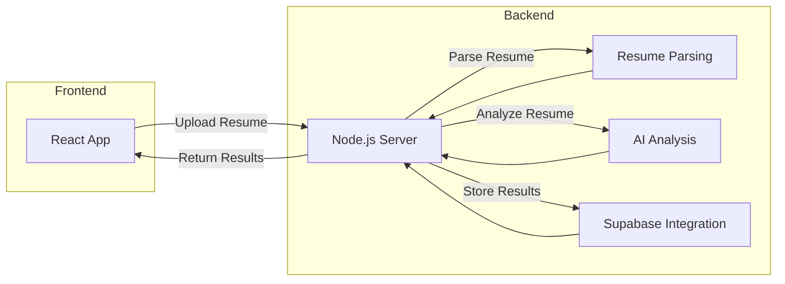

# Project Overview

The AI Resume Screener is a web application designed to automate and enhance the resume screening process for recruiters and hiring managers. It leverages AI and natural language processing (NLP) to analyze resumes, compare them against job descriptions, and provide insights into candidate suitability. The project is split into a frontend built with React and a backend built with Node.js. The backend handles tasks such as resume parsing, AI-powered analysis, and data storage using Supabase.

## Key Features

*   **Resume Parsing:** Extracts text from various resume formats (PDF, DOCX, etc.).
*   **AI-Powered Analysis:** Analyzes resumes using the Google Gemini Pro and OpenAI API to assess skills, experience, and keywords.
*   **Job Description Matching:** Compares resumes against job descriptions to identify the best-fit candidates.
*   **Candidate Ranking:** Ranks candidates based on their match to the job requirements.
*   **Data Storage:** Uses Supabase for storing resumes, job descriptions, and analysis results.

## Technology Stack

The project utilizes a modern web development stack:

*   **Frontend:** React, Vite, TailwindCSS, Zustand, React Query, React Router DOM
*   **Backend:** Node.js, Express, OpenAI, Google Gemini Pro, Supabase, Redis (for caching), Multer (for file uploads), pdf-parse-fixed, mammoth
*   **Database/Storage:** Supabase (PostgreSQL)
*   **Other:** Cors, Dotenv, ioredis, uuid

## Key Integration Points

### Frontend

The frontend, built with React, handles user interaction, display of results, and communication with the backend. It uses Vite for fast development and bundling.

#### Code Snippet: Frontend - React Component (Example)

This snippet demonstrates a simple React component that fetches data from the backend using `axios`.

```javascript
// frontend/src/components/ResumeUploader.jsx
import React, { useState } from 'react';
import axios from 'axios';

function ResumeUploader() {
  const [file, setFile] = useState(null);

  const handleFileChange = (event) => {
    setFile(event.target.files[0]);
  };

  const handleUpload = async () => {
    if (!file) {
      alert('Please select a file.');
      return;
    }

    const formData = new FormData();
    formData.append('resume', file);

    try {
      const response = await axios.post('/api/upload-resume', formData, {
        headers: {
          'Content-Type': 'multipart/form-data',
        },
      });
      console.log('Upload successful:', response.data);
      alert('Resume uploaded successfully!');
    } catch (error) {
      console.error('Upload failed:', error);
      alert('Upload failed.');
    }
  };

  return (
    <div>
      <input type="file" onChange={handleFileChange} />
      <button onClick={handleUpload}>Upload Resume</button>
    </div>
  );
}

export default ResumeUploader;
```

[View on GitHub](https://github.com/santrupt29/ai-resume-screener/blob/main/frontend/src/components/ResumeUploader.jsx)

### Backend

The backend is built with Node.js and Express. It serves as the API for the frontend, handling tasks like resume uploads, AI analysis, and database interactions. It uses a variety of libraries to interact with external services like OpenAI, Google Gemini Pro and Supabase.

#### Code Snippet: Backend - Resume Upload Route (Example)

This snippet demonstrates a simple Express route that handles resume uploads using `multer`.

```javascript
// backend/server.js
import express from 'express';
import multer from 'multer';
import cors from 'cors';

const app = express();
const port = process.env.PORT || 3001;

app.use(cors());
app.use(express.json());

const storage = multer.diskStorage({
  destination: (req, file, cb) => {
    cb(null, 'uploads/'); // Store uploads in the 'uploads' directory
  },
  filename: (req, file, cb) => {
    cb(null, Date.now() + '-' + file.originalname); // Unique filenames
  },
});

const upload = multer({ storage: storage });

app.post('/api/upload-resume', upload.single('resume'), (req, res) => {
  if (!req.file) {
    return res.status(400).send('No file uploaded.');
  }
  res.status(200).send({ message: 'File uploaded successfully', filename: req.file.filename });
});

app.listen(port, () => {
  console.log(`Server is running on port ${port}`);
});
```

[View on GitHub](https://github.com/santrupt29/ai-resume-screener/blob/main/backend/server.js)

### Data Flow and Architecture

The application's data flow involves the user uploading a resume through the frontend. The frontend sends the file to the backend, which parses the resume, uses OpenAI or Google Gemini Pro to analyze its content, and saves the data to the Supabase database. The frontend then displays the results of the analysis.





### AI Integration

The core of the application lies in its AI integration. The backend uses the OpenAI or Google Gemini Pro API to analyze the uploaded resume. The analysis typically involves extracting skills, experience, and other relevant information from the resume. This information is then used to compare the candidate with the job description.

#### Code Snippet: Backend - OpenAI Integration (Example)

This snippet demonstrates how to interact with the OpenAI API.

```javascript
// backend/server.js
import { OpenAI } from "openai";

const openai = new OpenAI({
  apiKey: process.env.OPENAI_API_KEY,
});

async function analyzeResumeWithOpenAI(resumeText) {
  try {
    const completion = await openai.chat.completions.create({
      messages: [
        { role: "system", content: "You are a helpful assistant that analyzes resumes." },
        { role: "user", content: `Analyze the following resume:\n${resumeText}` },
      ],
      model: "gpt-3.5-turbo",
    });

    return completion.choices[0].message.content;

  } catch (error) {
    console.error("OpenAI API Error:", error);
    return null;
  }
}
```

[View on GitHub](https://github.com/santrupt29/ai-resume-screener/blob/main/backend/server.js)

### Supabase Integration

Supabase is used for data storage, providing a PostgreSQL database for storing resumes, job descriptions, and analysis results.

#### Code Snippet: Backend - Supabase Integration (Example)

This snippet shows how to integrate with Supabase to save and retrieve data.

```javascript
// backend/server.js
import { createClient } from '@supabase/supabase-js';

const supabaseUrl = process.env.SUPABASE_URL;
const supabaseKey = process.env.SUPABASE_KEY;
const supabase = createClient(supabaseUrl, supabaseKey);

async function saveResumeAnalysis(analysisData) {
  const { data, error } = await supabase
    .from('resume_analyses')
    .insert([analysisData]);

  if (error) {
    console.error('Supabase insert error:', error);
    return null;
  }
  return data;
}
```

[View on GitHub](https://github.com/santrupt29/ai-resume-screener/blob/main/backend/server.js)

### Considerations

*   **Error Handling:** Implement robust error handling throughout the frontend and backend to gracefully handle potential issues like file upload failures, API errors, and database connection problems.
*   **Security:** Implement security measures such as input validation, sanitization, and secure storage of API keys and credentials.
*   **Scalability:** Consider the scalability of the application, especially concerning the number of users and the volume of resumes being processed. Implement caching and other optimization techniques.
*   **Performance:** Optimize the performance of the frontend and backend to ensure fast response times, particularly for AI analysis and data retrieval.




