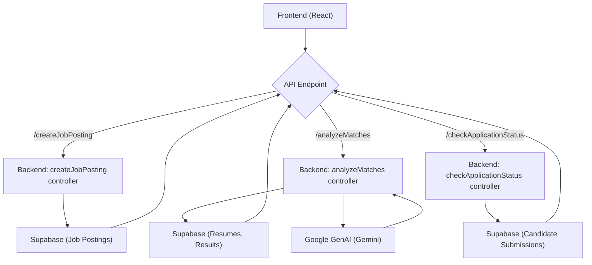

# API Endpoints

This section details the API endpoints available in the `ai-resume-screener` project, outlining their functionalities and usage. These endpoints handle core tasks such as analyzing resumes against job descriptions, checking application statuses, creating and updating job postings, and retrieving application data.

## `/analyzeMatches`

This endpoint is responsible for analyzing a resume against a job description, providing a match score, strengths, weaknesses, and suggestions for interview questions.

*   **Functionality:** Analyzes resume and job description to determine match.
*   **Method:** `POST`
*   **Request Body:**

    ```json
    {
      "resumeId": "uuid",
      "jobId": "uuid"
    }
    ```

    Where `resumeId` and `jobId` are UUIDs corresponding to entries in the `resumes` and `job_postings` tables, respectively.
*   **Response (Success - 200 OK):**

    ```json
    {
      "result": {
        "id": "uuid",
        "job_posting_id": "uuid",
        "resume_id": "uuid",
        "score": 85,
        "similarity_score": 78,
        "strengths": ["Experience with X", "Skills in Y"],
        "weaknesses": ["Lack of Z", "Limited experience with A"],
        "suggestions": ["Ask about experience with B", "Discuss C"]
      },
      "message": "Analysis completed successfully"
    }
    ```

*   **Response (Error - 500 Internal Server Error):**

    ```json
    {
      "error": "An unexpected error occurred"
    }
    ```

*   **Relevant File:** [`backend/controllers/analyzeMatches.js`](https://github.com/santrupt29/ai-resume-screener/blob/main/backend/controllers/analyzeMatches.js)

    The `analyzeMatches` function orchestrates the analysis process.  It retrieves the resume and job posting data from Supabase, calculates the cosine similarity, and utilizes the Gemini AI model to generate a detailed analysis. A retry mechanism with exponential backoff is implemented to handle potential AI model request failures. Finally, it stores the results in the `results` table.

    ```javascript
    // backend/controllers/analyzeMatches.js
    async function analyzeMatches(req, res) {
      // ... (Request Body and Data Validation) ...

      const { data: resume, error: resumeError } = await supabase
        .from('resumes_with_json_embedding')
        .select('*')
        .eq('id', resumeId)
        .single();

      // ... (Error handling for resume retrieval) ...

      const similarityScore = cosineSimilarity(resume.embedding, job.embedding);
      const similarityPercentage = Math.round(similarityScore * 100);

      const aiAnalysis = await retryWithBackoff(
        () => analyzeResumeWithAI(resume.extracted_text, job.description),
        5,
        1000
      );

      // ... (Supabase result updates/creation, response) ...
    }
    ```

## `/checkApplicationStatus`

This endpoint allows candidates to check the status of their application by providing their application ID and email address.

*   **Functionality:** Retrieves the status of a job application.
*   **Method:** `POST`
*   **Request Body:**

    ```json
    {
      "applicationId": "uuid",
      "email": "candidate@example.com"
    }
    ```

*   **Response (Success - 200 OK):**

    ```json
    {
      "application_id": "uuid",
      "candidate_name": "John Doe",
      "job_title": "Software Engineer",
      "company": "Acme Corp",
      "status": "analyzed",
      "created_at": "2024-07-27T10:00:00.000Z",
      "updated_at": "2024-07-27T12:00:00.000Z",
      "analysis": {
        "score": 85,
        "similarity_score": 78,
        "strengths": ["Experience with X", "Skills in Y"],
        "weaknesses": ["Lack of Z", "Limited experience with A"],
        "suggestions": ["Ask about experience with B", "Discuss C"]
      }
    }
    ```

*   **Response (Error - 404 Not Found):**

    ```json
    {
      "error": "Application not found"
    }
    ```

*   **Relevant File:** [`backend/controllers/checkApplicationStatus.js`](https://github.com/santrupt29/ai-resume-screener/blob/main/backend/controllers/checkApplicationStatus.js)

    The `checkApplicationStatus` function queries the `candidate_submissions` table and joins related tables ( `job_postings`, `resumes`, and `results` ) to fetch application data, job details, and analysis results.

    ```javascript
    // backend/controllers/checkApplicationStatus.js
    async function checkApplicationStatus(req, res) {
        const { applicationId, email } = req.body;

        // ... (Input validation) ...

        const { data: submission, error: submissionError } = await supabase
            .from("candidate_submissions")
            .select(`
                *,
                job_postings!candidate_submissions_job_posting_id_fkey(title, company),
                resumes!candidate_submissions_resume_id_fkey(
                  id,
                  results!results_resume_id_fkey(score, similarity_score, strengths, weaknesses, suggestions)
                )
              `)
            .eq("application_id", applicationId)
            .eq("candidate_email", email)
            .maybeSingle();

        // ... (Error handling and response formatting) ...
    }
    ```

## `/createJobPosting` and `/updateJobPosting`

These endpoints handle the creation and updating of job postings, including generating embeddings for the job descriptions using Google GenAI.

*   **Functionality:** Creates a new job posting or updates an existing one.
*   **Method:** `POST` (`/createJobPosting`) and `PUT` (`/updateJobPosting/:jobId`)
*   **Request Body (Create):**

    ```json
    {
      "user_id": "auth-user-id",
      "title": "Software Engineer",
      "description": "Develop and maintain software...",
      "company": "Acme Corp",
      "location": "New York, NY",
      "is_active": true
    }
    ```

*   **Request Body (Update):** (Same structure as create)

    ```json
    {
       "user_id": "auth-user-id",
       "title": "Senior Software Engineer",
       "description": "Lead software development...",
       "company": "Acme Corp",
       "location": "New York, NY",
       "is_active": true
    }
    ```

*   **Response (Success - 201 Created for Create, 200 OK for Update):**

    ```json
    {
      "job": {
        "id": "uuid",
        "user_id": "auth-user-id",
        "title": "Software Engineer",
        "description": "Develop and maintain software...",
        "company": "Acme Corp",
        "location": "New York, NY",
        "embedding": [0.123, 0.456, ...],
        "is_active": true,
        "created_at": "2024-07-27T10:00:00.000Z",
        "updated_at": "2024-07-27T10:00:00.000Z"
      },
      "publicUrl": "https://example.com/jobs/uuid"  // Only for create
    }
    ```

*   **Response (Error - 500 Internal Server Error):**

    ```json
    {
      "error": "Failed to create job posting"
    }
    ```

*   **Relevant File:** [`backend/controllers/createJobPosting.js`](https://github.com/santrupt29/ai-resume-screener/blob/main/backend/controllers/createJobPosting.js)

    The `createJobPosting` and `updateJobPosting` functions handle the insertion or update of job posting data. They also call the `generateJobEmbedding` function to create an embedding of the job description. The generated embedding is used for the similarity matching with resumes. `createJobPostingCore` and `updateJobPostingCore` are helper functions used to create the job postings and update them and they add a job to the queue for generating embeddings.

    ```javascript
    // backend/controllers/createJobPosting.js
    async function createJobPosting(req, res) {
        // ... (Input validation and User auth check) ...

        const { data: job, error: jobError } = await supabase
          .from('job_postings')
          .insert({
            user_id,
            title,
            description,
            company,
            location,
            embedding: jobEmbedding,
            is_active: is_active !== undefined ? is_active : true,
          })
          .select()
          .single();

        // ... (Error handling and response) ...
    }
    ```

    ```javascript
    // backend/controllers/createJobPosting.js
    async function generateJobEmbedding(text) {
        // ... (Error handling and validation) ...
        const response = await ai.models.embedContent({
          model: 'text-embedding-004',
          contents: [{ role: 'user', parts: [{ text }] }],
        });

        const embeddingValues = response?.embeddings?.[0]?.values;
        // ... (Error handling and return) ...
    }
    ```

## `/getApplications/:jobId`

This endpoint retrieves a list of applications associated with a specific job posting.

*   **Functionality:** Retrieves applications for a specific job.
*   **Method:** `GET`
*   **Parameters:** `jobId` (path parameter - UUID of the job posting)
*   **Response (Success - 200 OK):**

    ```json
    [
      {
        "id": "uuid",
        "job_posting_id": "uuid",
        "resume_id": "uuid",
        "candidate_name": "Jane Doe",
        "candidate_email": "jane.doe@example.com",
        "status": "submitted",
        "created_at": "2024-07-27T10:00:00.000Z",
        "updated_at": "2024-07-27T10:00:00.000Z",
        "resumes": {
          "file_name": "resume.pdf",
          "file_url": "https://example.com/resume.pdf"
        },
        "results":[
          {
            "id": "uuid",
            "job_posting_id": "uuid",
            "resume_id": "uuid",
            "score": 85,
            "similarity_score": 78,
            "strengths": ["Experience with X", "Skills in Y"],
            "weaknesses": ["Lack of Z", "Limited experience with A"],
            "suggestions": ["Ask about experience with B", "Discuss C"]
          }
        ]
      }
    ]
    ```

*   **Response (Error - 500 Internal Server Error):**

    ```json
    {
      "error": "Failed to fetch applications"
    }
    ```

*   **Relevant File:** [`backend/controllers/getApplications.js`](https://github.com/santrupt29/ai-resume-screener/blob/main/backend/controllers/getApplications.js)

    The `getApplications` function retrieves application data, including associated resume details, and analysis results for a particular job. The function makes use of Supabase's join operations to retrieve the related data.

    ```javascript
    // backend/controllers/getApplications.js
    async function getApplications(req, res) {
      const { jobId } = req.params;

      // ... (Input validation) ...

      const { data: applications, error: appError } = await supabase
        .from("candidate_submissions")
        .select(`
          *,
          resumes!candidate_submissions_resume_id_fkey (
            file_name,
            file_url
          )
        `)
        .eq("job_posting_id", jobId)
        .order("created_at", { ascending: false });

      // ... (Error handling and response) ...
    }
    ```

## Key Integration Points

*   **Authentication:**  The `createJobPosting` and `updateJobPosting` endpoints require user authentication via Supabase Auth.
*   **Asynchronous Tasks:** Generating job embeddings is an asynchronous task performed using Google GenAI, and is managed asynchronously, using a queue.
*   **Data Storage:**  All data (job postings, resumes, application submissions, and analysis results) are stored in a Supabase database.
*   **AI Integration:** The project heavily leverages Google GenAI for creating job embeddings and analyzing resumes.





This diagram shows the basic flow of how the application works using the defined API Endpoints.

## Best Practices

*   **Error Handling:** Implement comprehensive error handling throughout the API to provide informative error messages and prevent unexpected behavior.
*   **Input Validation:** Validate all input data to prevent security vulnerabilities and data integrity issues.
*   **Asynchronous Operations:** Utilize asynchronous operations for computationally intensive tasks, such as generating embeddings and AI analysis.
*   **Security:**  Secure your API endpoints, use HTTPS, and protect sensitive data.
*   **Monitoring and Logging:** Implement logging and monitoring to track API usage, performance, and identify potential issues.