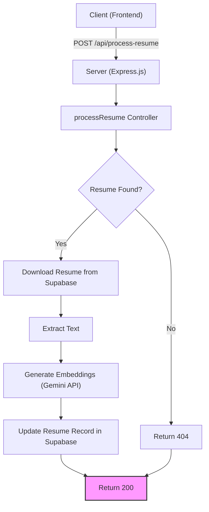

# Backend Architecture

This section details the backend architecture of the AI-powered resume screener application, outlining its components, API endpoints, database interactions, and background processes. The backend is built using Node.js and leverages Supabase for its database and storage needs, Redis for queuing, and Google Gemini for embedding generation.

## Overview

The backend is designed to handle the following core functionalities:

*   **Resume Processing:** Extract text and generate embeddings from uploaded resumes.
*   **Job Posting Management:** Create, update, and retrieve job postings.
*   **Application Submission:** Accept and store candidate applications.
*   **Analysis and Scoring:** Compare resumes against job postings using embeddings and similarity metrics.
*   **Results Retrieval:** Provide ranked results for each job posting.
*   **Background Processing:** Handle asynchronous tasks like resume processing and analysis using a queue.

## Key Components

The backend consists of several key components working together:

*   **Server ( `backend/server.js` ):** The entry point of the application, managing API routes, middleware, and server initialization.
*   **Controllers:** Handle specific API endpoints and business logic.
    *   `analysisResults.js`: Retrieves and formats analysis results for a given job posting.
    *   `processResume.js`: Processes uploaded resumes, including text extraction, embedding generation, and status updates.
    *   `createJobPosting.js`: Handles job posting creation and updates.
    *   `submitApplications.js`: Manages the submission of applications.
    *   `getApplications.js`: Retrieves application data based on a job posting.
    *   `updateApplicationStatus.js`: Updates the status of an application.
    *   `checkApplications.js`: Checks the status of applications.
*   **Supabase Client:** Interacts with the Supabase database for storing job postings, resumes, candidate submissions, and analysis results.
*   **Redis Queue ( `backend/queue.js` ):** Manages asynchronous tasks using a Redis-based queue.
*   **Utilities:** Supporting functions and configurations (e.g., Supabase configuration, PDF parsing).

## API Endpoints

The backend exposes a RESTful API with the following endpoints:

*   `/api/analyze-results/:jobId`: Retrieves analysis results for a specific job posting.
*   `/api/check-application-status`: Checks the status of an application.
*   `/api/create-job-posting`: Creates a new job posting.
*   `/api/process-resume`: Initiates resume processing (handled asynchronously via a queue).
*   `/api/submit-application`: Handles application submissions, including file uploads.
*   `/api/job-postings/:userId`: Retrieves job postings for a specific user.
*   `/api/applications/:jobId`: Retrieves applications for a specific job posting.
*   `/api/job-posting/:jobId`: Retrieves a specific job posting.
*   `/api/job-posting/:jobId`: Updates a job posting.

## Code Snippets and Explanations

### 1. Retrieving Analysis Results (`backend/controllers/analysisResults.js`)

This code retrieves analysis results, including associated resume and submission data, for a given job posting ID.

```javascript
// File: backend/controllers/analysisResults.js
import { supabase } from '../config/supabase.js';

async function analysisResults(req, res) {
  const { jobId } = req.params;
  // ... (Code to fetch results, submissions, and resumes from Supabase)
  return res.status(200).json(mergedData);
}

export default analysisResults;
```

[View on GitHub](https://github.com/santrupt29/ai-resume-screener/blob/main/backend/controllers/analysisResults.js)

This snippet demonstrates a typical API endpoint that retrieves data from the Supabase database. It fetches results, submissions, and resume details, and then merges the data for a comprehensive view of the analysis. Error handling is included to manage potential database failures.

### 2. Processing Resumes (`backend/controllers/processResume.js`)

This function is responsible for processing resumes uploaded by the users, including handling the file upload, extracting text, generating embeddings, and updating the resume status in the database.

```javascript
// File: backend/controllers/processResume.js
import { supabase } from '../config/supabase.js';

export async function processResume(req, res) {
  // ... (Code to download, extract text, and generate embeddings)
    try {
      embedding = await generateEmbedding(extractedText);
    } catch (embeddingError) {
      console.error('Embedding generation failed:', embeddingError.message);
      await updateResumeStatus(resume_id, 'error', `Embedding generation failed: ${embeddingError.message}`);
      return sendResponse(500, { error: embeddingError.message });
    }

    // ... (Code to update resume record)
}
```

[View on GitHub](https://github.com/santrupt29/ai-resume-screener/blob/main/backend/controllers/processResume.js)

This function showcases the main steps involved in processing a resume: downloading the file from Supabase storage, extracting the text content using different methods depending on the file type (PDF, DOCX, DOC), and generating embeddings using the Gemini API. The function also includes error handling and updates the resume status in the database.

### 3. Redis Queue Implementation (`backend/queue.js`)

This code defines a simple queue using Redis to handle asynchronous tasks such as resume processing.

```javascript
// File: backend/queue.js
import Redis from "ioredis";
import {processResumeCore} from "./controllers/processResume.js";

const redis = new Redis(process.env.REDIS_URL);

class SimpleQueue {
  async addJob(jobData) {
    const jobId = `job:${Date.now()}:${Math.random().toString(36).substr(2, 9)}`;
    await redis.hset(jobId, {
      status: "queued",
      jobData: JSON.stringify(jobData),
      createdAt: Date.now(),
    });
    await redis.lpush("queue", jobId);
    return jobId;
  }

  async startProcessing() {
      // ... (Code to read jobs from Redis, process them, and update job status)
  }
}

export default new SimpleQueue();
```

[View on GitHub](https://github.com/santrupt29/ai-resume-screener/blob/main/backend/queue.js)

This snippet outlines how the queue is used to add jobs and process them asynchronously.  The `addJob` method adds a job to the Redis queue, and the `startProcessing` method continuously checks the queue for new jobs, processes them, and updates their status.

### 4. Job Posting Creation (`backend/controllers/createJobPosting.js`)

This code handles the creation of a job posting.

```javascript
// File: backend/controllers/createJobPosting.js
import { supabase } from '../config/supabase.js';

export async function createJobPosting(req, res) {
  try {
    const { user_id, title, description, skills, ... } = req.body;
    const { data, error } = await supabase
      .from('job_postings')
      .insert([{ user_id, title, description, skills, ... }])
      .select();

    if (error) {
      console.error('Error creating job posting:', error);
      return res.status(500).json({ error: 'Failed to create job posting' });
    }

    return res.status(201).json(data[0]);
  } catch (error) {
    console.error('Unexpected error in createJobPosting:', error);
    return res.status(500).json({ error: 'An unexpected error occurred' });
  }
}
```

[View on GitHub](https://github.com/santrupt29/ai-resume-screener/blob/main/backend/controllers/createJobPosting.js)

This example illustrates the API endpoint for creating a job posting. It receives job posting details from the request body, inserts the data into the `job_postings` table in Supabase, and returns the newly created job posting. It includes error handling to manage potential database operation failures.

### 5. Supabase Configuration (`backend/config/supabase.js`)

Configuration for the Supabase client.

```javascript
// File: backend/config/supabase.js
import { createClient } from '@supabase/supabase-js';
import { config } from 'dotenv';
config();

const supabaseUrl = process.env.SUPABASE_URL;
const supabaseKey = process.env.SUPABASE_KEY;

export const supabase = createClient(supabaseUrl, supabaseKey);
```

[View on GitHub](https://github.com/santrupt29/ai-resume-screener/blob/main/backend/config/supabase.js)

This code snippet shows how to configure and initialize the Supabase client, which is then used to interact with the Supabase database. The configuration uses environment variables for security.

## Mermaid Diagrams

### 1. API Request Handling Flow

This diagram illustrates the flow of an API request.





This graph describes the flow of an API call from the frontend to the backend service.

### 2. Backend Processing Workflow

This diagram shows how background processing is handled with Redis.


```mermaid
flowchart LR
    A["Client"] --> B(POST /api/process-resume);
    B --> C{Add Job to Redis Queue};
    C --> D[Queue];
    subgraph Worker
      E[Redis: rpop("queue")];
      D --> E;
      E --> F{Job Exists?};
      F -- Yes --> G[Process Resume (processResumeCore)];
      G --> H[Update Job Status: completed/failed];
      F -- No --> I[Wait];
      H --> I;
    end
```


This flowchart details the backend workflow, from the client's request to the completion of the background tasks via the Redis queue.

## Key Integration Points

*   **Supabase and the Database:** Supabase is used to store all the data including job postings, resumes, candidate submissions, and analysis results. The Supabase client is initialized at server startup and used across various controllers to interact with the database.
*   **Gemini API for Embeddings:** The `processResume` controller integrates with the Google Gemini API to generate embeddings for the extracted text from resumes. The generated embeddings are then stored in the Supabase database.
*   **Redis Queue for Asynchronous Tasks:** The Redis-based queue is used to offload time-consuming tasks like resume processing and analysis from the main thread, improving application responsiveness. Jobs are added to the queue, and a background worker processes them.
*   **Error Handling:** The backend incorporates robust error handling to manage potential issues during API calls, database operations, and external service interactions. Error messages are logged, and appropriate HTTP status codes are returned to the client.

## Best Practices

*   **Asynchronous Processing:** Use of the Redis queue for time-consuming tasks ensures that the API remains responsive.
*   **Environment Variables:** Using environment variables for sensitive information like API keys and database credentials ensures security and flexibility.
*   **Modular Design:** The use of controllers and separate modules promotes code organization and maintainability.
*   **Error Handling:** Implementation of try-catch blocks and informative error messages improves the reliability of the application.