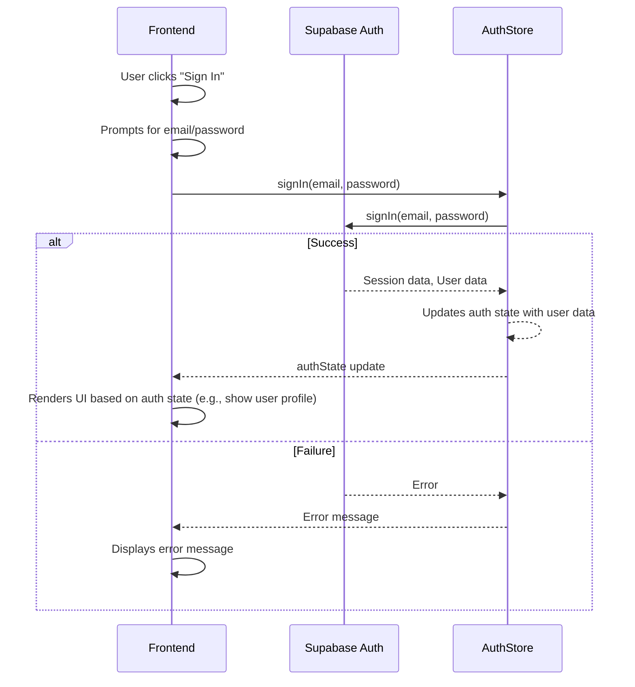

# Authentication and User Interface

This section details the authentication mechanisms, user interface elements, and the React contexts and hooks employed in the `ai-resume-screener` project. It covers how users sign in, sign out, and the supporting components that manage these interactions.

## Authentication Components

The project provides straightforward sign-in and sign-out functionalities through dedicated React components. These components leverage a custom hook to interact with the authentication service.

### Login Button

The `LoginButton` component facilitates user sign-in. It presents a button that, when clicked, prompts the user for their email and password using JavaScript `prompt()` functions.  While this is a basic implementation suitable for demonstration, a production environment would employ more secure and user-friendly input methods.

```javascript
// src/components/auth/LoginButton.jsx
import { useAuth } from '../../hooks/useAuth';
import  Button  from '../common/Button';

export default function LoginButton() {
  const { signIn } = useAuth();

  const handleLogin = async () => {
    // For simplicity, we'll use a prompt for email and password
    const email = prompt('Enter your email:');
    const password = prompt('Enter your password:');
    
    if (email && password) {
      try {
        await signIn(email, password);
      } catch (error) {
        alert('Login failed: ' + error.message);
      }
    }
  };

  return (
    <Button onClick={handleLogin}>
      Sign In
    </Button>
  );
}
```

[View on GitHub](https://github.com/santrupt29/ai-resume-screener/blob/main/frontend/src/components/auth/LoginButton.jsx)

The `useAuth` hook (implementation not shown here) is crucial. It abstracts the authentication logic, such as calling the authentication service (e.g., Supabase), and provides the `signIn` function. The `handleLogin` function then calls `signIn` with user-provided credentials.

### Logout Button

The `LogoutButton` component handles the user sign-out process. It uses the `signOut` function provided by the `useAuth` hook.

```javascript
// src/components/auth/LogoutButton.jsx
import { useAuth } from '../../hooks/useAuth';
import  Button  from '../common/Button';

export default function LogoutButton() {
  const { signOut } = useAuth();

  const handleLogout = async () => {
    try {
      await signOut();
    } catch (error) {
      alert('Logout failed: ' + error.message);
    }
  };

  return (
    <Button onClick={handleLogout} variant="outline">
      Sign Out
    </Button>
  );
}
```

[View on GitHub](https://github.com/santrupt29/ai-resume-screener/blob/main/frontend/src/components/auth/LogoutButton.jsx)

On clicking the "Sign Out" button, `handleLogout` calls the `signOut` function from the `useAuth` hook, initiating the sign-out process.

### Button Component

Both `LoginButton` and `LogoutButton` utilize a reusable `Button` component for consistent styling and behavior. This component supports different visual variants ("default", "outline", "destructive") and handles basic styling and disabled states.

```javascript
// src/components/common/Button.jsx
import React from 'react';

const Button = ({ 
  children, 
  onClick, 
  type = 'button', 
  variant = 'default', 
  disabled = false,
  className = '',
  ...props 
}) => {
  const baseClasses = 'px-4 py-2 rounded-md font-medium transition-colors focus:outline-none focus:ring-2 focus:ring-offset-2';
  
  const variantClasses = {
    default: 'bg-primary text-white hover:bg-primary/90 focus:ring-primary',
    outline: 'border border-gray-300 bg-white text-gray-700 hover:bg-gray-50 focus:ring-primary',
    destructive: 'bg-red-600 text-white hover:bg-red-700 focus:ring-red-500',
  };
  
  const disabledClasses = disabled ? 'opacity-50 cursor-not-allowed' : '';
  
  return (
    <button
      type={type}
      onClick={onClick}
      disabled={disabled}
      className={`${baseClasses} ${variantClasses[variant]} ${disabledClasses} ${className}`}
      {...props}
    >
      {children}
    </button>
  );
};

export default Button;
```

[View on GitHub](https://github.com/santrupt29/ai-resume-screener/blob/main/frontend/src/components/common/Button.jsx)

This `Button` component simplifies the creation of consistent buttons throughout the application by accepting props for styling and behavior customization.

## Authentication Context and Initialization

The `AuthProvider` component, combined with a state management solution (likely a `useAuthStore` using Zustand or similar), manages the authentication state and provides it to the rest of the application using React Context. This component handles the initialization of the authentication state, listening for authentication changes (sign-in, sign-out), and potentially fetching user profile data after sign-in.

```javascript
// src/contexts/AuthProvider.jsx (EXPLICIT CONTROL VERSION)
import React, { useEffect, useState } from 'react';
import { supabase } from '../lib/supabase';
import useAuthStore from '../stores/authStore';

export function AuthProvider({ children }) {
  const { setAuthState, setInitialized } = useAuthStore();
  const [isInitializing, setIsInitializing] = useState(true);

  useEffect(() => {
    let isMounted = true; // Prevent state updates on unmounted component

    const initializeAuth = async () => {
      console.log("AuthProvider: Starting initialization...");
      setIsInitializing(true);
      setAuthState(null, null, true, null); // Set loading to true

      try {
        // 1. Get the current session
        const { data: { session }, error: sessionError } = await supabase.auth.getSession();
        
        if (sessionError) {
          console.error("AuthProvider: Session error:", sessionError);
          if (isMounted) {
            setAuthState(null, null, false, sessionError.message);
            setInitialized(true);
            setIsInitializing(false);
          }
          return;
        }

        if (session?.user) {
          console.log("AuthProvider: Found session for user:", session.user.id);
          if (isMounted) {
            setAuthState(session.user, null, true, null); // Set user, start loading for profile
          }

          // 2. Fetch the user's profile
          const { data: profileData, error: profileError } = await supabase
            .from('profiles')
            .select('*')
            .eq('id', session.user.id)
            .single();

          if (profileError) {
            console.error("AuthProvider: Profile fetch error:", profileError);
            // Don't fail completely, just proceed without a profile
          }

          if (isMounted) {
            setAuthState(session.user, profileData, false, null); // Set user and profile, stop loading
          }
        } else {
          console.log("AuthProvider: No session found.");
          if (isMounted) {
            setAuthState(null, null, false, null); // No user, not loading
          }
        }
      } catch (err) {
        console.error("AuthProvider: Unexpected error during initialization:", err);
        if (isMounted) {
          setAuthState(null, null, false, err.message);
        }
      } finally {
        if (isMounted) {
          console.log("AuthProvider: Initialization finished.");
          setInitialized(true);
          setIsInitializing(false);
        }
      }
    };

    initializeAuth();

    // 3. Listen for auth changes (e.g., sign in, sign out)
    const { data: { subscription } } = supabase.auth.onAuthStateChange(async (event, session) => {
      console.log(`AuthProvider: Auth state changed. Event: ${event}`);
      
      if (event === 'SIGNED_IN' && session?.user) {
        // This will be triggered by the signIn function
        // The effect will re-run and fetch the profile, so we can just set the user here
        setAuthState(session.user, null, false, null);
      } else if (event === 'SIGNED_OUT') {
        setAuthState(null, null, false, null);
      }
    });

    return () => {
      isMounted = false;
      subscription.unsubscribe();
    };
  }, [setAuthState, setInitialized]);

  // Show a loading screen ONLY during the very first initialization
  if (isInitializing) {
    return (
      <div className="min-h-screen flex items-center justify-center bg-gray-50">
        <div className="text-center">
          <div className="animate-spin rounded-full h-12 w-12 border-b-2 border-blue-600 mx-auto"></div>
          <p className="mt-4 text-gray-600">Initializing Application...</p>
        </div>
      </div>
    );
  }
  
  return <>{children}</>;
}
```

[View on GitHub](https://github.com/santrupt29/ai-resume-screener/blob/main/frontend/src/contexts/AuthProvider.jsx)

This version shows explicit control and error handling. It initializes authentication using the `supabase.auth.getSession()` method. It also uses `supabase.auth.onAuthStateChange` to listen for authentication events. During the initialization phase, a loading indicator is displayed, ensuring a smooth user experience. This component ensures that the rest of the application can safely depend on the authentication state being available.

## Sequence Diagram: Authentication Flow

The following diagram illustrates the sequence of actions when a user signs in.





## Key Integration Points

- **`useAuth` Hook:** This custom hook (not shown in detail) is the central piece for interacting with the authentication service. It encapsulates the complexities of sign-in, sign-out, and potentially token management.
- **State Management:** The project utilizes a state management solution (likely Zustand or similar, although not explicitly shown) for managing the authentication state.  This allows the application to easily access the user's authentication status and user profile throughout the application.
- **Supabase Integration:** The `AuthProvider` component, and likely the `useAuth` hook, interact with Supabase for authentication.  This simplifies the backend integration and provides a secure and scalable authentication solution.
- **Error Handling:**  The code includes error handling, such as displaying alert messages upon sign-in or sign-out failures.
- **Loading State:** The `AuthProvider` includes a loading indicator to provide visual feedback during initialization, improving the user experience.

This structure allows for a clear separation of concerns, making the authentication process manageable and maintainable. The use of a context provider and a custom hook encapsulates the authentication logic, promoting code reusability and simplifying component interactions.