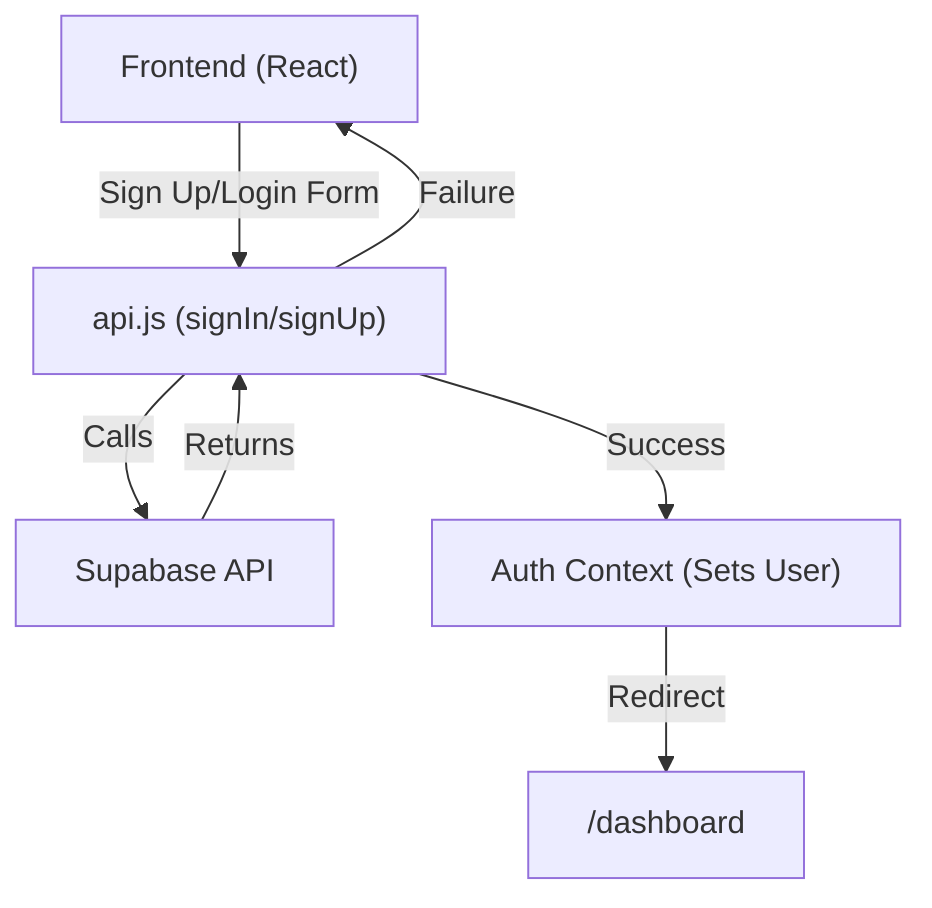
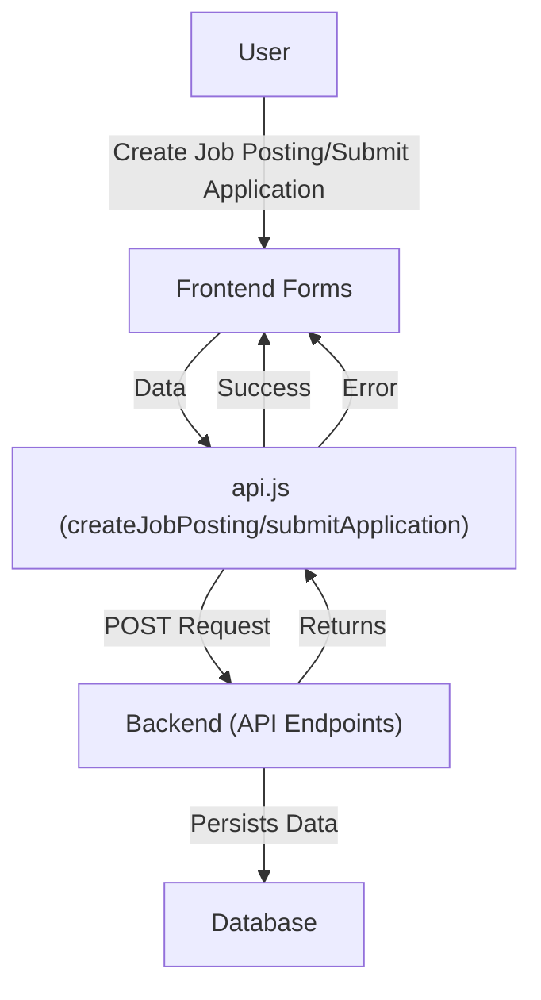
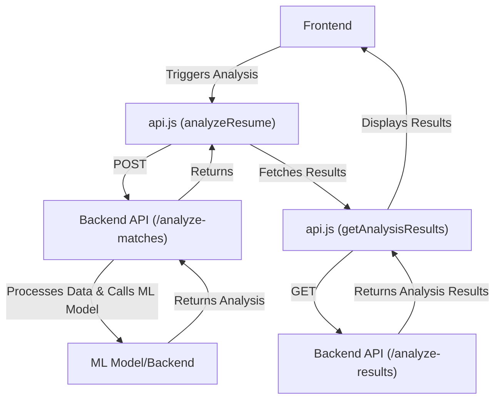

# Frontend Implementation

This section details the frontend implementation of the AI Resume Screener, covering its structure, components, state management, and interaction with the backend API.

## Project Structure and Entry Point

The frontend is built using React and leverages several libraries for state management, routing, and UI components. The main entry point of the application is `frontend/src/index.jsx`, which renders the `App` component within a `BrowserRouter` for client-side routing.

[View on GitHub](https://github.com/santrupt29/ai-resume-screener/blob/main/frontend/src/index.jsx)

```javascript
// frontend/src/index.jsx
import React from 'react';
import ReactDOM from 'react-dom/client';
import { BrowserRouter } from 'react-router-dom';
import App from './App';
import './index.css';

const root = ReactDOM.createRoot(document.getElementById('root'));
root.render(
  <React.StrictMode>
    <BrowserRouter>
      <App />
    </BrowserRouter>
  </React.StrictMode>
);
```

The `index.jsx` file sets up the React application and renders the `App` component. It uses `BrowserRouter` from `react-router-dom` to enable client-side routing.

## Core Components and Routing

The `App.jsx` file ( `frontend/src/App.jsx`) defines the application's routing structure and overall layout. It utilizes `react-router-dom` to handle navigation between different pages, including:

*   `/`:  `HomePage`
*   `/jobs/:jobId`: `PublicJobPage` (for public job postings)
*   `/status`: `StatusCheckPage` (for checking application status)
*   `/login`: `LoginPage`
*   `/signup`: `SignUpPage`
*   `/dashboard/*`: `DashboardPage` (protected route for authenticated users)

[View on GitHub](https://github.com/santrupt29/ai-resume-screener/blob/main/frontend/src/App.jsx)

```javascript
// frontend/src/App.jsx
import { BrowserRouter as Router, Routes, Route, Navigate, useLocation } from 'react-router-dom';
import { QueryClient, QueryClientProvider } from '@tanstack/react-query';
import { ReactQueryDevtools } from '@tanstack/react-query-devtools';
import { AuthProvider } from './contexts/AuthProvider';
import { ToastProvider } from './contexts/ToastContext.jsx';
import { ProtectedRoute } from './components/auth/ProtectedRoute';
import useAuth from './hooks/useAuth.jsx';
import HomePage from './pages/HomePage';
import DashboardPage from './pages/DashboardPage';
import PublicJobPage from './pages/PublicJobPage';
import StatusCheckPage from './pages/StatusCheckPage';
import LoginPage from './pages/LoginPage';
import SignUpPage from './pages/SignUpPage';
import Header from './components/layout/Header.jsx';

import './index.css';

const queryClient = new QueryClient();

function AppRoutes() {
  const { isAuthenticated } = useAuth();

  return (
    <Routes>
      <Route path="/" element={<HomePage />} />
      <Route path="/jobs/:jobId" element={<PublicJobPage />} />
      <Route path="/status" element={<StatusCheckPage />} />

      <Route
        path="/login"
        element={isAuthenticated ? <Navigate to="/dashboard" replace /> : <LoginPage />}
      />
      <Route
        path="/signup"
        element={isAuthenticated ? <Navigate to="/dashboard" replace /> : <SignUpPage />}
      />

      <Route
        path="/dashboard/*"
        element={
          <ProtectedRoute>
            <DashboardPage />
          </ProtectedRoute>
        }
      >
      </Route>

      <Route path="*" element={<Navigate to="/" replace />} />
    </Routes>
  );
}

const headerExcludedPaths = [
  /^\/jobs\/[^/]+$/, // regex for "/jobs/:jobId"
  // Add other patterns as needed
  /^\/status\/[^/]+$/, // regex for "/status/:applicationId",
  /^\/status$/, // regex for "/status",
];

function App() {
  const { signOut } = useAuth();
  const location = useLocation();
  const hideHeader = headerExcludedPaths.some((re) =>
    re.test(location.pathname)
  );

  const handleSignOut = () => {
    signOut();
  };
  return (
    <QueryClientProvider client={queryClient}>
      <ToastProvider>
        <AuthProvider>
            <div className="min-h-screen bg-gray-50">
                {/* <Header /> */}
                {!hideHeader && <Header />}
              <AppRoutes />
            </div>
        </AuthProvider>
      </ToastProvider>
      <ReactQueryDevtools initialIsOpen={false} />
    </QueryClientProvider>
  );
}

export default App;
```

This file also incorporates `ProtectedRoute`, which ensures that only authenticated users can access the dashboard. The `AuthProvider` context, managed through `AuthContext.jsx` (not shown here but is referenced by the code), handles user authentication. The `ToastProvider` provides a context for displaying notifications. The `Header` component is conditionally rendered based on the current route, excluding certain paths like public job pages.

## State Management and Authentication

The application uses a custom `AuthProvider` and `useAuth` hook ( `frontend/src/hooks/useAuth.jsx`) for managing user authentication state. This likely interacts with Supabase for authentication via functions such as `signIn`, `signUp`, and `signOut`  defined in  `frontend/src/lib/api.js`.  This approach centralizes authentication logic, making it easier to manage user sessions and access control throughout the application.

## API Interactions

The file `frontend/src/lib/api.js` defines the API client, encapsulating all interactions with the backend. It uses `axios` (through `axiosInstance`) to make HTTP requests to the server. Key functions include:

*   `getCurrentUser()`: Fetches the current user's information from Supabase.
*   `signIn(email, password)`:  Authenticates a user using email and password with Supabase.
*   `signUp(email, password, name)`:  Registers a new user with Supabase and creates a corresponding profile.
*   `signOut()`: Signs out the current user.
*   `createJobPosting(jobData)`:  Creates a new job posting.
*   `getJobPostings(userId)`: Retrieves job postings for a given user.
*   `getJobPosting(jobId)`: Retrieves a specific job posting.
*   `submitApplication(formPayload)`: Submits a job application.
*   `getApplications(jobId)`: Retrieves applications for a specific job.
*   `analyzeResume(resumeId, jobId)`: Analyzes a resume against a job description.
*   `getAnalysisResults(jobId)`: Retrieves the analysis results.
*   `uploadResume(file, path)`: Uploads a resume file.
*   `getResumeUrl(path)`: Retrieves the URL of a resume.

[View on GitHub](https://github.com/santrupt29/ai-resume-screener/blob/main/frontend/src/lib/api.js)

```javascript
// frontend/src/lib/api.js
import { axiosInstance } from './axios';
import {supabase} from './supabase';

export const getCurrentUser = async () => {
  const { data: { user } } = await supabase.auth.getUser();
  return user;
};

export const signIn = async (email, password) => {
  const { data, error } = await supabase.auth.signInWithPassword({
    email,
    password,
  });

  if (error) throw error;
  return data;
};

export const signUp = async (email, password, name) => {
  try {
    console.log('Attempting to sign up user:', { email, name });

    const { data, error } = await supabase.auth.signUp({
      email,
      password,
    });

    if (error) {
      console.error('Supabase auth error:', error);
      throw error;
    }
    if (data.user) {
      const { error: profileError } = await supabase
        .from('profiles')
        .insert([
          { id: data.user.id, name }
        ]);

      if (profileError) {
        console.error('Profile insert error:', profileError);
        throw profileError;
      }
    }

    console.log('Sign up + profile creation successful:', data);
    return data;
  } catch (error) {
    console.error('Signup error:', error);
    throw error;
  }
};

export const signOut = async () => {
  const { error } = await supabase.auth.signOut();
  if (error) throw error;
  return true;
};

export const createJobPosting = async (jobData) => {
  try {
    const response = await axiosInstance.post("/create-job-posting", jobData);
    return response.data;
  } catch (error) {
    throw new Error(error.response?.data?.error || "Failed to create job posting");
  }
};

export const getJobPostings = async (userId) => {
  console.log("API: getJobPostings called with userId:", userId);
  const response = await axiosInstance.get(`/job-postings/${userId}`);
  return response.data;
};

export const getJobPosting = async (jobId) => {
  try {
    const response = await axiosInstance.get(`/job-posting/${jobId}`);
    return response.data;
  } catch (error) {
      console.error("Error fetching job posting:", error);
      throw new Error(error.response?.data?.error || "Failed to fetch job posting");
  }
};

export const updateJobPosting = async (jobId, updates) => {
  const response = await axiosInstance.post(`/job-posting/${jobId}`, updates);
  return response.data;
};

export const deleteJobPosting = async (jobId) => {
  const response = await axiosInstance.delete(`/job-posting/${jobId}`);
  return response.data;
};

export const submitApplication = async (formPayload) => {
  const response = await axiosInstance.post("/submit-application", formPayload, {
    headers: {
      "Content-Type": "multipart/form-data",
    },
  });
  return response.data;
};

export const getApplications = async (jobId) => {
  try {
    const response = await axiosInstance.get(`/applications/${jobId}`);
    return { data: response.data };
  } catch (error) {
    console.error("Error fetching applications:", error);
    return { error: error.response?.data?.error || "Failed to fetch applications" };
  }
};

export const updateApplicationStatus = async (id, status) => {
  try {
    const response = await axiosInstance.post(`/update-application-status/${id}`, { status });
    return response.data;
  } catch (error) {
    console.error("Error updating application status:", error);
    throw new Error(error.response?.data?.error || "Failed to update application status");
  }
};

export const checkApplicationStatus = async (applicationId, email) => {
  try {
    const response = await axiosInstance.post("/check-application-status", { applicationId, email });
    return response.data;
  } catch (error) {
    console.error("Error checking application status:", error);
    throw new Error(error.response?.data?.error || "Failed to check application status");
  }

};

// ------------------- Resume Analysis -------------------

export const analyzeResume = async (resumeId, jobId) => {
  const response = await axiosInstance.post("/analyze-matches", { resumeId, jobId });
  return response.data;
};

export const getAnalysisResults = async (jobId) => {
  const response = await axiosInstance.get(`/analyze-results/${jobId}`);
  return response.data;
};

// ------------------- Resumes -------------------

export const getResume = async (resumeId) => {
  const response = await axiosInstance.get(`/resume/${resumeId}`);
  return response.data;
};

export const updateResume = async (resumeId, updates) => {
  const response = await axiosInstance.put(`/resume/${resumeId}`, updates);
  return response.data;
};

export const uploadResume = async (file, path) => {
  const formData = new FormData();
  formData.append("file", file);
  formData.append("path", path);

  const response = await axiosInstance.post("/upload-resume", formData, {
    headers: { "Content-Type": "multipart/form-data" },
  });
  return response.data;
};

export const getResumeUrl = async (path) => {
  const response = await axiosInstance.get(`/resume-url?path=${encodeURIComponent(path)}`);
  return response.data;
};

// ------------------- Utilities -------------------

export const generatePublicJobUrl = (jobId) => {
  return `${window.location.origin}/jobs/${jobId}`;
};

export const generateApplicationStatusUrl = () => {
  return `${window.location.origin}/status`;
};

export const handleApiError = (error, customMessage) => {
  console.error("API Error:", error);
  throw new Error(error.response?.data?.error || customMessage || "An unexpected error occurred");
};

// ------------------- Dashboard -------------------

export const getJobPostingsWithCounts = async (userId) => {
  const response = await axiosInstance.get(`/job-postings-with-counts/${userId}`);
  return response.data;
};

export const getDashboardStats = async (userId) => {
  const response = await axiosInstance.get(`/dashboard-stats/${userId}`);
  return response.data;
};

// ------------------- Search -------------------

export const searchJobPostings = async (searchTerm, userId) => {
  const response = await axiosInstance.get(
    `/search-job-postings?term=${encodeURIComponent(searchTerm)}&userId=${userId}`
  );
  return response.data;
};

// ------------------- Export -------------------

const api = {
  createJobPosting,
  getJobPostings,
  getJobPosting,
  updateJobPosting,
  deleteJobPosting,
  submitApplication,
  getApplications,
  updateApplicationStatus,
  checkApplicationStatus,
  analyzeResume,
  getAnalysisResults,
  getResume,
  updateResume,
  uploadResume,
  getResumeUrl,
  generatePublicJobUrl,
  generateApplicationStatusUrl,
  handleApiError,
  getJobPostingsWithCounts,
  getDashboardStats,
  searchJobPostings,
};

export default api;
```

This file is central to the frontend's communication with the backend, facilitating data retrieval and manipulation.

## Supabase Integration

The `frontend/src/lib/supabase.js` file (not shown) initializes the Supabase client, likely using environment variables for the Supabase URL and anonymous key. This integration is crucial for user authentication and potentially for storing resume data. The  `supabase` and `supabaseServer` clients are created and exported for use throughout the application.

## Data Fetching and Management

The application likely utilizes `react-query` (as seen in `App.jsx`) for data fetching and caching. This library simplifies API interactions and provides features like caching, retries, and background updates, enhancing the user experience.

## UI Components

The frontend makes use of React components for rendering different parts of the UI, such as `Header` which is used to display the header. Additional components, pages and UI elements are not covered in detail in the provided files, but it is expected that these UI elements interact with the API to render appropriate data.

## Key Integration Points

1.  **Authentication Flow:** The frontend authenticates users using Supabase. The `signIn`, `signUp`, and `signOut` functions in `api.js` interact with the Supabase API.  Upon successful authentication, the user is redirected to the `/dashboard` route.





2.  **Job Posting and Application Flow:** Users create job postings through forms that call the `createJobPosting` API. Applications are submitted via the `submitApplication` API.  Job postings and application data are fetched from the backend using the APIs defined in `api.js`.





3.  **Resume Analysis Flow:**  The frontend initiates resume analysis by calling the `analyzeResume` API, likely passing the resume ID and job ID. The frontend then retrieves analysis results using `getAnalysisResults`.





## Best Practices and Insights

*   **Modular Design:** The separation of concerns (API client, authentication context, routing) promotes code reusability and maintainability.
*   **Asynchronous Operations:** The use of `async/await` and `react-query` handles asynchronous API calls, preventing blocking and providing a smooth user experience.
*   **Error Handling:** The `handleApiError` function and error handling within API functions provide a centralized mechanism for managing and reporting errors.
*   **Security:**  The use of `ProtectedRoute` secures sensitive routes, ensuring that only authenticated users can access them.